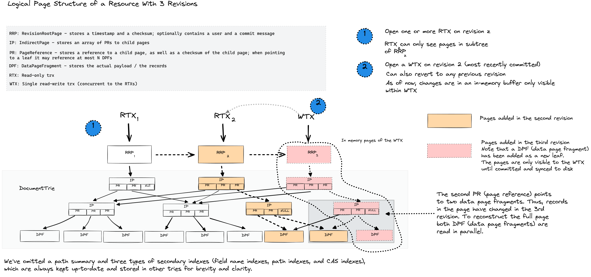
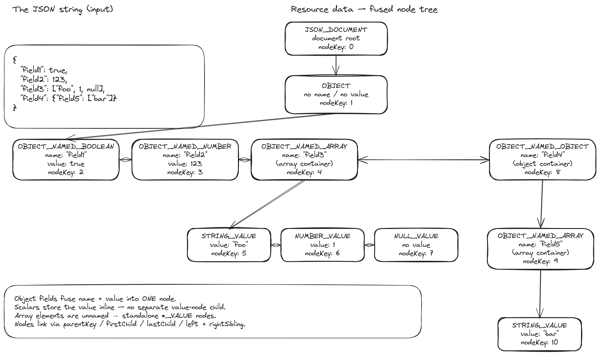
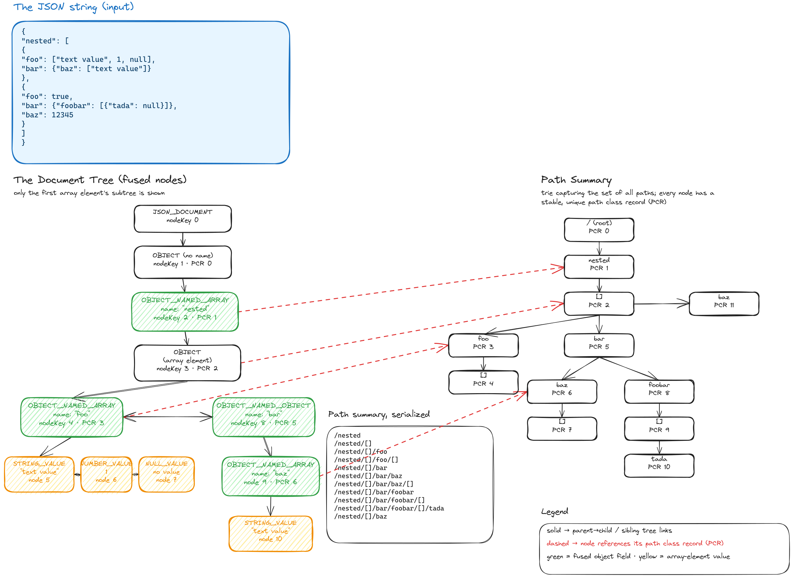
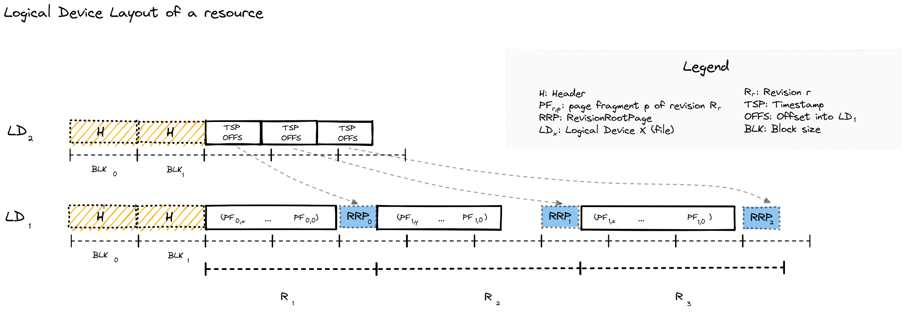

<p align="center"></p>

<h1 align="center">SirixDB - The Bitemporal Database System</h1>
<h3 align="center">Query any revision as fast as the latest</h3>

<p align="center">
<a href="https://github.com/sirixdb/sirix/actions"></a>
<a href="https://search.maven.org/search?q=g:io.sirix"></a>
<a href="http://makeapullrequest.com"></a>
<a href="#contributors-"></a>
</p>

<p align="center">
<a href="https://demo.sirix.io"><b>🟢 Live Demo</b></a> · <a href="docs/WHY-SIRIX.md"><b>Why SirixDB</b></a> · <a href="docs/README.md"><b>Docs</b></a> · <a href="https://sirix.io"><b>Website</b></a> · <a href="https://discord.gg/yC33wVpv7t"><b>Discord</b></a> · <a href="https://sirix.discourse.group/"><b>Forum</b></a> · <a href="https://github.com/sirixdb/sirixdb-web-gui"><b>Web UI</b></a>
</p>

<p align="center"><i>Status: <b>1.0.0-beta</b> — usable today and actively developed. The on-disk format and public APIs are stabilizing toward a 1.0 release; feedback from real use is exactly what we're looking for.</i></p>

---

## The Problem

You update a row in your database. The old value is gone.

To get history, you bolt on audit tables, change-data-capture, or event sourcing. Now you have two systems: one for current state, one for history. Querying the past means replaying events or scanning logs. Your "simple" audit requirement just became an infrastructure project.

Git solves this for files—but you can't query a Git repository. Event sourcing preserves history—but reconstructing past state means replaying from the beginning.

## The Solution

SirixDB is a database where **every revision is a first-class citizen**. Not an afterthought. Not a log you replay.

```java
// Query revision 1 - instant, not reconstructed
session.beginNodeReadOnlyTrx(1)

// Query by timestamp - which revision was current at 3am last Tuesday?
session.beginNodeReadOnlyTrx(Instant.parse("2024-01-15T03:00:00Z"))

// Both return the same thing: a readable snapshot, as fast as querying "now"
```

This works because SirixDB uses **structural sharing with sub-page versioning**. Unchanged pages are shared between revisions via copy-on-write — and versioning continues *below* the page: a commit writes page fragments containing only the changed records, and the sliding-snapshot algorithm guarantees any page is reconstructible from at most N fragments. Block-level COW (ZFS-style) copies a whole page when one byte in it changes; delta-based systems make reads replay ever-growing diff chains. SirixDB pays neither cost. Revision 1000 doesn't store 1000 copies—it stores the current state plus pointers to shared history.

**The result:**
- Storage: O(changed records per revision), not O(total size × revisions) — and not O(changed pages) either
- Read any page from any revision: O(N) page fragment reads, where N is the configurable snapshot window (default 3)
- No event replay, no log scanning—direct page access

## Bitemporal: Two Kinds of Time

Most databases (if they version at all) track one timeline: when data was written. SirixDB tracks two:

- **Transaction time**: When was this committed? (system-managed)
- **Valid time**: When was this true in the real world? (user-managed)

Why does this matter?

```
January 15: You record "Price = $100, valid from January 1"
January 20: You discover the price was actually $95 on January 1

After correction, you can ask:
  "What did we THINK the price was on Jan 16?"  →  $100 (transaction time)
  "What WAS the price on Jan 1?"                →  $95  (valid time)
```

Both questions have correct, different answers. Without bitemporal support, the correction destroys the audit trail.

## Core Properties

- **Append-only storage**: Data is never overwritten. New revisions write to new locations.
- **Structural sharing**: Unchanged pages and nodes are referenced between revisions via copy-on-write.
- **Snapshot isolation**: Readers see a consistent view; one writer per resource.
- **Embeddable**: a single self-contained JAR (third-party dependencies shaded in) — embed it in-process, or run it as a REST server.

## Performance

History is not a tax. Reading an old revision is a direct page lookup, not a replay — **any revision reads as fast as the latest**, and session-open cost is flat regardless of how much history exists (0.18 ms at 10,000 revisions).

A few measured receipts (we benchmark against ourselves and **publish the losses**, methodology in [`WHY-SIRIX.md`](docs/WHY-SIRIX.md) and the linked comparison docs):

- **Concurrent reads under a committing writer** — on a 12,800-revision database, 16 reader threads + 1 writer over REST went from 361 to **11,198 reads/s** with reader **p99 334 ms → 4.8 ms** and **zero errors**, after fixing a page-lifecycle bug and an O(history) open cost ([`BENCHMARKS.md`](docs/BENCHMARKS.md)). The aged database now outruns the pre-fix fresh one.
- **Semantic diffs** — node-level insert/update/delete between two revisions (with stable keys) in **~0.3 ms**, not a text diff.
- **Analytics** — the vectorized, fail-closed execution path runs the group-by/aggregate suite **head-to-head with DuckDB 1.5.2 at 100M records**: ahead on three of nine query shapes, within 1.1–2.5× on all others except count-distinct (~4.2×); the GraalVM native binary runs **7–17× faster than the JVM** on warm analytical queries ([`COMPARISON_DUCKDB.md`](docs/COMPARISON_DUCKDB.md), [`NATIVE_IMAGE.md`](docs/NATIVE_IMAGE.md)). The standalone query engine, [brackit](https://github.com/sirixdb/brackit), beats `jq` several-fold on [its own benchmark suite](https://github.com/sirixdb/brackit#performance).
- **Honest loss vs PostgreSQL** ([`COMPARISON_POSTGRES.md`](docs/COMPARISON_POSTGRES.md), re-run 2026-07) — PostgreSQL with a trigger-maintained history table still wins raw small-document ingest (**1,093 vs 169 durable commits/s** same-machine, both verified fsync-bound) and total storage (~2×, down from ~3× after recent storage work). SirixDB wins semantic diffs (**0.58 ms** node-level patch vs a top-level-only compare), now ties history listing, and offers sub-document time travel PostgreSQL doesn't have. Durability settings verified equivalent before measuring; the fsync floor of the box is published alongside the numbers.

Every fast path is **fail-closed**: a kernel only runs when the optimizer can prove the query's shape matches what it emits, and a differential suite requires byte-identical output against the general path. Wrong-but-fast is a bug class, not a setting.

## How Versioning Works

<p align="center">

<br/>
<em>Logical page structure of a resource with 3 revisions — read-only transactions (RTX) can open any revision, while a single write transaction (WTX) appends to the latest.</em>
</p>

SirixDB stores data in a persistent tree structure where revisions share unchanged pages and nodes. Traditional databases overwrite data in place and use write-ahead logs for recovery. SirixDB takes a different approach:

### Physical Storage: Append-Only Log

All data is written sequentially to an append-only log. Nothing is ever overwritten.

```
Physical Log (append-only, sequential writes)
┌────────────────────────────────────────────────────────────────────────┐
│ [R1:Root] [R1:P1] [R1:P2] [R2:Root] [R2:P1'] [R3:Root] [R3:P2'] ...    │
└────────────────────────────────────────────────────────────────────────┘
     t=0      t=1     t=2      t=3      t=4       t=5       t=6    → time
```

### Logical Structure: Persistent Trie

Each revision has a root node in a trie. Unchanged pages are shared via references.

```
  [Rev 1]           [Rev 2]         [Rev 3]
     │                 │               │
     ▼                 ▼               ▼
  [Root₁]           [Root₂]         [Root₃]
   │   │             │   │           │   │
   │   └──────────┐  │   └────────┐  │   └─────────┐
   ▼              ▼  ▼            ▼  ▼             ▼
┌──────┐        ┌──────┐        ┌──────┐        ┌──────┐
│  P1  │        │  P2  │        │ P1'  │        │ P2'  │
└──────┘        └──────┘        └──────┘        └──────┘
 Rev 1          Rev 1+2         Rev 2+3          Rev 3
                (shared)        (shared)
```

Rev 2 modified only P1 (writing P1') and still shares P2 with Rev 1; Rev 3 modified only P2 (writing P2') and still shares P1' with Rev 2 — matching the physical log above.

### Page Versioning Strategies

How page versions are stored is configurable per resource:

| Strategy | Page fragments per read | Write cost | Notes |
|---|---|---|---|
| FULL | 1 | full page per change | fastest reads, largest storage |
| INCREMENTAL | up to N−1 diffs | small diffs + periodic full snapshot | write spikes at snapshot points |
| DIFFERENTIAL | 2 | diffs grow between snapshots | bounded reads, uneven writes |
| **SLIDING_SNAPSHOT** (default) | ≤ N (default 3) | small diffs, out-of-window records rescued into the newest fragment | no full-snapshot spikes, best balance |

Modifying data copies only the affected pages (copy-on-write); unchanged pages are referenced
from the new revision, and the old revision remains intact and queryable. **Storage cost** is
O(changed records) per revision. **Read cost**: opening a revision is O(1) by number, O(log R)
by timestamp; each page read combines at most N fragments. The full strategy walkthrough is in
[`docs/ARCHITECTURE.md`](docs/ARCHITECTURE.md#mvcc--versioning).

## Quick Start

> **Platform support:** Linux, macOS, and Windows are CI-tested on every pull request.
> Linux additionally gets native binaries and the Docker images; known limitations are
> listed in [`docs/KNOWN_LIMITATIONS.md`](docs/KNOWN_LIMITATIONS.md).

### Using the CLI (Native Binaries)

SirixDB provides two CLI tools, both available as instant-startup native binaries:

| Binary | Module | Description |
|--------|--------|-------------|
| `sirix-cli` | sirix-kotlin-cli | Full-featured CLI for database operations |
| `sirix-shell` | sirix-query | Interactive JSONiq/XQuery shell |

Build native binaries with GraalVM:

```bash
# Build both CLIs as native binaries (requires GraalVM with native-image)
./gradlew :sirix-kotlin-cli:nativeCompile  # produces: sirix-cli
./gradlew :sirix-query:nativeCompile       # produces: sirix-shell

# Or run via JAR
./gradlew :sirix-kotlin-cli:run --args="-l /tmp/mydb create"
```

The whole create/update/time-travel loop from the shell (`-l` names the database path):

```bash
sirix-cli -l /tmp/mydb create json -r myresource -d '{"name": "Alice", "role": "admin"}'
sirix-cli -l /tmp/mydb update -r myresource '{"team": "engineering"}' -im as-first-child
sirix-cli -l /tmp/mydb query  -r myresource '$$.name'   # $$ is the document root
sirix-cli -l /tmp/mydb query  -r myresource -rev 1      # query a previous revision
sirix-cli -l /tmp/mydb resource-history myresource
```

`sirix-shell` is a JSONiq/XQuery REPL over the same data (`jn:store(...)`, `jn:doc(...)` —
multi-line queries, empty line executes, Control-D exits).

### Using the REST API

Start SirixDB and its bundled OAuth2 provider (Keycloak) with Docker:

```bash
git clone https://github.com/sirixdb/sirix.git
cd sirix
docker compose up
```

This starts the REST server on `http://localhost:9443` plus a Keycloak instance seeded with
demo users `admin/admin` and `viewer/viewer`. All endpoints are OAuth2-protected:

```bash
TOKEN=$(curl -s -X POST http://localhost:9443/token \
  -H "Content-Type: application/json" \
  -d '{"username":"admin","password":"admin","grant_type":"password"}' | jq -r .access_token)

curl -X PUT http://localhost:9443/mydb/myresource \
  -H "Authorization: Bearer $TOKEN" -H "Content-Type: application/json" \
  -d '{"name":"Alice","role":"admin"}'

curl http://localhost:9443/mydb/myresource -H "Authorization: Bearer $TOKEN"
```

For local development, `auth.mode=none` (`docker run -e SIRIX_AUTH_MODE=none ...`) skips
Keycloak entirely (loud warning, admin-for-all). **[→ docs/QUICKSTART.md](docs/QUICKSTART.md)**
walks the whole loop — create, query, commit, time-travel read, diff — with verified commands;
the [REST API documentation](https://sirix.io/docs/rest-api.html) has the full endpoint
reference.

> **Security note:** the bundled Keycloak realm, demo users, client secret, and self-signed TLS
> certificate are for local development only — see [`docs/operations.md`](docs/operations.md)
> before any public deployment.

### Using the MCP Server (for AI Agents)

SirixDB ships a native [Model Context Protocol](https://modelcontextprotocol.io) server, so AI
agents (Claude, Cursor, Windsurf, or any MCP client) can talk to it directly. Because every
revision is copy-on-write, agents get **O(1) disposable snapshots**, **time-travel reads**, and
**structural diffs** for free — branch, experiment, then discard or promote, with a
human-reviewable diff. Read-only by default, with access control, output sanitization, and an
audit log.

```bash
./gradlew :sirix-mcp:installDist   # creates build/install/sirix-mcp/bin/sirix-mcp
```

Register that binary in your MCP client with `--database-path /path/to/data` (add
`--read-write` to allow mutations). Full tool reference:
[`docs/MCP_SERVER_DESIGN.md`](docs/MCP_SERVER_DESIGN.md).

### As an Embedded Library

```xml
<dependency>
  <groupId>io.sirix</groupId>
  <artifactId>sirix-core</artifactId>
  <version>1.0.0-beta7</version>
</dependency>
```

```gradle
// Gradle (Kotlin DSL)
implementation("io.sirix:sirix-core:1.0.0-beta7")
```

```java
var dbPath = Path.of("/tmp/mydb");

// Create database and resource
Databases.createJsonDatabase(new DatabaseConfiguration(dbPath));
try (var database = Databases.openJsonDatabase(dbPath)) {
    database.createResource(ResourceConfiguration.newBuilder("myresource").build());

    // Insert JSON data (creates revision 1)
    try (var session = database.beginResourceSession("myresource");
         var wtx = session.beginNodeTrx()) {
        wtx.insertSubtreeAsFirstChild(JsonShredder.createStringReader("{\"key\": \"value\"}"));
        wtx.commit();
    }

    // Update creates revision 2 (revision 1 remains unchanged)
    try (var session = database.beginResourceSession("myresource");
         var wtx = session.beginNodeTrx()) {
        wtx.moveTo(2);  // Move to the "key" node
        wtx.setStringValue("updated value");
        wtx.commit();
    }

    // Read from revision 1 - still accessible
    try (var session = database.beginResourceSession("myresource");
         var rtx = session.beginNodeReadOnlyTrx(1)) {
        rtx.moveTo(2);
        System.out.println(rtx.getValue());  // Prints: value
    }
}
```

## Time-Travel Queries

SirixDB extends JSONiq/XQuery (via [Brackit](https://github.com/sirixdb/brackit)) with temporal axis and functions.

### Access by Revision Number or Timestamp

```xquery
(: Open specific revision :)
jn:doc('mydb','myresource', 5)

(: Open by timestamp - returns revision valid at that instant :)
jn:open('mydb','myresource', xs:dateTime('2024-01-15T10:30:00Z'))
```

### Temporal Axis Functions

Navigate a node's history across revisions — `jn:previous`, `jn:next`, `jn:first`, `jn:last`,
`jn:first-existing`, `jn:last-existing`, `jn:past`, `jn:future`, `jn:all-times`:

```xquery
(: iterate through all versions of a node :)
for $version in jn:all-times(jn:doc('mydb','myresource').users[0])
return {"rev": sdb:revision($version), "data": $version}
```

### Diff Between Revisions

```xquery
(: Structured diff between any two revisions :)
jn:diff('mydb','myresource', 1, 5)

(: Diff with optional parameters: startNodeKey, maxLevel :)
jn:diff('mydb','myresource', 1, 5, $nodeKey, 3)
```

For adjacent revisions, `jn:diff` reads directly from stored change tracking files. For non-adjacent revisions it computes the diff. With hashes enabled, changed revisions of a node can also be found by comparing `sdb:hash` across `jn:all-times`.

### Bitemporal Queries

Query both time dimensions (see [Bitemporal: Two Kinds of Time](#bitemporal-two-kinds-of-time) above for why this matters).

Configure a resource with valid time paths — SirixDB then maintains CAS indexes on them
automatically (also settable via REST query parameters):

```java
var resourceConfig = ResourceConfiguration.newBuilder("employees")
    .validTimePaths("validFrom", "validTo")   // or .useConventionalValidTimePaths()
    .buildPathSummary(true)
    .build();
```

```xquery
(: valid time: records valid at a point in real-world time :)
jn:valid-at('mydb','myresource', xs:dateTime('2024-07-15T12:00:00Z'))

(: true bitemporal: "what records were KNOWN on Jan 20 and VALID on July 15?" :)
jn:open-bitemporal('mydb','myresource',
    xs:dateTime('2024-01-20T10:00:00Z'),   (: transaction time - opens revision :)
    xs:dateTime('2024-07-15T12:00:00Z'))   (: valid time - filters via index :)
```

Revision metadata (`sdb:revision`, `sdb:timestamp`, `sdb:item-history`, author tracking,
commit messages) and optional per-node **Merkle hashes** (`sdb:hash` — tamper detection and
fast change detection on subtrees) round out the temporal API. See the
[query documentation](https://sirix.io/docs/jsoniq.html) for the full function reference.

## Web Interface

The [SirixDB Web GUI](https://github.com/sirixdb/sirixdb-web-gui) provides visualization of revision history and diffs:

```bash
git clone https://github.com/sirixdb/sirixdb-web-gui.git
cd sirixdb-web-gui
docker compose -f docker-compose.demo.yml up
```

Open `http://localhost:3000` (login: `admin`/`admin`)

## Architecture

### JSON Tree Encoding

SirixDB shreds JSON into a typed node tree where each node has a stable key across revisions:

<p align="center">

<br/>
<em>A JSON document and its internal tree representation — each node carries a stable key (nodeKey) for identity tracking across revisions.</em>
</p>

### Document Storage and Path Summary

When JSON is stored, SirixDB also builds a **path summary** — a compact trie capturing all unique paths in the document. This powers the path and CAS indexes:

<p align="center">

<br/>
<em>Left: the document tree. Right: the path summary trie with stable path class records (PCR) used for indexing.</em>
</p>

### On-Device Layout

<p align="center">

<br/>
<em>Physical layout on disk — data is split across two logical devices (LD₀ for metadata offsets, LD₁ for page data), written sequentially per revision.</em>
</p>

### Storage Model

```
Database (directory)
└── Resource (single JSON or XML document with revision history)
    └── Revisions (numbered 1, 2, 3, ...)
        └── Pages (variable-size blocks containing node data)
```

- **Database**: Directory containing multiple resources
- **Resource**: One logical document with its complete revision history
- **Page**: Unit of I/O and versioning. Variable-size, immutable once written.

### Key Design Decisions

| Aspect | Design | Trade-off |
|--------|--------|-----------|
| Write pattern | Append-only | No in-place updates; simpler recovery; larger storage footprint |
| Consistency | Single writer per resource | No write conflicts; readers never blocked |
| Index updates | Synchronous | Queries always see current indexes |
| Node IDs | Stable across revisions | Enables tracking node identity through time |

### Indexes

Three secondary index types, all updated **synchronously** inside the writing transaction — queries never see a stale index:

- **Path index** — index specific JSON paths for faster navigation.
- **CAS index** (Content-And-Structure) — index values with type awareness; supports equality and range predicates, optionally `unique` for constraint enforcement.
- **Name index** — index object-key / element names.

All three use one canonical [Height-Optimized Trie](docs/ARCHITECTURE.md#hot-height-optimized-trie-index)
representation over off-heap leaf pages. Initial creation may bulk-build a virgin tree, while every
later insert, update, and delete mutates only the affected posting chunk in that same format. There
is no per-resource backend selector or alternate mutation route.

Like the rest of the engine, indexes are **fully versioned**: opening an index at revision *N*
returns the index state as of *N*—never a later commit's. This is verified across point and range
reads, session close/reopen, and a concurrent pinned-reader-vs-writer (see
`HOTMultiVersionInvariantsTest`).

### Projection indexes (experimental, analytical)

A fourth, columnar index type accelerates analytical queries — aggregates, filtered counts,
group-bys, count-distinct — over homogeneous record sets. A **projection index** extracts
declared fields into column-oriented leaves (frame-of-reference numerics, string dictionaries,
presence bitmaps) that the vectorized executor scans with SIMD kernels instead of walking the
document tree. Projections are fully versioned copy-on-write pages like everything else and
served automatically — eligible plain JSONiq queries route through them with no scan function,
both embedded and over REST (behind a fail-closed allowlist gate). Inserts, updates and deletes
are maintained incrementally in the writing commit: only the touched units are rewritten, never
the whole index. Anything a projection cannot serve exactly falls back to the regular pipeline,
so results are always identical with or without the index.

```xquery
(: project (age, active, dept, city) over a record set, then plain JSONiq uses it :)
let $doc := jn:doc('mydb', 'sales.jn')
let $idx := jn:create-projection-index($doc, '/[]',
    ('/[]/age', '/[]/active', '/[]/dept', '/[]/city'),
    ('long', 'boolean', 'string', 'string'))
return {"revision": sdb:commit($doc)}
```

Usage guide, maintenance semantics, REST gate, and current limits:
[`docs/PROJECTION_INDEXES.md`](docs/PROJECTION_INDEXES.md); internals:
[`docs/PROJECTION_INDEX_DEEP_DIVE.md`](docs/PROJECTION_INDEX_DEEP_DIVE.md).

## Correctness & Formal Verification

A versioned storage engine is only useful if old revisions are *exactly* what was written. We take
correctness seriously and treat it as a first-class, reviewable artifact:

- **An invariant catalog** — [`docs/formal-verification.md`](docs/formal-verification.md) states the
  load-bearing invariants of the engine (temporal arithmetic, DeweyID encoding, page-fragment
  reconstruction, checksums, the HOT index) as precise pre/post-conditions, each with a proof sketch
  tight enough to falsify by reading and a pointer to the test that discharges it.
- **Executable verification tests** that fail CI if an invariant breaks — e.g. `DeweyIDEncodingVerificationTest`,
  `ChecksumVerificationTest`, `FragmentCacheVerificationTest`, and the `HOTFormalModelTest` /
  `HOTFormalVerificationTest` model-based suite (a formal model checked against the implementation).
- **Property-based & fuzz testing** — a SQLite-`fuzzcheck`-style random JSON round-trip property test,
  plus a long-running [bitemporal soak stress test](.github/workflows/stress.yml).

The aim isn't Coq-grade proof; it's that every behavioral claim about the storage engine is stated
precisely and guarded by a test.

## Comparison with Alternatives

| Feature | SirixDB | Postgres + Audit | Git + JSON | Event Sourcing | Datomic |
|---------|---------|------------------|------------|----------------|---------|
| Query past state | Direct page access | Scan audit log | Checkout + parse | Replay events | Direct segment access |
| Storage overhead | O(changes) | O(all writes) | O(file × revs) | O(all events) | O(changes) |
| Granularity | Node-level | Row-level | File-level | Event-level | Fact-level |
| Bitemporal | Built-in | Manual | No | Manual | Built-in |
| Embeddable | Yes | No | Yes | Varies | No |
| Query language | JSONiq/XQuery | SQL | None | Varies | Datalog |

## Building from Source

```bash
git clone https://github.com/sirixdb/sirix.git
cd sirix
./gradlew build -x test
```

**Requirements:**
- Java 25+
- Gradle 9.1+ (or use included wrapper)

**JVM flags** (required for running):
```
--enable-preview
--add-exports=java.base/jdk.internal.ref=ALL-UNNAMED
--add-exports=java.base/sun.nio.ch=ALL-UNNAMED
--add-exports=jdk.unsupported/sun.misc=ALL-UNNAMED
--add-opens=java.base/java.lang=ALL-UNNAMED
--add-opens=java.base/java.lang.reflect=ALL-UNNAMED
--add-opens=java.base/java.io=ALL-UNNAMED
--add-opens=java.base/java.util=ALL-UNNAMED
```

**Build native binaries** (requires GraalVM):
```bash
./gradlew :sirix-kotlin-cli:nativeCompile  # sirix-cli
./gradlew :sirix-query:nativeCompile       # sirix-shell
./gradlew :sirix-rest-api:nativeCompile    # REST API server
```

## Project Structure

```
bundles/
├── sirix-core/          # Core storage engine and versioning
├── sirix-query/         # Brackit JSONiq/XQuery integration + sirix-shell
├── sirix-rest-api/      # Vert.x REST server
├── sirix-kotlin-cli/    # Command-line interface (sirix-cli)
├── sirix-kotlin-api/    # Kotlin coroutine-based API
├── sirix-mcp/           # Model Context Protocol server for AI agents
├── sirix-examples/      # Runnable usage examples
└── sirix-benchmarks/    # JMH and scale benchmarks
```

## Use Cases

- **Audit trails**: Regulatory requirements for complete data history (finance, healthcare)
- **Document versioning**: Track changes to configuration, contracts, or content
- **Debugging**: Query production state at the time a bug occurred
- **Temporal analytics**: Analyze how data evolved over time windows
- **Undo/restore**: Revert to or query any historical state

## Community

- **[Discord](https://discord.gg/yC33wVpv7t)** — Quick questions and chat
- **[Forum](https://sirix.discourse.group/)** — Discussions and support
- **[GitHub Issues](https://github.com/sirixdb/sirix/issues)** — Bug reports and feature requests

## Contributing

Contributions welcome! See [CONTRIBUTING.md](CONTRIBUTING.md) for guidelines, and please review our [Code of Conduct](CODE_OF_CONDUCT.md).

For security vulnerabilities, see [SECURITY.md](SECURITY.md).

## Contributors

SirixDB is maintained by Johannes Lichtenberger and the open source community.

The project originated from Treetank, a university research project by Dr. Marc Kramis, Dr. Sebastian Graf and many students.

<!-- ALL-CONTRIBUTORS-LIST:START - Do not remove or modify this section -->
<!-- prettier-ignore-start -->
<!-- markdownlint-disable -->
<table>
  <tr>
    <td align="center"><a href="https://github.com/yiss"><br /><sub><b>Ilias YAHIA</b></sub></a><br /><a href="https://github.com/sirixdb/sirix/commits?author=yiss" title="Code">💻</a></td>
    <td align="center"><a href="https://github.com/BirokratskaZila"><br /><sub><b>BirokratskaZila</b></sub></a><br /><a href="https://github.com/sirixdb/sirix/commits?author=BirokratskaZila" title="Documentation">📖</a></td>
    <td align="center"><a href="https://mrbuggysan.github.io/"><br /><sub><b>Andrei Buiza</b></sub></a><br /><a href="https://github.com/sirixdb/sirix/commits?author=MrBuggySan" title="Code">💻</a></td>
    <td align="center"><a href="https://www.linkedin.com/in/dmytro-bondar-330804103/"><br /><sub><b>Bondar Dmytro</b></sub></a><br /><a href="https://github.com/sirixdb/sirix/commits?author=Loniks" title="Code">💻</a></td>
    <td align="center"><a href="https://github.com/santoshkumarkannur"><br /><sub><b>santoshkumarkannur</b></sub></a><br /><a href="https://github.com/sirixdb/sirix/commits?author=santoshkumarkannur" title="Documentation">📖</a></td>
    <td align="center"><a href="https://github.com/LarsEckart"><br /><sub><b>Lars Eckart</b></sub></a><br /><a href="https://github.com/sirixdb/sirix/commits?author=LarsEckart" title="Code">💻</a></td>
    <td align="center"><a href="http://www.hackingpalace.net"><br /><sub><b>Jayadeep K M</b></sub></a><br /><a href="#projectManagement-kmjayadeep" title="Project Management">📆</a></td>
  </tr>
  <tr>
    <td align="center"><a href="http://keithkim.org"><br /><sub><b>Keith Kim</b></sub></a><br /><a href="#design-karmakaze" title="Design">🎨</a></td>
    <td align="center"><a href="https://github.com/theodesp"><br /><sub><b>Theofanis Despoudis</b></sub></a><br /><a href="https://github.com/sirixdb/sirix/commits?author=theodesp" title="Documentation">📖</a></td>
    <td align="center"><a href="https://github.com/Mrexsp"><br /><sub><b>Mario Iglesias Alarcón</b></sub></a><br /><a href="#design-Mrexsp" title="Design">🎨</a></td>
    <td align="center"><a href="https://twitter.com/_anmonteiro"><br /><sub><b>Antonio Nuno Monteiro</b></sub></a><br /><a href="#projectManagement-anmonteiro" title="Project Management">📆</a></td>
    <td align="center"><a href="http://fultonbrowne.github.io"><br /><sub><b>Fulton Browne</b></sub></a><br /><a href="https://github.com/sirixdb/sirix/commits?author=FultonBrowne" title="Documentation">📖</a></td>
    <td align="center"><a href="https://twitter.com/felixrabe"><br /><sub><b>Felix Rabe</b></sub></a><br /><a href="https://github.com/sirixdb/sirix/commits?author=felixrabe" title="Documentation">📖</a></td>
    <td align="center"><a href="https://twitter.com/ELWillis10"><br /><sub><b>Ethan Willis</b></sub></a><br /><a href="https://github.com/sirixdb/sirix/commits?author=ethanwillis" title="Documentation">📖</a></td>
  </tr>
  <tr>
    <td align="center"><a href="https://github.com/bark"><br /><sub><b>Erik Axelsson</b></sub></a><br /><a href="https://github.com/sirixdb/sirix/commits?author=bark" title="Code">💻</a></td>
    <td align="center"><a href="https://se.rg.io/"><br /><sub><b>Sérgio Batista</b></sub></a><br /><a href="https://github.com/sirixdb/sirix/commits?author=batista" title="Documentation">📖</a></td>
    <td align="center"><a href="https://github.com/chaensel"><br /><sub><b>chaensel</b></sub></a><br /><a href="https://github.com/sirixdb/sirix/commits?author=chaensel" title="Documentation">📖</a></td>
    <td align="center"><a href="https://github.com/balajiv113"><br /><sub><b>Balaji Vijayakumar</b></sub></a><br /><a href="https://github.com/sirixdb/sirix/commits?author=balajiv113" title="Code">💻</a></td>
    <td align="center"><a href="https://github.com/FernandaCG"><br /><sub><b>Fernanda Campos</b></sub></a><br /><a href="https://github.com/sirixdb/sirix/commits?author=FernandaCG" title="Code">💻</a></td>
    <td align="center"><a href="https://joellau.github.io/"><br /><sub><b>Joel Lau</b></sub></a><br /><a href="https://github.com/sirixdb/sirix/commits?author=JoelLau" title="Code">💻</a></td>
    <td align="center"><a href="https://github.com/add09"><br /><sub><b>add09</b></sub></a><br /><a href="https://github.com/sirixdb/sirix/commits?author=add09" title="Code">💻</a></td>
  </tr>
  <tr>
    <td align="center"><a href="https://github.com/EmilGedda"><br /><sub><b>Emil Gedda</b></sub></a><br /><a href="https://github.com/sirixdb/sirix/commits?author=EmilGedda" title="Code">💻</a></td>
    <td align="center"><a href="https://github.com/arohlen"><br /><sub><b>Andreas Rohlén</b></sub></a><br /><a href="https://github.com/sirixdb/sirix/commits?author=arohlen" title="Code">💻</a></td>
    <td align="center"><a href="https://github.com/marcinbieleckiLLL"><br /><sub><b>Marcin Bielecki</b></sub></a><br /><a href="https://github.com/sirixdb/sirix/commits?author=marcinbieleckiLLL" title="Code">💻</a></td>
    <td align="center"><a href="https://github.com/ManfredNentwig"><br /><sub><b>Manfred Nentwig</b></sub></a><br /><a href="https://github.com/sirixdb/sirix/commits?author=ManfredNentwig" title="Code">💻</a></td>
    <td align="center"><a href="https://github.com/Raj-Datta-Manohar"><br /><sub><b>Raj</b></sub></a><br /><a href="https://github.com/sirixdb/sirix/commits?author=Raj-Datta-Manohar" title="Code">💻</a></td>
    <td align="center"><a href="https://github.com/mosheduminer"><br /><sub><b>Moshe Uminer</b></sub></a><br /><a href="https://github.com/sirixdb/sirix/commits?author=mosheduminer" title="Code">💻</a></td>
  </tr>
</table>

<!-- markdownlint-restore -->
<!-- prettier-ignore-end -->

<!-- ALL-CONTRIBUTORS-LIST:END -->

## Sponsors

Support SirixDB development on [Open Collective](https://opencollective.com/sirixdb/).

## License

[BSD 3-Clause License](LICENSE)
