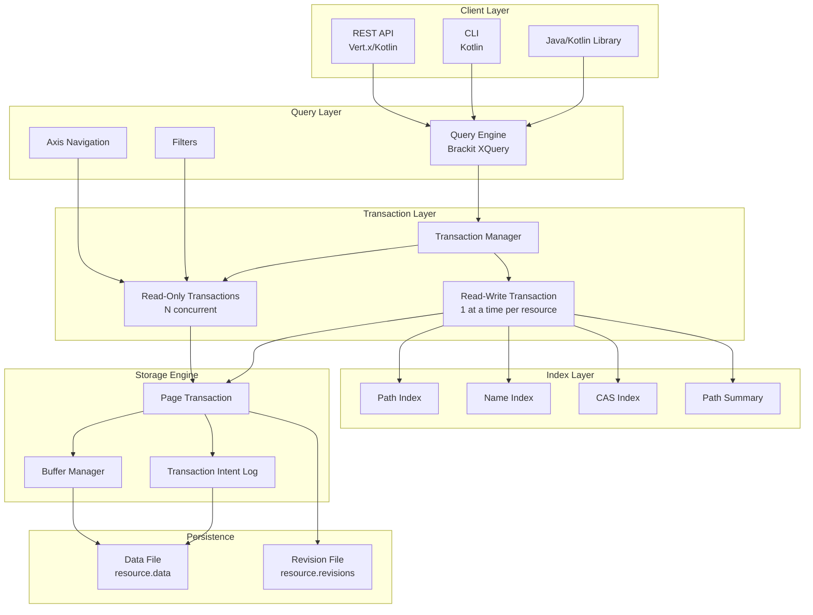
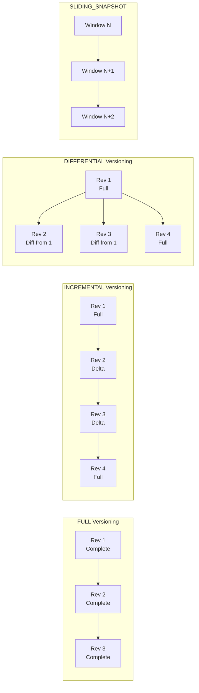
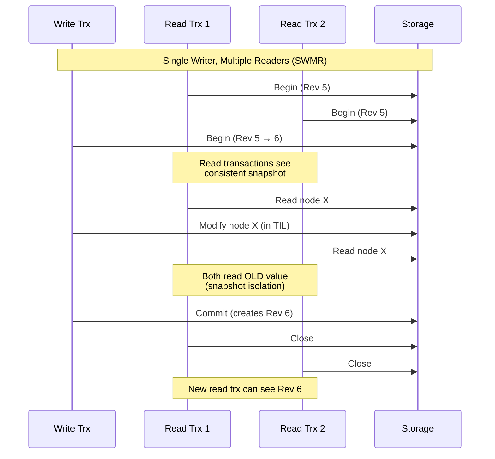
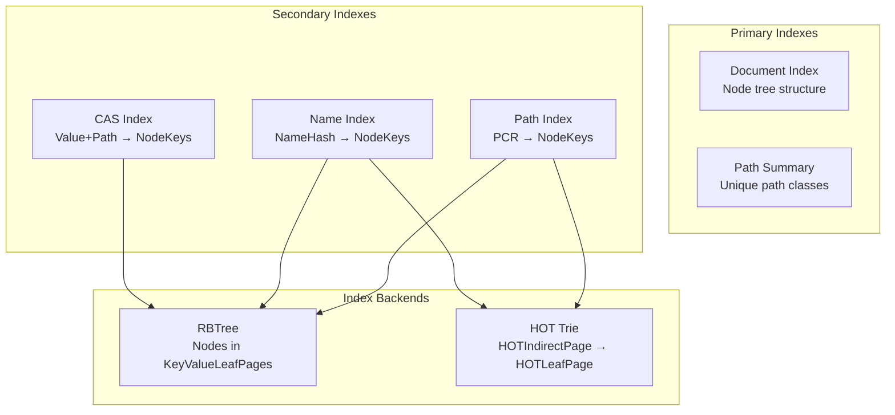
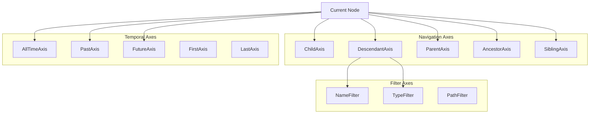
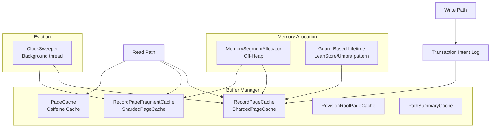

# SirixDB Architecture Specification

## Table of Contents

1. [Overview](#overview)
2. [Core Design Principles](#core-design-principles)
3. [System Architecture](#system-architecture)
4. [Storage Engine](#storage-engine)
5. [Page Structure](#page-structure)
6. [MVCC & Versioning](#mvcc--versioning)
7. [Transaction Model](#transaction-model)
8. [Index Architecture](#index-architecture)
9. [Query Processing](#query-processing)
10. [Memory Management](#memory-management)

---

## Overview

SirixDB is an **embeddable, temporal, append-only database system** designed for storing and querying versioned semi-structured data (XML and JSON). Unlike traditional databases that overwrite data in place, SirixDB implements a **copy-on-write (CoW)** strategy that preserves complete revision history while minimizing storage overhead.

### Key Characteristics

| Feature | Description |
|---------|-------------|
| **Temporal** | Every revision is preserved and queryable via time-travel |
| **Append-Only** | Never overwrites committed data (no WAL needed) |
| **Embeddable** | Can be used as a library (like SQLite) or via REST API |
| **MVCC** | Multi-Version Concurrency Control with snapshot isolation |
| **Log-Structured** | Sequential writes optimized for SSDs/flash storage |

---

## Core Design Principles

```
┌─────────────────────────────────────────────────────────────────────────┐
│                       SirixDB Design Philosophy                         │
├─────────────────────────────────────────────────────────────────────────┤
│                                                                         │
│  ┌──────────────┐    ┌──────────────┐    ┌──────────────┐               │
│  │   TEMPORAL   │    │   IMMUTABLE  │    │    SHARED    │               │
│  │    FIRST     │    │     PAGES    │    │   STRUCTURE  │               │
│  │              │    │              │    │              │               │
│  │  Every rev   │    │   CoW with   │    │  Unchanged   │               │
│  │  preserved   │    │  no in-place │    │  pages are   │               │
│  │  & queryable │    │   updates    │    │   shared     │               │
│  └──────────────┘    └──────────────┘    └──────────────┘               │
│                                                                         │
│  ┌──────────────┐    ┌──────────────┐    ┌──────────────┐               │
│  │  SSD/FLASH   │    │    CRASH     │    │   MINIMAL    │               │
│  │   FRIENDLY   │    │     SAFE     │    │ WRITE AMPLIF │               │
│  │              │    │              │    │              │               │
│  │  Sequential  │    │  Atomic page │    │  Only delta  │               │
│  │   batched    │    │  commits, no │    │   fragments  │               │
│  │   writes     │    │  WAL needed  │    │   written    │               │
│  └──────────────┘    └──────────────┘    └──────────────┘               │
│                                                                         │
└─────────────────────────────────────────────────────────────────────────┘
```

---

## System Architecture

### High-Level Component Diagram



### Module Structure

```
sirix/bundles/
├── sirix-core/          # Core storage engine, transactions, pages
├── sirix-query/         # Brackit XQuery engine integration
├── sirix-rest-api/      # Vert.x REST server (Kotlin)
├── sirix-kotlin-cli/    # Command-line interface
├── sirix-kotlin-api/    # Kotlin extensions
├── sirix-distributed/   # Distributed features (experimental)
└── sirix-examples/      # Usage examples
```

---

## Storage Engine

### File Layout

```
┌─────────────────────────────────────────────────────────────────────────────┐
│                         SirixDB File Layout                                 │
├─────────────────────────────────────────────────────────────────────────────┤
│                                                                             │
│  mydatabase/                           ◄── Database directory               │
│  ├── dbsetting.obj                     ◄── Database configuration (binary)  │
│  ├── keyselector/                      ◄── Encryption key storage           │
│  ├── .lock                             ◄── Database lock file               │
│  └── resources/                        ◄── All resources in this database   │
│      │                                                                      │
│      ├── resource1/                    ◄── Resource directory               │
│      │   ├── ressetting.obj            ◄── Resource config (binary)         │
│      │   ├── data/                     ◄── Main storage                     │
│      │   │   ├── sirix.data            ◄── Page data (append-only)          │
│      │   │   └── sirix.revisions       ◄── Revision offset index            │
│      │   ├── indexes/                  ◄── Index definitions                │
│      │   │   └── indexes.xml           ◄── XML index config                 │
│      │   ├── log/                      ◄── Transaction intent log           │
│      │   │   └── .commit               ◄── Commit marker file               │
│      │   ├── encryption/               ◄── Resource encryption keys         │
│      │   └── update-operations/        ◄── Update operation logs            │
│      │                                                                      │
│      └── resource2/                    ◄── Another resource                 │
│          └── ...                                                            │
│                                                                             │
└─────────────────────────────────────────────────────────────────────────────┘
```

**Key files:**
- `sirix.data` - Append-only file containing all pages (compressed, versioned)
- `sirix.revisions` - Index mapping revision numbers to file offsets
- `ressetting.obj` - Serialized `ResourceConfiguration` (versioning type, compression, etc.)

### Page Hierarchy

```
┌─────────────────────────────────────────────────────────────────────────┐
│                        SirixDB Page Hierarchy                           │
├─────────────────────────────────────────────────────────────────────────┤
│                                                                         │
│  UberPage                                                               │
│  ════════                                                               │
│  │ Entry point for resource (one per resource)                          │
│  │ Points to RevisionRootPage for each revision                         │
│  │                                                                      │
│  ▼                                                                      │
│  RevisionRootPage (Rev N)                                               │
│  ════════════════════════                                               │
│  │ Root for one revision                                                │
│  │ Commit timestamp, max node key                                       │
│  │                                                                      │
│  ├──► DocumentPage ───────────────────────────────────────────────────┐ │
│  │    (Node storage root)                                             │ │
│  │         │                                                          │ │
│  │         ▼                                                          │ │
│  │    IndirectPage L0 [0..1023]                                       │ │
│  │         │                                                          │ │
│  │         ├─[0]──► IndirectPage L1 [0..1023]                         │ │
│  │         │              │                                           │ │
│  │         │              ├─[0]──► IndirectPage L2 ──► ... ──► Leaf   │ │
│  │         │              ├─[1]──► IndirectPage L2 ──► ... ──► Leaf   │ │
│  │         │              └─[...]                                     │ │
│  │         │                                                          │ │
│  │         ├─[1]──► IndirectPage L1 ──► ...                           │ │
│  │         ├─[2]──► IndirectPage L1 ──► ...                           │ │
│  │         └─[...]──► (up to 1024 children per level)                 │ │
│  │                                                                    │ │
│  │                          ▼                                         │ │
│  │                   KeyValueLeafPage                                 │ │
│  │                   ════════════════                                 │ │
│  │                   │ Up to 1024 node records                        │ │
│  │                   │ Off-heap MemorySegment                         │ │
│  │                   └────────────────────────────────────────────────┘ │
│  │                                                                      │
│  ├──► PathSummaryPage ──► IndirectPages ──► KeyValueLeafPage (Paths)    │
│  │                                                                      │
│  ├──► NamePage ─────────► IndirectPages ──► KeyValueLeafPage (names)    │
│  │                                                                      │
│  │   Secondary Indexes (configurable backend):                          │
│  │   ─────────────────────────────────────────                          │
│  │                                                                      │
│  │   HOT backend:                                                       │
│  ├──► PathPage ─────────► HOTIndirectPage ──► HOTLeafPage               │
│  ├──► NameIndexPage ────► HOTIndirectPage ──► HOTLeafPage               │
│  ├──► CASPage ──────────► HOTIndirectPage ──► HOTLeafPage               │
│  │                                                                      │
│  │   RBTree backend:                                                    │
│  ├──► PathPage ─────────► IndirectPages ──► KeyValueLeafPage (RBNodes)  │
│  ├──► NameIndexPage ────► IndirectPages ──► KeyValueLeafPage (RBNodes)  │
│  └──► CASPage ──────────► IndirectPages ──► KeyValueLeafPage (RBNodes)  │
│                                                                         │
└─────────────────────────────────────────────────────────────────────────┘
```

### HOT Index Structure (Secondary Indexes)

```
┌─────────────────────────────────────────────────────────────────────────┐
│                   HOT (Height-Optimized Trie) Index                     │
├─────────────────────────────────────────────────────────────────────────┤
│                                                                         │
│  PathPage / NameIndexPage / CASPage                                     │
│       │                                                                 │
│       ▼                                                                 │
│  ┌───────────────────────────────────────────────────────────────────┐  │
│  │  HOT Root (HOTIndirectPage)                                       │  │
│  │  ════════════════════════════                                     │  │
│  │                                                                   │  │
│  │  BiNode: discriminative bit at position 12                        │  │
│  │  ┌───────────────────┬───────────────────┐                        │  │
│  │  │ bit=0 → left      │ bit=1 → right     │                        │  │
│  │  └────────┬──────────┴─────────┬─────────┘                        │  │
│  │           │                    │                                  │  │
│  │           ▼                    ▼                                  │  │
│  │     SpanNode              HOTLeafPage                             │  │
│  │   (4 bits, 16 slots)     ┌──────────────────────────────────┐     │  │
│  │   ┌──┬──┬──┬──┐          │ [key₁|NodeRefs₁]                 │     │  │
│  │   │0 │1 │..│15│          │ [key₂|NodeRefs₂]                 │     │  │
│  │   └┬─┴┬─┴──┴┬─┘          │ [key₃|NodeRefs₃]                 │     │  │
│  │    │  │     │            │ ...                              │     │  │
│  │    ▼  ▼     ▼            │ Sorted by key, binary search     │     │  │
│  │   Leaf Leaf Leaf         │ Values: Roaring64Bitmap          │     │  │
│  │                          └──────────────────────────────────┘     │  │
│  │                                                                   │  │
│  └───────────────────────────────────────────────────────────────────┘  │
│                                                                         │
│  Index Types:                                                           │
│  ────────────                                                           │
│  • PATH Index:  key = pathNodeKey (long)  → NodeReferences (bitmap)     │
│  • NAME Index:  key = nameHash (bytes)    → NodeReferences (bitmap)     │
│  • CAS Index:   key = value+path (bytes)  → NodeReferences (bitmap)     │
│                                                                         │
│  HOT Node Types:                                                        │
│  ───────────────                                                        │
│  • BiNode:   2 children, single discriminative bit                      │
│  • SpanNode: up to 16 children, 4 contiguous bits                       │
│  • MultiNode: up to 256 children, 8 bits (full byte)                    │
│                                                                         │
│  Leaf Page:                                                             │
│  ──────────                                                             │
│  • HOTLeafPage: up to 512 key-value entries                             │
│  • Keys sorted for binary search O(log n)                               │
│  • Values are Roaring64Bitmap (compressed node key sets)                │
│  • Off-heap storage via MemorySegment                                   │
│                                                                         │
└─────────────────────────────────────────────────────────────────────────┘
```

---

## Page Structure

### Core Page Types

| Page Type | Purpose | Key Properties |
|-----------|---------|----------------|
| **UberPage** | Resource entry point | Points to RevisionRootPages (all revisions) |
| **RevisionRootPage** | Root of a revision's page tree | Commit timestamp, max node key |
| **IndirectPage** | Trie node for 64-bit keys | Up to 1024 child references |
| **KeyValueLeafPage** | Stores actual node records | Off-heap MemorySegment storage |
| **NamePage** | String table for names | Element/attribute/key names |
| **PathPage** | Path index roots | References to path index trees |
| **CASPage** | Content-and-Structure index | Combined value+path indexing |

### IndirectPage Trie Navigation

SirixDB uses a **trie structure** (not a B+ tree) to navigate from node keys to their storage locations. The 64-bit node key is decomposed into 10-bit chunks, with each chunk indexing into an IndirectPage:

```
Node Key (64-bit): 0x0000_0001_ABCD_EF01
                   ├──────────────────────┘
                   │
Decomposed into 10-bit indices (2^10 = 1024 slots per IndirectPage):

   Level 0: bits 60-70  ─► IndirectPage[idx] ─►
   Level 1: bits 50-60  ─► IndirectPage[idx] ─►
   Level 2: bits 40-50  ─► IndirectPage[idx] ─►
   Level 3: bits 30-40  ─► IndirectPage[idx] ─►
   Level 4: bits 20-30  ─► IndirectPage[idx] ─►
   Level 5: bits 10-20  ─► IndirectPage[idx] ─►
   Level 6: bits 0-10   ─► KeyValueLeafPage

┌─────────────────────────────────────────────────────────────────────────────┐
│                          Trie Navigation Example                            │
├─────────────────────────────────────────────────────────────────────────────┤
│                                                                             │
│   DocumentPage                                                              │
│       │                                                                     │
│       ▼                                                                     │
│   IndirectPage L0 [0..1023]                                                 │
│       │                                                                     │
│       ├── [0] ──► IndirectPage L1 ──► ... ──► LeafPage (nodes 0-1023)       │
│       ├── [1] ──► IndirectPage L1 ──► ... ──► LeafPage (nodes 1024-2047)    │
│       ├── [2] ──► IndirectPage L1 ──► ... ──► LeafPage (nodes 2048-3071)    │
│       │   ...                                                               │
│       └── [1023] ──► IndirectPage L1 ──► ...                                │
│                                                                             │
└─────────────────────────────────────────────────────────────────────────────┘
```

Each IndirectPage level provides **O(1)** lookup for its portion of the key, making node lookup **O(depth)** where depth is typically 7 levels maximum.

### KeyValueLeafPage Memory Layout

```
┌─────────────────────────────────────────────────────────────────────────┐
│                      KeyValueLeafPage (Off-Heap)                        │
├─────────────────────────────────────────────────────────────────────────┤
│ Header: pageKey (8B) | revision (4B) | entryCount (4B) | ...            │
├─────────────────────────────────────────────────────────────────────────┤
│                                                                         │
│  Slot Offsets Array (int[])       Records Array (DataRecord[])          │
│  ┌─────┬─────┬─────┬─────┐        ┌────────────────────────────┐        │
│  │  0  │ 128 │ 256 │ ... │        │ Record 0                   │        │
│  └──┬──┴──┬──┴──┬──┴─────┘        ├────────────────────────────┤        │
│     │     │     │                 │ Record 1                   │        │
│     │     │     └────────────────►├────────────────────────────┤        │
│     │     └──────────────────────►│ Record 2                   │        │
│     └────────────────────────────►└────────────────────────────┘        │
│                                                                         │
│  MemorySegment (slots)            MemorySegment (deweyIds)              │
│  ┌─────────────────────┐          ┌─────────────────────┐               │
│  │ Serialized bytes    │          │ DeweyID bytes       │               │
│  │ for each record     │          │ (if enabled)        │               │
│  └─────────────────────┘          └─────────────────────┘               │
│                                                                         │
└─────────────────────────────────────────────────────────────────────────┘
```

### Page Reference

Each `PageReference` contains:

```java
class PageReference {
    long key;           // Storage offset (persistent)
    int logKey;         // Transaction log index (transient)
    long checksum;      // Data integrity checksum
    Page page;          // In-memory swizzled page (transient)
}
```

---

## MVCC & Versioning

SirixDB implements a **Copy-on-Write (COW)** architecture where modifications never overwrite existing data. This enables:
- **Time-travel queries**: Access any historical revision instantly
- **MVCC (Multi-Version Concurrency Control)**: Readers never block writers
- **Crash consistency**: Atomic commits via single pointer swap

### Copy-on-Write Mechanism

When a page is modified, SirixDB creates a new version rather than modifying in place:

```
┌─────────────────────────────────────────────────────────────────────────────┐
│                        Copy-on-Write Page Modification                      │
├─────────────────────────────────────────────────────────────────────────────┤
│                                                                             │
│    Revision N                          Revision N+1                         │
│    ──────────                          ────────────                         │
│                                                                             │
│         ┌─────┐                             ┌─────┐                         │
│         │Root │                             │Root'│ ◄── NEW (copied)        │
│         └──┬──┘                             └──┬──┘                         │
│            │                                   │                            │
│      ┌─────┴─────┐                       ┌─────┴─────┐                      │
│      │           │                       │           │                      │
│   ┌──┴──┐     ┌──┴──┐                 ┌──┴──┐     ┌──┴──┐                   │
│   │  A  │     │  B  │                 │  A  │────►│ B'  │ ◄── NEW (copied)  │
│   └──┬──┘     └──┬──┘                 └──┬──┘     └──┬──┘                   │
│      │           │                    SHARED         │                      │
│   ┌──┴──┐     ┌──┴──┐                 ┌──┴──┐     ┌──┴──┐                   │
│   │  C  │     │  D  │                 │  C  │────►│ D'  │ ◄── NEW (modified)│
│   └─────┘     └─────┘                 └─────┘     └─────┘                   │
│                                       SHARED                                │
│                                                                             │
│   Key insight: Pages A and C are SHARED between revisions                   │
│   Only the modified path (Root' → B' → D') is copied                        │
│                                                                             │
└─────────────────────────────────────────────────────────────────────────────┘
```

### Transaction Intent Log (TIL)

During a write transaction, modified pages are held in memory in the **Transaction Intent Log**:

```
┌─────────────────────────────────────────────────────────────────────────┐
│                        Transaction Intent Log                           │
├─────────────────────────────────────────────────────────────────────────┤
│                                                                         │
│  Write Transaction                                                      │
│  ─────────────────                                                      │
│                                                                         │
│  ┌───────────────────────────────────────────────────────────────────┐  │
│  │  TransactionIntentLog                                             │  │
│  │  ┌─────────────────────────────────────────────────────────────┐  │  │
│  │  │ PageContainer[0]: complete=Page₁, modified=Page₁'           │  │  │
│  │  │ PageContainer[1]: complete=Page₂, modified=Page₂'           │  │  │
│  │  │ PageContainer[2]: complete=Page₃, modified=Page₃'           │  │  │
│  │  │ ...                                                         │  │  │
│  │  └─────────────────────────────────────────────────────────────┘  │  │
│  └───────────────────────────────────────────────────────────────────┘  │
│                                                                         │
│  On COMMIT:                          On ROLLBACK:                       │
│  ───────────                         ────────────                       │
│  1. Write all modified pages         1. TIL.clear()                     │
│  2. Write new RevisionRootPage       2. Close all pages                 │
│  3. Update UberPage pointer          3. Release memory                  │
│  4. fsync() for durability                                              │
│  5. TIL.clear()                                                         │
│                                                                         │
└─────────────────────────────────────────────────────────────────────────┘
```

### Versioning Strategies

The key innovation in SirixDB is **configurable page versioning** which controls the trade-off between storage overhead, read performance, and write performance.



| Strategy | Read Cost | Write Cost | Storage | Use Case |
|----------|-----------|------------|---------|----------|
| **FULL** | O(1) | High | Highest | Read-heavy, infrequent updates |
| **INCREMENTAL** | O(k) | Low | Low | Frequent small updates |
| **DIFFERENTIAL** | O(1) | Medium | Medium | Balanced read/write |
| **SLIDING_SNAPSHOT** | O(1)-O(k) | Low | Lowest | Time-windowed queries |

### How Versioning Algorithms Work

#### FULL Versioning

Every revision stores complete pages. No reconstruction needed.

```
┌─────────────────────────────────────────────────────────────────────────────┐
│                            FULL Versioning                                  │
├─────────────────────────────────────────────────────────────────────────────┤
│                                                                             │
│   Storage Layout:                                                           │
│   ───────────────                                                           │
│                                                                             │
│   Rev 1: [Page A₁ FULL] [Page B₁ FULL] [Page C₁ FULL]                       │
│   Rev 2: [Page A₂ FULL] [Page B₂ FULL] [Page C₂ FULL]  ◄── All complete     │
│   Rev 3: [Page A₃ FULL] [Page B₃ FULL] [Page C₃ FULL]                       │
│                                                                             │
│   Read Rev 2, Page B:                                                       │
│   ───────────────────                                                       │
│   → Load Page B₂ directly (O(1) I/O)                                        │
│                                                                             │
│   Pros: Fastest reads, simplest implementation                              │
│   Cons: Highest storage, every write copies entire page                     │
│                                                                             │
└─────────────────────────────────────────────────────────────────────────────┘
```

#### INCREMENTAL Versioning

Stores only changed records. Full snapshots created every N revisions.

```
┌─────────────────────────────────────────────────────────────────────────────┐
│                        INCREMENTAL Versioning                               │
│                        (revisionsToRestore = 4)                             │
├─────────────────────────────────────────────────────────────────────────────┤
│                                                                             │
│   Storage Layout (Page A across revisions):                                 │
│   ──────────────────────────────────────────                                │
│                                                                             │
│   Rev 1: [FULL: slots 0,1,2,3,4,5...1023]      ◄── Full snapshot            │
│   Rev 2: [DELTA: slot 5 changed]               ◄── Only changed slot        │
│   Rev 3: [DELTA: slots 10,11 changed]          ◄── Only changed slots       │
│   Rev 4: [DELTA: slot 5 changed again]                                      │
│   Rev 5: [FULL: slots 0,1,2,3,4,5...1023]      ◄── New full snapshot        │
│   Rev 6: [DELTA: slot 100 changed]                                          │
│   ...                                                                       │
│                                                                             │
│   Read Rev 4, Page A (reconstruction):                                      │
│   ────────────────────────────────────                                      │
│   1. Load Rev 4 delta  → slot 5                                             │
│   2. Load Rev 3 delta  → slots 10,11                                        │
│   3. Load Rev 2 delta  → slot 5 (skip, already have newer)                  │
│   4. Load Rev 1 full   → remaining slots                                    │
│   5. Combine: newer fragments override older                                │
│                                                                             │
│   Fragment Chain:                                                           │
│   ───────────────                                                           │
│   PageReference.pageFragments = [                                           │
│     FragmentKey(rev=4, offset=..., dbId, resId),                            │
│     FragmentKey(rev=3, offset=...),                                         │
│     FragmentKey(rev=2, offset=...),                                         │
│     FragmentKey(rev=1, offset=...)   ◄── Full dump (chain anchor)           │
│   ]                                                                         │
│                                                                             │
│   Slot Bitmap Optimization:                                                 │
│   ─────────────────────────                                                 │
│   Each KeyValueLeafPage tracks populated slots with a bitmap (long[16])     │
│   Reconstruction iterates only populated slots: O(k) not O(1024)            │
│                                                                             │
└─────────────────────────────────────────────────────────────────────────────┘
```

#### DIFFERENTIAL Versioning

Each delta references the last full snapshot (not the previous revision).

```
┌─────────────────────────────────────────────────────────────────────────────┐
│                       DIFFERENTIAL Versioning                               │
│                       (revisionsToRestore = 4)                              │
├─────────────────────────────────────────────────────────────────────────────┤
│                                                                             │
│   Storage Layout (Page A):                                                  │
│   ────────────────────────                                                  │
│                                                                             │
│   Rev 1: [FULL: all slots]            ◄── Full snapshot                     │
│   Rev 2: [DIFF from 1: slot 5]        ◄── Changes since Rev 1               │
│   Rev 3: [DIFF from 1: slots 5,10,11] ◄── ALL changes since Rev 1           │
│   Rev 4: [FULL: all slots]            ◄── New full snapshot (rev % 4 == 0)  │
│   Rev 5: [DIFF from 4: slot 100]      ◄── Changes since Rev 4               │
│                                                                             │
│   Read Rev 3, Page A:                                                       │
│   ───────────────────                                                       │
│   1. Load Rev 3 diff   → slots 5,10,11                                      │
│   2. Load Rev 1 full   → remaining slots                                    │
│   3. Combine (only 2 pages, never more!)                                    │
│                                                                             │
│   Key Difference from INCREMENTAL:                                          │
│   ─────────────────────────────────                                         │
│   • INCREMENTAL: delta = changes since previous revision                    │
│   • DIFFERENTIAL: delta = changes since last full snapshot                  │
│                                                                             │
│   Result: Always reconstruct from at most 2 fragments (O(1) complexity)     │
│   Trade-off: Deltas grow larger over time until next full snapshot          │
│                                                                             │
└─────────────────────────────────────────────────────────────────────────────┘
```

#### SLIDING_SNAPSHOT Versioning

Combines INCREMENTAL with garbage collection of old revisions.

```
┌─────────────────────────────────────────────────────────────────────────────┐
│                      SLIDING_SNAPSHOT Versioning                            │
│                      (window size = 4 revisions)                            │
├─────────────────────────────────────────────────────────────────────────────┤
│                                                                             │
│   Time ──────────────────────────────────────────────────────────────►      │
│                                                                             │
│   Window at T=4:  [Rev 1][Rev 2][Rev 3][Rev 4]                              │
│                    ↑                      ↑                                 │
│                   FULL                  Current                             │
│                                                                             │
│   Window at T=5:       [Rev 2][Rev 3][Rev 4][Rev 5]                         │
│                         ↑                      ↑                            │
│                        FULL                  Current                        │
│                   (Rev 1 garbage collected)                                 │
│                                                                             │
│   Window at T=8:                 [Rev 5][Rev 6][Rev 7][Rev 8]               │
│                                   ↑                      ↑                  │
│                                  FULL                  Current              │
│                             (Rev 2,3,4 garbage collected)                   │
│                                                                             │
│   Storage Behavior:                                                         │
│   ─────────────────                                                         │
│   • Full snapshot at start of each window                                   │
│   • Deltas within window (like INCREMENTAL)                                 │
│   • Old revisions outside window can be reclaimed                           │
│                                                                             │
│   Use Case: Audit logs, recent history queries, storage-constrained         │
│                                                                             │
└─────────────────────────────────────────────────────────────────────────────┘
```

### Page Fragment Storage

Page fragments are linked via `PageFragmentKey` for reconstruction:

```java
record PageFragmentKey(
    int revision,        // Which revision this fragment is from
    long storageKey,     // Offset in data file
    int databaseId,      // For multi-database deployments
    int resourceId       // Which resource within database
) {}
```

During commit, the storage engine:
1. Serializes the modified page (full or delta based on strategy)
2. Compresses using LZ4 or Zstd
3. Writes to append-only data file
4. Creates `PageFragmentKey` pointing to new fragment
5. Links to previous fragments in `PageReference.pageFragments`

### PageContainer: Complete vs Modified

The `PageContainer` holds two views of a page during modification:

```
┌─────────────────────────────────────────────────────────────────────────────┐
│                            PageContainer                                    │
├─────────────────────────────────────────────────────────────────────────────┤
│                                                                             │
│   PageContainer {                                                           │
│     Page complete;   // Reconstructed page (all slots from all fragments)   │
│     Page modified;   // Page being modified (for delta strategies)          │
│   }                                                                         │
│                                                                             │
│   For FULL versioning:                                                      │
│   ────────────────────                                                      │
│   complete == modified (same page, full copy on any modification)           │
│                                                                             │
│   For DIFFERENTIAL/INCREMENTAL:                                             │
│   ──────────────────────────────                                            │
│   complete = fully reconstructed page (for reading current values)          │
│   modified = delta page (only stores NEW changes for efficient commit)      │
│                                                                             │
│   Lazy Copy Optimization:                                                   │
│   ───────────────────────                                                   │
│   Instead of copying all slots from complete→modified upfront:              │
│   1. Mark slots for preservation with preservationBitmap                    │
│   2. At commit time (addReferences), copy only preserved slots              │
│   3. Slots that were actually modified are already in modified page         │
│                                                                             │
└─────────────────────────────────────────────────────────────────────────────┘
```

---

## Transaction Model

### Transaction Types

```
┌─────────────────────────────────────────────────────────────────────────────┐
│                         SirixDB Transaction Types                           │
├─────────────────────────────────────────────────────────────────────────────┤
│                                                                             │
│   Read-Only Transaction (NodeReadOnlyTrx)                                   │
│   ═══════════════════════════════════════                                   │
│   • ALWAYS bound to a SPECIFIC revision (immutable snapshot)                │
│   • Multiple read transactions can run concurrently                         │
│   • Never sees uncommitted changes from write transactions                  │
│   • Can be opened for any historical revision                               │
│                                                                             │
│   Example:                                                                  │
│   ┌─────────────────────────────────────────────────────────────────────┐   │
│   │ // Read latest revision                                             │   │
│   │ JsonNodeReadOnlyTrx rtx = session.beginNodeReadOnlyTrx();           │   │
│   │                                                                     │   │
│   │ // Read specific historical revision                                │   │
│   │ JsonNodeReadOnlyTrx rtx5 = session.beginNodeReadOnlyTrx(5);         │   │
│   │                                                                     │   │
│   │ // Read revision at specific timestamp                              │   │
│   │ JsonNodeReadOnlyTrx rtxTime = session.beginNodeReadOnlyTrx(instant);│   │
│   └─────────────────────────────────────────────────────────────────────┘   │
│                                                                             │
│   Read-Write Transaction (NodeTrx)                                          │
│   ═════════════════════════════════                                         │
│   • Only ONE write transaction per resource at a time                       │
│   • Creates a NEW revision on commit                                        │
│   • Changes held in Transaction Intent Log until commit                     │
│   • Readers never blocked by writer (MVCC)                                  │
│                                                                             │
└─────────────────────────────────────────────────────────────────────────────┘
```

### Concurrency Model



### Transaction Intent Log (TIL)

The TIL holds uncommitted modifications during a write transaction:

```
┌─────────────────────────────────────────────────────────────────────────┐
│                     Transaction Intent Log (TIL)                        │
├─────────────────────────────────────────────────────────────────────────┤
│                                                                         │
│  ┌───────────────────────────────────────────────────────────────────┐  │
│  │  PageContainer[0]                                                 │  │
│  │  ┌─────────────────────┐  ┌─────────────────────┐                 │  │
│  │  │ Complete (original) │  │ Modified (changed)  │                 │  │
│  │  └─────────────────────┘  └─────────────────────┘                 │  │
│  └───────────────────────────────────────────────────────────────────┘  │
│                                                                         │
│  ┌───────────────────────────────────────────────────────────────────┐  │
│  │  PageContainer[1]                                                 │  │
│  │  ┌─────────────────────┐  ┌─────────────────────┐                 │  │
│  │  │ Complete (original) │  │ Modified (changed)  │                 │  │
│  │  └─────────────────────┘  └─────────────────────┘                 │  │
│  └───────────────────────────────────────────────────────────────────┘  │
│                                                                         │
│  PageReference.logKey → index into this list                            │
│                                                                         │
│  On COMMIT: Modified pages written to storage                           │
│  On ROLLBACK: TIL cleared, pages discarded                              │
│                                                                         │
└─────────────────────────────────────────────────────────────────────────┘
```

### Node Encoding

SirixDB stores document nodes with structural pointers enabling efficient navigation:

```
┌─────────────────────────────────────────────────────────────────────────────┐
│                         Node Structure Overview                             │
├─────────────────────────────────────────────────────────────────────────────┤
│                                                                             │
│   Every node has a unique nodeKey (64-bit) stable across all revisions      │
│                                                                             │
│   Base Node Fields (all nodes):                                             │
│   ┌─────────────────────────────────────────────────────────────────────┐   │
│   │ nodeKey           (64-bit)  Unique identifier, stable across time   │   │
│   │ parentKey         (64-bit)  Parent node's key                       │   │
│   │ previousRevision  (32-bit)  When node was created                   │   │
│   │ lastModRevision   (32-bit)  When node was last modified             │   │
│   │ hash              (64-bit)  Optional: rolling/postorder hash        │   │
│   └─────────────────────────────────────────────────────────────────────┘   │
│                                                                             │
│   Structural Node Fields (tree nodes):                                      │
│   ┌─────────────────────────────────────────────────────────────────────┐   │
│   │ firstChildKey     (64-bit)  First child's key                       │   │
│   │ lastChildKey      (64-bit)  Last child's key                        │   │
│   │ leftSiblingKey    (64-bit)  Left sibling's key                      │   │
│   │ rightSiblingKey   (64-bit)  Right sibling's key                     │   │
│   │ childCount        (64-bit)  Optional: number of children            │   │
│   │ descendantCount   (64-bit)  Optional: number of descendants         │   │
│   └─────────────────────────────────────────────────────────────────────┘   │
│                                                                             │
│   Named Node Fields (elements, attributes, object keys):                    │
│   ┌─────────────────────────────────────────────────────────────────────┐   │
│   │ pathNodeKey       (64-bit)  Reference to PathSummary node (PCR)     │   │
│   │ localNameKey      (32-bit)  Index into NamePage string table        │   │
│   │ prefixKey         (32-bit)  XML namespace prefix (NamePage index)   │   │
│   │ uriKey            (32-bit)  XML namespace URI (NamePage index)      │   │
│   └─────────────────────────────────────────────────────────────────────┘   │
│                                                                             │
└─────────────────────────────────────────────────────────────────────────────┘
```

#### Node Types

**XML Node Types:**

| NodeKind | ID | Description |
|----------|-----|-------------|
| ELEMENT | 1 | XML element with optional attributes/namespaces |
| ATTRIBUTE | 2 | Attribute node |
| NAMESPACE | 4 | Namespace declaration |
| TEXT | 6 | Text content node |
| PROCESSING_INSTRUCTION | 7 | Processing instruction |
| COMMENT | 8 | Comment node |
| XML_DOCUMENT | 9 | Document root |

**JSON Node Types:**

| NodeKind | ID | Description |
|----------|-----|-------------|
| JSON_DOCUMENT | 31 | JSON document root |
| OBJECT | 24 | JSON object `{ }` |
| ARRAY | 25 | JSON array `[ ]` |
| OBJECT_KEY | 26 | Object key (field name) |
| STRING_VALUE | 26 | String value `"text"` |
| NUMBER_VALUE | 28 | Number value `123.45` |
| BOOLEAN_VALUE | 27 | Boolean value `true`/`false` |
| NULL_VALUE | 29 | Null value `null` |

#### Serialization Format

```
┌─────────────────────────────────────────────────────────────────────────┐
│                    Node Serialization Layout                            │
├─────────────────────────────────────────────────────────────────────────┤
│                                                                         │
│  On-Disk Format (per node in KeyValueLeafPage):                         │
│  ┌─────┬─────────────────────────────────────────────────────────────┐  │
│  │ 1B  │ NodeKind ID                                                 │  │
│  ├─────┼─────────────────────────────────────────────────────────────┤  │
│  │ var │ Structural fields (delta-encoded for JSON, fixed for XML)   │  │
│  ├─────┼─────────────────────────────────────────────────────────────┤  │
│  │ var │ Type-specific fields (name keys, value bytes, etc.)         │  │
│  └─────┴─────────────────────────────────────────────────────────────┘  │
│                                                                         │
│  Optimizations:                                                         │
│  • Delta encoding: sibling/parent keys stored as offset from nodeKey    │
│  • VarInt encoding: small values use fewer bytes                        │
│  • String compression: FSST (Fast Static Symbol Table) for text         │
│  • DeweyID compression: delta-encoded hierarchical IDs                  │
│                                                                         │
│  Example JSON StringNode serialization:                                 │
│  ┌───────────────────────────────────────────────────────────────────┐  │
│  │ [1B kind][varInt parentDelta][varInt leftSib][varInt rightSib]    │  │
│  │ [varInt prevRev][varInt lastModRev][8B hash][1B compressed]       │  │
│  │ [varInt valueLen][valueLen bytes]                                 │  │
│  └───────────────────────────────────────────────────────────────────┘  │
│                                                                         │
└─────────────────────────────────────────────────────────────────────────┘
```

#### Example: JSON Document Node Structure

```
┌───────────────────────────────────────────────────────────────────────────┐
│              JSON Document Example with All Node Types                    │
├───────────────────────────────────────────────────────────────────────────┤
│                                                                           │
│  JSON Document:                                                           │
│  {                                                                        │
│    "name": "Alice",                                                       │
│    "age": 30,                                                             │
│    "active": true,                                                        │
│    "address": null,                                                       │
│    "tags": ["dev", "lead"]                                                │
│  }                                                                        │
│                                                                           │
│  Node Tree:                                                               │
│  ══════════                                                               │
│                                                                           │
│  ┌────────────────────────────────────────────────────────────────────┐   │
│  │ JSON_DOCUMENT (nodeKey=0)                                          │   │
│  │ Type: Document root                                                │   │
│  └───────────────────────────────┬────────────────────────────────────┘   │
│                                  │ firstChild                             │
│                                  ▼                                        │
│  ┌────────────────────────────────────────────────────────────────────┐   │
│  │ OBJECT (nodeKey=1)                                                 │   │
│  │ Type: JSON object { }                                              │   │
│  │ childCount: 5                                                      │   │
│  └───────────────────────────────┬────────────────────────────────────┘   │
│                                  │ firstChild                             │
│      ┌───────────────────────────┼───────────────────────────┐            │
│      ▼                           │                           │            │
│  ┌────────────────┐  rightSib    ▼          rightSib         ▼            │
│  │ OBJECT_KEY     │─────────►┌────────────┐─────────►┌────────────┐       │
│  │ (nodeKey=2)    │          │ OBJECT_KEY │          │ OBJECT_KEY │       │
│  │ name: "name"   │          │ (nodeKey=4)│          │ (nodeKey=6)│       │
│  │ localNameKey→  │          │ name:"age" │          │name:"active│       │
│  │   NamePage[0]  │          └─────┬──────┘          └─────┬──────┘       │
│  └───────┬────────┘                │                       │              │
│          │ firstChild              │ firstChild            │ firstChild   │
│          ▼                         ▼                       ▼              │
│  ┌────────────────┐        ┌────────────────┐      ┌────────────────┐     │
│  │ STRING_VALUE   │        │ NUMBER_VALUE   │      │ BOOLEAN_VALUE  │     │
│  │ (nodeKey=3)    │        │ (nodeKey=5)    │      │ (nodeKey=7)    │     │
│  │ value: "Alice" │        │ value: 30      │      │ value: true    │     │
│  │ (FSST compress)│        │ (8-byte double)│      │ (1-bit flag)   │     │
│  └────────────────┘        └────────────────┘      └────────────────┘     │
│                                                                           │
│  ... continuing siblings:                                                 │
│                                                                           │
│  ┌────────────────┐  rightSib ┌────────────────┐                          │
│  │ OBJECT_KEY     │──────────►│ OBJECT_KEY     │                          │
│  │ (nodeKey=8)    │           │ (nodeKey=10)   │                          │
│  │ name:"address" │           │ name: "tags"   │                          │
│  └───────┬────────┘           └───────┬────────┘                          │
│          │ firstChild                 │ firstChild                        │
│          ▼                            ▼                                   │
│  ┌────────────────┐           ┌────────────────┐                          │
│  │ NULL_VALUE     │           │ ARRAY          │                          │
│  │ (nodeKey=9)    │           │ (nodeKey=11)   │                          │
│  │ (no payload)   │           │ childCount: 2  │                          │
│  └────────────────┘           └───────┬────────┘                          │
│                                       │ firstChild                        │
│                          ┌────────────┴────────────┐                      │
│                          ▼                         ▼                      │
│                  ┌────────────────┐ rightSib ┌────────────────┐           │
│                  │ STRING_VALUE   │─────────►│ STRING_VALUE   │           │
│                  │ (nodeKey=12)   │          │ (nodeKey=13)   │           │
│                  │ value: "dev"   │          │ value: "lead"  │           │
│                  └────────────────┘          └────────────────┘           │
│                                                                           │
│  Node Key Mapping:                                                        │
│  ─────────────────                                                        │
│  nodeKey 0  → JSON_DOCUMENT  (root)                                       │
│  nodeKey 1  → OBJECT         (main object)                                │
│  nodeKey 2  → OBJECT_KEY     ("name")                                     │
│  nodeKey 3  → STRING_VALUE   ("Alice")                                    │
│  nodeKey 4  → OBJECT_KEY     ("age")                                      │
│  nodeKey 5  → NUMBER_VALUE   (30)                                         │
│  nodeKey 6  → OBJECT_KEY     ("active")                                   │
│  nodeKey 7  → BOOLEAN_VALUE  (true)                                       │
│  nodeKey 8  → OBJECT_KEY     ("address")                                  │
│  nodeKey 9  → NULL_VALUE     (null)                                       │
│  nodeKey 10 → OBJECT_KEY     ("tags")                                     │
│  nodeKey 11 → ARRAY          (array container)                            │
│  nodeKey 12 → STRING_VALUE   ("dev")                                      │
│  nodeKey 13 → STRING_VALUE   ("lead")                                     │
│                                                                           │
└───────────────────────────────────────────────────────────────────────────┘
```

#### Node Relationships

```
┌───────────────────────────────────────────────────────────────────────────┐
│                        Node Pointer Structure                             │
├───────────────────────────────────────────────────────────────────────────┤
│                                                                           │
│                            ┌─────────────┐                                │
│                            │   Parent    │                                │
│                            └──────┬──────┘                                │
│                                   │ parentKey                             │
│                                   ▼                                       │
│  ┌─────────────┐ rightSibling ┌─────────────┐ rightSibling ┌───────────┐  │
│  │ Left Sibling│◄─────────────│   Current   │─────────────►│  Right    │  │
│  └─────────────┘ leftSibling  │    Node     │ leftSibling  │  Sibling  │  │
│                               └──────┬──────┘              └───────────┘  │
│                       firstChild │   │ lastChild                          │
│                                  ▼   ▼                                    │
│                            ┌───────────────┐                              │
│                            │   Children    │                              │
│                            │ (linked list) │                              │
│                            └───────────────┘                              │
│                                                                           │
│  Navigation Complexity:                                                   │
│  • parent()          O(1)  - direct lookup                                │
│  • firstChild()      O(1)  - direct lookup                                │
│  • lastChild()       O(1)  - direct lookup                                │
│  • leftSibling()     O(1)  - direct lookup                                │
│  • rightSibling()    O(1)  - direct lookup                                │
│  • childAt(index)    O(n)  - must traverse sibling chain                  │
│  • descendant(key)   O(log n) - trie lookup by nodeKey                    │
│                                                                           │
└───────────────────────────────────────────────────────────────────────────┘
```

#### Physical Storage: No Pointer Chasing

```
┌─────────────────────────────────────────────────────────────────────────────┐
│                 Node Storage in KeyValueLeafPage                            │
├─────────────────────────────────────────────────────────────────────────────┤
│                                                                             │
│   IMPORTANT: Node keys are NOT memory pointers!                             │
│   ════════════════════════════════════════════════                          │
│                                                                             │
│   The "parentKey", "firstChildKey", etc. are LOGICAL identifiers that       │
│   require a trie lookup to resolve. However, nodes are stored together      │
│   in KeyValueLeafPages to maximize cache locality.                          │
│                                                                             │
│   KeyValueLeafPage (Off-Heap MemorySegment):                                │
│   ┌─────────────────────────────────────────────────────────────────────┐   │
│   │                                                                     │   │
│   │   Up to 1024 nodes stored in CONTIGUOUS memory region               │   │
│   │                                                                     │   │
│   │   ┌──────────┬──────────┬──────────┬──────────┬─────────────────┐   │   │
│   │   │ Node 0   │ Node 1   │ Node 2   │ Node 3   │ ... Node 1023   │   │   │
│   │   │ (parent) │ (child1) │ (child2) │ (child3) │                 │   │   │
│   │   └──────────┴──────────┴──────────┴──────────┴─────────────────┘   │   │
│   │                                                                     │   │
│   │   MemorySegment: native off-heap memory, cache-friendly layout      │   │
│   │                                                                     │   │
│   └─────────────────────────────────────────────────────────────────────┘   │
│                                                                             │
│   Node Key Assignment:                                                      │
│   ─────────────────────                                                     │
│   • Nodes are assigned sequential keys during insertion                     │
│   • Related nodes (parent + children) often land in same page               │
│   • Page key = nodeKey / 1024 (determines which page)                       │
│   • Slot index = nodeKey % 1024 (offset within page)                        │
│                                                                             │
│   Example:                                                                  │
│   nodeKey 1000 → Page 0, Slot 1000                                          │
│   nodeKey 1024 → Page 1, Slot 0                                             │
│   nodeKey 2050 → Page 2, Slot 2                                             │
│                                                                             │
│   Cache Locality Benefits:                                                  │
│   ─────────────────────────                                                 │
│   • Sequential inserts keep related nodes in same page                      │
│   • Descendants often share page with ancestors                             │
│   • Single page load brings 1024 related nodes into cache                   │
│   • Off-heap storage avoids GC pressure                                     │
│                                                                             │
│   Trie Lookup (nodeKey → Node):                                             │
│   ──────────────────────────────                                            │
│   1. Compute page key: nodeKey >> 10  (divide by 1024)                      │
│   2. Navigate IndirectPage trie with 10-bit chunks                          │
│   3. Load KeyValueLeafPage (likely already cached)                          │
│   4. Direct slot access: slots[nodeKey & 1023]                              │
│                                                                             │
└─────────────────────────────────────────────────────────────────────────────┘
```

### Navigation Axes

SirixDB provides two categories of axes for document traversal:

#### Spatial Axes (Within a Single Revision)

Navigate the document tree structure within a single revision snapshot:

```
┌─────────────────────────────────────────────────────────────────────────────┐
│                           Spatial Axes                                      │
├─────────────────────────────────────────────────────────────────────────────┤
│                                                                             │
│   Document Tree:                                                            │
│                           ┌───────────┐                                     │
│                           │   root    │                                     │
│                           └─────┬─────┘                                     │
│                    ┌────────────┼────────────┐                              │
│                    │            │            │                              │
│              ┌─────┴─────┐┌─────┴─────┐┌─────┴─────┐                        │
│              │  child1   ││  child2   ││  child3   │                        │
│              └─────┬─────┘└─────┬─────┘└───────────┘                        │
│                    │            │                                           │
│              ┌─────┴─────┐┌─────┴─────┐                                     │
│              │grandchild1││grandchild2│                                     │
│              └───────────┘└───────────┘                                     │
│                                                                             │
│   Axis             Description                    Example Nodes             │
│   ─────────────────────────────────────────────────────────────────────     │
│   ChildAxis        Direct children                child1, child2, child3    │
│   ParentAxis       Direct parent                  root (from child1)        │
│   DescendantAxis   All descendants                child1, grandchild1, ...  │
│   AncestorAxis     All ancestors                  child1, root (from gc1)   │
│   SelfAxis         Current node only              child1 (from child1)      │
│   FollowingAxis    All nodes after in doc order   child2, child3, gc2       │
│   PrecedingAxis    All nodes before in doc order  child1, gc1 (from child2) │
│   FollowingSiblingAxis  Siblings after            child2, child3            │
│   PrecedingSiblingAxis  Siblings before           child1 (from child2)      │
│   LevelOrderAxis   Breadth-first traversal        root, c1, c2, c3, gc1...  │
│   PostOrderAxis    Post-order traversal           gc1, c1, gc2, c2, c3, root│
│                                                                             │
│   Additional XML-specific axes:                                             │
│   AttributeAxis    Attribute nodes of element                               │
│   NamespaceAxis    Namespace nodes of element                               │
│                                                                             │
└─────────────────────────────────────────────────────────────────────────────┘
```

#### Temporal Axes (Across Revisions)

Navigate the same node across different revisions (time-travel):

```
┌─────────────────────────────────────────────────────────────────────────┐
│                         Temporal Axes                                   │
├─────────────────────────────────────────────────────────────────────────┤
│                                                                         │
│  Revision Timeline:                                                     │
│                                                                         │
│  Rev 1      Rev 2      Rev 3      Rev 4      Rev 5      Rev 6           │
│  ──┬──────────┬──────────┬──────────┬──────────┬──────────┬──           │
│    │          │          │          │          │          │             │
│  Node X    Node X    Node X    [deleted]  [deleted]  [deleted]          │
│  v1        v2        v3                                                 │
│    │          │          │                                              │
│    │          │          └── Current transaction at Rev 3               │
│    │          │                                                         │
│  ◄─┴──────────┴─ PastAxis ───────────────────────────────────►          │
│  ◄──────────────────────────────────── FutureAxis ───────────►          │
│  ◄──────────────────────────────────── AllTimeAxis ──────────►          │
│                                                                         │
│  Axis             Description                                           │
│  ─────────────────────────────────────────────────────────────────      │
│  FirstAxis        Node in first revision where it exists (Rev 1)        │
│  LastAxis         Node in most recent revision where it exists          │
│  PreviousAxis     Node in previous revision (Rev 2 from Rev 3)          │
│  NextAxis         Node in next revision (Rev 4 from Rev 3)              │
│  PastAxis         Node in all earlier revisions (Rev 1, Rev 2)          │
│  FutureAxis       Node in all later revisions (Rev 4+, if exists)       │
│  AllTimeAxis      Node in ALL revisions (Rev 1, 2, 3)                   │
│                                                                         │
│  Usage Example:                                                         │
│  ┌───────────────────────────────────────────────────────────────────┐  │
│  │ // Get node's history across all revisions                        │  │
│  │ var allTimeAxis = new AllTimeAxis<>(session, rtx);                │  │
│  │ while (allTimeAxis.hasNext()) {                                   │  │
│  │     var historicalRtx = allTimeAxis.next();                       │  │
│  │     System.out.println("Rev " + historicalRtx.getRevisionNumber() │  │
│  │         + ": " + historicalRtx.getValue());                       │  │
│  │     historicalRtx.close();  // Each iteration returns new rtx     │  │
│  │ }                                                                 │  │
│  └───────────────────────────────────────────────────────────────────┘  │
│                                                                         │
│  Key Points:                                                            │
│  • Temporal axes open NEW read-only transactions for each revision      │
│  • Each returned transaction must be closed by the caller               │
│  • Node is tracked by its nodeKey (stable identifier)                   │
│  • If node doesn't exist in a revision, that revision is skipped        │
│                                                                         │
└─────────────────────────────────────────────────────────────────────────┘
```

#### Combining Spatial and Temporal Axes

```
┌─────────────────────────────────────────────────────────────────────────────┐
│                   Combining Spatial + Temporal Axes                         │
├─────────────────────────────────────────────────────────────────────────────┤
│                                                                             │
│   Example: "Show me all children of this node in all past revisions"        │
│                                                                             │
│   ┌─────────────────────────────────────────────────────────────────────┐   │
│   │ // Temporal navigation: past revisions                              │   │
│   │ var pastAxis = new PastAxis<>(session, rtx, IncludeSelf.YES);       │   │
│   │ while (pastAxis.hasNext()) {                                        │   │
│   │     var histRtx = pastAxis.next();                                  │   │
│   │                                                                     │   │
│   │     // Spatial navigation: children in that revision                │   │
│   │     var childAxis = new ChildAxis(histRtx);                         │   │
│   │     while (childAxis.hasNext()) {                                   │   │
│   │         childAxis.nextLong();  // primitive for performance         │   │
│   │         System.out.println(histRtx.getName());                      │   │
│   │     }                                                               │   │
│   │     histRtx.close();                                                │   │
│   │ }                                                                   │   │
│   └─────────────────────────────────────────────────────────────────────┘   │
│                                                                             │
└─────────────────────────────────────────────────────────────────────────────┘
```

#### Filter and Concurrent Axes

| Axis | Description |
|------|-------------|
| **FilterAxis** | Wraps another axis with predicate filters |
| **PredicateFilterAxis** | XPath-style predicate evaluation |
| **NestedAxis** | Combines multiple axes in sequence |
| **ConcurrentAxis** | Parallel axis evaluation |
| **ConcurrentUnionAxis** | Parallel union of multiple axes |
| **ConcurrentIntersectAxis** | Parallel intersection |
| **ConcurrentExceptAxis** | Parallel set difference |

---

## Index Architecture

### Index Types



**Important**: The two index backends use different storage structures:

| Backend | Page Structure | Leaf Page Type |
|---------|----------------|----------------|
| **RBTree** | `IndexPage` → `IndirectPages` → `KeyValueLeafPage` | RBTree nodes stored as records |
| **HOT** | `IndexPage` → `HOTIndirectPage` → `HOTLeafPage` | Sorted key-value entries |

- RBTree: Uses the standard trie (IndirectPages) with RB-tree nodes in KeyValueLeafPages
- HOT: Uses its own trie structure (HOTIndirectPage) with specialized HOTLeafPages

### Path Summary

The **Path Summary** is a compressed representation of all unique paths in the document:

```
Document:                          Path Summary:
─────────                          ─────────────
{                                  /             (PCR=0)
  "users": [                       ├─ users      (PCR=1)
    {                              │  └─ []      (PCR=2)
      "name": "Alice",             │     ├─ name (PCR=3)
      "age": 30                    │     └─ age  (PCR=4)
    },                             
    {                              PCR = Path Class Reference
      "name": "Bob",               Each unique path gets one PCR
      "age": 25                    Nodes reference their PCR
    }                              
  ]                                
}                                  
```

### HOT (Height-Optimized Trie) Index

The HOT index is a cache-friendly alternative to B-trees:

```
┌─────────────────────────────────────────────────────────────────────────────┐
│                    HOT Index Structure                                      │
├─────────────────────────────────────────────────────────────────────────────┤
│                                                                             │
│   Traditional B-Tree:           HOT Trie:                                   │
│   ─────────────────            ─────────                                    │
│                                                                             │
│        [Root]                       [Compound Node]                         │
│       /      \                     /    |    |    \                         │
│     [A]      [B]              [C1] [C2] [C3] [C4]                           │
│    / | \    / | \                                                           │
│   ...      ...                 Multiple levels collapsed                    │
│                                into single cache-friendly node              │
│                                                                             │
│   Node Types:                                                               │
│   ┌──────────┬──────────────────────────────────────────────────────────┐   │
│   │ BiNode   │ 2 children, 1 discriminative bit                         │   │
│   ├──────────┼──────────────────────────────────────────────────────────┤   │
│   │ SpanNode │ 2-16 children, SIMD-optimized partial key search         │   │
│   ├──────────┼──────────────────────────────────────────────────────────┤   │
│   │ MultiNode│ 17-256 children, direct byte indexing                    │   │
│   └──────────┴──────────────────────────────────────────────────────────┘   │
│                                                                             │
│   HOTLeafPage:                                                              │
│   ┌─────────────────────────────────────────────────────────────────────┐   │
│   │ [key₁|value₁][key₂|value₂][key₃|value₃]...                          │   │
│   │ Sorted entries, binary search, off-heap MemorySegment               │   │
│   └─────────────────────────────────────────────────────────────────────┘   │
│                                                                             │
└─────────────────────────────────────────────────────────────────────────────┘
```

### Index Configuration

```java
// Create a path index for specific paths
IndexDef pathIdx = IndexDefs.createPathIdxDef(
    Set.of(parse("/users/[]/name")), 
    0, 
    IndexDef.DbType.JSON
);

// Create a name index for all field names
IndexDef nameIdx = IndexDefs.createNameIdxDef(0, IndexDef.DbType.JSON);

// Create a CAS index for value queries
IndexDef casIdx = IndexDefs.createCASIdxDef(
    false,                    // not unique
    Type.STR,                 // string values
    Set.of(parse("/users/[]/name")),
    0,
    IndexDef.DbType.JSON
);
```

---

## Query Processing

### XQuery/JSONiq Engine

SirixDB uses **Brackit** as its query processor, supporting:

- **XQuery 3.1** for XML
- **JSONiq** for JSON
- **Temporal extensions** for time-travel queries

```xquery
(: Time-travel query example :)
let $doc := jn:open('mydb', 'myresource', xs:dateTime('2024-01-01T00:00:00'))
for $user in $doc.users[]
where $user.age > 25
return {
  "name": $user.name,
  "revision": sdb:revision($user),
  "previousValue": jn:previous($user).name
}
```

### Axis-Based Navigation



---

## Memory Management

### Buffer Manager Architecture



### Page Lifetime Management

```
┌─────────────────────────────────────────────────────────────────────────────┐
│                      Guard-Based Page Lifetime                              │
├─────────────────────────────────────────────────────────────────────────────┤
│                                                                             │
│   1. Reader acquires guard:                                                 │
│      page.acquireGuard();    // guardCount++                                │
│                                                                             │
│   2. Reader uses page:                                                      │
│      byte[] data = page.getValue(index);                                    │
│                                                                             │
│   3. Reader releases guard:                                                 │
│      page.releaseGuard();    // guardCount--                                │
│                                                                             │
│   4. ClockSweeper checks:                                                   │
│      if (guardCount == 0 && !hotBit) {                                      │
│          evict(page);                                                       │
│      }                                                                      │
│                                                                             │
│   Key invariant: Page cannot be evicted while guardCount > 0                │
│                                                                             │
└─────────────────────────────────────────────────────────────────────────────┘
```

### Cache Hierarchy

| Cache | Purpose | Eviction Policy | Typical Size |
|-------|---------|-----------------|--------------|
| **RecordPageCache** | Hot data pages | Clock sweep | 50MB+ |
| **RecordPageFragmentCache** | Version fragments | Clock sweep | 25MB+ |
| **PageCache** | Metadata pages | Caffeine LRU | 500K entries |
| **RevisionRootPageCache** | Revision roots | Caffeine LRU | 5K entries |
| **PathSummaryCache** | Path summary data | Caffeine LRU | 20 entries |

---

## Data Integrity

### Checksum Verification

SirixDB stores checksums in parent pages to detect corruption:

```
        ┌─────────────────┐
        │   Parent Page   │
        │                 │
        │ Child Refs:     │
        │ ┌─────────────┐ │
        │ │ key: 1234   │ │
        │ │ checksum: ▓▓│◄──── Checksum of child page
        │ └─────────────┘ │
        └────────┬────────┘
                 │
                 ▼
        ┌─────────────────┐
        │   Child Page    │
        │                 │
        │   [data...]     │────► Hash of this data
        │                 │      must match parent's checksum
        └─────────────────┘
```

### Crash Recovery

Since SirixDB is append-only with CoW:

1. **No WAL needed** - committed data is never overwritten
2. **Atomic commits** - revision visible only after all pages written
3. **Self-healing** - corrupted pages detected by checksum mismatch

---

## Performance Characteristics

### Asymptotic Complexities

| Operation | Complexity | Notes |
|-----------|------------|-------|
| Point lookup by key | O(log n) | Via B-tree/HOT index |
| Range scan | O(log n + k) | k = result size |
| Insert/Update | O(log n) | Plus CoW overhead |
| Revision lookup | O(log r) | r = number of revisions |
| Time-travel query | O(log r + query) | Binary search + query |

### Optimization Techniques

1. **Page Prefetching** - Speculatively load child pages
2. **SIMD Operations** - HOT uses `Long.compress()` → PEXT instruction
3. **Off-Heap Storage** - MemorySegment avoids GC pressure
4. **Parallel Fragment Loading** - Reconstruct pages from fragments in parallel
5. **Epoch-Based Eviction** - MVCC-aware cache management

---

## Configuration Reference

### Resource Configuration

```java
ResourceConfiguration.newBuilder("myresource")
    .versioningApproach(VersioningType.SLIDING_SNAPSHOT)
    .revisionsToRestore(8)
    .hashKind(HashType.ROLLING)
    .useTextCompression(true)
    .buildPathSummary(true)
    .indexBackendType(IndexBackendType.HOT_TRIE)
    .build();
```

### Key Configuration Options

| Option | Values | Default | Description |
|--------|--------|---------|-------------|
| `versioningApproach` | FULL, INCREMENTAL, DIFFERENTIAL, SLIDING_SNAPSHOT | SLIDING_SNAPSHOT | Page versioning strategy |
| `revisionsToRestore` | 1-N | 8 | Window size for versioning |
| `hashKind` | NONE, ROLLING, POSTORDER | ROLLING | Hash computation method |
| `indexBackendType` | RB_TREE, HOT_TRIE | RB_TREE | Secondary index implementation |
| `buildPathSummary` | true/false | true | Enable path summary |

---

## References

- [SirixDB GitHub Repository](https://github.com/sirixdb/sirix)
- [HOT: A Height Optimized Trie Index](https://db.in.tum.de/~leis/papers/HOT.pdf)
- [Brackit Query Processor](https://github.com/sirixdb/brackit)
- [LeanStore: In-Memory Data Management](https://db.in.tum.de/~leis/papers/leanstore.pdf)

---

*Document Version: 1.0*  
*Last Updated: January 2026*  
*Author: SirixDB Team*

