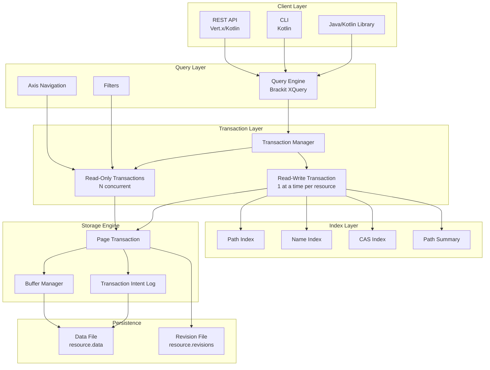
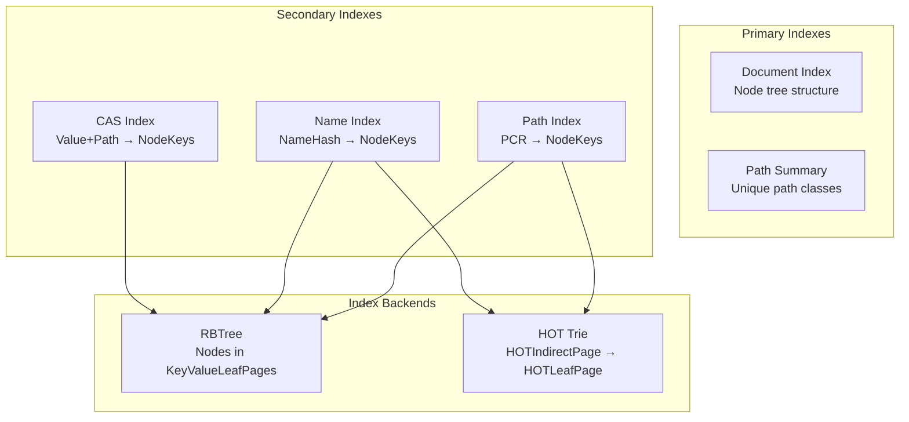
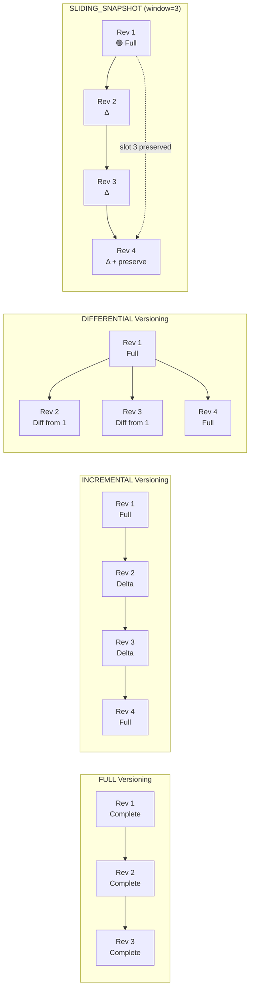
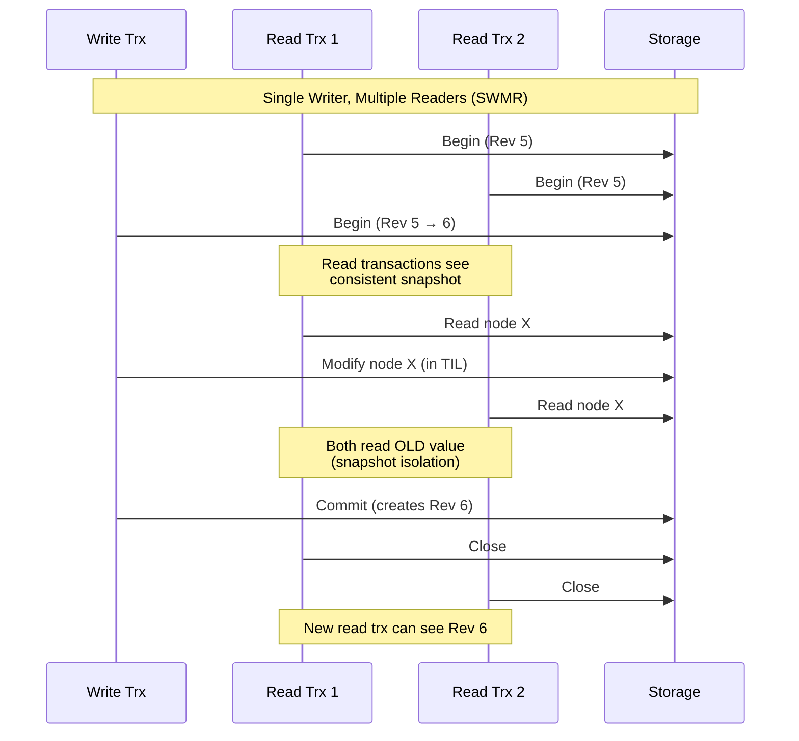
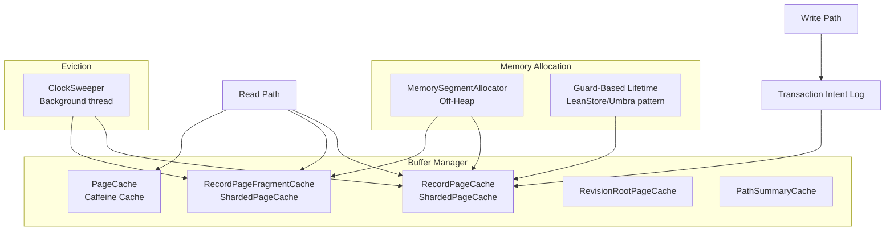

# SirixDB Architecture Specification

## Table of Contents

1. [Overview](#overview)
2. [Core Design Principles](#core-design-principles)
3. [System Architecture](#system-architecture)
4. [Query Processing](#query-processing) ← User-facing layer
5. [Document Model & Navigation](#document-model--navigation) ← Nodes & Axes
6. [Index Architecture](#index-architecture)
7. [Storage Engine](#storage-engine)
8. [Page Structure](#page-structure)
9. [MVCC & Versioning](#mvcc--versioning)
10. [Transaction Model](#transaction-model)
11. [Memory Management](#memory-management)
12. [Data Integrity](#data-integrity)
13. [Performance Characteristics](#performance-characteristics)
14. [Configuration Reference](#configuration-reference)

---

## Overview

SirixDB is an **embeddable, temporal, append-only database system** designed for storing and querying versioned semi-structured data (XML and JSON). Unlike traditional databases that overwrite data in place, SirixDB implements a **copy-on-write (CoW)** strategy that preserves complete revision history while minimizing storage overhead.

### Key Characteristics

| Feature | Description |
|---------|-------------|
| **Temporal** | Every revision is preserved and queryable via time-travel |
| **Append-Only** | Never overwrites committed data (no WAL needed) |
| **Embeddable** | Can be used as a library (like SQLite) or via REST API |
| **MVCC** | Multi-Version Concurrency Control with snapshot isolation |
| **Log-Structured** | Sequential writes optimized for SSDs/flash storage |

---

## Core Design Principles

```
┌─────────────────────────────────────────────────────────────────────────┐
│                       SirixDB Design Philosophy                         │
├─────────────────────────────────────────────────────────────────────────┤
│                                                                         │
│  ┌──────────────┐    ┌──────────────┐    ┌──────────────┐               │
│  │   TEMPORAL   │    │   IMMUTABLE  │    │    SHARED    │               │
│  │    FIRST     │    │     PAGES    │    │   STRUCTURE  │               │
│  │              │    │              │    │              │               │
│  │  Every rev   │    │   CoW with   │    │  Unchanged   │               │
│  │  preserved   │    │  no in-place │    │  pages are   │               │
│  │  & queryable │    │   updates    │    │   shared     │               │
│  └──────────────┘    └──────────────┘    └──────────────┘               │
│                                                                         │
│  ┌──────────────┐    ┌──────────────┐    ┌──────────────┐               │
│  │  SSD/FLASH   │    │    CRASH     │    │   MINIMAL    │               │
│  │   FRIENDLY   │    │     SAFE     │    │ WRITE AMPLIF │               │
│  │              │    │              │    │              │               │
│  │  Sequential  │    │  Atomic page │    │  Only delta  │               │
│  │   batched    │    │  commits, no │    │   fragments  │               │
│  │   writes     │    │  WAL needed  │    │   written    │               │
│  └──────────────┘    └──────────────┘    └──────────────┘               │
│                                                                         │
└─────────────────────────────────────────────────────────────────────────┘
```

---

## System Architecture

### High-Level Component Diagram



### Module Structure

```
sirix/bundles/
├── sirix-core/          # Core storage engine, transactions, pages
├── sirix-query/         # Brackit XQuery engine integration
├── sirix-rest-api/      # Vert.x REST server (Kotlin)
├── sirix-kotlin-cli/    # Command-line interface
├── sirix-kotlin-api/    # Kotlin extensions
├── sirix-distributed/   # Distributed features (experimental)
└── sirix-examples/      # Usage examples
```

---

## Query Processing

SirixDB provides powerful query capabilities through the **Brackit** query processor.

### XQuery/JSONiq Engine

Supports:
- **XQuery 3.1** for XML documents
- **JSONiq** for JSON documents  
- **Temporal extensions** for time-travel queries

```xquery
(: Time-travel query example :)
let $doc := jn:open('mydb', 'myresource', xs:dateTime('2024-01-01T00:00:00'))
for $user in $doc.users[]
where $user.age > 25
return {
  "name": $user.name,
  "revision": sdb:revision($user),
  "previousValue": jn:previous($user).name
}
```

### Query Execution Model

```
┌───────────────────────────────────────────────────────────────────────────┐
│                       Query Execution Pipeline                            │
├───────────────────────────────────────────────────────────────────────────┤
│                                                                           │
│   JSONiq/XQuery ──► Parser ──► AST ──► Optimizer ──► Axis Iterators      │
│                                                                           │
│   Example: $doc.users[].name                                              │
│                                                                           │
│   1. Parse: ObjectDeref("users") → ArrayDeref → ObjectDeref("name")       │
│   2. Optimize: Push predicates, select index                              │
│   3. Execute: ChildAxis → ArrayAxis → ChildAxis + NameFilter              │
│                                                                           │
│   Each axis is a lazy iterator producing nodes on-demand.                 │
│   Temporal functions (jn:previous, sdb:revision) open new transactions.   │
│                                                                           │
└───────────────────────────────────────────────────────────────────────────┘
```

### Temporal Query Functions

| Function | Description |
|----------|-------------|
| `jn:open(db, resource, revision)` | Open specific revision by number |
| `jn:open(db, resource, timestamp)` | Open revision at point-in-time |
| `jn:previous($node)` | Get node from previous revision |
| `jn:next($node)` | Get node from next revision |
| `jn:all-times($node)` | Iterate all versions of node |
| `sdb:revision($node)` | Get revision number |
| `sdb:timestamp($node)` | Get commit timestamp |

---

## Document Model & Navigation

This section describes how documents are structured as nodes and how queries navigate between them.

### Node Structure

Every document is stored as a tree of **nodes**, where each node has:
- A unique `nodeKey` (64-bit integer, stable across all revisions)
- Structural pointers (parent, children, siblings)
- Type-specific data (values, names)

```
┌───────────────────────────────────────────────────────────────────────────┐
│                         Node Structure Overview                           │
├───────────────────────────────────────────────────────────────────────────┤
│                                                                           │
│  Every node has a unique nodeKey (64-bit) stable across all revisions     │
│                                                                           │
│  Base Node Fields (all nodes):                                            │
│  ┌─────────────────────────────────────────────────────────────────────┐  │
│  │ nodeKey           (64-bit)  Unique identifier, stable across time   │  │
│  │ parentKey         (64-bit)  Parent node's key                       │  │
│  │ previousRevision  (32-bit)  When node was created                   │  │
│  │ lastModRevision   (32-bit)  When node was last modified             │  │
│  │ hash              (64-bit)  Optional: rolling/postorder hash        │  │
│  └─────────────────────────────────────────────────────────────────────┘  │
│                                                                           │
│  Structural Node Fields (tree nodes):                                     │
│  ┌─────────────────────────────────────────────────────────────────────┐  │
│  │ firstChildKey     (64-bit)  First child's key                       │  │
│  │ lastChildKey      (64-bit)  Last child's key                        │  │
│  │ leftSiblingKey    (64-bit)  Left sibling's key                      │  │
│  │ rightSiblingKey   (64-bit)  Right sibling's key                     │  │
│  │ childCount        (64-bit)  Optional: number of children            │  │
│  │ descendantCount   (64-bit)  Optional: number of descendants         │  │
│  └─────────────────────────────────────────────────────────────────────┘  │
│                                                                           │
│  Named Node Fields (elements, attributes, object keys):                   │
│  ┌─────────────────────────────────────────────────────────────────────┐  │
│  │ pathNodeKey       (64-bit)  Reference to PathSummary node (PCR)     │  │
│  │ localNameKey      (32-bit)  Index into NamePage string table        │  │
│  │ prefixKey         (32-bit)  XML namespace prefix (NamePage index)   │  │
│  │ uriKey            (32-bit)  XML namespace URI (NamePage index)      │  │
│  └─────────────────────────────────────────────────────────────────────┘  │
│                                                                           │
└───────────────────────────────────────────────────────────────────────────┘
```

### Node Types

**JSON Node Types:**

| NodeKind | ID | Description |
|----------|-----|-------------|
| JSON_DOCUMENT | 31 | JSON document root |
| OBJECT | 24 | JSON object `{ }` |
| ARRAY | 25 | JSON array `[ ]` |
| OBJECT_KEY | 26 | Object key (field name) |
| STRING_VALUE | 26 | String value `"text"` |
| NUMBER_VALUE | 28 | Number value `123.45` |
| BOOLEAN_VALUE | 27 | Boolean value `true`/`false` |
| NULL_VALUE | 29 | Null value `null` |

**XML Node Types:**

| NodeKind | ID | Description |
|----------|-----|-------------|
| ELEMENT | 1 | XML element with optional attributes/namespaces |
| ATTRIBUTE | 2 | Attribute node |
| NAMESPACE | 4 | Namespace declaration |
| TEXT | 6 | Text content node |
| PROCESSING_INSTRUCTION | 7 | Processing instruction |
| COMMENT | 8 | Comment node |
| XML_DOCUMENT | 9 | Document root |

### Example: JSON Document Structure

```
┌───────────────────────────────────────────────────────────────────────────┐
│                   JSON Document with All Node Types                       │
├───────────────────────────────────────────────────────────────────────────┤
│                                                                           │
│  Document: {"name":"Alice","age":30,"active":true,"address":null,         │
│             "tags":["dev","lead"]}                                        │
│                                                                           │
│  Tree Structure:                                                          │
│                                                                           │
│  JSON_DOCUMENT (key=0)                                                    │
│       │                                                                   │
│       └── OBJECT (key=1)                                                  │
│            ├── OBJECT_KEY "name" (key=2) ──► STRING_VALUE "Alice" (key=3) │
│            ├── OBJECT_KEY "age" (key=4)  ──► NUMBER_VALUE 30 (key=5)      │
│            ├── OBJECT_KEY "active" (key=6) ► BOOLEAN_VALUE true (key=7)   │
│            ├── OBJECT_KEY "address" (key=8) ► NULL_VALUE (key=9)          │
│            └── OBJECT_KEY "tags" (key=10)                                 │
│                     └── ARRAY (key=11)                                    │
│                          ├── STRING_VALUE "dev" (key=12)                  │
│                          └── STRING_VALUE "lead" (key=13)                 │
│                                                                           │
│  Navigation: nodeKey 2 has parentKey=1, rightSiblingKey=4                 │
│                                                                           │
└───────────────────────────────────────────────────────────────────────────┘
```

### Navigation Axes

Axes are iterators that traverse from a context node to related nodes. SirixDB provides both **spatial axes** (within a revision) and **temporal axes** (across revisions).

#### Spatial Axes

| Axis | Direction | Description |
|------|-----------|-------------|
| `ChildAxis` | Down | Direct children only |
| `DescendantAxis` | Down | All descendants (depth-first) |
| `ParentAxis` | Up | Direct parent |
| `AncestorAxis` | Up | All ancestors to root |
| `FollowingSiblingAxis` | Right | Siblings after this node |
| `PrecedingSiblingAxis` | Left | Siblings before this node |
| `SelfAxis` | None | The node itself |

```java
// Example: iterate all children
try (var rtx = resource.beginNodeReadOnlyTrx()) {
    rtx.moveTo(parentNodeKey);
    for (var axis = new ChildAxis(rtx); axis.hasNext(); ) {
        axis.nextLong();
        System.out.println(rtx.getName() + ": " + rtx.getValue());
    }
}
```

#### Temporal Axes

Navigate the same node across different revisions:

| Axis | Description |
|------|-------------|
| `AllTimeAxis` | All revisions where node exists |
| `PastAxis` | Previous revisions (oldest first or newest first) |
| `FutureAxis` | Later revisions |
| `FirstAxis` | First revision where node existed |
| `LastAxis` | Most recent revision |
| `PreviousAxis` | Immediately preceding revision |
| `NextAxis` | Immediately following revision |

```
┌───────────────────────────────────────────────────────────────────────────┐
│                         Temporal Navigation                               │
├───────────────────────────────────────────────────────────────────────────┤
│                                                                           │
│  Timeline:  Rev 1 ──► Rev 2 ──► Rev 3 ──► Rev 4 ──► Rev 5                 │
│                                    ▲                                      │
│                               Current Node                                │
│                                                                           │
│  PastAxis:        Rev 1, Rev 2 (iterations before Rev 3)                  │
│  FutureAxis:      Rev 4, Rev 5 (iterations after Rev 3)                   │
│  AllTimeAxis:     Rev 1, Rev 2, Rev 3, Rev 4, Rev 5                       │
│  PreviousAxis:    Rev 2 (one step back)                                   │
│  NextAxis:        Rev 4 (one step forward)                                │
│                                                                           │
└───────────────────────────────────────────────────────────────────────────┘
```

#### Combining Spatial and Temporal

```java
// Get all versions of all children
try (var rtx = resource.beginNodeReadOnlyTrx()) {
    rtx.moveTo(parentKey);
    var childAxis = new ChildAxis(rtx);
    while (childAxis.hasNext()) {
        childAxis.nextLong();
        var allTimeAxis = new AllTimeAxis(resource, rtx);
        while (allTimeAxis.hasNext()) {
            var historicalRtx = allTimeAxis.next();
            // historicalRtx points to this child in a different revision
        }
    }
}
```

### Physical Storage: No Pointer Chasing

Node keys are **logical identifiers**, not memory pointers. Nodes are stored contiguously in `KeyValueLeafPages` for cache locality:

```
┌───────────────────────────────────────────────────────────────────────────┐
│                    Logical Keys → Physical Storage                        │
├───────────────────────────────────────────────────────────────────────────┤
│                                                                           │
│  nodeKey = 5000                                                           │
│      │                                                                    │
│      ├──► pageKey = 5000 >> 10 = 4  (which KeyValueLeafPage)              │
│      └──► slotIndex = 5000 & 1023 = 904  (which slot in page)             │
│                                                                           │
│  KeyValueLeafPage #4:                                                     │
│  ┌─────────────────────────────────────────────────────────────────────┐  │
│  │ MemorySegment (off-heap, up to 1024 nodes)                          │  │
│  │ ┌──────┬──────┬──────┬─────────────────────────┬──────┬──────────┐  │  │
│  │ │ [0]  │ [1]  │ [2]  │ ... contiguous nodes ...│ [904]│   ...    │  │  │
│  │ │ Node │ Node │ Node │                         │ Node │          │  │  │
│  │ └──────┴──────┴──────┴─────────────────────────┴──────┴──────────┘  │  │
│  └─────────────────────────────────────────────────────────────────────┘  │
│                                                                           │
│  Benefits:                                                                │
│  • Cache-friendly: nodes in same page are nearby in memory                │
│  • O(1) lookup: trie navigation + slot index                              │
│  • No pointer chasing: direct offset calculation                          │
│                                                                           │
└───────────────────────────────────────────────────────────────────────────┘
```

---

## Index Architecture

### Index Types



**Important**: The two index backends use different storage structures:

| Backend | Page Structure | Leaf Page Type |
|---------|----------------|----------------|
| **RBTree** | `IndexPage` → `IndirectPages` → `KeyValueLeafPage` | RBTree nodes stored as records |
| **HOT** | `IndexPage` → `HOTIndirectPage` → `HOTLeafPage` | Sorted key-value entries |

- RBTree: Uses the standard trie (IndirectPages) with RB-tree nodes in KeyValueLeafPages
- HOT: Uses its own trie structure (HOTIndirectPage) with specialized HOTLeafPages

### Path Summary

The **Path Summary** is a compressed representation of all unique paths in the document:

```
Document:                          Path Summary:
─────────                          ─────────────
{                                  /             (PCR=0)
  "users": [                       ├─ users      (PCR=1)
    {                              │  └─ []      (PCR=2)
      "name": "Alice",             │     ├─ name (PCR=3)
      "age": 30                    │     └─ age  (PCR=4)
    },                             
    {                              PCR = Path Class Reference
      "name": "Bob",               Each unique path gets one PCR
      "age": 25                    Nodes reference their PCR
    }                              
  ]                                
}                                  
```

### HOT (Height-Optimized Trie) Index

The HOT index is a cache-friendly alternative to B-trees:

```
┌───────────────────────────────────────────────────────────────────────────┐
│                    HOT Index Structure                                    │
├───────────────────────────────────────────────────────────────────────────┤
│                                                                           │
│  Traditional B-Tree:           HOT Trie:                                  │
│  ─────────────────            ─────────                                   │
│                                                                           │
│       [Root]                       [Compound Node]                        │
│      /      \                     /    |    |    \                        │
│    [A]      [B]              [C1] [C2] [C3] [C4]                          │
│   / | \    / | \                                                          │
│  ...      ...                 Multiple levels collapsed                   │
│                               into single cache-friendly node             │
│                                                                           │
│  Node Types:                                                              │
│  ┌──────────┬──────────────────────────────────────────────────────────┐  │
│  │ BiNode   │ 2 children, 1 discriminative bit                         │  │
│  ├──────────┼──────────────────────────────────────────────────────────┤  │
│  │ SpanNode │ 2-16 children, SIMD-optimized partial key search         │  │
│  ├──────────┼──────────────────────────────────────────────────────────┤  │
│  │ MultiNode│ 17-256 children, direct byte indexing                    │  │
│  └──────────┴──────────────────────────────────────────────────────────┘  │
│                                                                           │
│  HOTLeafPage:                                                             │
│  ┌─────────────────────────────────────────────────────────────────────┐  │
│  │ [key₁|value₁][key₂|value₂][key₃|value₃]...                          │  │
│  │ Sorted entries, binary search, off-heap MemorySegment               │  │
│  └─────────────────────────────────────────────────────────────────────┘  │
│                                                                           │
└───────────────────────────────────────────────────────────────────────────┘
```

### Index Configuration

```java
// Create a path index for specific paths
IndexDef pathIdx = IndexDefs.createPathIdxDef(
    Set.of(parse("/users/[]/name")), 
    0, 
    IndexDef.DbType.JSON
);

// Create a name index for all field names
IndexDef nameIdx = IndexDefs.createNameIdxDef(0, IndexDef.DbType.JSON);

// Create a CAS index for value queries
IndexDef casIdx = IndexDefs.createCASIdxDef(
    false,                    // not unique
    Type.STR,                 // string values
    Set.of(parse("/users/[]/name")),
    0,
    IndexDef.DbType.JSON
);
```

---

## Storage Engine

### File Layout

```
┌─────────────────────────────────────────────────────────────────────────────┐
│                         SirixDB File Layout                                 │
├─────────────────────────────────────────────────────────────────────────────┤
│                                                                             │
│  mydatabase/                           ◄── Database directory               │
│  ├── dbsetting.obj                     ◄── Database configuration (binary)  │
│  ├── keyselector/                      ◄── Encryption key storage           │
│  ├── .lock                             ◄── Database lock file               │
│  └── resources/                        ◄── All resources in this database   │
│      │                                                                      │
│      ├── resource1/                    ◄── Resource directory               │
│      │   ├── ressetting.obj            ◄── Resource config (binary)         │
│      │   ├── data/                     ◄── Main storage                     │
│      │   │   ├── sirix.data            ◄── Page data (append-only)          │
│      │   │   └── sirix.revisions       ◄── Revision offset index            │
│      │   ├── indexes/                  ◄── Index definitions                │
│      │   │   └── indexes.xml           ◄── XML index config                 │
│      │   ├── log/                      ◄── Transaction intent log           │
│      │   │   └── .commit               ◄── Commit marker file               │
│      │   ├── encryption/               ◄── Resource encryption keys         │
│      │   └── update-operations/        ◄── Update operation logs            │
│      │                                                                      │
│      └── resource2/                    ◄── Another resource                 │
│          └── ...                                                            │
│                                                                             │
└─────────────────────────────────────────────────────────────────────────────┘
```

**Key files:**
- `sirix.data` - Append-only file containing all pages (compressed, versioned)
- `sirix.revisions` - Index mapping revision numbers to file offsets
- `ressetting.obj` - Serialized `ResourceConfiguration` (versioning type, compression, etc.)

### Page Hierarchy

```
┌─────────────────────────────────────────────────────────────────────────┐
│                        SirixDB Page Hierarchy                           │
├─────────────────────────────────────────────────────────────────────────┤
│                                                                         │
│  UberPage                                                               │
│  ════════                                                               │
│  │ Entry point for resource (one per resource)                          │
│  │ Points to RevisionRootPage for each revision                         │
│  │                                                                      │
│  ▼                                                                      │
│  RevisionRootPage (Rev N)                                               │
│  ════════════════════════                                               │
│  │ Root for one revision                                                │
│  │ Commit timestamp, max node key                                       │
│  │                                                                      │
│  ├──► DocumentPage ───────────────────────────────────────────────────┐ │
│  │    (Node storage root)                                             │ │
│  │         │                                                          │ │
│  │         ▼                                                          │ │
│  │    IndirectPage L0 [0..1023]                                       │ │
│  │         │                                                          │ │
│  │         ├─[0]──► IndirectPage L1 [0..1023]                         │ │
│  │         │              │                                           │ │
│  │         │              ├─[0]──► IndirectPage L2 ──► ... ──► Leaf   │ │
│  │         │              ├─[1]──► IndirectPage L2 ──► ... ──► Leaf   │ │
│  │         │              └─[...]                                     │ │
│  │         │                                                          │ │
│  │         ├─[1]──► IndirectPage L1 ──► ...                           │ │
│  │         ├─[2]──► IndirectPage L1 ──► ...                           │ │
│  │         └─[...]──► (up to 1024 children per level)                 │ │
│  │                                                                    │ │
│  │                          ▼                                         │ │
│  │                   KeyValueLeafPage                                 │ │
│  │                   ════════════════                                 │ │
│  │                   │ Up to 1024 node records                        │ │
│  │                   │ Off-heap MemorySegment                         │ │
│  │                   └────────────────────────────────────────────────┘ │
│  │                                                                      │
│  ├──► PathSummaryPage ──► IndirectPages ──► KeyValueLeafPage (Paths)    │
│  │                                                                      │
│  ├──► NamePage ─────────► IndirectPages ──► KeyValueLeafPage (names)    │
│  │                                                                      │
│  │   Secondary Indexes (configurable backend):                          │
│  │   ─────────────────────────────────────────                          │
│  │                                                                      │
│  │   HOT backend:                                                       │
│  ├──► PathPage ─────────► HOTIndirectPage ──► HOTLeafPage               │
│  ├──► NameIndexPage ────► HOTIndirectPage ──► HOTLeafPage               │
│  ├──► CASPage ──────────► HOTIndirectPage ──► HOTLeafPage               │
│  │                                                                      │
│  │   RBTree backend:                                                    │
│  ├──► PathPage ─────────► IndirectPages ──► KeyValueLeafPage (RBNodes)  │
│  ├──► NameIndexPage ────► IndirectPages ──► KeyValueLeafPage (RBNodes)  │
│  └──► CASPage ──────────► IndirectPages ──► KeyValueLeafPage (RBNodes)  │
│                                                                         │
└─────────────────────────────────────────────────────────────────────────┘
```

### HOT Index Structure (Secondary Indexes)

```
┌─────────────────────────────────────────────────────────────────────────┐
│                   HOT (Height-Optimized Trie) Index                     │
├─────────────────────────────────────────────────────────────────────────┤
│                                                                         │
│  PathPage / NameIndexPage / CASPage                                     │
│       │                                                                 │
│       ▼                                                                 │
│  ┌───────────────────────────────────────────────────────────────────┐  │
│  │  HOT Root (HOTIndirectPage)                                       │  │
│  │  ════════════════════════════                                     │  │
│  │                                                                   │  │
│  │  BiNode: discriminative bit at position 12                        │  │
│  │  ┌───────────────────┬───────────────────┐                        │  │
│  │  │ bit=0 → left      │ bit=1 → right     │                        │  │
│  │  └────────┬──────────┴─────────┬─────────┘                        │  │
│  │           │                    │                                  │  │
│  │           ▼                    ▼                                  │  │
│  │     SpanNode              HOTLeafPage                             │  │
│  │   (4 bits, 16 slots)     ┌──────────────────────────────────┐     │  │
│  │   ┌──┬──┬──┬──┐          │ [key₁|NodeRefs₁]                 │     │  │
│  │   │0 │1 │..│15│          │ [key₂|NodeRefs₂]                 │     │  │
│  │   └┬─┴┬─┴──┴┬─┘          │ [key₃|NodeRefs₃]                 │     │  │
│  │    │  │     │            │ ...                              │     │  │
│  │    ▼  ▼     ▼            │ Sorted by key, binary search     │     │  │
│  │   Leaf Leaf Leaf         │ Values: Roaring64Bitmap          │     │  │
│  │                          └──────────────────────────────────┘     │  │
│  │                                                                   │  │
│  └───────────────────────────────────────────────────────────────────┘  │
│                                                                         │
│  Index Types:                                                           │
│  ────────────                                                           │
│  • PATH Index:  key = pathNodeKey (long)  → NodeReferences (bitmap)     │
│  • NAME Index:  key = nameHash (bytes)    → NodeReferences (bitmap)     │
│  • CAS Index:   key = value+path (bytes)  → NodeReferences (bitmap)     │
│                                                                         │
│  HOT Node Types:                                                        │
│  ───────────────                                                        │
│  • BiNode:   2 children, single discriminative bit                      │
│  • SpanNode: up to 16 children, 4 contiguous bits                       │
│  • MultiNode: up to 256 children, 8 bits (full byte)                    │
│                                                                         │
│  Leaf Page:                                                             │
│  ──────────                                                             │
│  • HOTLeafPage: up to 512 key-value entries                             │
│  • Keys sorted for binary search O(log n)                               │
│  • Values are Roaring64Bitmap (compressed node key sets)                │
│  • Off-heap storage via MemorySegment                                   │
│                                                                         │
└─────────────────────────────────────────────────────────────────────────┘
```

---

## Page Structure

### Core Page Types

| Page Type | Purpose | Key Properties |
|-----------|---------|----------------|
| **UberPage** | Resource entry point | Points to RevisionRootPages (all revisions) |
| **RevisionRootPage** | Root of a revision's page tree | Commit timestamp, max node key |
| **IndirectPage** | Trie node for 64-bit keys | Up to 1024 child references |
| **KeyValueLeafPage** | Stores actual node records | Off-heap MemorySegment storage |
| **NamePage** | String table for names | Element/attribute/key names |
| **PathPage** | Path index roots | References to path index trees |
| **CASPage** | Content-and-Structure index | Combined value+path indexing |

### IndirectPage Trie Navigation

SirixDB uses a **trie structure** (not a B+ tree) to navigate from node keys to their storage locations. The 64-bit node key is decomposed into 10-bit chunks, with each chunk indexing into an IndirectPage.

> **Reference**: The trie design with flexible height is described in:
> Sebastian Graf, "Flexible Secure Cloud Storage", PhD Dissertation, University of Konstanz, 2014.
> [Available at KOPS](https://kops.uni-konstanz.de/server/api/core/bitstreams/7dc033e4-a4ef-47ce-b1d5-6f4580191070/content)

**Dynamic Tree Height**: The trie grows dynamically based on the maximum node key. Initially, a small document needs only 1 level. As the document grows and node keys exceed the current capacity, a new level is added at the top. This design minimizes storage overhead for small documents while scaling to billions of nodes.

**Copy-on-Write**: IndirectPages are fully copied when modified, ensuring immutability of previous revisions.

```
Navigation Algorithm (from NodeStorageEngineReader):

  levelKey = pageKey
  for level in (array.length - maxHeight) to (array.length - 1):
      offset = levelKey >> exponent[level]     // extract index (0-1023)
      levelKey -= offset << exponent[level]    // subtract for next level
      page = page.getReference(offset)         // follow reference

Exponent Array: {70, 60, 50, 40, 30, 20, 10, 0}
                 L0  L1  L2  L3  L4  L5  L6  L7

Tree height grows dynamically (maxHeight = 1 to 8):

   Height 1: Only L7 (shift 0)  → bits 0-9   → up to 1K pages
   Height 2: L6→L7              → bits 0-19  → up to 1M pages  
   Height 3: L5→L6→L7           → bits 0-29  → up to 1B pages
   Height 4: L4→L5→L6→L7        → bits 0-39  → up to 1T pages
   ...
   Height 8: L0→L1→...→L7       → bits 0-69  → theoretical max
             (only bits 0-63 exist in 64-bit keys)

Example: pageKey = 1_048_576 (0x100000), Height = 3

   L5: offset = 1048576 >> 20 = 1    → IndirectPage[1]
   L6: offset = 0 >> 10 = 0          → IndirectPage[0]  
   L7: offset = 0 >> 0 = 0           → KeyValueLeafPage[0]

┌─────────────────────────────────────────────────────────────────────────────┐
│                          Trie Navigation Example                            │
├─────────────────────────────────────────────────────────────────────────────┤
│                                                                             │
│   DocumentPage                                                              │
│       │                                                                     │
│       ▼                                                                     │
│   IndirectPage L0 [0..1023]                                                 │
│       │                                                                     │
│       ├── [0] ──► IndirectPage L1 ──► ... ──► LeafPage (nodes 0-1023)       │
│       ├── [1] ──► IndirectPage L1 ──► ... ──► LeafPage (nodes 1024-2047)    │
│       ├── [2] ──► IndirectPage L1 ──► ... ──► LeafPage (nodes 2048-3071)    │
│       │   ...                                                               │
│       └── [1023] ──► IndirectPage L1 ──► ...                                │
│                                                                             │
└─────────────────────────────────────────────────────────────────────────────┘
```

Each IndirectPage level provides **O(1)** lookup for its portion of the key, making node lookup **O(depth)** where depth is typically 7 levels maximum.

### KeyValueLeafPage Memory Layout

```
┌───────────────────────────────────────────────────────────────────────────┐
│                       KeyValueLeafPage (Off-Heap)                         │
├───────────────────────────────────────────────────────────────────────────┤
│ Header: pageKey (8B) | revision (4B) | entryCount (4B) | ...              │
├───────────────────────────────────────────────────────────────────────────┤
│                                                                           │
│  Slot Offsets Array (int[])          Records Array (DataRecord[])         │
│                                                                           │
│  ┌─────┬─────┬─────┬─────┐           ┌────────────────────────────┐       │
│  │  0  │ 128 │ 256 │ ... │           │                            │       │
│  └──┬──┴──┬──┴──┬──┴─────┘           │ Record 0  (offset 0)       │       │
│     │     │     │        ┌──────────►│                            │       │
│     │     │     │        │           ├────────────────────────────┤       │
│     │     │     │        │           │                            │       │
│     │     │     └────────┼──────────►│ Record 1  (offset 128)     │       │
│     │     │              │           │                            │       │
│     │     │              │           ├────────────────────────────┤       │
│     │     │              │           │                            │       │
│     │     └──────────────┼──────────►│ Record 2  (offset 256)     │       │
│     │                    │           │                            │       │
│     └────────────────────┘           └────────────────────────────┘       │
│                                                                           │
│  MemorySegment (slots)               MemorySegment (deweyIds)             │
│  ┌─────────────────────┐             ┌─────────────────────┐              │
│  │ Serialized bytes    │             │ DeweyID bytes       │              │
│  │ for each record     │             │ (if enabled)        │              │
│  └─────────────────────┘             └─────────────────────┘              │
│                                                                           │
└───────────────────────────────────────────────────────────────────────────┘
```

### Page Reference

Each `PageReference` contains:

```java
class PageReference {
    long key;           // Storage offset (persistent)
    int logKey;         // Transaction log index (transient)
    long checksum;      // Data integrity checksum
    Page page;          // In-memory swizzled page (transient)
}
```

---

## MVCC & Versioning

SirixDB implements a **Copy-on-Write (COW)** architecture where modifications never overwrite existing data. This enables:
- **Time-travel queries**: Access any historical revision instantly
- **MVCC (Multi-Version Concurrency Control)**: Readers never block writers
- **Crash consistency**: Atomic commits via single pointer swap

### Copy-on-Write Mechanism

When a page is modified, SirixDB creates a new version rather than modifying in place:

```
┌─────────────────────────────────────────────────────────────────────────────┐
│                        Copy-on-Write Page Modification                      │
├─────────────────────────────────────────────────────────────────────────────┤
│                                                                             │
│    Revision N                          Revision N+1                         │
│    ──────────                          ────────────                         │
│                                                                             │
│         ┌─────┐                             ┌─────┐                         │
│         │Root │                             │Root'│ ◄── NEW (copied)        │
│         └──┬──┘                             └──┬──┘                         │
│            │                                   │                            │
│      ┌─────┴─────┐                       ┌─────┴─────┐                      │
│      │           │                       │           │                      │
│   ┌──┴──┐     ┌──┴──┐                 ┌──┴──┐     ┌──┴──┐                   │
│   │  A  │     │  B  │                 │  A  │────►│ B'  │ ◄── NEW (copied)  │
│   └──┬──┘     └──┬──┘                 └──┬──┘     └──┬──┘                   │
│      │           │                    SHARED         │                      │
│   ┌──┴──┐     ┌──┴──┐                 ┌──┴──┐     ┌──┴──┐                   │
│   │  C  │     │  D  │                 │  C  │────►│ D'  │ ◄── NEW (modified)│
│   └─────┘     └─────┘                 └─────┘     └─────┘                   │
│                                       SHARED                                │
│                                                                             │
│   Key insight: Pages A and C are SHARED between revisions                   │
│   Only the modified path (Root' → B' → D') is copied                        │
│                                                                             │
└─────────────────────────────────────────────────────────────────────────────┘
```

### Transaction Intent Log (TIL)

During a write transaction, modified pages are held in memory in the **Transaction Intent Log**:

```
┌─────────────────────────────────────────────────────────────────────────┐
│                        Transaction Intent Log                           │
├─────────────────────────────────────────────────────────────────────────┤
│                                                                         │
│  Write Transaction                                                      │
│  ─────────────────                                                      │
│                                                                         │
│  ┌───────────────────────────────────────────────────────────────────┐  │
│  │  TransactionIntentLog                                             │  │
│  │  ┌─────────────────────────────────────────────────────────────┐  │  │
│  │  │ PageContainer[0]: complete=Page₁, modified=Page₁'           │  │  │
│  │  │ PageContainer[1]: complete=Page₂, modified=Page₂'           │  │  │
│  │  │ PageContainer[2]: complete=Page₃, modified=Page₃'           │  │  │
│  │  │ ...                                                         │  │  │
│  │  └─────────────────────────────────────────────────────────────┘  │  │
│  └───────────────────────────────────────────────────────────────────┘  │
│                                                                         │
│  On COMMIT:                          On ROLLBACK:                       │
│  ───────────                         ────────────                       │
│  1. Write all modified pages         1. TIL.clear()                     │
│  2. Write new RevisionRootPage       2. Close all pages                 │
│  3. Update UberPage pointer          3. Release memory                  │
│  4. fsync() for durability                                              │
│  5. TIL.clear()                                                         │
│                                                                         │
└─────────────────────────────────────────────────────────────────────────┘
```

### Versioning Strategies

The key innovation in SirixDB is **configurable page versioning** which controls the trade-off between storage overhead, read performance, and write performance.



| Strategy | Read Cost | Write Cost | Storage | Use Case |
|----------|-----------|------------|---------|----------|
| **FULL** | O(1) | High | Highest | Read-heavy, infrequent updates |
| **INCREMENTAL** | O(k) | Low | Lowest | Frequent small updates |
| **DIFFERENTIAL** | O(1) | Medium | Medium | Balanced read/write |
| **SLIDING_SNAPSHOT** | O(1)-O(k) | Medium | Medium | Bounded reconstruction cost |

### How Versioning Algorithms Work

#### FULL Versioning

Every revision stores complete pages. No reconstruction needed.

```
┌─────────────────────────────────────────────────────────────────────────────┐
│                            FULL Versioning                                  │
├─────────────────────────────────────────────────────────────────────────────┤
│                                                                             │
│   Storage Layout:                                                           │
│   ───────────────                                                           │
│                                                                             │
│   Rev 1: [Page A₁ FULL] [Page B₁ FULL] [Page C₁ FULL]                       │
│   Rev 2: [Page A₂ FULL] [Page B₂ FULL] [Page C₂ FULL]  ◄── All complete     │
│   Rev 3: [Page A₃ FULL] [Page B₃ FULL] [Page C₃ FULL]                       │
│                                                                             │
│   Read Rev 2, Page B:                                                       │
│   ───────────────────                                                       │
│   → Load Page B₂ directly (O(1) I/O)                                        │
│                                                                             │
│   Pros: Fastest reads, simplest implementation                              │
│   Cons: Highest storage, every write copies entire page                     │
│                                                                             │
└─────────────────────────────────────────────────────────────────────────────┘
```

#### INCREMENTAL Versioning

Stores only changed records. Full snapshots created every N revisions.

```
┌─────────────────────────────────────────────────────────────────────────────┐
│                        INCREMENTAL Versioning                               │
│                        (revisionsToRestore = 4)                             │
├─────────────────────────────────────────────────────────────────────────────┤
│                                                                             │
│   Storage Layout (Page A across revisions):                                 │
│   ──────────────────────────────────────────                                │
│                                                                             │
│   Rev 1: [FULL: slots 0,1,2,3,4,5...1023]      ◄── Full snapshot            │
│   Rev 2: [DELTA: slot 5 changed]               ◄── Only changed slot        │
│   Rev 3: [DELTA: slots 10,11 changed]          ◄── Only changed slots       │
│   Rev 4: [DELTA: slot 5 changed again]                                      │
│   Rev 5: [FULL: slots 0,1,2,3,4,5...1023]      ◄── New full snapshot        │
│   Rev 6: [DELTA: slot 100 changed]                                          │
│   ...                                                                       │
│                                                                             │
│   Read Rev 4, Page A (reconstruction):                                      │
│   ────────────────────────────────────                                      │
│   1. Load Rev 4 delta  → slot 5                                             │
│   2. Load Rev 3 delta  → slots 10,11                                        │
│   3. Load Rev 2 delta  → slot 5 (skip, already have newer)                  │
│   4. Load Rev 1 full   → remaining slots                                    │
│   5. Combine: newer fragments override older                                │
│                                                                             │
│   Fragment Chain:                                                           │
│   ───────────────                                                           │
│   PageReference.pageFragments = [                                           │
│     FragmentKey(rev=4, offset=..., dbId, resId),                            │
│     FragmentKey(rev=3, offset=...),                                         │
│     FragmentKey(rev=2, offset=...),                                         │
│     FragmentKey(rev=1, offset=...)   ◄── Full dump (chain anchor)           │
│   ]                                                                         │
│                                                                             │
│   Slot Bitmap Optimization:                                                 │
│   ─────────────────────────                                                 │
│   Each KeyValueLeafPage tracks populated slots with a bitmap (long[16])     │
│   Reconstruction iterates only populated slots: O(k) not O(1024)            │
│                                                                             │
└─────────────────────────────────────────────────────────────────────────────┘
```

#### DIFFERENTIAL Versioning

Each delta references the last full snapshot (not the previous revision).

```
┌─────────────────────────────────────────────────────────────────────────────┐
│                       DIFFERENTIAL Versioning                               │
│                       (revisionsToRestore = 4)                              │
├─────────────────────────────────────────────────────────────────────────────┤
│                                                                             │
│   Storage Layout (Page A):                                                  │
│   ────────────────────────                                                  │
│                                                                             │
│   Rev 1: [FULL: all slots]            ◄── Full snapshot                     │
│   Rev 2: [DIFF from 1: slot 5]        ◄── Changes since Rev 1               │
│   Rev 3: [DIFF from 1: slots 5,10,11] ◄── ALL changes since Rev 1           │
│   Rev 4: [FULL: all slots]            ◄── New full snapshot (rev % 4 == 0)  │
│   Rev 5: [DIFF from 4: slot 100]      ◄── Changes since Rev 4               │
│                                                                             │
│   Read Rev 3, Page A:                                                       │
│   ───────────────────                                                       │
│   1. Load Rev 3 diff   → slots 5,10,11                                      │
│   2. Load Rev 1 full   → remaining slots                                    │
│   3. Combine (only 2 pages, never more!)                                    │
│                                                                             │
│   Key Difference from INCREMENTAL:                                          │
│   ─────────────────────────────────                                         │
│   • INCREMENTAL: delta = changes since previous revision                    │
│   • DIFFERENTIAL: delta = changes since last full snapshot                  │
│                                                                             │
│   Result: Always reconstruct from at most 2 fragments (O(1) complexity)     │
│   Trade-off: Deltas grow larger over time until next full snapshot          │
│                                                                             │
└─────────────────────────────────────────────────────────────────────────────┘
```

#### SLIDING_SNAPSHOT Versioning

Like INCREMENTAL, but with a bounded fragment chain (window). When a page fragment
falls OUT of the window, records that haven't been overwritten by newer fragments
are preserved by writing them to the new revision's page. This ensures bounded
reconstruction cost (max `revisionsToRestore` fragments).

```
┌─────────────────────────────────────────────────────────────────────────────┐
│                      SLIDING_SNAPSHOT Versioning                            │
│                      (window size = 4 revisions)                            │
├─────────────────────────────────────────────────────────────────────────────┤
│                                                                             │
│   Algorithm (from VersioningType.SLIDING_SNAPSHOT):                         │
│   ─────────────────────────────────────────────────                         │
│   1. Load up to (revToRestore - 1) fragment references                      │
│   2. If there's an out-of-window page:                                      │
│      - Find records NOT overwritten by in-window fragments                  │
│      - Mark those records for preservation in new page                      │
│   3. Write new delta + preserved out-of-window records                      │
│                                                                             │
│   Example (window = 4):                                                     │
│                                                                             │
│   Rev 1: [FULL: slots 0,1,2,3]                                              │
│   Rev 2: [Δ: slot 1 modified]                                               │
│   Rev 3: [Δ: slot 2 modified]                                               │
│   Rev 4: [Δ: slot 0 modified]                                               │
│   Rev 5: Writing...                                                         │
│          - Window: Rev 2,3,4 (3 fragments)                                  │
│          - Out-of-window: Rev 1                                             │
│          - Slot 3 from Rev 1 NOT in window → preserve in Rev 5              │
│          - Rev 5 contains: [Δ: slot 3 preserved + any new changes]          │
│                                                                             │
│   Fragment chain always bounded:                                            │
│   • Max fragments to combine = revToRestore                                 │
│   • Oldest fragments dropped from reference list (not physically deleted)  │
│   • Storage NOT reclaimed (append-only)                                     │
│                                                                             │
│   Use Case: Bounded read cost, better write locality than INCREMENTAL       │
│                                                                             │
└─────────────────────────────────────────────────────────────────────────────┘
```

### Page Fragment Storage

Page fragments are linked via `PageFragmentKey` for reconstruction:

```java
record PageFragmentKey(
    int revision,        // Which revision this fragment is from
    long storageKey,     // Offset in data file
    int databaseId,      // For multi-database deployments
    int resourceId       // Which resource within database
) {}
```

During commit, the storage engine:
1. Serializes the modified page (full or delta based on strategy)
2. Compresses using LZ4 or Zstd
3. Writes to append-only data file
4. Creates `PageFragmentKey` pointing to new fragment
5. Links to previous fragments in `PageReference.pageFragments`

### Fragment Fetching & Recombination

When reading a page, fragments must be **fetched** from storage and **recombined** into a complete page:

```
┌───────────────────────────────────────────────────────────────────────────┐
│                   Fragment Fetching Pipeline                              │
├───────────────────────────────────────────────────────────────────────────┤
│                                                                           │
│  PageReference                                                            │
│  ┌─────────────────────────────────────────────────────────────────────┐  │
│  │ key: 12345                    (current fragment offset)             │  │
│  │ pageFragments: [              (chain of older fragments)            │  │
│  │   {rev=5, key=10200},                                               │  │
│  │   {rev=3, key=8100},                                                │  │
│  │   {rev=1, key=5000}                                                 │  │
│  │ ]                                                                   │  │
│  └─────────────────────────────────────────────────────────────────────┘  │
│                                                                           │
│  Fetching (NodeStorageEngineReader.getRecordPage):                        │
│  ─────────────────────────────────────────────────                        │
│  1. Read current fragment from offset 12345                               │
│  2. Decompress (LZ4/Zstd)                                                 │
│  3. Deserialize into KeyValueLeafPage                                     │
│  4. If delta page, fetch previous fragments from pageFragments chain      │
│  5. Repeat until full page found or chain exhausted                       │
│                                                                           │
│  Fragment Chain (newest → oldest):                                        │
│                                                                           │
│  [Rev 7 Δ] → [Rev 5 Δ] → [Rev 3 Δ] → [Rev 1 FULL]                         │
│     ↑           ↑           ↑            ↑                                │
│   current    fragment[0]  fragment[1]  fragment[2]                        │
│                                                                           │
└───────────────────────────────────────────────────────────────────────────┘
```

```
┌───────────────────────────────────────────────────────────────────────────┐
│                   Fragment Recombination Algorithm                        │
├───────────────────────────────────────────────────────────────────────────┤
│                                                                           │
│  combineRecordPages(List<Page> fragments):                                │
│  ─────────────────────────────────────────                                │
│                                                                           │
│  Input: [Rev7, Rev5, Rev3, Rev1] (newest first)                           │
│                                                                           │
│  Algorithm:                                                               │
│  1. Create empty result page                                              │
│  2. Use bitmap to track which slots are filled (1024 bits)                │
│  3. For each fragment (newest → oldest):                                  │
│     a. Get populated slots from fragment                                  │
│     b. For each slot NOT already in result:                               │
│        - Copy record to result                                            │
│        - Mark slot as filled in bitmap                                    │
│     c. If all 1024 slots filled → stop early                              │
│  4. Return reconstructed page                                             │
│                                                                           │
│  Visual Example (slots 0-5 only):                                         │
│  ────────────────────────────────                                         │
│                                                                           │
│  Rev 7 (Δ):  [_][_][C][_][_][_]  → Result: [_][_][C][_][_][_]             │
│  Rev 5 (Δ):  [_][B][_][_][E][_]  → Result: [_][B][C][_][E][_]             │
│  Rev 3 (Δ):  [_][_][_][D][_][_]  → Result: [_][B][C][D][E][_]             │
│  Rev 1 (F):  [A][X][X][X][X][F]  → Result: [A][B][C][D][E][F]             │
│                                                                           │
│  Key: Newer values "win" - slot 1 has B (Rev5), not X (Rev1)              │
│                                                                           │
│  Complexity: O(k × m) where k=fragments, m=avg populated slots            │
│  Optimization: Bitmap iteration instead of O(1024) scan                   │
│                                                                           │
└───────────────────────────────────────────────────────────────────────────┘
```

```
┌───────────────────────────────────────────────────────────────────────────┐
│              Strategy-Specific Recombination Behavior                     │
├───────────────────────────────────────────────────────────────────────────┤
│                                                                           │
│  FULL:                                                                    │
│  ─────                                                                    │
│  • Only 1 fragment (the current full page)                                │
│  • No recombination needed                                                │
│  • Read cost: O(1)                                                        │
│                                                                           │
│  INCREMENTAL:                                                             │
│  ────────────                                                             │
│  • Chain of deltas until a full page                                      │
│  • Must combine all fragments                                             │
│  • Chain length limited by `revisionsToRestore`                           │
│  • Read cost: O(k) where k = chain length                                 │
│                                                                           │
│  DIFFERENTIAL:                                                            │
│  ─────────────                                                            │
│  • Each delta references a base full page directly                        │
│  • Only 2 fragments needed: current delta + base full                     │
│  • Read cost: O(1) (always 2 fragments max)                               │
│                                                                           │
│  SLIDING_SNAPSHOT:                                                        │
│  ─────────────────                                                        │
│  • Like INCREMENTAL but chain bounded by window size                      │
│  • Out-of-window records preserved in newer fragments                     │
│  • Read cost: O(window_size) worst case                                   │
│  • No unbounded chain growth                                              │
│                                                                           │
│  Cache Behavior:                                                          │
│  ───────────────                                                          │
│  • Reconstructed pages cached in BufferManager                            │
│  • Subsequent reads hit cache (no reconstruction)                         │
│  • Cache key: (pageKey, revision)                                         │
│  • Invalidation: only on new revision commit                              │
│                                                                           │
└───────────────────────────────────────────────────────────────────────────┘
```

### PageContainer: Complete vs Modified

The `PageContainer` holds two views of a page during modification:

```
┌─────────────────────────────────────────────────────────────────────────────┐
│                            PageContainer                                    │
├─────────────────────────────────────────────────────────────────────────────┤
│                                                                             │
│   PageContainer {                                                           │
│     Page complete;   // Reconstructed page (all slots from all fragments)   │
│     Page modified;   // Page being modified (for delta strategies)          │
│   }                                                                         │
│                                                                             │
│   For FULL versioning:                                                      │
│   ────────────────────                                                      │
│   complete == modified (same page, full copy on any modification)           │
│                                                                             │
│   For DIFFERENTIAL/INCREMENTAL:                                             │
│   ──────────────────────────────                                            │
│   complete = fully reconstructed page (for reading current values)          │
│   modified = delta page (only stores NEW changes for efficient commit)      │
│                                                                             │
│   Lazy Copy Optimization:                                                   │
│   ───────────────────────                                                   │
│   Instead of copying all slots from complete→modified upfront:              │
│   1. Mark slots for preservation with preservationBitmap                    │
│   2. At commit time (addReferences), copy only preserved slots              │
│   3. Slots that were actually modified are already in modified page         │
│                                                                             │
└─────────────────────────────────────────────────────────────────────────────┘
```

---

## Transaction Model

### Transaction Types

```
┌─────────────────────────────────────────────────────────────────────────────┐
│                         SirixDB Transaction Types                           │
├─────────────────────────────────────────────────────────────────────────────┤
│                                                                             │
│   Read-Only Transaction (NodeReadOnlyTrx)                                   │
│   ═══════════════════════════════════════                                   │
│   • ALWAYS bound to a SPECIFIC revision (immutable snapshot)                │
│   • Multiple read transactions can run concurrently                         │
│   • Never sees uncommitted changes from write transactions                  │
│   • Can be opened for any historical revision                               │
│                                                                             │
│   Example:                                                                  │
│   ┌─────────────────────────────────────────────────────────────────────┐   │
│   │ // Read latest revision                                             │   │
│   │ JsonNodeReadOnlyTrx rtx = session.beginNodeReadOnlyTrx();           │   │
│   │                                                                     │   │
│   │ // Read specific historical revision                                │   │
│   │ JsonNodeReadOnlyTrx rtx5 = session.beginNodeReadOnlyTrx(5);         │   │
│   │                                                                     │   │
│   │ // Read revision at specific timestamp                              │   │
│   │ JsonNodeReadOnlyTrx rtxTime = session.beginNodeReadOnlyTrx(instant);│   │
│   └─────────────────────────────────────────────────────────────────────┘   │
│                                                                             │
│   Read-Write Transaction (NodeTrx)                                          │
│   ═════════════════════════════════                                         │
│   • Only ONE write transaction per resource at a time                       │
│   • Creates a NEW revision on commit                                        │
│   • Changes held in Transaction Intent Log until commit                     │
│   • Readers never blocked by writer (MVCC)                                  │
│                                                                             │
└─────────────────────────────────────────────────────────────────────────────┘
```

### Concurrency Model



### Transaction Intent Log (TIL)

The TIL holds uncommitted modifications during a write transaction:

```
┌─────────────────────────────────────────────────────────────────────────┐
│                     Transaction Intent Log (TIL)                        │
├─────────────────────────────────────────────────────────────────────────┤
│                                                                         │
│  ┌───────────────────────────────────────────────────────────────────┐  │
│  │  PageContainer[0]                                                 │  │
│  │  ┌─────────────────────┐  ┌─────────────────────┐                 │  │
│  │  │ Complete (original) │  │ Modified (changed)  │                 │  │
│  │  └─────────────────────┘  └─────────────────────┘                 │  │
│  └───────────────────────────────────────────────────────────────────┘  │
│                                                                         │
│  ┌───────────────────────────────────────────────────────────────────┐  │
│  │  PageContainer[1]                                                 │  │
│  │  ┌─────────────────────┐  ┌─────────────────────┐                 │  │
│  │  │ Complete (original) │  │ Modified (changed)  │                 │  │
│  │  └─────────────────────┘  └─────────────────────┘                 │  │
│  └───────────────────────────────────────────────────────────────────┘  │
│                                                                         │
│  PageReference.logKey → index into this list                            │
│                                                                         │
│  On COMMIT: Modified pages written to storage                           │
│  On ROLLBACK: TIL cleared, pages discarded                              │
│                                                                         │
└─────────────────────────────────────────────────────────────────────────┘
```


## Memory Management

### Buffer Manager Architecture



### Page Lifetime Management

```
┌─────────────────────────────────────────────────────────────────────────────┐
│                      Guard-Based Page Lifetime                              │
├─────────────────────────────────────────────────────────────────────────────┤
│                                                                             │
│   1. Reader acquires guard:                                                 │
│      page.acquireGuard();    // guardCount++                                │
│                                                                             │
│   2. Reader uses page:                                                      │
│      byte[] data = page.getValue(index);                                    │
│                                                                             │
│   3. Reader releases guard:                                                 │
│      page.releaseGuard();    // guardCount--                                │
│                                                                             │
│   4. ClockSweeper checks:                                                   │
│      if (guardCount == 0 && !hotBit) {                                      │
│          evict(page);                                                       │
│      }                                                                      │
│                                                                             │
│   Key invariant: Page cannot be evicted while guardCount > 0                │
│                                                                             │
└─────────────────────────────────────────────────────────────────────────────┘
```

### Cache Hierarchy

| Cache | Purpose | Eviction Policy | Typical Size |
|-------|---------|-----------------|--------------|
| **RecordPageCache** | Hot data pages | Clock sweep | 50MB+ |
| **RecordPageFragmentCache** | Version fragments | Clock sweep | 25MB+ |
| **PageCache** | Metadata pages | Caffeine LRU | 500K entries |
| **RevisionRootPageCache** | Revision roots | Caffeine LRU | 5K entries |
| **PathSummaryCache** | Path summary data | Caffeine LRU | 20 entries |

---

## Data Integrity

### Checksum Verification

SirixDB stores checksums in parent pages to detect corruption:

```
        ┌─────────────────┐
        │   Parent Page   │
        │                 │
        │ Child Refs:     │
        │ ┌─────────────┐ │
        │ │ key: 1234   │ │
        │ │ checksum: ▓▓│◄──── Checksum of child page
        │ └─────────────┘ │
        └────────┬────────┘
                 │
                 ▼
        ┌─────────────────┐
        │   Child Page    │
        │                 │
        │   [data...]     │────► Hash of this data
        │                 │      must match parent's checksum
        └─────────────────┘
```

### Crash Recovery

Since SirixDB is append-only with CoW:

1. **No WAL needed** - committed data is never overwritten
2. **Atomic commits** - revision visible only after all pages written
3. **Self-healing** - corrupted pages detected by checksum mismatch

---

## Performance Characteristics

### Asymptotic Complexities

| Operation | Complexity | Notes |
|-----------|------------|-------|
| Point lookup by key | O(log n) | Via B-tree/HOT index |
| Range scan | O(log n + k) | k = result size |
| Insert/Update | O(log n) | Plus CoW overhead |
| Revision lookup | O(log r) | r = number of revisions |
| Time-travel query | O(log r + query) | Binary search + query |

### Optimization Techniques

1. **Page Prefetching** - Speculatively load child pages
2. **SIMD Operations** - HOT uses `Long.compress()` → PEXT instruction
3. **Off-Heap Storage** - MemorySegment avoids GC pressure
4. **Parallel Fragment Loading** - Reconstruct pages from fragments in parallel
5. **Epoch-Based Eviction** - MVCC-aware cache management

---

## Configuration Reference

### Resource Configuration

```java
ResourceConfiguration.newBuilder("myresource")
    .versioningApproach(VersioningType.SLIDING_SNAPSHOT)
    .revisionsToRestore(8)
    .hashKind(HashType.ROLLING)
    .useTextCompression(true)
    .buildPathSummary(true)
    .indexBackendType(IndexBackendType.HOT_TRIE)
    .build();
```

### Key Configuration Options

| Option | Values | Default | Description |
|--------|--------|---------|-------------|
| `versioningApproach` | FULL, INCREMENTAL, DIFFERENTIAL, SLIDING_SNAPSHOT | SLIDING_SNAPSHOT | Page versioning strategy |
| `revisionsToRestore` | 1-N | 8 | Window size for versioning |
| `hashKind` | NONE, ROLLING, POSTORDER | ROLLING | Hash computation method |
| `indexBackendType` | RB_TREE, HOT_TRIE | RB_TREE | Secondary index implementation |
| `buildPathSummary` | true/false | true | Enable path summary |

---

## References

- [SirixDB GitHub Repository](https://github.com/sirixdb/sirix)
- [HOT: A Height Optimized Trie Index](https://db.in.tum.de/~leis/papers/HOT.pdf)
- [Brackit Query Processor](https://github.com/sirixdb/brackit)
- [LeanStore: In-Memory Data Management](https://db.in.tum.de/~leis/papers/leanstore.pdf)

---

*Document Version: 1.0*  
*Last Updated: January 2026*  
*Author: SirixDB Team*

