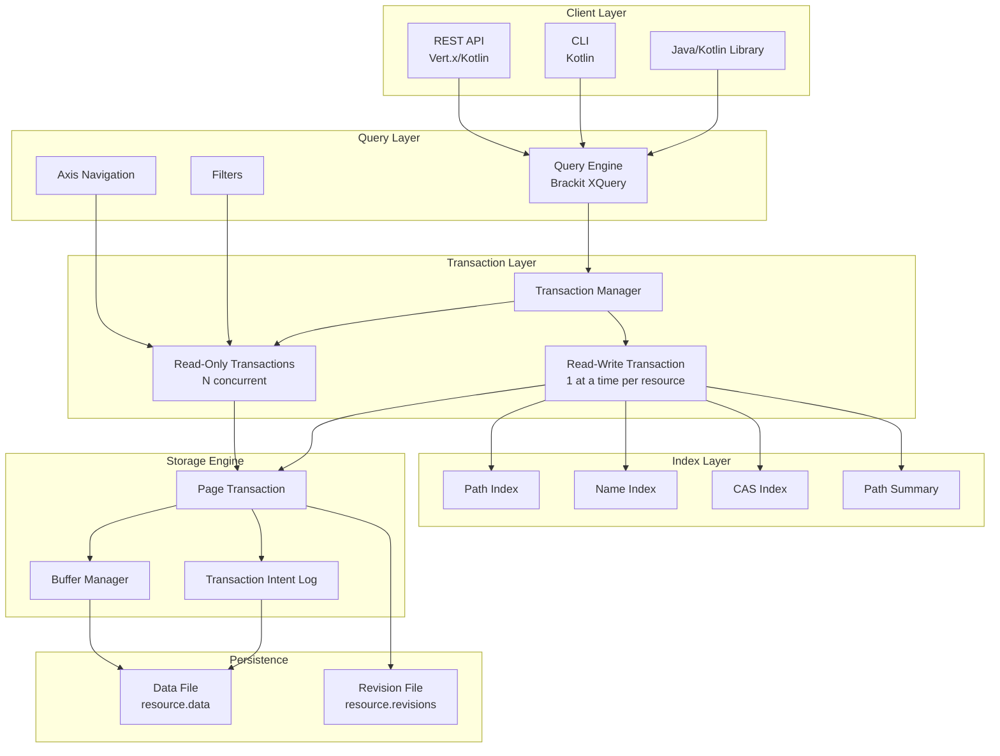
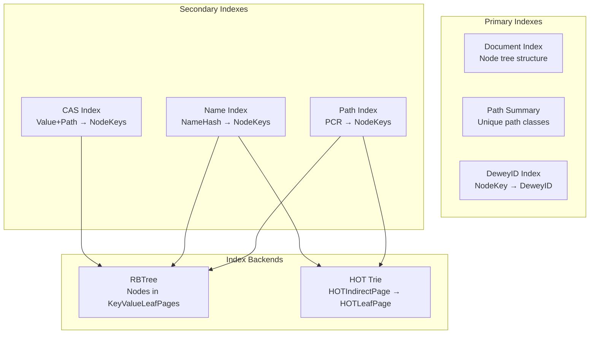
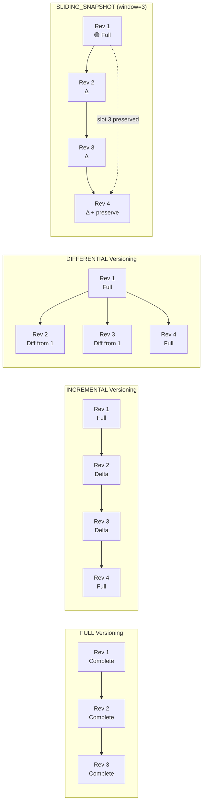
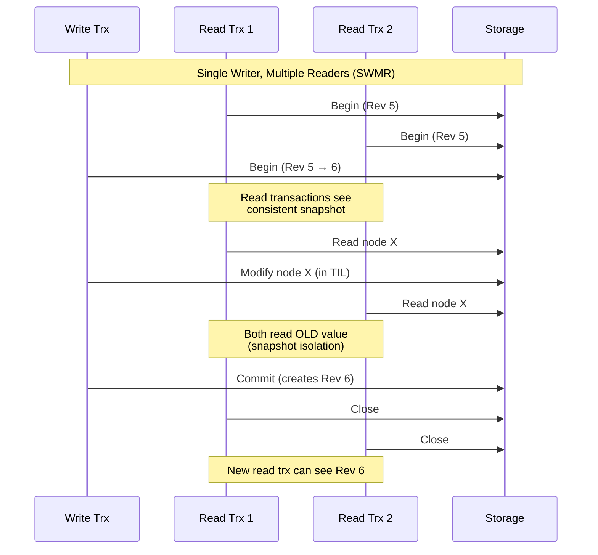
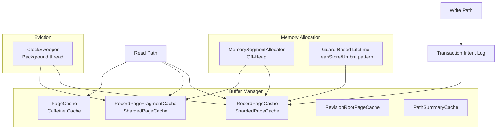

# SirixDB Architecture Specification

## Table of Contents

1. [Overview](#overview)
2. [The Hard Problems](#the-hard-problems) ← Why this is non-trivial
3. [Core Design Principles](#core-design-principles)
4. [System Architecture](#system-architecture)
5. [Query Processing](#query-processing)
6. [Document Model & Navigation](#document-model--navigation)
7. [Index Architecture](#index-architecture)
8. [Storage Engine](#storage-engine)
9. [Page Structure](#page-structure)
10. [MVCC & Versioning](#mvcc--versioning) ← Contains SLIDING_SNAPSHOT innovation
11. [Transaction Model](#transaction-model)
12. [Memory Management](#memory-management)
13. [Data Integrity](#data-integrity)
14. [Performance Characteristics](#performance-characteristics)
15. [Configuration Reference](#configuration-reference)

---

## Overview

**The core insight**: What if your database never forgot anything, and you could query any point in its history as fast as querying the present—without the storage exploding?

SirixDB is a **temporal document store** that makes version control a first-class citizen of the storage engine itself. Every commit creates an immutable snapshot. Every revision is queryable. And unlike naive approaches that either copy everything (git-style) or maintain expensive logs (event sourcing), SirixDB achieves this through **structural sharing** and a novel **sliding snapshot** versioning algorithm.

### What Makes This Hard

Traditional approaches to temporal databases face an impossible trilemma:

```
                    ┌─────────────────────┐
                    │   FAST READS        │
                    │   (single lookup)   │
                    └──────────┬──────────┘
                               │
              Pick two:        │
                               │
    ┌──────────────────────────┼──────────────────────────┐
    │                          │                          │
    ▼                          ▼                          ▼
┌─────────────┐       ┌─────────────────┐       ┌─────────────┐
│ FAST WRITES │       │ LOW STORAGE     │       │ BOUNDED     │
│ (append Δ)  │       │ (share pages)   │       │ READ COST   │
└─────────────┘       └─────────────────┘       └─────────────┘

• Full snapshots:      Fast reads, but O(n) storage per revision
• Delta chains:        Compact, but reads degrade to O(revisions)
• Periodic snapshots:  Bounded reads, but write spikes during compaction
```

**SirixDB's answer**: The SLIDING_SNAPSHOT algorithm—formally verified—achieves all three without periodic compaction spikes. See [MVCC & Versioning](#mvcc--versioning).

### Key Characteristics

| Feature | What it means | Why it matters |
|---------|---------------|----------------|
| **Temporal** | Every revision preserved | Git-like history for your data |
| **Append-Only** | No in-place updates | No WAL needed, crash-safe by design |
| **Copy-on-Write** | Modified pages copied, unchanged shared | O(Δ) storage per revision |
| **Structural Sharing** | Unchanged subtrees reference existing pages | Billion-node docs with small revisions |
| **Log-Structured** | Sequential writes only | SSD-friendly, no random write I/O |

### Node Storage vs. Document Storage: Why It Matters

> **SirixDB stores trees of nodes, not blobs of documents.** This isn't an implementation detail—it's a fundamental design choice with profound implications.

Most document databases (MongoDB, CouchDB, etc.) treat a document as an opaque blob: store it, retrieve it, replace it. SirixDB takes a radically different approach—it understands the *structure* of your data.

```
┌──────────────────────────────────────────────────────────────────────────┐
│                   Document Store vs. Node Store                          │
├──────────────────────────────────────────────────────────────────────────┤
│                                                                          │
│   Document Store (MongoDB, etc.)         Node Store (SirixDB)            │
│   ──────────────────────────────         ─────────────────────           │
│                                                                          │
│   ┌─────────────────────────┐           ┌────┐                           │
│   │ { "user": "alice",      │           │root│──────────────────┐        │
│   │   "orders": [           │           └─┬──┘                  │        │
│   │     { "id": 1, ... },   │    ┌───────┴───────┐              │        │
│   │     { "id": 2, ... },   │   user           orders           │        │
│   │     ...10000 orders...  │  "alice"    ┌────┴────┐           │        │
│   │   ]                     │           [0]  [1] ... [9999]     │        │
│   │ }                       │            │    │        │        │        │
│   └─────────────────────────┘           {...}{...}   {...}      │        │
│        ↓                                                        │        │
│   Stored as ONE blob                    Each node stored        │        │
│   Updated as ONE blob                   independently           │        │
│   Limited by max doc size               No size limit!          │        │
│                                                                          │
└──────────────────────────────────────────────────────────────────────────┘
```

**Why this matters:**

| Aspect | Document Store | SirixDB Node Store |
|--------|----------------|-------------------|
| **Size limits** | 16MB (MongoDB), 1MB (DynamoDB) | **Unlimited**—nodes stored independently |
| **Update granularity** | Replace entire document | Write only changed nodes |
| **Query efficiency** | Load doc, filter in app | Navigate directly to target nodes |
| **Memory footprint** | Entire doc in memory | Stream nodes, never load full tree |
| **Versioning granularity** | "Document changed" | "These specific nodes changed" |
| **Diff precision** | "Something's different" | Exact path to every modified node |

**Real-world implications:**

1. **No artificial document splits**: A 100GB JSON dataset with millions of records? Store it as one logical resource. No need to shard by arbitrary boundaries.

2. **Surgical updates**: Change one field in a deeply nested object? Depending on the versioning type, SirixDB writes just that node plus the modified path through the page index structure. If node hashing is enabled, the path to the document root is also updated to reflect the new rolling hash. The document store rewrites everything.

3. **Efficient streaming**: Process a billion-node tree without ever holding the full structure in memory. Navigate node-by-node.

4. **Fine-grained history**: "Show me exactly which fields changed in the last 100 commits" is a fast index lookup, not a document-diff operation.

5. **Partial materialization**: Need just one branch of a huge tree? Fetch and reconstruct only that subtree. The rest stays on disk.

```xquery
(: Navigate to a specific node in a 100GB resource - 
   loads only the path, not the whole tree :)
let $doc := jn:doc('huge', 'dataset')
return $doc.customers[10000].orders[500].items[3].price
```

This query touches ~5 nodes, not 100GB.

---

## The Hard Problems: Why Bitemporal Storage Matters

Before diving into the architecture, let's understand the *real-world problems* that shaped the design. These aren't academic exercises—they're scenarios where traditional databases force you into painful workarounds.

---

### Problem 1: "What did my data look like last Tuesday at 3pm?"

**The Scenario**: Your e-commerce system processed 50,000 orders yesterday. A customer claims they were charged the wrong price. Your current database shows today's price. What was the price *at the moment of their order*?

**Traditional Approach**: Hope you logged it. Build audit tables. Maintain change data capture pipelines. Query across multiple systems. Pray nothing was missed.

**With SirixDB**:
```xquery
(: Query the exact state at the order timestamp :)
let $catalog := jn:open('shop', 'products', xs:dateTime('2024-01-15T15:23:47Z'))
return $catalog.products[.sku eq "SKU-12345"].price
```

One query. Exact answer. No audit infrastructure required—*the database remembers everything*.

---

### Problem 2: "Show me what changed between two points in time"

**The Scenario**: Your configuration management system shows a production outage started at 2:00 AM. What configuration changes were made between the last known good state (midnight) and the incident?

**Traditional Approach**: Diff log files. Compare backup snapshots. Write custom scripts to parse change logs. Miss the one change that mattered.

**With SirixDB**:
```xquery
(: Get structured diffs between any two points in time :)
let $midnight := jn:open('configs', 'production', xs:dateTime('2024-01-15T00:00:00Z'))
let $incident := jn:open('configs', 'production', xs:dateTime('2024-01-15T02:00:00Z'))
return jn:diff('configs', 'production', sdb:revision($midnight), sdb:revision($incident))
```

Returns a structured JSON diff showing exactly what was inserted, deleted, updated, and moved—with node-level precision.

---

### Problem 3: "Track how this specific record evolved over its entire lifetime"

**The Scenario**: A patient's medical record shows an allergy. When was it added? Was it ever modified? By which revision?

**Traditional Approach**: Build a separate history table. Maintain triggers. Hope the triggers don't miss edge cases. Query across temporal joins.

**With SirixDB**:
```xquery
(: Every version of a specific node, across all time :)
let $allergy := jn:doc('hospital', 'patient-123').allergies[.name eq "Penicillin"]
for $version in jn:all-times($allergy)
return {
  "revision": sdb:revision($version),
  "timestamp": sdb:timestamp($version),
  "data": $version,
  "changedFromPrevious": sdb:hash($version) ne sdb:hash(jn:previous($version))
}
```

The node key is stable across all revisions. The built-in Merkle hash tree instantly detects if the subtree changed.

---

### Problem 4: "Find records that were added after a specific date and still exist"

**The Scenario**: Regulatory audit requires identifying all customer accounts created after the new compliance rules took effect that are still active.

**With SirixDB**:
```xquery
(: Find the revision number for the compliance cutoff date :)
let $cutoffDoc := jn:open('bank', 'accounts', xs:dateTime('2024-06-01T00:00:00Z'))
let $cutoffRev := sdb:revision($cutoffDoc)

(: Query current state, filter by creation revision :)
let $current := jn:doc('bank', 'accounts')
for $account in $current.accounts[]
where not(exists(jn:previous($account)))  (: First revision this account exists :)
  and sdb:revision($account) > $cutoffRev
return $account
```

`jn:previous()` navigates to the same node in the prior revision (if it existed). No separate "created_at" column needed—the revision history *is* the audit trail.

---

### Problem 5: "Undo the last 3 changes to this subtree"

**The Scenario**: A bulk import corrupted part of your document. You need to restore just that subtree, not the entire database.

**Traditional Approach**: Restore from backup (lose all other changes). Write complex update scripts. Hope you got the scope right.

**With SirixDB**:
```xquery
(: Find the node 5 revisions ago and see its state :)
let $currentDoc := jn:doc('mydb', 'myresource')
let $currentRev := sdb:revision($currentDoc)
let $nodeKey := 12345  (: Stable across all revisions :)

(: Open the older revision and select the same node :)
let $oldDoc := jn:doc('mydb', 'myresource', $currentRev - 5)
let $oldVersion := sdb:select-item($oldDoc, $nodeKey)
return $oldVersion  (: This is the exact state we want to restore :)
```

Node keys are stable. You can surgically access any subtree at any point in history.

---

### Problem 6: The History Table Performance Tax

**The Scenario**: You implement temporal data the "standard" way—history tables with `valid_from` and `valid_to` timestamps on every row.

**The Hidden Costs**:
- **Index bloat**: Every index now includes timestamps. Your primary key index on `user_id` becomes `(user_id, valid_from, valid_to)`. 3x larger, less cache-friendly.
- **Query overhead**: Every query needs `WHERE valid_from <= :timestamp AND valid_to > :timestamp`. The optimizer must scan timestamp ranges, not just key lookups.
- **Write amplification**: Updating a row means INSERT new + UPDATE old row's `valid_to`. Two writes per logical change.
- **Join complexity**: Joining two temporal tables? Now you're intersecting validity intervals. O(n²) potential matches.

**With SirixDB**:
- Indexes don't contain timestamps—they're *scoped to a revision*
- Query revision 42? You get revision 42's index. No filtering required.
- Each revision's index is O(1) to access via the revision root
- Structural sharing means unchanged index pages aren't duplicated

**"But don't you have to find the revision first?"**

Yes! When querying by timestamp (e.g., `jn:open(..., xs:dateTime('2024-01-15T15:00:00Z'))`), SirixDB must find the corresponding revision:

1. The `sirix.revisions` file stores: `[(rev, timestamp, offset), ...]`
2. Binary search finds the revision for a timestamp: **O(log R)** where R = revisions
3. After that, *all operations* in that revision are timestamp-free

The key difference:
```
History table scanning 1000 products:
  1000 × (index lookup + timestamp range filter)
  = 1000 timestamp comparisons

SirixDB scanning 1000 products:  
  1 × O(log R) revision lookup + 1000 × (index lookup)
  = 1 timestamp lookup total
```

And typically, you open a session on a revision and run many queries—so that one O(log R) cost is amortized across the entire session.

---

### Problem 7: Structural Sharing (Why Git Works)

**The Insight**: Git doesn't copy your entire repo on each commit. It shares unchanged blobs and trees. SirixDB applies the same principle to database pages.

**Traditional Temporal DBs**: Store full rows with validity periods. Even unchanged data has new timestamp metadata.

**SirixDB**: Only *modified pages* are written. Unchanged subtrees reference existing pages across revisions. A 10GB document with 1000 revisions that change 0.1% each? ~20GB total, not 10TB.

---

### Problem 8: The Read Degradation Trap

**The Problem**: Pure delta-based versioning (like INCREMENTAL) is compact, but reading revision 1000 means reconstructing from 1000 deltas. Reads degrade linearly with history depth.

**SirixDB's Solution**: The **SLIDING_SNAPSHOT** algorithm bounds reconstruction to a constant window (typically 8 fragments), regardless of total revision count. Revision 1 and revision 10,000 have the same read performance.

---

### Problem 9: The Write Amplification Spike

**The Problem**: To bound read cost, systems periodically write full snapshots. Every N revisions: write storm.

**SirixDB's Solution**: SLIDING_SNAPSHOT *never* writes full snapshots after initialization. It selectively preserves only records falling out of the window—amortized O(1) extra writes per record. No spikes. Ever.

---

## Core Design Principles

These aren't just nice-to-haves—they're load-bearing constraints that enable the solutions above:

```
┌─────────────────────────────────────────────────────────────────────────┐
│                       SirixDB Design Philosophy                         │
├─────────────────────────────────────────────────────────────────────────┤
│                                                                         │
│  ┌──────────────┐    ┌──────────────┐    ┌──────────────┐               │
│  │   TEMPORAL   │    │   IMMUTABLE  │    │    SHARED    │               │
│  │    FIRST     │    │     PAGES    │    │   STRUCTURE  │               │
│  │              │    │              │    │              │               │
│  │  Not bolted  │    │   Once       │    │  Unchanged   │               │
│  │  on—baked    │    │   written,   │    │  subtrees    │               │
│  │  into core   │    │   never      │    │   reference  │               │
│  │              │    │   modified   │    │   existing   │               │
│  └──────────────┘    └──────────────┘    └──────────────┘               │
│                                                                         │
│  ┌──────────────┐    ┌──────────────┐    ┌──────────────┐               │
│  │  SSD/FLASH   │    │    CRASH     │    │   ZERO       │               │
│  │   NATIVE     │    │    PROOF     │    │   WRITE AMP  │               │
│  │              │    │              │    │              │               │
│  │  Sequential  │    │  Commit =    │    │  No periodic │               │
│  │  append-only │    │  fsync once  │    │  full page   │               │
│  │  writes only │    │  No WAL/redo │    │  rewrites    │               │
│  └──────────────┘    └──────────────┘    └──────────────┘               │
│                                                                         │
└─────────────────────────────────────────────────────────────────────────┘
```

---

## System Architecture

### High-Level Component Diagram



### Module Structure

```
sirix/bundles/
├── sirix-core/          # Core storage engine, transactions, pages
├── sirix-query/         # Brackit XQuery engine integration
├── sirix-rest-api/      # Vert.x REST server (Kotlin)
├── sirix-kotlin-cli/    # Command-line interface
├── sirix-kotlin-api/    # Kotlin extensions
├── sirix-distributed/   # Distributed features (experimental)
└── sirix-examples/      # Usage examples
```

---

## Query Processing

> **Time-travel as a first-class operation**: Most databases let you query the present. Some let you restore backups. SirixDB lets you query *any point in history* with the same syntax and performance as querying now.

### XQuery/JSONiq Engine

SirixDB uses **Brackit**, a high-performance query processor, extended with temporal primitives:

```xquery
(: The killer feature: compare a node across time :)
let $now := jn:doc('shop', 'products')  (: Most recent revision :)
let $lastWeek := jn:open('shop', 'products', xs:dateTime('2024-12-30T00:00:00Z'))

for $product in $now.products[]
let $oldPrice := $lastWeek.products[.id eq $product.id].price
where $product.price > $oldPrice * 1.1  (: Price increased >10% :)
return {
  "name": $product.name,
  "priceChange": $product.price - $oldPrice,
  "changedInRevision": sdb:revision($product)
}
```

This query **joins data across time**—something that would require ETL pipelines, data warehouses, or manual snapshotting in traditional systems. Here, it's just a query.

### Query Execution Model

```
┌───────────────────────────────────────────────────────────────────────────┐
│                       Query Execution Pipeline                            │
├───────────────────────────────────────────────────────────────────────────┤
│                                                                           │
│   JSONiq/XQuery ──► Parser ──► AST ──► Optimizer ──► Axis Iterators      │
│                                                                           │
│   Example: $doc.users[].name                                              │
│                                                                           │
│   1. Parse: ObjectDeref("users") → ArrayDeref → ObjectDeref("name")       │
│   2. Optimize: Push predicates, select index                              │
│   3. Execute: ChildAxis → ArrayAxis → ChildAxis + NameFilter              │
│                                                                           │
│   Each axis is a lazy iterator producing nodes on-demand.                 │
│   Temporal functions (jn:previous, sdb:revision) open new transactions.   │
│                                                                           │
└───────────────────────────────────────────────────────────────────────────┘
```

### Temporal Query Functions

| Function | Description |
|----------|-------------|
| `jn:open(db, resource, revision)` | Open specific revision by number |
| `jn:open(db, resource, timestamp)` | Open revision at point-in-time |
| `jn:previous($node)` | Get node from previous revision |
| `jn:next($node)` | Get node from next revision |
| `jn:all-times($node)` | Iterate all versions of node |
| `sdb:revision($node)` | Get revision number |
| `sdb:timestamp($node)` | Get commit timestamp |

---

## Document Model & Navigation

> **The Abstraction**: To queries, documents look like trees you navigate with XPath-style axes. Under the hood, those "pointers" are actually node keys that resolve through the trie to contiguous memory regions. The abstraction is clean; the performance is physical.

### Node Structure

**Stable identity across time**: Every node has a 64-bit `nodeKey` that never changes, even as the document evolves. Node 42 in revision 1 is the same logical entity as node 42 in revision 100 (if it still exists). This is what makes temporal queries like "show me how node 42 changed" possible.

Every document is stored as a tree of **nodes**, where each node has:
- A unique `nodeKey` (64-bit integer, stable across all revisions)
- Structural pointers (parent, children, siblings)
- Type-specific data (values, names)

```
┌───────────────────────────────────────────────────────────────────────────┐
│                         Node Structure Overview                           │
├───────────────────────────────────────────────────────────────────────────┤
│                                                                           │
│  Every node has a unique nodeKey (64-bit) stable across all revisions     │
│                                                                           │
│  Base Node Fields (all nodes):                                            │
│  ┌─────────────────────────────────────────────────────────────────────┐  │
│  │ nodeKey           (64-bit)  Unique identifier, stable across time   │  │
│  │ parentKey         (64-bit)  Parent node's key                       │  │
│  │ previousRevision  (32-bit)  When node was created                   │  │
│  │ lastModRevision   (32-bit)  When node was last modified             │  │
│  │ hash              (64-bit)  Optional: rolling/postorder hash        │  │
│  └─────────────────────────────────────────────────────────────────────┘  │
│                                                                           │
│  Structural Node Fields (tree nodes):                                     │
│  ┌─────────────────────────────────────────────────────────────────────┐  │
│  │ firstChildKey     (64-bit)  First child's key                       │  │
│  │ lastChildKey      (64-bit)  Last child's key                        │  │
│  │ leftSiblingKey    (64-bit)  Left sibling's key                      │  │
│  │ rightSiblingKey   (64-bit)  Right sibling's key                     │  │
│  │ childCount        (64-bit)  Optional: number of children            │  │
│  │ descendantCount   (64-bit)  Optional: number of descendants         │  │
│  └─────────────────────────────────────────────────────────────────────┘  │
│                                                                           │
│  Named Node Fields (elements, attributes, object keys):                   │
│  ┌─────────────────────────────────────────────────────────────────────┐  │
│  │ pathNodeKey       (64-bit)  Reference to PathSummary node (PCR)     │  │
│  │ localNameKey      (32-bit)  Index into NamePage string table        │  │
│  │ prefixKey         (32-bit)  XML namespace prefix (NamePage index)   │  │
│  │ uriKey            (32-bit)  XML namespace URI (NamePage index)      │  │
│  └─────────────────────────────────────────────────────────────────────┘  │
│                                                                           │
└───────────────────────────────────────────────────────────────────────────┘
```

### Node Types

**JSON Node Types:**

| NodeKind | ID | Description |
|----------|-----|-------------|
| JSON_DOCUMENT | 31 | JSON document root |
| OBJECT | 24 | JSON object `{ }` |
| ARRAY | 25 | JSON array `[ ]` |
| OBJECT_KEY | 26 | Object key (field name) |
| STRING_VALUE | 26 | String value `"text"` |
| NUMBER_VALUE | 28 | Number value `123.45` |
| BOOLEAN_VALUE | 27 | Boolean value `true`/`false` |
| NULL_VALUE | 29 | Null value `null` |

**XML Node Types:**

| NodeKind | ID | Description |
|----------|-----|-------------|
| ELEMENT | 1 | XML element with optional attributes/namespaces |
| ATTRIBUTE | 2 | Attribute node |
| NAMESPACE | 4 | Namespace declaration |
| TEXT | 6 | Text content node |
| PROCESSING_INSTRUCTION | 7 | Processing instruction |
| COMMENT | 8 | Comment node |
| XML_DOCUMENT | 9 | Document root |

### Example: JSON Document Structure

```
┌───────────────────────────────────────────────────────────────────────────┐
│                   JSON Document with All Node Types                       │
├───────────────────────────────────────────────────────────────────────────┤
│                                                                           │
│  Document: {"name":"Alice","age":30,"active":true,"address":null,         │
│             "tags":["dev","lead"]}                                        │
│                                                                           │
│  Tree Structure:                                                          │
│                                                                           │
│  JSON_DOCUMENT (key=0)                                                    │
│       │                                                                   │
│       └── OBJECT (key=1)                                                  │
│            ├── OBJECT_KEY "name" (key=2) ──► STRING_VALUE "Alice" (key=3) │
│            ├── OBJECT_KEY "age" (key=4)  ──► NUMBER_VALUE 30 (key=5)      │
│            ├── OBJECT_KEY "active" (key=6) ► BOOLEAN_VALUE true (key=7)   │
│            ├── OBJECT_KEY "address" (key=8) ► NULL_VALUE (key=9)          │
│            └── OBJECT_KEY "tags" (key=10)                                 │
│                     └── ARRAY (key=11)                                    │
│                          ├── STRING_VALUE "dev" (key=12)                  │
│                          └── STRING_VALUE "lead" (key=13)                 │
│                                                                           │
│  Navigation: nodeKey 2 has parentKey=1, rightSiblingKey=4                 │
│                                                                           │
└───────────────────────────────────────────────────────────────────────────┘
```

### Navigation Axes

Axes are iterators that traverse from a context node to related nodes. SirixDB provides both **spatial axes** (within a revision) and **temporal axes** (across revisions).

#### Spatial Axes

| Axis | Direction | Description |
|------|-----------|-------------|
| `ChildAxis` | Down | Direct children only |
| `DescendantAxis` | Down | All descendants (depth-first) |
| `ParentAxis` | Up | Direct parent |
| `AncestorAxis` | Up | All ancestors to root |
| `FollowingSiblingAxis` | Right | Siblings after this node |
| `PrecedingSiblingAxis` | Left | Siblings before this node |
| `SelfAxis` | None | The node itself |

```java
// Example: iterate all children
try (var rtx = resource.beginNodeReadOnlyTrx()) {
    rtx.moveTo(parentNodeKey);
    for (var axis = new ChildAxis(rtx); axis.hasNext(); ) {
        axis.nextLong();
        System.out.println(rtx.getName() + ": " + rtx.getValue());
    }
}
```

#### Temporal Axes

Navigate the same node across different revisions:

| Axis | Description |
|------|-------------|
| `AllTimeAxis` | All revisions where node exists |
| `PastAxis` | Previous revisions (oldest first or newest first) |
| `FutureAxis` | Later revisions |
| `FirstAxis` | First revision where node existed |
| `LastAxis` | Most recent revision |
| `PreviousAxis` | Immediately preceding revision |
| `NextAxis` | Immediately following revision |

```
┌───────────────────────────────────────────────────────────────────────────┐
│                         Temporal Navigation                               │
├───────────────────────────────────────────────────────────────────────────┤
│                                                                           │
│  Timeline:  Rev 1 ──► Rev 2 ──► Rev 3 ──► Rev 4 ──► Rev 5                 │
│                                    ▲                                      │
│                               Current Node                                │
│                                                                           │
│  PastAxis:        Rev 1, Rev 2 (iterations before Rev 3)                  │
│  FutureAxis:      Rev 4, Rev 5 (iterations after Rev 3)                   │
│  AllTimeAxis:     Rev 1, Rev 2, Rev 3, Rev 4, Rev 5                       │
│  PreviousAxis:    Rev 2 (one step back)                                   │
│  NextAxis:        Rev 4 (one step forward)                                │
│                                                                           │
└───────────────────────────────────────────────────────────────────────────┘
```

#### Combining Spatial and Temporal

```java
// Get all versions of all children
try (var rtx = resource.beginNodeReadOnlyTrx()) {
    rtx.moveTo(parentKey);
    var childAxis = new ChildAxis(rtx);
    while (childAxis.hasNext()) {
        childAxis.nextLong();
        var allTimeAxis = new AllTimeAxis(resource, rtx);
        while (allTimeAxis.hasNext()) {
            var historicalRtx = allTimeAxis.next();
            // historicalRtx points to this child in a different revision
        }
    }
}
```

### Physical Storage: No Pointer Chasing

Node keys are **logical identifiers**, not memory pointers. Nodes are stored contiguously in `KeyValueLeafPages` for cache locality:

```
┌───────────────────────────────────────────────────────────────────────────┐
│                    Logical Keys → Physical Storage                        │
├───────────────────────────────────────────────────────────────────────────┤
│                                                                           │
│  nodeKey = 5000                                                           │
│      │                                                                    │
│      ├──► pageKey = 5000 >> 10 = 4  (which KeyValueLeafPage)              │
│      └──► slotIndex = 5000 & 1023 = 904  (which slot in page)             │
│                                                                           │
│  KeyValueLeafPage #4:                                                     │
│  ┌─────────────────────────────────────────────────────────────────────┐  │
│  │ MemorySegment (off-heap, up to 1024 nodes)                          │  │
│  │ ┌──────┬──────┬──────┬─────────────────────────┬──────┬──────────┐  │  │
│  │ │ [0]  │ [1]  │ [2]  │ ... contiguous nodes ...│ [904]│   ...    │  │  │
│  │ │ Node │ Node │ Node │                         │ Node │          │  │  │
│  │ └──────┴──────┴──────┴─────────────────────────┴──────┴──────────┘  │  │
│  └─────────────────────────────────────────────────────────────────────┘  │
│                                                                           │
│  Benefits:                                                                │
│  • Cache-friendly: nodes in same page are nearby in memory                │
│  • O(1) lookup: trie navigation + slot index                              │
│  • No pointer chasing: direct offset calculation                          │
│                                                                           │
└───────────────────────────────────────────────────────────────────────────┘
```

---

## Index Architecture

> **The Challenge**: Most databases bolt on versioning to indexes as an afterthought. Result: your index at revision 42 might not match your data at revision 42. SirixDB indexes version *with* the data—same CoW infrastructure, same revision semantics.

Secondary indexes answer the question: "Which nodes have property X?" Instead of scanning the entire document, look up X in an index and get back a bitmap of matching node keys.

### Index Types



**DeweyIDs**: When enabled via `ResourceConfiguration.Builder.useDeweyIDs(true)`, each node is assigned a hierarchical identifier (e.g., `1.3.5.7`) that encodes its position in the document tree. DeweyIDs enable:
- O(1) ancestor/descendant relationship checks (compare prefixes)
- O(1) document order comparisons (lexicographic comparison)
- Efficient sibling navigation without parent traversal

DeweyIDs are stored inline within `KeyValueLeafPages` alongside node records (in a dedicated MemorySegment). The sibling distance (`deweyIdSiblingDistance`) is configurable to optimize for insert-heavy vs. read-heavy workloads.

### Secondary Index Types

SirixDB supports three types of user-defined secondary indexes that can be created on any resource:

#### Path Index

**Purpose**: Accelerates queries that filter by document structure (path expressions).

**Key Mapping**: `PCR (Path Class Reference) → Set<NodeKey>`

**Use Case**: "Find all nodes at path `/users/[]/email`"

```
Document:                          Path Index (for /users/[]/name):
─────────                          ─────────────────────────────────
{                                  PCR=3 → {5, 12}  (nodeKeys of "Alice", "Bob")
  "users": [
    {"name": "Alice", "age": 30},  ← nodeKey=5
    {"name": "Bob", "age": 25}     ← nodeKey=12
  ]
}
```

**When to Use**:
- Queries with specific path patterns (e.g., `//users/[]/address/city`)
- XPath/JSONPath-style navigation
- When you know which paths are frequently queried

#### Name Index

**Purpose**: Accelerates queries that search for elements/fields by name regardless of path.

**Key Mapping**: `QNm (Qualified Name hash) → Set<NodeKey>`

**Use Case**: "Find all nodes named 'email' anywhere in the document"

```
Document:                          Name Index (for "email"):
─────────                          ──────────────────────────
{                                  hash("email") → {8, 15, 22}
  "user": {
    "email": "a@test.com"          ← nodeKey=8
  },
  "admin": {
    "contact": {
      "email": "b@test.com"        ← nodeKey=15
    }
  },
  "support": {
    "email": "c@test.com"          ← nodeKey=22
  }
}
```

**When to Use**:
- Wildcard path queries (`//*:email`, `..$email`)
- Schema-agnostic searches across heterogeneous documents
- When the same field name appears at different paths

#### CAS Index (Content-And-Structure)

**Purpose**: Accelerates queries that filter by both value AND path (content + structure).

**Key Mapping**: `CASValue (Path + TypedValue) → Set<NodeKey>`

**Use Case**: "Find all users where age > 30" or "Find products with price = 99.99"

```
Document:                          CAS Index (for /users/[]/age, Type=INT):
─────────                          ─────────────────────────────────────────
{                                  (PCR=4, 25) → {13}
  "users": [                       (PCR=4, 30) → {7}
    {"name": "Alice", "age": 30},  (PCR=4, 35) → {19}
    {"name": "Bob", "age": 25},
    {"name": "Carol", "age": 35}   Supports range queries: age > 28
  ]                                → Returns {7, 19}
}
```

**When to Use**:
- Value-based filtering (`where price < 100`)
- Range queries (`where date between ...`)
- Equality checks on specific paths
- Can be marked as `unique` for constraint enforcement

**Important**: The two index backends use different storage structures:

| Backend | Page Structure | Leaf Page Type |
|---------|----------------|----------------|
| **RBTree** | `IndexPage` → `IndirectPages` → `KeyValueLeafPage` | RBTree nodes stored as records |
| **HOT** | `IndexPage` → `HOTIndirectPage` → `HOTLeafPage` | Sorted key-value entries |

- RBTree: Uses the standard trie (IndirectPages) with RB-tree nodes in KeyValueLeafPages
- HOT: Uses its own trie structure (HOTIndirectPage) with specialized HOTLeafPages

### Path Summary

The **Path Summary** is a compressed representation of all unique paths in the document:

```
Document:                          Path Summary:
─────────                          ─────────────
{                                  /             (PCR=0)
  "users": [                       ├─ users      (PCR=1)
    {                              │  └─ []      (PCR=2)
      "name": "Alice",             │     ├─ name (PCR=3)
      "age": 30                    │     └─ age  (PCR=4)
    },                             
    {                              PCR = Path Class Reference
      "name": "Bob",               Each unique path gets one PCR
      "age": 25                    Nodes reference their PCR
    }                              
  ]                                
}                                  
```

### HOT (Height-Optimized Trie) Index

The HOT index is a cache-friendly alternative to B-trees:

```
┌───────────────────────────────────────────────────────────────────────────┐
│                    HOT Index Structure                                    │
├───────────────────────────────────────────────────────────────────────────┤
│                                                                           │
│  Traditional B-Tree:           HOT Trie:                                  │
│  ─────────────────            ─────────                                   │
│                                                                           │
│       [Root]                       [Compound Node]                        │
│      /      \                     /    |    |    \                        │
│    [A]      [B]              [C1] [C2] [C3] [C4]                          │
│   / | \    / | \                                                          │
│  ...      ...                 Multiple levels collapsed                   │
│                               into single cache-friendly node             │
│                                                                           │
│  Node Types:                                                              │
│  ┌──────────┬──────────────────────────────────────────────────────────┐  │
│  │ BiNode   │ 2 children, 1 discriminative bit                         │  │
│  ├──────────┼──────────────────────────────────────────────────────────┤  │
│  │ SpanNode │ 2-16 children, SIMD-optimized partial key search         │  │
│  ├──────────┼──────────────────────────────────────────────────────────┤  │
│  │ MultiNode│ 17-256 children, direct byte indexing                    │  │
│  └──────────┴──────────────────────────────────────────────────────────┘  │
│                                                                           │
│  HOTLeafPage:                                                             │
│  ┌─────────────────────────────────────────────────────────────────────┐  │
│  │ [key₁|value₁][key₂|value₂][key₃|value₃]...                          │  │
│  │ Sorted entries, binary search, off-heap MemorySegment               │  │
│  └─────────────────────────────────────────────────────────────────────┘  │
│                                                                           │
└───────────────────────────────────────────────────────────────────────────┘
```

### Index Configuration

```java
// Create a path index for specific paths
IndexDef pathIdx = IndexDefs.createPathIdxDef(
    Set.of(parse("/users/[]/name")), 
    0, 
    IndexDef.DbType.JSON
);

// Create a name index for all field names
IndexDef nameIdx = IndexDefs.createNameIdxDef(0, IndexDef.DbType.JSON);

// Create a CAS index for value queries
IndexDef casIdx = IndexDefs.createCASIdxDef(
    false,                    // not unique
    Type.STR,                 // string values
    Set.of(parse("/users/[]/name")),
    0,
    IndexDef.DbType.JSON
);
```

---

## Storage Engine

> **Design Goal**: A single append-only file per resource. No WAL. No compaction. Just write pages sequentially and fsync once per commit.

The storage engine is deceptively simple: pages go in, pages come out. The complexity lives in *which* pages to write and *how* to reconstruct them. That's where versioning strategies earn their keep.

### File Layout

```
┌─────────────────────────────────────────────────────────────────────────────┐
│                         SirixDB File Layout                                 │
├─────────────────────────────────────────────────────────────────────────────┤
│                                                                             │
│  mydatabase/                           ◄── Database directory               │
│  ├── dbsetting.obj                     ◄── Database configuration (binary)  │
│  ├── keyselector/                      ◄── Encryption key storage           │
│  ├── .lock                             ◄── Database lock file               │
│  └── resources/                        ◄── All resources in this database   │
│      │                                                                      │
│      ├── resource1/                    ◄── Resource directory               │
│      │   ├── ressetting.obj            ◄── Resource config (binary)         │
│      │   ├── data/                     ◄── Main storage                     │
│      │   │   ├── sirix.data            ◄── Page data (append-only)          │
│      │   │   └── sirix.revisions       ◄── Revision offset index            │
│      │   ├── indexes/                  ◄── Index definitions                │
│      │   │   └── indexes.xml           ◄── XML index config                 │
│      │   ├── log/                      ◄── Transaction intent log           │
│      │   │   └── .commit               ◄── Commit marker file               │
│      │   ├── encryption/               ◄── Resource encryption keys         │
│      │   └── update-operations/        ◄── Update operation logs            │
│      │                                                                      │
│      └── resource2/                    ◄── Another resource                 │
│          └── ...                                                            │
│                                                                             │
└─────────────────────────────────────────────────────────────────────────────┘
```

**Key files:**
- `sirix.data` - Append-only file containing all pages (compressed, versioned)
- `sirix.revisions` - Index mapping revision numbers to file offsets
- `ressetting.obj` - Serialized `ResourceConfiguration` (versioning type, compression, etc.)

### Page Hierarchy

```
┌─────────────────────────────────────────────────────────────────────────┐
│                        SirixDB Page Hierarchy                           │
├─────────────────────────────────────────────────────────────────────────┤
│                                                                         │
│  UberPage                                                               │
│  ════════                                                               │
│  │ Entry point for resource (one per resource)                          │
│  │ Points to RevisionRootPage for each revision                         │
│  │                                                                      │
│  ▼                                                                      │
│  RevisionRootPage (Rev N)                                               │
│  ════════════════════════                                               │
│  │ Root for one revision                                                │
│  │ Commit timestamp, max node key                                       │
│  │                                                                      │
│  ├──► DocumentPage ───────────────────────────────────────────────────┐ │
│  │    (Node storage root)                                             │ │
│  │         │                                                          │ │
│  │         ▼                                                          │ │
│  │    IndirectPage L0 [0..1023]                                       │ │
│  │         │                                                          │ │
│  │         ├─[0]──► IndirectPage L1 [0..1023]                         │ │
│  │         │              │                                           │ │
│  │         │              ├─[0]──► IndirectPage L2 ──► ... ──► Leaf   │ │
│  │         │              ├─[1]──► IndirectPage L2 ──► ... ──► Leaf   │ │
│  │         │              └─[...]                                     │ │
│  │         │                                                          │ │
│  │         ├─[1]──► IndirectPage L1 ──► ...                           │ │
│  │         ├─[2]──► IndirectPage L1 ──► ...                           │ │
│  │         └─[...]──► (up to 1024 children per level)                 │ │
│  │                                                                    │ │
│  │                          ▼                                         │ │
│  │                   KeyValueLeafPage                                 │ │
│  │                   ════════════════                                 │ │
│  │                   │ Up to 1024 node records                        │ │
│  │                   │ Off-heap MemorySegment                         │ │
│  │                   └────────────────────────────────────────────────┘ │
│  │                                                                      │
│  ├──► PathSummaryPage ──► IndirectPages ──► KeyValueLeafPage (Paths)    │
│  │                                                                      │
│  ├──► NamePage ─────────► IndirectPages ──► KeyValueLeafPage (names)    │
│  │                                                                      │
│  │   Secondary Indexes (configurable backend):                          │
│  │   ─────────────────────────────────────────                          │
│  │                                                                      │
│  │   HOT backend:                                                       │
│  ├──► PathPage ─────────► HOTIndirectPage ──► HOTLeafPage               │
│  ├──► NameIndexPage ────► HOTIndirectPage ──► HOTLeafPage               │
│  ├──► CASPage ──────────► HOTIndirectPage ──► HOTLeafPage               │
│  │                                                                      │
│  │   RBTree backend:                                                    │
│  ├──► PathPage ─────────► IndirectPages ──► KeyValueLeafPage (RBNodes)  │
│  ├──► NameIndexPage ────► IndirectPages ──► KeyValueLeafPage (RBNodes)  │
│  └──► CASPage ──────────► IndirectPages ──► KeyValueLeafPage (RBNodes)  │
│                                                                         │
└─────────────────────────────────────────────────────────────────────────┘
```

### HOT Index Structure (Secondary Indexes)

```
┌─────────────────────────────────────────────────────────────────────────┐
│                   HOT (Height-Optimized Trie) Index                     │
├─────────────────────────────────────────────────────────────────────────┤
│                                                                         │
│  PathPage / NameIndexPage / CASPage                                     │
│       │                                                                 │
│       ▼                                                                 │
│  ┌───────────────────────────────────────────────────────────────────┐  │
│  │  HOT Root (HOTIndirectPage)                                       │  │
│  │  ════════════════════════════                                     │  │
│  │                                                                   │  │
│  │  BiNode: discriminative bit at position 12                        │  │
│  │  ┌───────────────────┬───────────────────┐                        │  │
│  │  │ bit=0 → left      │ bit=1 → right     │                        │  │
│  │  └────────┬──────────┴─────────┬─────────┘                        │  │
│  │           │                    │                                  │  │
│  │           ▼                    ▼                                  │  │
│  │     SpanNode              HOTLeafPage                             │  │
│  │   (4 bits, 16 slots)     ┌──────────────────────────────────┐     │  │
│  │   ┌──┬──┬──┬──┐          │ [key₁|NodeRefs₁]                 │     │  │
│  │   │0 │1 │..│15│          │ [key₂|NodeRefs₂]                 │     │  │
│  │   └┬─┴┬─┴──┴┬─┘          │ [key₃|NodeRefs₃]                 │     │  │
│  │    │  │     │            │ ...                              │     │  │
│  │    ▼  ▼     ▼            │ Sorted by key, binary search     │     │  │
│  │   Leaf Leaf Leaf         │ Values: Roaring64Bitmap          │     │  │
│  │                          └──────────────────────────────────┘     │  │
│  │                                                                   │  │
│  └───────────────────────────────────────────────────────────────────┘  │
│                                                                         │
│  Index Types:                                                           │
│  ────────────                                                           │
│  • PATH Index:  key = pathNodeKey (long)  → NodeReferences (bitmap)     │
│  • NAME Index:  key = nameHash (bytes)    → NodeReferences (bitmap)     │
│  • CAS Index:   key = value+path (bytes)  → NodeReferences (bitmap)     │
│                                                                         │
│  HOT Node Types:                                                        │
│  ───────────────                                                        │
│  • BiNode:   2 children, single discriminative bit                      │
│  • SpanNode: up to 16 children, 4 contiguous bits                       │
│  • MultiNode: up to 256 children, 8 bits (full byte)                    │
│                                                                         │
│  Leaf Page:                                                             │
│  ──────────                                                             │
│  • HOTLeafPage: up to 512 key-value entries                             │
│  • Keys sorted for binary search O(log n)                               │
│  • Values are Roaring64Bitmap (compressed node key sets)                │
│  • Off-heap storage via MemorySegment                                   │
│                                                                         │
└─────────────────────────────────────────────────────────────────────────┘
```

---

## Page Structure

> **Key Insight**: Everything is a page. Documents, indexes, metadata—all stored in the same versioned page infrastructure. This uniformity is what makes temporal queries on indexes "just work."

### Core Page Types

| Page Type | Purpose | Key Properties |
|-----------|---------|----------------|
| **UberPage** | Resource entry point | Points to RevisionRootPages (all revisions) |
| **RevisionRootPage** | Root of a revision's page tree | Commit timestamp, max node key |
| **IndirectPage** | Trie node for 64-bit keys | Up to 1024 child references |
| **KeyValueLeafPage** | Stores actual node records | Off-heap MemorySegment storage |
| **NamePage** | String table for names | Element/attribute/key names |
| **PathPage** | Path index roots | References to path index trees |
| **CASPage** | Content-and-Structure index | Combined value+path indexing |

### IndirectPage Trie Navigation

> **Why a trie, not a B+ tree?** B+ trees are optimized for range scans and disk seeks. But SirixDB's append-only model means we never update nodes in place—we just need O(1) lookup from node key → page. A trie gives us that with minimal overhead and perfect structural sharing for versioning.

SirixDB uses a **trie structure** to navigate from node keys to their storage locations. The 64-bit node key is decomposed into 10-bit chunks, with each chunk indexing into an IndirectPage.

> **Reference**: The trie design with flexible height is described in:
> Sebastian Graf, "Flexible Secure Cloud Storage", PhD Dissertation, University of Konstanz, 2014.
> [Available at KOPS](https://kops.uni-konstanz.de/server/api/core/bitstreams/7dc033e4-a4ef-47ce-b1d5-6f4580191070/content)

**Dynamic Tree Height**: The trie grows dynamically based on the maximum node key. Initially, a small document needs only 1 level. As the document grows and node keys exceed the current capacity, a new level is added at the top. This design minimizes storage overhead for small documents while scaling to billions of nodes.

**Copy-on-Write**: IndirectPages are fully copied when modified, ensuring immutability of previous revisions.

```
Navigation Algorithm (from NodeStorageEngineReader):

  levelKey = pageKey
  for level in (array.length - maxHeight) to (array.length - 1):
      offset = levelKey >> exponent[level]     // extract index (0-1023)
      levelKey -= offset << exponent[level]    // subtract for next level
      page = page.getReference(offset)         // follow reference

Exponent Array: {70, 60, 50, 40, 30, 20, 10, 0}
                 L0  L1  L2  L3  L4  L5  L6  L7

Tree height grows dynamically (maxHeight = 1 to 8):

   Height 1: Only L7 (shift 0)  → bits 0-9   → up to 1K pages
   Height 2: L6→L7              → bits 0-19  → up to 1M pages  
   Height 3: L5→L6→L7           → bits 0-29  → up to 1B pages
   Height 4: L4→L5→L6→L7        → bits 0-39  → up to 1T pages
   ...
   Height 8: L0→L1→...→L7       → bits 0-69  → theoretical max
             (only bits 0-63 exist in 64-bit keys)

Example: pageKey = 1_048_576 (0x100000), Height = 3

   L5: offset = 1048576 >> 20 = 1    → IndirectPage[1]
   L6: offset = 0 >> 10 = 0          → IndirectPage[0]  
   L7: offset = 0 >> 0 = 0           → KeyValueLeafPage[0]

┌─────────────────────────────────────────────────────────────────────────────┐
│                          Trie Navigation Example                            │
├─────────────────────────────────────────────────────────────────────────────┤
│                                                                             │
│   DocumentPage                                                              │
│       │                                                                     │
│       ▼                                                                     │
│   IndirectPage L0 [0..1023]                                                 │
│       │                                                                     │
│       ├── [0] ──► IndirectPage L1 ──► ... ──► LeafPage (nodes 0-1023)       │
│       ├── [1] ──► IndirectPage L1 ──► ... ──► LeafPage (nodes 1024-2047)    │
│       ├── [2] ──► IndirectPage L1 ──► ... ──► LeafPage (nodes 2048-3071)    │
│       │   ...                                                               │
│       └── [1023] ──► IndirectPage L1 ──► ...                                │
│                                                                             │
└─────────────────────────────────────────────────────────────────────────────┘
```

Each IndirectPage level provides **O(1)** lookup for its portion of the key, making node lookup **O(depth)** where depth is typically 7 levels maximum.

### KeyValueLeafPage Memory Layout

```
┌───────────────────────────────────────────────────────────────────────────┐
│                       KeyValueLeafPage (Off-Heap)                         │
├───────────────────────────────────────────────────────────────────────────┤
│ Header: pageKey (8B) | revision (4B) | entryCount (4B) | ...              │
├───────────────────────────────────────────────────────────────────────────┤
│                                                                           │
│  Slot Offsets Array (int[])          Records Array (DataRecord[])         │
│                                                                           │
│  ┌─────┬─────┬─────┬─────┐           ┌────────────────────────────┐       │
│  │  0  │ 128 │ 256 │ ... │           │                            │       │
│  └──┬──┴──┬──┴──┬──┴─────┘           │ Record 0  (offset 0)       │       │
│     │     │     │        ┌──────────►│                            │       │
│     │     │     │        │           ├────────────────────────────┤       │
│     │     │     │        │           │                            │       │
│     │     │     └────────┼──────────►│ Record 1  (offset 128)     │       │
│     │     │              │           │                            │       │
│     │     │              │           ├────────────────────────────┤       │
│     │     │              │           │                            │       │
│     │     └──────────────┼──────────►│ Record 2  (offset 256)     │       │
│     │                    │           │                            │       │
│     └────────────────────┘           └────────────────────────────┘       │
│                                                                           │
│  MemorySegment (slots)               MemorySegment (deweyIds)             │
│  ┌─────────────────────┐             ┌─────────────────────┐              │
│  │ Serialized bytes    │             │ DeweyID bytes       │              │
│  │ for each record     │             │ (if enabled)        │              │
│  └─────────────────────┘             └─────────────────────┘              │
│                                                                           │
└───────────────────────────────────────────────────────────────────────────┘
```

### Page Reference

Each `PageReference` contains:

```java
class PageReference {
    long key;           // Storage offset (persistent)
    int logKey;         // Transaction log index (transient)
    long checksum;      // Data integrity checksum
    Page page;          // In-memory swizzled page (transient)
}
```

---

## MVCC & Versioning

> **The fundamental invariant**: Once a page is written, it is never modified. Ever. This single constraint enables time-travel, crash safety, and lock-free reads—but it creates the storage/performance trade-off that SLIDING_SNAPSHOT elegantly solves.

SirixDB implements a **Copy-on-Write (COW)** architecture where modifications never overwrite existing data:

| Benefit | How CoW Enables It |
|---------|-------------------|
| **Time-travel** | Old pages still exist—just follow old revision's root |
| **Lock-free reads** | Readers see a consistent snapshot, never torn writes |
| **Crash safety** | Commit = atomic pointer swap; partial writes are orphaned |
| **No WAL needed** | Append-only + atomic commit = always consistent |

### Copy-on-Write Mechanism

When a page is modified, SirixDB creates a new version rather than modifying in place:

```
┌─────────────────────────────────────────────────────────────────────────────┐
│                        Copy-on-Write Page Modification                      │
├─────────────────────────────────────────────────────────────────────────────┤
│                                                                             │
│    Revision N                          Revision N+1                         │
│    ──────────                          ────────────                         │
│                                                                             │
│         ┌─────┐                             ┌─────┐                         │
│         │Root │                             │Root'│ ◄── NEW (copied)        │
│         └──┬──┘                             └──┬──┘                         │
│            │                                   │                            │
│      ┌─────┴─────┐                       ┌─────┴─────┐                      │
│      │           │                       │           │                      │
│   ┌──┴──┐     ┌──┴──┐                 ┌──┴──┐     ┌──┴──┐                   │
│   │  A  │     │  B  │                 │  A  │────►│ B'  │ ◄── NEW (copied)  │
│   └──┬──┘     └──┬──┘                 └──┬──┘     └──┬──┘                   │
│      │           │                    SHARED         │                      │
│   ┌──┴──┐     ┌──┴──┐                 ┌──┴──┐     ┌──┴──┐                   │
│   │  C  │     │  D  │                 │  C  │────►│ D'  │ ◄── NEW (modified)│
│   └─────┘     └─────┘                 └─────┘     └─────┘                   │
│                                       SHARED                                │
│                                                                             │
│   Key insight: Pages A and C are SHARED between revisions                   │
│   Only the modified path (Root' → B' → D') is copied                        │
│                                                                             │
└─────────────────────────────────────────────────────────────────────────────┘
```

### Transaction Intent Log (TIL)

During a write transaction, modified pages are held in memory in the **Transaction Intent Log**:

```
┌─────────────────────────────────────────────────────────────────────────┐
│                        Transaction Intent Log                           │
├─────────────────────────────────────────────────────────────────────────┤
│                                                                         │
│  Write Transaction                                                      │
│  ─────────────────                                                      │
│                                                                         │
│  ┌───────────────────────────────────────────────────────────────────┐  │
│  │  TransactionIntentLog                                             │  │
│  │  ┌─────────────────────────────────────────────────────────────┐  │  │
│  │  │ PageContainer[0]: complete=Page₁, modified=Page₁'           │  │  │
│  │  │ PageContainer[1]: complete=Page₂, modified=Page₂'           │  │  │
│  │  │ PageContainer[2]: complete=Page₃, modified=Page₃'           │  │  │
│  │  │ ...                                                         │  │  │
│  │  └─────────────────────────────────────────────────────────────┘  │  │
│  └───────────────────────────────────────────────────────────────────┘  │
│                                                                         │
│  On COMMIT:                          On ROLLBACK:                       │
│  ───────────                         ────────────                       │
│  1. Write all modified pages         1. TIL.clear()                     │
│  2. Write new RevisionRootPage       2. Close all pages                 │
│  3. Update UberPage pointer          3. Release memory                  │
│  4. fsync() for durability                                              │
│  5. TIL.clear()                                                         │
│                                                                         │
└─────────────────────────────────────────────────────────────────────────┘
```

### Versioning Strategies

The key innovation in SirixDB is **configurable page versioning** which controls the trade-off between storage overhead, read performance, and write performance.



| Strategy | Fragments | Read Cost | Write Cost | Storage | Use Case |
|----------|-----------|-----------|------------|---------|----------|
| **FULL** | 1 | O(1) | High | Highest | Read-heavy, infrequent updates |
| **INCREMENTAL** | 1-w | O(w) small Δs | Low + periodic **full** | Lowest | Simple, periodic full writes OK |
| **DIFFERENTIAL** | 2 | O(2) large Δ | Medium-High (growing) | Medium | Read-heavy after initial load |
| **SLIDING_SNAPSHOT** | 1-w | O(w) small Δs | **Low** (no full writes) | Medium | Best overall trade-off |

> **Cost Clarification:**
> - `w` = window size / `revisionsToRestore` (typically 8)
> - **INCREMENTAL**: Bounded via periodic full page snapshots (write spike every w revisions)
> - **SLIDING_SNAPSHOT**: Bounded via preservation (never writes full pages, only small deltas)
> - **DIFFERENTIAL**: 2 fragments but delta contains ALL changes since base (can be large)
> - Reconstruction time depends on both fragment count AND fragment size

### How Versioning Algorithms Work

#### FULL Versioning

Every revision stores complete pages. No reconstruction needed.

```
┌─────────────────────────────────────────────────────────────────────────────┐
│                            FULL Versioning                                  │
├─────────────────────────────────────────────────────────────────────────────┤
│                                                                             │
│   Storage Layout:                                                           │
│   ───────────────                                                           │
│                                                                             │
│   Rev 1: [Page A₁ FULL] [Page B₁ FULL] [Page C₁ FULL]                       │
│   Rev 2: [Page A₂ FULL] [Page B₂ FULL] [Page C₂ FULL]  ◄── All complete     │
│   Rev 3: [Page A₃ FULL] [Page B₃ FULL] [Page C₃ FULL]                       │
│                                                                             │
│   Read Rev 2, Page B:                                                       │
│   ───────────────────                                                       │
│   → Load Page B₂ directly (O(1) I/O)                                        │
│                                                                             │
│   Pros: Fastest reads, simplest implementation                              │
│   Cons: Highest storage, every write copies entire page                     │
│                                                                             │
└─────────────────────────────────────────────────────────────────────────────┘
```

#### INCREMENTAL Versioning

Stores only changed records. Full snapshots created every N revisions.

```
┌─────────────────────────────────────────────────────────────────────────────┐
│                        INCREMENTAL Versioning                               │
│                        (revisionsToRestore = 4)                             │
├─────────────────────────────────────────────────────────────────────────────┤
│                                                                             │
│   Storage Layout (Page A across revisions):                                 │
│   ──────────────────────────────────────────                                │
│                                                                             │
│   Rev 1: [FULL: slots 0,1,2,3,4,5...1023]      ◄── Full snapshot            │
│   Rev 2: [DELTA: slot 5 changed]               ◄── Only changed slot        │
│   Rev 3: [DELTA: slots 10,11 changed]          ◄── Only changed slots       │
│   Rev 4: [DELTA: slot 5 changed again]                                      │
│   Rev 5: [FULL: slots 0,1,2,3,4,5...1023]      ◄── New full snapshot        │
│   Rev 6: [DELTA: slot 100 changed]                                          │
│   ...                                                                       │
│                                                                             │
│   Read Rev 4, Page A (reconstruction):                                      │
│   ────────────────────────────────────                                      │
│   1. Load Rev 4 delta  → slot 5                                             │
│   2. Load Rev 3 delta  → slots 10,11                                        │
│   3. Load Rev 2 delta  → slot 5 (skip, already have newer)                  │
│   4. Load Rev 1 full   → remaining slots                                    │
│   5. Combine: newer fragments override older                                │
│                                                                             │
│   Fragment Chain:                                                           │
│   ───────────────                                                           │
│   PageReference.pageFragments = [                                           │
│     FragmentKey(rev=4, offset=..., dbId, resId),                            │
│     FragmentKey(rev=3, offset=...),                                         │
│     FragmentKey(rev=2, offset=...),                                         │
│     FragmentKey(rev=1, offset=...)   ◄── Full dump (chain anchor)           │
│   ]                                                                         │
│                                                                             │
│   Slot Bitmap Optimization:                                                 │
│   ─────────────────────────                                                 │
│   Each KeyValueLeafPage tracks populated slots with a bitmap (long[16])     │
│   Reconstruction iterates only populated slots: O(k) not O(1024)            │
│                                                                             │
└─────────────────────────────────────────────────────────────────────────────┘
```

#### DIFFERENTIAL Versioning

Each delta references the last full snapshot (not the previous revision).

```
┌─────────────────────────────────────────────────────────────────────────────┐
│                       DIFFERENTIAL Versioning                               │
│                       (revisionsToRestore = 4)                              │
├─────────────────────────────────────────────────────────────────────────────┤
│                                                                             │
│   Storage Layout (Page A):                                                  │
│   ────────────────────────                                                  │
│                                                                             │
│   Rev 1: [FULL: all slots]            ◄── Full snapshot                     │
│   Rev 2: [DIFF from 1: slot 5]        ◄── Changes since Rev 1               │
│   Rev 3: [DIFF from 1: slots 5,10,11] ◄── ALL changes since Rev 1           │
│   Rev 4: [FULL: all slots]            ◄── New full snapshot (rev % 4 == 0)  │
│   Rev 5: [DIFF from 4: slot 100]      ◄── Changes since Rev 4               │
│                                                                             │
│   Read Rev 3, Page A:                                                       │
│   ───────────────────                                                       │
│   1. Load Rev 3 diff   → slots 5,10,11                                      │
│   2. Load Rev 1 full   → remaining slots                                    │
│   3. Combine (only 2 pages, never more!)                                    │
│                                                                             │
│   Key Difference from INCREMENTAL:                                          │
│   ─────────────────────────────────                                         │
│   • INCREMENTAL: delta = changes since previous revision                    │
│   • DIFFERENTIAL: delta = changes since last full snapshot                  │
│                                                                             │
│   Result: Always reconstruct from at most 2 fragments (O(1) complexity)     │
│   Trade-off: Deltas grow larger over time until next full snapshot          │
│                                                                             │
└─────────────────────────────────────────────────────────────────────────────┘
```

#### SLIDING_SNAPSHOT Versioning (The Core Innovation)

> **"What if we could have bounded read cost without periodic write storms?"**

This is the question that led to SLIDING_SNAPSHOT—the default versioning strategy and the algorithmic heart of SirixDB's efficiency.

**The Insight**

Traditional bounded versioning (INCREMENTAL with periodic snapshots) has a fatal flaw: every `w` revisions, you must rewrite the *entire* page to reset the delta chain. For a 1024-record page with small changes, you're rewriting 1024 records to save one record. That's 1000x write amplification.

SLIDING_SNAPSHOT asks: *what if we only preserved records that would actually be lost?*

Instead of rewriting everything, track which records exist in the in-window fragments (a 128-byte bitmap). When a fragment falls out of the window, only preserve records *not covered* by the bitmap. The amortized cost? Each record is preserved at most once per window—exactly when it would otherwise become unreachable.

> **Formal Verification**: This algorithm has been formally verified for correctness in:
> Sebastian Graf, "Flexible Secure Cloud Storage", PhD Dissertation, University of Konstanz, 2014.
> [Available at KOPS](https://kops.uni-konstanz.de/server/api/core/bitstreams/7dc033e4-a4ef-47ce-b1d5-6f4580191070/content)

**The Trade-off Comparison**

| Aspect | INCREMENTAL | DIFFERENTIAL | SLIDING_SNAPSHOT |
|--------|-------------|--------------|------------------|
| Read fragments | Bounded O(w) | Fixed O(2) | Bounded O(w) |
| Fragment size | Small Δ | **Grows** over time | Small Δ |
| Full page writes | Every w revisions | Every w revisions | **Never** |
| Write pattern | Spiky (6,1,1,1,**6**,...) | Growing (1,2,3,4,...) | Smooth (1,1,1,4,1,1,...) |
| **Write amplification** | ❌ Periodic 100% rewrite | ❌ Unbounded delta growth | ✅ Amortized ~12.5%/rev |

```
┌───────────────────────────────────────────────────────────────────────────┐
│                 SLIDING_SNAPSHOT: The Algorithm                           │
├───────────────────────────────────────────────────────────────────────────┤
│                                                                           │
│  Configuration: revisionsToRestore = 4 (window size)                      │
│                                                                           │
│  PHASE 1: Prepare for Modification                                        │
│  ══════════════════════════════════                                       │
│                                                                           │
│  combineRecordPagesForModification(pages, revToRestore, ...):             │
│                                                                           │
│  1. Build fragment reference chain (max revToRestore - 1 entries):        │
│     previousPageFragmentKeys = [currentFragment]                          │
│     for each oldFragment in reference.pageFragments:                      │
│         if chain.size < revToRestore - 1:                                 │
│             chain.add(oldFragment)    // Keep in window                   │
│         else:                                                             │
│             break                     // Beyond window                    │
│                                                                           │
│  2. Create two page views:                                                │
│     completePage  = reconstructed page (for reading)                      │
│     modifyingPage = new delta page (for writing changes)                  │
│                                                                           │
│  PHASE 2: Process In-Window Fragments                                     │
│  ════════════════════════════════════                                     │
│                                                                           │
│  Use bitmap (128 bytes) to track which slots exist in window:             │
│                                                                           │
│  inWindowBitmap = new long[16]   // 1024 bits for 1024 slots              │
│                                                                           │
│  for each fragment in window (newest → oldest):                           │
│      for each populated slot in fragment:                                 │
│          inWindowBitmap[slot/64] |= (1L << (slot % 64))                   │
│          if slot not in completePage:                                     │
│              completePage.setSlot(slot, record)                           │
│                                                                           │
│  PHASE 3: Handle Out-of-Window Fragment (The Key Innovation!)             │
│  ═════════════════════════════════════════════════════════════            │
│                                                                           │
│  if pages.size == revToRestore:   // There IS an out-of-window fragment   │
│      outOfWindowPage = pages.getLast()                                    │
│                                                                           │
│      for each populated slot in outOfWindowPage:                          │
│          // Add to complete page if not already filled                    │
│          if slot not in completePage:                                     │
│              completePage.setSlot(slot, record)                           │
│                                                                           │
│          // CRITICAL: Preserve if not in any in-window fragment!          │
│          if slot NOT in inWindowBitmap:                                   │
│              modifyingPage.markSlotForPreservation(slot)                  │
│                                                                           │
│  Result: modifyingPage contains:                                          │
│    • New modifications made in this transaction                           │
│    • Preserved records from out-of-window fragment                        │
│                                                                           │
└───────────────────────────────────────────────────────────────────────────┘
```

```
┌───────────────────────────────────────────────────────────────────────────┐
│                 SLIDING_SNAPSHOT: Visual Timeline                         │
├───────────────────────────────────────────────────────────────────────────┤
│                                                                           │
│  Window Size = 4, Page has slots [0,1,2,3,4,5]                            │
│                                                                           │
│  Rev 1: FULL PAGE                                                         │
│         ┌───┬───┬───┬───┬───┬───┐                                         │
│         │ A │ B │ C │ D │ E │ F │  ← All slots filled                     │
│         └───┴───┴───┴───┴───┴───┘                                         │
│         slots: 0   1   2   3   4   5                                      │
│                                                                           │
│  Rev 2: DELTA (slot 1 modified)                                           │
│         ┌───┬───┬───┬───┬───┬───┐                                         │
│         │   │ B'│   │   │   │   │  ← Only changed slot                    │
│         └───┴───┴───┴───┴───┴───┘                                         │
│         Chain: [Rev2] → [Rev1]                                            │
│                                                                           │
│  Rev 3: DELTA (slot 2 modified)                                           │
│         ┌───┬───┬───┬───┬───┬───┐                                         │
│         │   │   │ C'│   │   │   │                                         │
│         └───┴───┴───┴───┴───┴───┘                                         │
│         Chain: [Rev3] → [Rev2] → [Rev1]                                   │
│                                                                           │
│  Rev 4: DELTA (slot 0 modified)                                           │
│         ┌───┬───┬───┬───┬───┬───┐                                         │
│         │ A'│   │   │   │   │   │                                         │
│         └───┴───┴───┴───┴───┴───┘                                         │
│         Chain: [Rev4] → [Rev3] → [Rev2] → [Rev1]  (window full!)          │
│                                                                           │
│  Rev 5: DELTA + PRESERVATION                                              │
│         ════════════════════════                                          │
│         Rev 1 is now OUT OF WINDOW!                                       │
│                                                                           │
│         In-window bitmap check:                                           │
│         • Slot 0: in Rev4 ✓                                               │
│         • Slot 1: in Rev2 ✓                                               │
│         • Slot 2: in Rev3 ✓                                               │
│         • Slot 3: NOT in any window fragment! ← PRESERVE                  │
│         • Slot 4: NOT in any window fragment! ← PRESERVE                  │
│         • Slot 5: NOT in any window fragment! ← PRESERVE                  │
│                                                                           │
│         Rev 5 written:                                                    │
│         ┌───┬───┬───┬───┬───┬───┐                                         │
│         │   │   │   │ D │ E │ F │  ← Preserved from Rev 1                 │
│         └───┴───┴───┴───┴───┴───┘                                         │
│         Chain: [Rev5] → [Rev4] → [Rev3] → [Rev2]  (Rev1 dropped!)         │
│                                                                           │
│  Reading Rev 5:                                                           │
│         Combine: Rev5 + Rev4 + Rev3 + Rev2 = [A',B',C',D,E,F]             │
│         Only 4 fragments needed! (not 5)                                  │
│                                                                           │
└───────────────────────────────────────────────────────────────────────────┘
```

```
┌───────────────────────────────────────────────────────────────────────────┐
│           SLIDING_SNAPSHOT vs INCREMENTAL: Write Amplification            │
├───────────────────────────────────────────────────────────────────────────┤
│                                                                           │
│  Both achieve bounded read chains, but HOW they do it differs:            │
│                                                                           │
│  INCREMENTAL (with revisionsToRestore = 4):                               │
│  ──────────────────────────────────────────                               │
│                                                                           │
│  Rev 1: FULL PAGE  [A,B,C,D,E,F]     ← Write 6 records                    │
│  Rev 2: Δ          [_,B',_,_,_,_]    ← Write 1 record                     │
│  Rev 3: Δ          [_,_,C',_,_,_]    ← Write 1 record                     │
│  Rev 4: Δ          [A',_,_,_,_,_]    ← Write 1 record                     │
│  Rev 5: FULL PAGE  [A',B',C',D,E,F]  ← Write 6 records (SPIKE!)           │
│  Rev 6: Δ          [_,_,_,D',_,_]    ← Write 1 record                     │
│  ...                                                                      │
│  Rev 9: FULL PAGE  [...]             ← Write 6 records (SPIKE!)           │
│                                                                           │
│  Write pattern: 6, 1, 1, 1, 6, 1, 1, 1, 6, ...                            │
│  Average: 2.25 records/revision, periodic spikes of 6x                    │
│                                                                           │
│  SLIDING_SNAPSHOT (with revisionsToRestore = 4):                          │
│  ───────────────────────────────────────────────                          │
│                                                                           │
│  Rev 1: FULL PAGE  [A,B,C,D,E,F]     ← Write 6 records (initial only)     │
│  Rev 2: Δ          [_,B',_,_,_,_]    ← Write 1 record                     │
│  Rev 3: Δ          [_,_,C',_,_,_]    ← Write 1 record                     │
│  Rev 4: Δ          [A',_,_,_,_,_]    ← Write 1 record                     │
│  Rev 5: Δ+preserve [_,_,_,D,E,F]     ← Write 1 change + 3 preserved = 4   │
│  Rev 6: Δ+preserve [_,_,_,D',_,_]    ← Write 1 change + 0 preserved = 1   │
│  Rev 7: Δ+preserve [_,_,_,_,E',_]    ← Write 1 change + 0 preserved = 1   │
│  ...                                                                      │
│                                                                           │
│  Write pattern: 6, 1, 1, 1, 4, 1, 1, 1, ...                               │
│  Preservation is amortized: each record preserved at most once per window │
│  No periodic full page rewrites, ever!                                    │
│                                                                           │
│  Key Insight:                                                             │
│  ────────────                                                             │
│  • INCREMENTAL: Rewrites ENTIRE page every w revisions                    │
│  • SLIDING_SNAPSHOT: Preserves only records NOT in window (selective)     │
│                                                                           │
│  For a page with 1024 records, mostly unchanged:                          │
│  • INCREMENTAL: Writes 1024 records every w revisions (100% of page)      │
│  • SLIDING_SNAPSHOT: Writes only ~1024/w records per revision (~12.5%)    │
│                                                                           │
└───────────────────────────────────────────────────────────────────────────┘
```

```
┌───────────────────────────────────────────────────────────────────────────┐
│                 SLIDING_SNAPSHOT: Implementation Details                  │
├───────────────────────────────────────────────────────────────────────────┤
│                                                                           │
│  Key Code Paths (VersioningType.java):                                    │
│  ─────────────────────────────────────                                    │
│                                                                           │
│  combineRecordPages():                                                    │
│    • Called during READ to reconstruct page from fragments                │
│    • Iterates fragments newest→oldest                                     │
│    • Uses slot bitmap for O(populated) instead of O(1024)                 │
│    • Early exit when all 1024 slots filled                                │
│                                                                           │
│  combineRecordPagesForModification():                                     │
│    • Called during WRITE to prepare page for modification                 │
│    • Creates completePage (for reads) + modifyingPage (for writes)        │
│    • Tracks inWindowBitmap to identify preservation candidates            │
│    • Uses lazy copy: markSlotForPreservation() instead of copying         │
│                                                                           │
│  Lazy Copy Optimization:                                                  │
│  ───────────────────────                                                  │
│    Instead of copying preserved records immediately:                      │
│    1. Mark slot indices in preservationBitmap                             │
│    2. Store reference to completePage                                     │
│    3. At commit time, copy only marked slots                              │
│    4. Avoids unnecessary copies if slot is later modified                 │
│                                                                           │
│  Memory Optimization:                                                     │
│  ────────────────────                                                     │
│    • inWindowBitmap: 128 bytes (vs 64KB for full page copy)               │
│    • Slot iteration uses populatedSlots() not full scan                   │
│    • Only 2 pages allocated (complete + modifying)                        │
│                                                                           │
│  Configuration:                                                           │
│  ──────────────                                                           │
│    ResourceConfiguration.newBuilder("resource")                           │
│        .versioningApproach(VersioningType.SLIDING_SNAPSHOT)               │
│        .revisionsToRestore(8)  // Window size (default)                   │
│        .build();                                                          │
│                                                                           │
│  Trade-off Tuning:                                                        │
│  ─────────────────                                                        │
│    • Smaller window (4): Less read cost, more preservation writes         │
│    • Larger window (16): Less preservation, more fragments to combine     │
│    • Default (8): Good balance for most workloads                         │
│                                                                           │
└───────────────────────────────────────────────────────────────────────────┘
```

### Page Fragment Storage

Page fragments are linked via `PageFragmentKey` for reconstruction:

```java
record PageFragmentKey(
    int revision,        // Which revision this fragment is from
    long storageKey,     // Offset in data file
    int databaseId,      // For multi-database deployments
    int resourceId       // Which resource within database
) {}
```

During commit, the storage engine:
1. Serializes the modified page (full or delta based on strategy)
2. Compresses using LZ4 or Zstd
3. Writes to append-only data file
4. Creates `PageFragmentKey` pointing to new fragment
5. Links to previous fragments in `PageReference.pageFragments`

### Fragment Fetching & Recombination

When reading a page, fragments must be **fetched** from storage and **recombined** into a complete page:

```
┌───────────────────────────────────────────────────────────────────────────┐
│                   Fragment Fetching Pipeline                              │
├───────────────────────────────────────────────────────────────────────────┤
│                                                                           │
│  PageReference                                                            │
│  ┌─────────────────────────────────────────────────────────────────────┐  │
│  │ key: 12345                    (current fragment offset)             │  │
│  │ pageFragments: [              (chain of older fragments)            │  │
│  │   {rev=5, key=10200},                                               │  │
│  │   {rev=3, key=8100},                                                │  │
│  │   {rev=1, key=5000}                                                 │  │
│  │ ]                                                                   │  │
│  └─────────────────────────────────────────────────────────────────────┘  │
│                                                                           │
│  Fetching (NodeStorageEngineReader.getRecordPage):                        │
│  ─────────────────────────────────────────────────                        │
│  1. Read current fragment from offset 12345                               │
│  2. Decompress (LZ4/Zstd)                                                 │
│  3. Deserialize into KeyValueLeafPage                                     │
│  4. If delta page, fetch previous fragments from pageFragments chain      │
│  5. Repeat until full page found or chain exhausted                       │
│                                                                           │
│  Fragment Chain (newest → oldest):                                        │
│                                                                           │
│  [Rev 7 Δ] → [Rev 5 Δ] → [Rev 3 Δ] → [Rev 1 FULL]                         │
│     ↑           ↑           ↑            ↑                                │
│   current    fragment[0]  fragment[1]  fragment[2]                        │
│                                                                           │
└───────────────────────────────────────────────────────────────────────────┘
```

```
┌───────────────────────────────────────────────────────────────────────────┐
│                   Fragment Recombination Algorithm                        │
├───────────────────────────────────────────────────────────────────────────┤
│                                                                           │
│  combineRecordPages(List<Page> fragments):                                │
│  ─────────────────────────────────────────                                │
│                                                                           │
│  Input: [Rev7, Rev5, Rev3, Rev1] (newest first)                           │
│                                                                           │
│  Algorithm:                                                               │
│  1. Create empty result page                                              │
│  2. Use bitmap to track which slots are filled (1024 bits)                │
│  3. For each fragment (newest → oldest):                                  │
│     a. Get populated slots from fragment                                  │
│     b. For each slot NOT already in result:                               │
│        - Copy record to result                                            │
│        - Mark slot as filled in bitmap                                    │
│     c. If all 1024 slots filled → stop early                              │
│  4. Return reconstructed page                                             │
│                                                                           │
│  Visual Example (slots 0-5 only):                                         │
│  ────────────────────────────────                                         │
│                                                                           │
│  Rev 7 (Δ):  [_][_][C][_][_][_]  → Result: [_][_][C][_][_][_]             │
│  Rev 5 (Δ):  [_][B][_][_][E][_]  → Result: [_][B][C][_][E][_]             │
│  Rev 3 (Δ):  [_][_][_][D][_][_]  → Result: [_][B][C][D][E][_]             │
│  Rev 1 (F):  [A][X][X][X][X][F]  → Result: [A][B][C][D][E][F]             │
│                                                                           │
│  Key: Newer values "win" - slot 1 has B (Rev5), not X (Rev1)              │
│                                                                           │
│  Complexity: O(k × m) where k=fragments, m=avg populated slots            │
│  Optimization: Bitmap iteration instead of O(1024) scan                   │
│                                                                           │
└───────────────────────────────────────────────────────────────────────────┘
```

```
┌───────────────────────────────────────────────────────────────────────────┐
│              Strategy-Specific Recombination Behavior                     │
├───────────────────────────────────────────────────────────────────────────┤
│                                                                           │
│  FULL:                                                                    │
│  ─────                                                                    │
│  • Only 1 fragment (the current full page)                                │
│  • No recombination needed                                                │
│  • Read cost: O(1)                                                        │
│                                                                           │
│  INCREMENTAL:                                                             │
│  ────────────                                                             │
│  • Chain of deltas until a full page                                      │
│  • Must combine all fragments                                             │
│  • Chain length limited by `revisionsToRestore`                           │
│  • Read cost: O(k) where k = chain length                                 │
│                                                                           │
│  DIFFERENTIAL:                                                            │
│  ─────────────                                                            │
│  • Each delta references a base full page directly                        │
│  • Only 2 fragments needed: current delta + base full                     │
│  • Read cost: O(1) (always 2 fragments max)                               │
│                                                                           │
│  SLIDING_SNAPSHOT:                                                        │
│  ─────────────────                                                        │
│  • Like INCREMENTAL but chain bounded by window size                      │
│  • Out-of-window records preserved in newer fragments                     │
│  • Read cost: O(window_size) worst case                                   │
│  • No unbounded chain growth                                              │
│                                                                           │
│  Cache Behavior:                                                          │
│  ───────────────                                                          │
│  • Reconstructed pages cached in BufferManager                            │
│  • Subsequent reads hit cache (no reconstruction)                         │
│  • Cache key: (pageKey, revision)                                         │
│  • Invalidation: only on new revision commit                              │
│                                                                           │
└───────────────────────────────────────────────────────────────────────────┘
```

### PageContainer: Complete vs Modified

The `PageContainer` holds two views of a page during modification:

```
┌─────────────────────────────────────────────────────────────────────────────┐
│                            PageContainer                                    │
├─────────────────────────────────────────────────────────────────────────────┤
│                                                                             │
│   PageContainer {                                                           │
│     Page complete;   // Reconstructed page (all slots from all fragments)   │
│     Page modified;   // Page being modified (for delta strategies)          │
│   }                                                                         │
│                                                                             │
│   For FULL versioning:                                                      │
│   ────────────────────                                                      │
│   complete == modified (same page, full copy on any modification)           │
│                                                                             │
│   For DIFFERENTIAL/INCREMENTAL:                                             │
│   ──────────────────────────────                                            │
│   complete = fully reconstructed page (for reading current values)          │
│   modified = delta page (only stores NEW changes for efficient commit)      │
│                                                                             │
│   Lazy Copy Optimization:                                                   │
│   ───────────────────────                                                   │
│   Instead of copying all slots from complete→modified upfront:              │
│   1. Mark slots for preservation with preservationBitmap                    │
│   2. At commit time (addReferences), copy only preserved slots              │
│   3. Slots that were actually modified are already in modified page         │
│                                                                             │
└─────────────────────────────────────────────────────────────────────────────┘
```

---

## Transaction Model

> **No read locks. Ever.** Readers see a frozen snapshot at a specific revision. Writers append new pages to a transaction-local log. The two never interfere. This is MVCC in its purest form.

### Transaction Types

```
┌─────────────────────────────────────────────────────────────────────────────┐
│                         SirixDB Transaction Types                           │
├─────────────────────────────────────────────────────────────────────────────┤
│                                                                             │
│   Read-Only Transaction (NodeReadOnlyTrx)                                   │
│   ═══════════════════════════════════════                                   │
│   • ALWAYS bound to a SPECIFIC revision (immutable snapshot)                │
│   • Multiple read transactions can run concurrently                         │
│   • Never sees uncommitted changes from write transactions                  │
│   • Can be opened for any historical revision                               │
│                                                                             │
│   Example:                                                                  │
│   ┌─────────────────────────────────────────────────────────────────────┐   │
│   │ // Read latest revision                                             │   │
│   │ JsonNodeReadOnlyTrx rtx = session.beginNodeReadOnlyTrx();           │   │
│   │                                                                     │   │
│   │ // Read specific historical revision                                │   │
│   │ JsonNodeReadOnlyTrx rtx5 = session.beginNodeReadOnlyTrx(5);         │   │
│   │                                                                     │   │
│   │ // Read revision at specific timestamp                              │   │
│   │ JsonNodeReadOnlyTrx rtxTime = session.beginNodeReadOnlyTrx(instant);│   │
│   └─────────────────────────────────────────────────────────────────────┘   │
│                                                                             │
│   Read-Write Transaction (NodeTrx)                                          │
│   ═════════════════════════════════                                         │
│   • Only ONE write transaction per resource at a time                       │
│   • Creates a NEW revision on commit                                        │
│   • Changes held in Transaction Intent Log until commit                     │
│   • Readers never blocked by writer (MVCC)                                  │
│                                                                             │
└─────────────────────────────────────────────────────────────────────────────┘
```

### Concurrency Model



### Transaction Intent Log (TIL)

The TIL holds uncommitted modifications during a write transaction:

```
┌─────────────────────────────────────────────────────────────────────────┐
│                     Transaction Intent Log (TIL)                        │
├─────────────────────────────────────────────────────────────────────────┤
│                                                                         │
│  ┌───────────────────────────────────────────────────────────────────┐  │
│  │  PageContainer[0]                                                 │  │
│  │  ┌─────────────────────┐  ┌─────────────────────┐                 │  │
│  │  │ Complete (original) │  │ Modified (changed)  │                 │  │
│  │  └─────────────────────┘  └─────────────────────┘                 │  │
│  └───────────────────────────────────────────────────────────────────┘  │
│                                                                         │
│  ┌───────────────────────────────────────────────────────────────────┐  │
│  │  PageContainer[1]                                                 │  │
│  │  ┌─────────────────────┐  ┌─────────────────────┐                 │  │
│  │  │ Complete (original) │  │ Modified (changed)  │                 │  │
│  │  └─────────────────────┘  └─────────────────────┘                 │  │
│  └───────────────────────────────────────────────────────────────────┘  │
│                                                                         │
│  PageReference.logKey → index into this list                            │
│                                                                         │
│  On COMMIT: Modified pages written to storage                           │
│  On ROLLBACK: TIL cleared, pages discarded                              │
│                                                                         │
└─────────────────────────────────────────────────────────────────────────┘
```


## Memory Management

### Buffer Manager Architecture



### Page Lifetime Management

```
┌─────────────────────────────────────────────────────────────────────────────┐
│                      Guard-Based Page Lifetime                              │
├─────────────────────────────────────────────────────────────────────────────┤
│                                                                             │
│   1. Reader acquires guard:                                                 │
│      page.acquireGuard();    // guardCount++                                │
│                                                                             │
│   2. Reader uses page:                                                      │
│      byte[] data = page.getValue(index);                                    │
│                                                                             │
│   3. Reader releases guard:                                                 │
│      page.releaseGuard();    // guardCount--                                │
│                                                                             │
│   4. ClockSweeper checks:                                                   │
│      if (guardCount == 0 && !hotBit) {                                      │
│          evict(page);                                                       │
│      }                                                                      │
│                                                                             │
│   Key invariant: Page cannot be evicted while guardCount > 0                │
│                                                                             │
└─────────────────────────────────────────────────────────────────────────────┘
```

### Cache Hierarchy

| Cache | Purpose | Eviction Policy | Typical Size |
|-------|---------|-----------------|--------------|
| **RecordPageCache** | Hot data pages | Clock sweep | 50MB+ |
| **RecordPageFragmentCache** | Version fragments | Clock sweep | 25MB+ |
| **PageCache** | Metadata pages | Caffeine LRU | 500K entries |
| **RevisionRootPageCache** | Revision roots | Caffeine LRU | 5K entries |
| **PathSummaryCache** | Path summary data | Caffeine LRU | 20 entries |

---

## Data Integrity

### Checksum Verification

SirixDB stores checksums in parent pages to detect corruption:

```
        ┌─────────────────┐
        │   Parent Page   │
        │                 │
        │ Child Refs:     │
        │ ┌─────────────┐ │
        │ │ key: 1234   │ │
        │ │ checksum: ▓▓│◄──── Checksum of child page
        │ └─────────────┘ │
        └────────┬────────┘
                 │
                 ▼
        ┌─────────────────┐
        │   Child Page    │
        │                 │
        │   [data...]     │────► Hash of this data
        │                 │      must match parent's checksum
        └─────────────────┘
```

### Crash Recovery

Since SirixDB is append-only with CoW:

1. **No WAL needed** - committed data is never overwritten
2. **Atomic commits** - revision visible only after all pages written
3. **Self-healing** - corrupted pages detected by checksum mismatch

---

## Performance Characteristics

### Asymptotic Complexities

| Operation | Complexity | Notes |
|-----------|------------|-------|
| Point lookup by key | O(log n) | Via B-tree/HOT index |
| Range scan | O(log n + k) | k = result size |
| Insert/Update | O(log n) | Plus CoW overhead |
| Revision lookup | O(log r) | r = number of revisions |
| Time-travel query | O(log r + query) | Binary search + query |

### Optimization Techniques

1. **Page Prefetching** - Speculatively load child pages
2. **SIMD Operations** - HOT uses `Long.compress()` → PEXT instruction
3. **Off-Heap Storage** - MemorySegment avoids GC pressure
4. **Parallel Fragment Loading** - Reconstruct pages from fragments in parallel
5. **Epoch-Based Eviction** - MVCC-aware cache management

---

## Configuration Reference

### Resource Configuration

```java
ResourceConfiguration.newBuilder("myresource")
    .versioningApproach(VersioningType.SLIDING_SNAPSHOT)
    .revisionsToRestore(8)
    .hashKind(HashType.ROLLING)
    .useTextCompression(true)
    .buildPathSummary(true)
    .indexBackendType(IndexBackendType.HOT_TRIE)
    .build();
```

### Key Configuration Options

| Option | Values | Default | Description |
|--------|--------|---------|-------------|
| `versioningApproach` | FULL, INCREMENTAL, DIFFERENTIAL, SLIDING_SNAPSHOT | SLIDING_SNAPSHOT | Page versioning strategy |
| `revisionsToRestore` | 1-N | 8 | Window size for versioning |
| `hashKind` | NONE, ROLLING, POSTORDER | ROLLING | Hash computation method |
| `indexBackendType` | RB_TREE, HOT_TRIE | RB_TREE | Secondary index implementation |
| `buildPathSummary` | true/false | true | Enable path summary |

---

## References

- [SirixDB GitHub Repository](https://github.com/sirixdb/sirix)
- [HOT: A Height Optimized Trie Index](https://db.in.tum.de/~leis/papers/HOT.pdf)
- [Brackit Query Processor](https://github.com/sirixdb/brackit)
- [LeanStore: In-Memory Data Management](https://db.in.tum.de/~leis/papers/leanstore.pdf)

---

*Document Version: 1.0*  
*Last Updated: January 2026*  
*Author: SirixDB Team*

