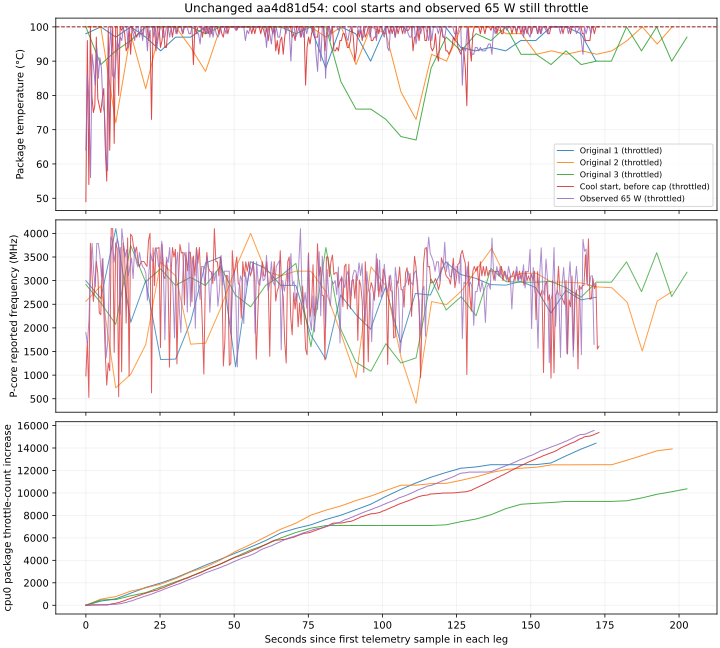
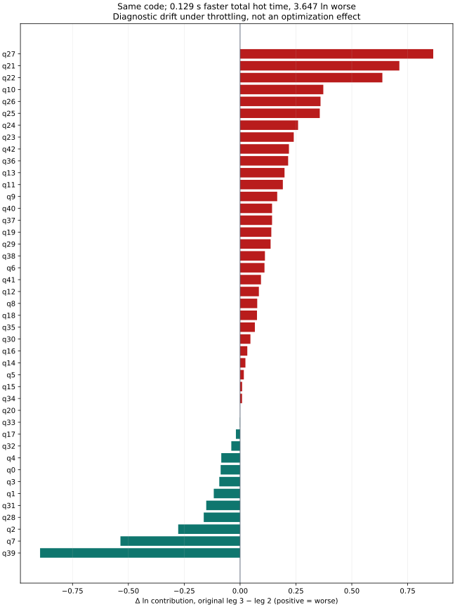

# ClickBench rig thermal findings, 2026-09-08

> **Paused checkpoint:** the captain stopped work via firstmate inbox 007. Later inboxes 005–006 supersede the binary throttle-counter acceptance described below: variance is the criterion, with capped steering separate from uncapped publication. Two full flat-50-W distribution legs completed; the third was interrupted and must not be scored. This intermediate report is retained as historical evidence, not a final verdict. See `PARKED.md` beside the evidence.

The unchanged campaign head cannot yet produce a demonstrated unthrottled reference on this machine. Cooling before a full suite did not prevent throttling within it. A subsequent probe recorded a 65 W sustained setting, despite being queued after a 50 W announcement, and also throttled. **There is no valid 50 W result or calibrated effect-size confidence interval yet.**

This report is an intermediate measurement checkpoint on `fm/sirix-cb-rig-trust-1`, based on `aa4d81d547fb0e2353ede959786d6e8ba442edf2`. No query execution or committed harness source was changed during these measurements. The database and corpora were only read; logs were written in the task worktree.

## What was measured

The original plan prescribed twenty identical three-try legs before any harness change. Firstmate stopped that series for a thermal re-plan after three complete legs. Consequently, the original series provides descriptive observations and thermal evidence, **not** a distribution characterization. Calling it unimodal, bimodal, or stationary would exceed the evidence.

All legs retain the 6 GiB initial / 14 GiB maximum heap, 10 GiB arena, `-XX:-UseJVMCICompiler`, and 5 GiB eager materialization. The running process command lines confirmed those flags. Each query still has exactly three tries; the C6A hot value is `min(try 2, try 3)`. Scores use the existing, unchanged `rank.py` and its committed 2026-09-02 board snapshot.

| Leg | Protocol / interpretation | Suite hot seconds | Sum-ln | Geomean |
|---|---|---:|---:|---:|
| baseline-01 | Original script; throttled | 38.986 | 65.398313 | 4.576301 |
| baseline-02 | Original script; throttled | 42.348 | 66.156179 | 4.657672 |
| baseline-03 | Original script; throttled | 42.219 | 69.802884 | 5.069909 |
| cool-01 | Cool start; throttled | 39.565 | 64.961043 | 4.530000 |
| cool-02 | Power-setting transition; exclude from comparisons | 39.367 | 66.263431 | 4.669304 |
| cap65-01 | Observed 65 W; throttled; not a 50 W test | 38.363 | 67.048402 | 4.755326 |

For the three original legs only:

| Quantity | Mean | Sample SD | Min | Max | Modality |
|---|---:|---:|---:|---:|---|
| Suite hot seconds | 41.184333 | 1.904905 | 38.986000 | 42.348000 | Indeterminate, n=3 |
| Suite sum-ln | 67.119126 | 2.354891 | 65.398313 | 69.802884 | Indeterminate, n=3 |

These standard deviations include changing system conditions. They must not be plugged into a sample-size calculator as a stationary noise estimate. The 20-leg protocol was explicitly cancelled rather than silently reduced to three.

## Thermal evidence and its limits

The original three legs reached 100°C. The first direct-JVM cool-start probe launched at 49°C after three sub-55°C observations, five seconds apart, and still reached 100°C. Its cpu0 package throttle count increased by 15,378 across the process. Cooldown before a leg is therefore insufficient under those conditions.

Firstmate then relayed that the captain had changed the sustained MSR package limit from 200 W to 50 W. The initial separately exposed MMIO limit was 45 W; settings alone do not establish actual package power. The second cool probe overlapped the external change and is retained as a transition run. No exact change timestamp or continuous power-limit trace is available for it.

The next probe was queued as `capped50-01`, but **every JVM-time power-limit observation reads 65,000,000 µW**. Its evidence is exported as `cap65-01`. It reached 100°C and its cpu0 package throttle count increased by 15,604. Counter growth was already 8,415 between the first observed query completion and q27, so this was not merely startup activity. The three cool-gate readings were 53/52/53°C, but a subsequent pre-JVM snapshot was 58°C: the final launch temperature must also be rechecked by the repaired gate. This leg is suspect for both reasons.

Package temperature is sampled from the identified `x86_pkg_temp` sensor. Frequency values are `scaling_cur_freq` observations, split between P and E logical CPUs. They are not effective APERF/MPERF frequencies. Dividing a mixed-core average by the 4.6 GHz single-core maximum cannot establish a speedup or the thermal share of the leaderboard gap. Logical-CPU package counters also overlap and must not be summed as independent thermal events.

For original legs the observer sampled every five seconds. Exact retrospective query boundaries are unavailable. For cool probes, half-second traces and observations when each try resource line was consumed are preserved. The latter are post-query boundaries, not mean temperatures inside a timed query; very short queries can finish before their line is processed.

## Which queries are unstable

| Query | Original hot values (s) | What the evidence supports |
|---|---|---|
| q31 | 2.904 / 3.575 / 3.071 | Wide; the reported 1.500/3.191 split was not reproduced in this original series. A later, differently capped suspect leg reached 1.854 s. |
| q33 | 2.304 / 2.274 / 2.272 | The reported 2.311/4.929 split did not reproduce. There is no basis here to label its distribution bimodal. |
| q39 | 0.246 / 0.389 / 0.153 | Large spread reproduced; too few observations to determine modality or isolate its mechanism. |

Thermal throttling is a confirmed confounder, not a demonstrated explanation for every query swing. Fixed query order confounds identity with position; a raw correlation between query number and runtime is not a valid position-effect test. A stable-power repeated suite, followed by same-query isolated/prefix diagnostics, is still needed to distinguish suite history, JIT compilation, GC, residency and I/O effects.

In particular, q31 in the original first leg had hot CPU/wall values 26.1/2.904 s (9.0 busy cores), versus 24.6/1.854 s (13.3 busy cores) in the suspect 65 W leg. Similar total CPU time with much different wall time does not support simply scaling every query by one clock ratio. GC is recorded per try in the evidence; its two-decimal pause times and lack of phase-specific JIT/I/O traces do not isolate all remaining mechanisms. No query-engine change was attempted.

## Seconds and score diverged on unchanged code

Original leg 3 took **0.129 fewer hot seconds** than leg 2 but scored **3.646705 ln worse**. The largest deteriorations were q27 (+0.864486 ln), q21 (+0.712852), and q22 (+0.636815). q39 improved by 0.895211 ln and q7 by 0.535518, which did not offset the other increases. These are observed run differences, not optimization effects.

## Complete original per-query statistics

All values below are descriptive for the three original legs. Modality is **indeterminate for every query** because the thermal re-plan stopped the series at n=3. The CSV retains that classification on every row.

| q | Mean hot s | Sample SD s | Min s | Max s | Mean ln contribution | Sample SD ln |
|---:|---:|---:|---:|---:|---:|---:|
| 0 | 0.001333 | 0.000577 | 0.001000 | 0.002000 | 0.124314 | 0.050236 |
| 1 | 0.031333 | 0.003215 | 0.029000 | 0.035000 | 1.321806 | 0.076367 |
| 2 | 0.050000 | 0.012124 | 0.037000 | 0.061000 | 1.777402 | 0.210269 |
| 3 | 0.032667 | 0.002082 | 0.031000 | 0.035000 | 1.044585 | 0.048316 |
| 4 | 0.297333 | 0.013317 | 0.286000 | 0.312000 | 1.272966 | 0.043028 |
| 5 | 0.682667 | 0.039145 | 0.638000 | 0.711000 | 2.085114 | 0.057403 |
| 6 | 0.018333 | 0.002082 | 0.016000 | 0.020000 | 1.039611 | 0.074779 |
| 7 | 0.044333 | 0.038760 | 0.014000 | 0.088000 | 1.186474 | 0.710107 |
| 8 | 0.651000 | 0.039281 | 0.617000 | 0.694000 | 1.356791 | 0.058926 |
| 9 | 0.775333 | 0.098875 | 0.693000 | 0.885000 | 1.192895 | 0.123547 |
| 10 | 0.324667 | 0.101658 | 0.239000 | 0.437000 | 2.228022 | 0.296168 |
| 11 | 0.261667 | 0.033382 | 0.239000 | 0.300000 | 1.962148 | 0.119313 |
| 12 | 0.778000 | 0.049790 | 0.736000 | 0.833000 | 1.526522 | 0.062544 |
| 13 | 2.739000 | 0.428039 | 2.376000 | 3.211000 | 2.145927 | 0.152667 |
| 14 | 0.988667 | 0.017474 | 0.974000 | 1.008000 | 1.643629 | 0.017442 |
| 15 | 0.426000 | 0.005568 | 0.420000 | 0.431000 | 1.008684 | 0.012792 |
| 16 | 2.097333 | 0.034078 | 2.062000 | 2.130000 | 2.339885 | 0.016188 |
| 17 | 0.044667 | 0.002082 | 0.043000 | 0.047000 | 1.698191 | 0.037786 |
| 18 | 4.120333 | 0.189690 | 4.000000 | 4.339000 | 1.573151 | 0.045358 |
| 19 | 0.011667 | 0.001528 | 0.010000 | 0.013000 | 0.771505 | 0.071407 |
| 20 | 0.027333 | 0.002887 | 0.024000 | 0.029000 | -0.616279 | 0.079213 |
| 21 | 0.261667 | 0.119810 | 0.191000 | 0.400000 | 1.990513 | 0.407356 |
| 22 | 0.445667 | 0.188431 | 0.328000 | 0.663000 | 2.635920 | 0.383521 |
| 23 | 0.149667 | 0.028989 | 0.126000 | 0.182000 | 1.536116 | 0.176807 |
| 24 | 0.019333 | 0.004933 | 0.016000 | 0.025000 | 1.067175 | 0.161828 |
| 25 | 0.107333 | 0.028572 | 0.087000 | 0.140000 | 2.443850 | 0.232209 |
| 26 | 0.025000 | 0.007000 | 0.020000 | 0.033000 | 1.240126 | 0.191949 |
| 27 | 0.289333 | 0.164263 | 0.193000 | 0.479000 | 1.067853 | 0.503400 |
| 28 | 9.259000 | 0.928162 | 8.671000 | 10.329000 | 1.955710 | 0.097598 |
| 29 | 0.032667 | 0.003786 | 0.030000 | 0.037000 | 1.042816 | 0.086862 |
| 30 | 0.526000 | 0.014731 | 0.517000 | 0.543000 | 1.740590 | 0.027273 |
| 31 | 3.183333 | 0.349320 | 2.904000 | 3.575000 | 3.130461 | 0.107241 |
| 32 | 6.994333 | 0.188683 | 6.847000 | 7.207000 | 3.001842 | 0.026779 |
| 33 | 2.283333 | 0.017926 | 2.272000 | 2.304000 | 2.150493 | 0.007799 |
| 34 | 2.245333 | 0.048952 | 2.190000 | 2.283000 | 2.133646 | 0.021820 |
| 35 | 0.422667 | 0.017673 | 0.411000 | 0.443000 | 1.179070 | 0.040403 |
| 36 | 0.070333 | 0.011015 | 0.063000 | 0.083000 | 1.384450 | 0.132687 |
| 37 | 0.044667 | 0.004619 | 0.042000 | 0.050000 | 1.290894 | 0.082619 |
| 38 | 0.041000 | 0.006000 | 0.035000 | 0.047000 | 1.362230 | 0.118263 |
| 39 | 0.262667 | 0.118879 | 0.153000 | 0.389000 | 2.108642 | 0.447611 |
| 40 | 0.033000 | 0.003464 | 0.029000 | 0.035000 | 1.274056 | 0.082619 |
| 41 | 0.043667 | 0.002517 | 0.041000 | 0.046000 | 1.417104 | 0.047147 |
| 42 | 0.040667 | 0.005508 | 0.035000 | 0.046000 | 1.282223 | 0.109725 |

## What remains unresolved

The original 63.442 ln standing and the current observations were not measured under a proven common thermal regime. No fraction of the 11.452 ln gap to the target can honestly be assigned exclusively to thermals yet. The 49°C-start leg scored 64.961043 ln and still throttled; it is not an unthrottled reference. A lower stable power cap may increase absolute times while making comparisons more reliable. That must not be described as a query-engine regression.

The next measurement requires an agreed power setting that is checked immediately before launch and throughout a full suite, plus flat thermal-throttle counters. A fresh repeated baseline and repeated randomized paired comparisons can then estimate whole-suite ln differences, confidence intervals and required repetitions. Query covariance must be preserved by treating complete paired legs as the replication unit. The current samples cannot supply a defensible confidence interval or required pair count.

The measurement command, common process-owned lock for all 100M entry points, uncertainty report, and validation are still outstanding. This is a findings checkpoint, not task completion.

[Raw logs, timing exports, telemetry and provenance](../bundles/sirix-query/bench/clickbench/rig/evidence/thermal-20260908/README.md) are committed alongside this report. The archived copy of the parked working directory was discarded from the deliverable; it captured the pre-cap power regime and cannot be recaptured ([retention](../bundles/sirix-query/bench/clickbench/rig/evidence/RETENTION.md)). The initial background observer and protocol-experiment scripts remain in the task worktree under `bundles/sirix-query/build/diagnostics/rig-trust/`.
