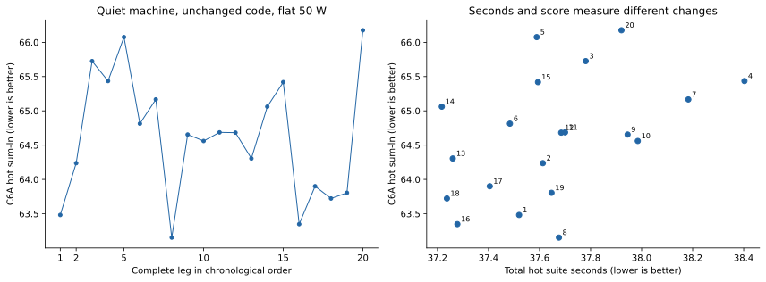
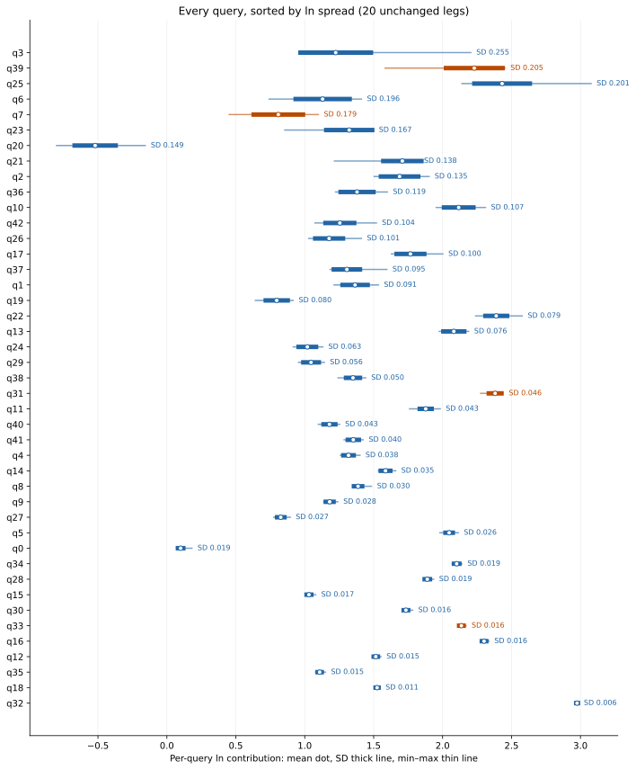
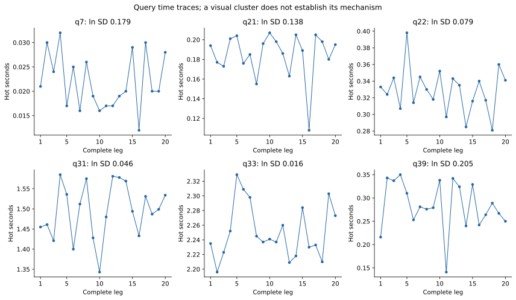

# ClickBench fixed-50-W variance study, 2026-09-08

Twenty unchanged full legs on the quiet machine at verified PL1=PL2=50 W span **63.152–66.175 sum-ln**, a **3.023 ln spread**. The three earlier pre-cap legs spanned 65.398–69.803, or 4.405 ln. These unequal sample sizes and different sessions do not establish a causal cap effect.

Ten chronological adjacent A-A pairs give an observed difference of **+0.203 ± 0.966 ln** (nominal two-sided 95% paired t interval). This is null-run/order noise, not a code improvement. The estimated 80%-power detectable effect at ten pairs is **1.345 ln**. **The 0.5 ln target is unresolved at this repetition count.**

> **These legs did not share one power envelope.** PL1=PL2=50 W refers to the MSR limits, which were
> verified throughout. The [per-leg power audit](../bundles/sirix-query/bench/clickbench/rig/evidence/power-audit-20260908/README.md)
> shows 16 of these 20 legs also sampled a *platform-managed MMIO* long-term limit below 50 W, and the
> package is bounded by the lower of the two. So the **3.023 ln spread** and the **1.345 ln MDE80**
> describe this cohort as it was actually measured, under differing sampled limits — they are not
> demonstrated precision under a uniform effective 50 W envelope, and every figure below inherits
> that qualification.
>
> **Open hypothesis, owned by a separate Firstmate task.** A firmware-managed envelope moving between
> 45 W and 76 W during a leg would slow or speed the whole leg together, which is the shape of the
> cross-query covariance that GC, thread placement and JIT each failed to account for (see the
> [attribution report](CLICKBENCH_RIG_VARIANCE_ATTRIBUTION_2026-09-08.md)). If that is a contributor,
> the achievable resolution under a genuinely pinned envelope could be better than 1.345 ln. This is a
> hypothesis and nothing here tests it: no causal attribution is established, the other mechanisms are
> not conclusively eliminated, and no improved resolution is claimed. Do not investigate it from this
> report — it is filed as its own task.

Planning from the observed pair SD (1.350 ln) suggests **60 pairs** for a 0.5 ln effect at two-sided alpha=0.05 and 80% power. Using a one-sided 95% upper normal-model bound on that SD instead suggests 157 pairs. These are provisional model-based estimates, not a demonstrated resolution or a promise that longer runs will be stationary.

## Protocol and provenance

The measured code and original serving JVM command are from `aa4d81d547fb0e2353ede959786d6e8ba442edf2`. The checkout was the evidence-only checkpoint `f7c7f991c`. Firstmate inbox 008 established the quiet-machine cutoff at 2026-09-08 07:57:48 UTC; both other lanes stood down completely. No query execution or committed harness source was changed before this series completed. Runtime artifact hashes and the original source-file hashes are preserved with the evidence.

Each leg starts a fresh JVM and runs all 43 queries exactly three times. The envelope remains `-Xms6g -Xmx14g`, a 10 GiB arena, `-XX:-UseJVMCICompiler`, and `-Dsirix.projection.eagerMaterializeBytes=5368709120`. The existing C6A score is unchanged: `min(try 2, try 3)`, `ln((0.01 + ours)/(0.01 + board best))` per query, and `exp(sum-ln/43)`. Every exported score was checked against the original `rank.py` and its unchanged board snapshot.

The preserved cooldown controller waits for three package-temperature readings below 55°C, five seconds apart, and rechecks immediately before launch. It holds the shared OS lock, samples sensors every 0.5 seconds and at query-resource lines, and records both power limits. Every complete leg is retained irrespective of score or throttle activity. Throttle counts are observations, not acceptance gates. No power setting was changed by this worker.

All twenty `quiet50-01` through `quiet50-20` legs start after the quiet cutoff. Adjacent null pairs are 01/02, …, 19/20. Earlier `flat50-01`, `flat50-02`, and `flat50-04` through `flat50-12` measured varying background load and are retained separately; `flat50-13` crosses the cutoff and is a transition observation. The captain-interrupted `flat50-03` remains unscorable. No background-exposed or transition leg enters the quiet variance estimate.

## Suite distribution

| Measure | n | Mean | Sample SD | Min | Max | Spread | Modality |
|---|---:|---:|---:|---:|---:|---:|---|
| Hot suite seconds | 20 | 37.656150 | 0.316714 | 37.217000 | 38.403000 | 1.186000 | not rejected; not proof |
| C6A hot sum-ln | 20 | 64.620426 | 0.885711 | 63.152371 | 66.175146 | 3.022775 | not rejected; not proof |

## Per-leg evidence

| Leg | Hot seconds | Sum-ln | Geomean | Peak °C | cpu0 core throttle delta | cpu0 package throttle delta |
|---|---:|---:|---:|---:|---:|---:|
| quiet50-01 | 37.520 | 63.481836 | 4.376817 | 100 | 412 | 4822 |
| quiet50-02 | 37.613 | 64.237795 | 4.454444 | 100 | 666 | 5739 |
| quiet50-03 | 37.781 | 65.725268 | 4.611230 | 100 | 424 | 5688 |
| quiet50-04 | 38.403 | 65.435050 | 4.580212 | 100 | 526 | 5504 |
| quiet50-05 | 37.589 | 66.075470 | 4.648938 | 100 | 491 | 7600 |
| quiet50-06 | 37.484 | 64.813405 | 4.514473 | 100 | 450 | 5666 |
| quiet50-07 | 38.183 | 65.166580 | 4.551705 | 100 | 423 | 6067 |
| quiet50-08 | 37.676 | 63.152371 | 4.343410 | 100 | 490 | 6281 |
| quiet50-09 | 37.945 | 64.654676 | 4.497839 | 100 | 417 | 6053 |
| quiet50-10 | 37.985 | 64.560782 | 4.488029 | 100 | 433 | 8245 |
| quiet50-11 | 37.700 | 64.686448 | 4.501164 | 100 | 586 | 8829 |
| quiet50-12 | 37.685 | 64.682395 | 4.500740 | 100 | 494 | 8770 |
| quiet50-13 | 37.260 | 64.305267 | 4.461439 | 100 | 369 | 5777 |
| quiet50-14 | 37.217 | 65.061219 | 4.540566 | 100 | 311 | 4778 |
| quiet50-15 | 37.594 | 65.418976 | 4.578500 | 100 | 281 | 4495 |
| quiet50-16 | 37.278 | 63.347967 | 4.363212 | 100 | 291 | 5252 |
| quiet50-17 | 37.405 | 63.900565 | 4.419646 | 100 | 376 | 6007 |
| quiet50-18 | 37.237 | 63.722454 | 4.401377 | 100 | 502 | 5995 |
| quiet50-19 | 37.647 | 63.804843 | 4.409819 | 100 | 395 | 5929 |
| quiet50-20 | 37.921 | 66.175146 | 4.659727 | 100 | 304 | 6566 |

## Query spread and modality

The table gives every query, sorted by SD of its ln contribution. Hot-time modality uses Hartigan’s dip test; raw p-values and Holm-adjusted values across 43 queries plus the two suite measures are in the CSV. Failure to reject unimodality at n=20 is not proof of one mode, and a cluster across sessions does not by itself identify a mechanism. Existing timings are rounded to milliseconds: ties and apparent clusters in very short queries can reflect quantization, so the continuous-distribution dip test is a screening aid rather than an execution-mode diagnosis.

| q | Mean hot s | SD s | Min s | Max s | Mean ln | SD ln | ln range | Modality |
|---:|---:|---:|---:|---:|---:|---:|---:|---|
| 3 | 0.043150 | 0.020345 | 0.033000 | 0.126000 | 1.224711 | 0.255326 | 1.151455 | not rejected; not proof |
| 39 | 0.283550 | 0.052778 | 0.141000 | 0.350000 | 2.229916 | 0.205125 | 0.868824 | not rejected; not proof |
| 25 | 0.106250 | 0.027988 | 0.075000 | 0.207000 | 2.431667 | 0.201260 | 0.937246 | not rejected; not proof |
| 6 | 0.021500 | 0.005862 | 0.011000 | 0.031000 | 1.129819 | 0.195817 | 0.669050 | not rejected; not proof |
| 7 | 0.021900 | 0.005711 | 0.012000 | 0.032000 | 0.808379 | 0.178766 | 0.646627 | not rejected; not proof |
| 23 | 0.119150 | 0.018698 | 0.070000 | 0.142000 | 1.322652 | 0.166578 | 0.641854 | not rejected; not proof |
| 20 | 0.031450 | 0.006345 | 0.021000 | 0.049000 | -0.520279 | 0.148682 | 0.643550 | not rejected; not proof |
| 21 | 0.184750 | 0.023151 | 0.108000 | 0.207000 | 1.708192 | 0.138248 | 0.609213 | not rejected; not proof |
| 2 | 0.044550 | 0.007480 | 0.035000 | 0.057000 | 1.687779 | 0.135117 | 0.398030 | not rejected; not proof |
| 36 | 0.070000 | 0.009712 | 0.058000 | 0.089000 | 1.379474 | 0.119036 | 0.375612 | not rejected; not proof |
| 10 | 0.282200 | 0.031345 | 0.237000 | 0.343000 | 2.116676 | 0.106576 | 0.357080 | not rejected; not proof |
| 42 | 0.039350 | 0.005314 | 0.031000 | 0.054000 | 1.254626 | 0.104086 | 0.445311 | not rejected; not proof |
| 26 | 0.022600 | 0.003409 | 0.018000 | 0.031000 | 1.176804 | 0.100540 | 0.381368 | not rejected; not proof |
| 17 | 0.048800 | 0.006118 | 0.041000 | 0.064000 | 1.766667 | 0.100260 | 0.372239 | not rejected; not proof |
| 37 | 0.045600 | 0.005651 | 0.039000 | 0.064000 | 1.305672 | 0.094765 | 0.412245 | not rejected; not proof |
| 1 | 0.033250 | 0.003932 | 0.027000 | 0.041000 | 1.365177 | 0.090924 | 0.320908 | not rejected; not proof |
| 19 | 0.012250 | 0.001743 | 0.009000 | 0.015000 | 0.796779 | 0.079629 | 0.274437 | not rejected; not proof |
| 22 | 0.329000 | 0.026831 | 0.281000 | 0.398000 | 2.389065 | 0.078672 | 0.337944 | not rejected; not proof |
| 13 | 2.553900 | 0.195339 | 2.290000 | 2.837000 | 2.081363 | 0.075625 | 0.213357 | not rejected; not proof |
| 24 | 0.017750 | 0.001773 | 0.015000 | 0.021000 | 1.018739 | 0.063216 | 0.215111 | not rejected; not proof |
| 29 | 0.032750 | 0.002425 | 0.029000 | 0.037000 | 1.045808 | 0.056245 | 0.186586 | not rejected; not proof |
| 38 | 0.040200 | 0.002505 | 0.035000 | 0.045000 | 1.349872 | 0.050269 | 0.200671 | not rejected; not proof |
| 31 | 1.495100 | 0.068074 | 1.343000 | 1.585000 | 2.381155 | 0.045729 | 0.164549 | not rejected; not proof |
| 11 | 0.238650 | 0.010629 | 0.211000 | 0.266000 | 1.877585 | 0.043028 | 0.222238 | not rejected; not proof |
| 40 | 0.029050 | 0.001669 | 0.026000 | 0.032000 | 1.179069 | 0.042705 | 0.154151 | not rejected; not proof |
| 41 | 0.040300 | 0.002029 | 0.037000 | 0.044000 | 1.352287 | 0.040188 | 0.138836 | not rejected; not proof |
| 4 | 0.311350 | 0.012201 | 0.293000 | 0.339000 | 1.317508 | 0.037575 | 0.141339 | not rejected; not proof |
| 14 | 0.933100 | 0.033109 | 0.885000 | 1.005000 | 1.585905 | 0.034747 | 0.125820 | not rejected; not proof |
| 8 | 0.670600 | 0.021035 | 0.652000 | 0.740000 | 1.386742 | 0.029910 | 0.124808 | not rejected; not proof |
| 9 | 0.762150 | 0.022132 | 0.729000 | 0.809000 | 1.180734 | 0.028331 | 0.102786 | not rejected; not proof |
| 27 | 0.204800 | 0.005800 | 0.194000 | 0.220000 | 0.826071 | 0.026751 | 0.119959 | not rejected; not proof |
| 5 | 0.656550 | 0.017608 | 0.613000 | 0.702000 | 2.047437 | 0.026398 | 0.133531 | not rejected; not proof |
| 0 | 0.001050 | 0.000224 | 0.001000 | 0.002000 | 0.099661 | 0.019456 | 0.087011 | not rejected; not proof |
| 34 | 2.175500 | 0.042593 | 2.105000 | 2.260000 | 2.102172 | 0.019416 | 0.070725 | not rejected; not proof |
| 28 | 8.633900 | 0.166561 | 8.428000 | 9.034000 | 1.888945 | 0.019102 | 0.069356 | not rejected; not proof |
| 15 | 0.435650 | 0.007734 | 0.428000 | 0.458000 | 1.030489 | 0.017118 | 0.066249 | not rejected; not proof |
| 30 | 0.522400 | 0.008768 | 0.510000 | 0.549000 | 1.733973 | 0.016293 | 0.072321 | not rejected; not proof |
| 33 | 2.251100 | 0.036927 | 2.196000 | 2.329000 | 2.136232 | 0.016257 | 0.058543 | not rejected; not proof |
| 16 | 2.016500 | 0.032753 | 1.975000 | 2.088000 | 2.300736 | 0.016090 | 0.055366 | not rejected; not proof |
| 12 | 0.768500 | 0.011936 | 0.749000 | 0.798000 | 1.515594 | 0.015299 | 0.062560 | not rejected; not proof |
| 35 | 0.392950 | 0.006091 | 0.381000 | 0.410000 | 1.108356 | 0.015019 | 0.071547 | not rejected; not proof |
| 18 | 3.922850 | 0.042457 | 3.854000 | 4.008000 | 1.524794 | 0.010767 | 0.039081 | not rejected; not proof |
| 32 | 6.810200 | 0.041923 | 6.713000 | 6.873000 | 2.975424 | 0.006165 | 0.023520 | not rejected; not proof |

## Interpretation limits and next measurement

This study calibrates unchanged-run noise under a verified 50 W MSR cap whose effective envelope was
not uniform across legs: 16 of the 20 legs also sampled a platform-managed MMIO limit below that cap,
as the caveat above records. Its adjacent pairs were not randomized candidate comparisons. A candidate needs a prespecified, balanced AB/BA paired series, with complete paired legs as the replication unit so query covariance is preserved. Repeatedly extending a run until its interval excludes zero would invalidate an ordinary fixed-sample confidence interval.

The score and time traces, full per-try CPU/GC data, and sequence correlations are retained. Sensor snapshots do not measure effective APERF/MPERF frequency; per-query boundary temperatures are observations after the resource line arrives, not time-averaged in-query temperatures. Throttle counters on different logical CPUs overlap and must not be summed.

The baseline observer did not record precise per-try I/O, compilation, or residency decisions. Zero reported GC pause time rules out recorded stop-the-world pauses as the complete explanation for some swings; it does not rule out collector-dependent budgeting, compilation activity, memory stalls, or scheduling. Follow-up diagnostic runs must isolate those mechanisms without modifying query execution.

This series is named for the 50 W MSR cap that was verified throughout, but it was not one power
regime. The [per-leg power audit](../bundles/sirix-query/bench/clickbench/rig/evidence/power-audit-20260908/README.md)
finds 16 of these 20 legs sampled an MMIO long-term limit below that MSR cap — four at 45 W for every
sample, while three others held 52.625 W throughout — and the package is bounded by the lower of the
two. Every number in this report stands as measured; what cannot be claimed is that the legs shared
an envelope, so part of the spread reported here may be regime difference rather than noise.

A capped effect does not establish either the size or the sign of an uncapped effect. No controlled candidate comparison in both regimes has been measured here, and the resumption instruction forbids changing the cap. Capped steering and uncapped publication remain separately labeled.

[Complete machine-readable study and provenance](../bundles/sirix-query/bench/clickbench/rig/evidence/quiet50-20260908/README.md). Every reported statistic is retained in `summary.json`; the raw-log archive and its analysis scripts were discarded from the deliverable and cannot be regenerated, so the study cannot be recomputed from raw logs ([retention](../bundles/sirix-query/bench/clickbench/rig/evidence/RETENTION.md)).

Statistical methods use the [SciPy paired t-test definition](https://docs.scipy.org/doc/scipy/reference/generated/scipy.stats.ttest_rel.html), [noncentral-t power planning](https://www.statsmodels.org/stable/generated/statsmodels.stats.power.TTestPower.solve_power.html), and [Hartigan dip test implementation](https://github.com/RUrlus/diptest).
