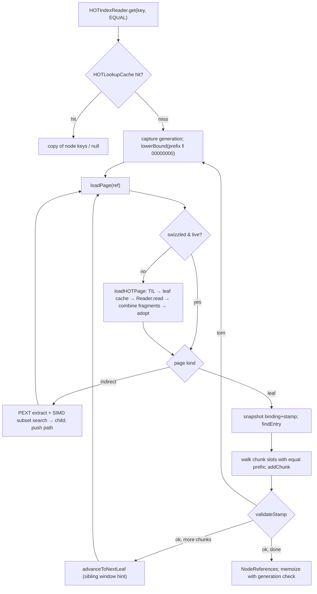

# HOT Index Specification

Status: **specification of the code on `main` after PR
[#1214](https://github.com/sirixdb/sirix/pull/1214)** (merged 2026-09-19). First written 2026-09-17
against commit `739e46288` and revised 2026-09-20 against the merged tree, by reading the code only;
nothing in this document was verified by running code. Where a statement could only be settled by
execution it says so.

PR #1214 is a projection-index and read-path change; it touches HOT in three places, each noted where
it belongs: a range cursor's `close()` now ends its reader's walk and so releases a guarded leaf
(§4.9.4), the batched `Reader.read(PageReference[])` contract now releases the pages a failed batch
already decoded (§4.1.1), and `Writer#supportsUncommittedWrites()` splits the pre-commit page-write
capability from reclaimability, which is what lets a projection bulk load spill its pinned HOT trie
pages on memory-mapped storage
([SEGMENT_PROJECTION_INDEXES.md §8.6](SEGMENT_PROJECTION_INDEXES.md)).

This document is for an engineer who has to understand, verify or reimplement SirixDB's Height
Optimized Trie (HOT) indexes. Normative sections (formats, invariants, algorithms, defaults) cite
the code as `alias/File.java:line`. Descriptive sections say what the older design documents
establish and which of them are stale. Where the code and a comment or document disagree, the
code is taken as the truth and the disagreement is listed in §8.

The companion document [SEGMENT_PROJECTION_INDEXES.md](SEGMENT_PROJECTION_INDEXES.md) specifies
the projection indexes, which store their pages in a HOT tree, and the I/O layer both share.

## Contents

0. [Conventions](#0-conventions)
1. [Purpose and scope](#1-purpose-and-scope)
2. [Key model](#2-key-model)
3. [Node and page formats](#3-node-and-page-formats)
4. [Algorithms](#4-algorithms)
5. [Correctness arguments and their status](#5-correctness-arguments-and-their-status)
6. [Configuration and diagnostics](#6-configuration-and-diagnostics)
7. [Known limits and open questions](#7-known-limits-and-open-questions)
8. [Existing documents: coverage and staleness](#8-existing-documents-coverage-and-staleness)

---

## 0. Conventions

### 0.1 Path aliases

All paths are relative to the repository root.

| Alias | Path |
|---|---|
| `hot/` | `bundles/sirix-core/src/main/java/io/sirix/index/hot/` |
| `page/` | `bundles/sirix-core/src/main/java/io/sirix/page/` |
| `trx/` | `bundles/sirix-core/src/main/java/io/sirix/access/trx/page/` |
| `cache/` | `bundles/sirix-core/src/main/java/io/sirix/cache/` |
| `io/` | `bundles/sirix-core/src/main/java/io/sirix/io/` |
| `idx/` | `bundles/sirix-core/src/main/java/io/sirix/index/` |
| `set/` | `bundles/sirix-core/src/main/java/io/sirix/settings/` |
| `proj/` | `bundles/sirix-core/src/main/java/io/sirix/index/projection/` |
| `test/` | `bundles/sirix-core/src/test/java/io/sirix/` |

Short class names used without an alias: `AbstractHOTIndexWriter` = `hot/AbstractHOTIndexWriter.java`,
`HOTIncrementalInsert` = `hot/HOTIncrementalInsert.java`, `HOTBulkBuilder` = `hot/HOTBulkBuilder.java`,
`HOTTrieReader` = `trx/HOTTrieReader.java`, `HOTRangeCursor` = `trx/HOTRangeCursor.java`,
`HOTLeafPage` = `page/HOTLeafPage.java`, `HOTIndirectPage` = `page/HOTIndirectPage.java`,
`PageKind` = `page/PageKind.java`, `VersioningType` = `set/VersioningType.java`,
`NodeStorageEngineReader` = `trx/NodeStorageEngineReader.java`,
`NodeStorageEngineWriter` = `trx/NodeStorageEngineWriter.java`.

### 0.2 Bits, bytes and order

- **Key order** is unsigned lexicographic byte order: `Arrays.compareUnsigned`, so a strict prefix
  sorts before any extension of it (`hot/HOTKeySerializer.java:129-131`).
- **Absolute bit index** = `byteIndex * 8 + bitInByte`, where bit 0 is the most significant bit of
  byte 0 (`hot/DiscriminativeBitComputer.java:82`, `:296`, `:457-469`). "MSB-first" below means
  "smaller absolute index first".
- **Key words** used for partial-key extraction are loaded **big-endian**: key byte `p` lands in
  long bits 56-63 (`page/HOTIndirectPage.java:800-829`, `page/HOTLeafPage.java:770-778`). Several
  field comments say "LE" for these masks; they are wrong (§8.3).
- **On-disk integers** of page bodies are little-endian, like every `BytesOut` integer in the V0
  format (`docs/DISK_FORMAT.md:144-160`). "varlong" is the stop-bit encoding: 7 data bits per byte,
  least significant group first, `0x80` = continuation (`bundles/sirix-core/src/main/java/io/sirix/node/MemorySegmentBytesOut.java:164-172`).
- **Key vs. entry vs. slot.** A *key* is the byte string stored in a leaf. An *entry* is one key and
  its value inside a `HOTLeafPage`. *Slot* is used by the projection storage for the logical unit it
  stores under one key.

### 0.3 Normative language

"Must" and "invariant" describe properties the code enforces or relies on, with the enforcing line
cited. "Asserted" means a comment or Javadoc claims the property but no check or test was found.

---

## 1. Purpose and scope

### 1.1 What HOT is used for

HOT is the only ordered secondary-index structure of `sirix-core`. No red-black tree
classes remain in `src/main`; `NodeReferences` and `CASValue` still live in the legacy package name
`io.sirix.index.redblacktree.keyvalue` (`hot/AbstractHOTIndexWriter.java:36`), and `IndexDef` has no
backend selector.

| Index type | Writer | Reader | Logical key | Value | Wiring |
|---|---|---|---|---|---|
| PATH | `HOTLongIndexWriter` (PATH only, `hot/HOTLongIndexWriter.java:62`, `:95`) | `HOTLongIndexReader` | path class reference (PCR), `long` | posting list of node keys | `idx/path/PathIndexListenerFactory.java:24`, `idx/path/PathIndexBuilderFactory.java:24` |
| CAS (content-and-structure, "value index") | `HOTIndexWriter<CASValue>` + `CASKeySerializer` | `HOTIndexReader<CASValue>` | (PCR, typed atomic value) | posting list | `idx/cas/CASIndexListenerFactory.java:27`, `idx/cas/CASIndexBuilderFactory.java:27` |
| NAME | `HOTIndexWriter<QNm>` + `NameKeySerializer` | `HOTIndexReader<QNm>` | qualified name | posting list | `idx/name/NameIndexListenerFactory.java:25`, `idx/name/NameIndexBuilderFactory.java:25` |
| VALIDTIME | `HOTIndexWriter<ValidTimeKey>` + `ValidTimeKeySerializer` | `HOTIndexReader<ValidTimeKey>` | (store, fork node, endpoint) of an RI-tree | posting list | `idx/interval/ValidTimeIntervalIndexFactory.java:48-53`, `idx/interval/HotOrderedStore.java:66-97` |
| PROJECTION | `ProjectionIndexHOTStorage extends AbstractHOTIndexWriter<Long>` (`proj/ProjectionIndexHOTStorage.java:100`) | same class, via `HOTTrieReader` | 8-byte slot key | opaque bytes, last writer wins, zero length = tombstone | `proj/ProjectionIndexBuilder.java:942` |

**DeweyIDs are not stored in HOT.** `DeweyIDPage` builds a keyed trie
(`page/DeweyIDPage.java:105`, `PageUtils.createKeyedTrie(..., IndexType.DEWEYID_TO_RECORDID, ...)`),
and no DeweyID `HOTKeySerializer` exists in `src/main`. `docs/DEWEYID_HOT_INDEX_FORMAL_PROOF.md`
describes a proposal (§5.1). The page-key allocator and the root slot of `AbstractHOTIndexWriter`
accept only PATH, CAS, NAME, PROJECTION and VALIDTIME (`hot/AbstractHOTIndexWriter.java:710-726`,
`:787-817`); any other type throws.

### 1.2 Where a HOT tree lives in the storage engine

SirixDB stores every revision as a copy-on-write tree of pages reachable from a
`RevisionRootPage`. A HOT tree is one more subtree of that page tree.

```
RevisionRootPage (one per revision)
 ├─ ref[4]  NamePage        ─┐
 ├─ ref[5]  CASPage          │  "index container pages": a reference delegate with up to
 ├─ ref[6]  PathPage         │  INP_REFERENCE_COUNT (1024) slots, one slot per index number,
 ├─ ref[7]  DeweyIDPage      │  plus the per-index HOT page-key high-water mark
 ├─ ref[9]  ProjectionIndexPage
 └─ ref[10] ValidTimeIndexPage ┘
                 │ slot[indexNumber]  (PageReference: disk offset key + fragment list)
                 ▼
            HOT root  ── HOTIndirectPage (height h) ── ... ── HOTIndirectPage (height 1)
                                                                   │ up to 32 children
                                                                   ▼
                                                              HOTLeafPage (≤ 512 entries)
                                                                   │ PageReference of a leaf
                                                                   ▼
                                                       newest image + older fragments (§3.5)
```

- Reference offsets in the revision root: NAME 4, CAS 5, PATH 6, DEWEYID 7, VECTOR 8,
  PROJECTION 9, VALIDTIME 10 (`page/RevisionRootPage.java:77-107`). DEWEYID (7) is the keyed trie
  mentioned above.
- Each occupied slot of `CASPage`/`PathPage`/`NamePage`/`ProjectionIndexPage`/`ValidTimeIndexPage`
  roots one HOT tree. The container also persists, per index number, the largest HOT page key it has
  issued (`Int2LongMap maxHotPageKeys`, `page/CASPage.java:47-70`), serialized as
  `[i32 size][size × (i32 index, i64 max)]` with strictly increasing index `< 1024` and non-negative
  max (`page/PageKind.java:6313-6346`, `:6356-6383`).
- A new tree is a single empty `HOTLeafPage` with page key `ROOT_PAGE_KEY = 0` placed in the
  transaction intent log (`page/PageUtils.java:114-130`). The root becomes an indirect page on the
  first split (§4.5.3).
- **Two key spaces.** A HOT page header carries a *logical page key* issued by the per-index
  allocator (`hot/AbstractHOTIndexWriter.java:710-726`; rationale `:944-951`). The `PageReference`
  that points at the page carries the *disk key*, a byte offset into `sirix.data`
  (`docs/DISK_FORMAT.md:47`). They are unrelated numbers.
- **Page references and fragments.** A `PageReference` holds the disk key of the newest physical
  image of a page and, for versioned pages, an ordered list of older fragment keys
  `(revision, key)` (`page/PageFragmentKeyImpl.java:11`). §3.5 specifies how a HOT leaf is rebuilt
  from them.
- **Versioning types.** The resource's `VersioningType` (FULL, DIFFERENTIAL, INCREMENTAL,
  SLIDING_SNAPSHOT; default SLIDING_SNAPSHOT with `maxNumberOfRevisionsToRestore = 3`,
  `bundles/sirix-core/src/main/java/io/sirix/access/ResourceConfiguration.java:182`, `:199`) applies
  to HOT leaves exactly as to record pages. HOT indirect pages are never versioned: every revision
  that changes one writes a complete copy.
- **Writers** stage every page they change in the `TransactionIntentLog` (TIL) as a
  `PageContainer(complete, modified)` pair; commit serializes the modified pages bottom-up and gives
  them new disk keys (§4.9.2).
- **Caches.** Leaves (combined images) and leaf fragments live in two global `ShardedPageCache`s;
  indirect pages are retained only by being attached ("swizzled") to their parent's
  `PageReference` (§4.1). Point-lookup answers are memoized in the JVM-global `HOTLookupCache`
  (§4.2.3).

### 1.3 How this HOT differs from Binna's HOT

The design follows Binna et al., "HOT: A Height Optimized Trie Index for Main-Memory Database
Systems" (SIGMOD 2018), and ports `HOTSingleThreaded.hpp` routines (for example
`trx/HOTTrieReader.java:409-449`). The differences that matter for reimplementation:

- **Multi-entry, page-sized leaves.** A Binna leaf holds one tuple identifier. A SirixDB leaf holds
  up to 512 sorted entries in a 64 KiB frame (`page/HOTLeafPage.java:116`, `:165`), so every search
  ends with an in-leaf search, and the leaf-split bit is computed over many keys.
  `docs/HOT_PAPER_IMPOSSIBILITY.md` is the long argument about what this costs.
- **No sibling pointers.** Range scans keep a parent stack; sibling pointers would force a
  copy-on-write cascade over all siblings (`trx/HOTRangeCursor.java:44-48`).
- **Chunked posting lists.** A logical posting list is split across keys `logicalKey ‖ chunkIdx`
  (§2.2), so one hot key never produces a value larger than a leaf.
- **Versioned leaves.** A leaf's state for a revision is the combination of fragments (§3.5).
- **Partial keys at most 32 bits wide** (§2.6.3).
- **Fail-closed structural validation instead of repair** (§4.8).

---

## 2. Key model

### 2.1 Serializer contracts

`HOTKeySerializer<K>` (object keys) and `HOTLongKeySerializer` (primitive long keys) are the two
serializer interfaces.

| Member | Contract | Cite |
|---|---|---|
| Order preservation (object keys) | "∀ a, b: a.compareTo(b) < 0 ⟺ compare(serialize(a), serialize(b)) < 0" | `hot/HOTKeySerializer.java:43-50` |
| Order preservation (long keys) | signed long order must equal unsigned byte order ("typically requires XORing the sign bit") | `hot/HOTLongKeySerializer.java:42-50` |
| `serialize(K, byte[], int)` | writes at an offset, returns the length; throws `IllegalArgumentException` for null or an empty serialization | `hot/HOTKeySerializer.java:63-78` |
| `maxSerializedLength(K)` | an upper bound computed *before* serializing; "Deliberately not defaulted" | `hot/HOTKeySerializer.java:80-98` |
| `compare` default | `Arrays.compareUnsigned` | `hot/HOTKeySerializer.java:129-131` |
| `SERIALIZED_SIZE` / `CHUNKED_SERIALIZED_SIZE` (long keys) | 8 / 12 | `hot/HOTLongKeySerializer.java:65`, `:131` |

The object-key contract is violated on purpose in the cases listed in §2.4; readers that depend on
exact order compensate for them.

### 2.2 Composite keys and posting payloads

Every posting-list index (PATH, CAS, NAME, VALIDTIME) stores a logical posting list as a sequence of
**chunks**:

```
stored key   = serialize(logicalKey) ‖ chunkIdx          (chunkIdx: u32 big-endian, 4 bytes)
chunkIdx     = (int) (nodeKey >>> 16)
chunk value  = the set { nodeKey & 0xFFFF } of the chunk's node keys
nodeKey      = ((chunkIdx & 0xFFFFFFFF) << 16) | bit16
```

- `CHUNK_IDX_BYTES = 4` (`hot/HOTKeySerializer.java:154-160`); composition at
  `hot/HOTKeySerializer.java:181-185`, `hot/HOTLongKeySerializer.java:148-152`; chunk derivation at
  `hot/HOTIndexWriter.java:225-229` and `hot/HOTLongIndexWriter.java:151-155`; reconstruction at
  `hot/NodeReferencesSerializer.java:438-445`.
- **Node-key range invariant:** `0 ≤ nodeKey ≤ 2^48 − 1` (`hot/AbstractHOTIndexWriter.java:1477`,
  `:1485-1493`).
- **Chunk payload domain invariant:** every value in a chunk is in `[0, 65535]` and a payload is never
  empty ("Silently masking a wider value would alias it to an unrelated posting",
  `hot/NodeReferencesSerializer.java:995-1014`).
- A logical key's chunks occupy the contiguous key range `[k ‖ 00000000, k ‖ FFFFFFFF]`
  (`hot/HOTIndexWriter.java:284-290`).
- **Composite keys are not prefix-free.** `"car" ‖ FFFFFFFF` sorts above `"carpet" ‖ 00000000`
  only if the bytes say so, and a logical key can be a byte prefix of another. Readers therefore
  filter every candidate by comparing the logical prefix and requiring
  `keyLength == prefixLength + 4` (`hot/AbstractHOTIndexReader.java:783-799`, `:915-936`,
  `:959-962`; `hot/NodeReferencesSerializer.java:402`, `:412-413`).

**Chunk value format** (`hot/NodeReferencesSerializer.java:57-93`):

| First byte | Name | Layout | Constraint |
|---|---|---|---|
| `0xFE` | tombstone | `[0xFE]` | exactly 1 byte; written for an empty set |
| `0x00` | packed | `[0x00][count:u8][key:u64 BE] × count` | `1 ≤ count ≤ 64`; length exactly `2 + 8·count`; keys strictly increasing; `MAX_PACKED_PAYLOAD_LENGTH = 514` (`:682`) |
| `0xFF` | Roaring | `[0xFF][Roaring64Bitmap.serialize()]` | used when cardinality > 64 |

- `PACKED_THRESHOLD = 64`, choice `cardinality <= 64 ⇒ packed` (`hot/NodeReferencesSerializer.java:93`,
  `:116`, `:191`); the class Javadoc's "< 64" is wrong (`:53`).
- Length 0 deserializes to an empty set; an unknown marker throws (`:227-229`, `:243-245`).
- In-place fast paths add or remove one bit of a packed payload without deserializing
  (`:699-863`, `:865-964`).
- A reader accumulates chunks into a sorted `long[]` up to `COMPACT_LIMIT = 512` entries and spills
  into a `Roaring64Bitmap` on overflow or on a non-ascending append (`:453-518`).

**Projection slot keys** are 8-byte sign-flipped big-endian longs without a chunk suffix
(`hot/HOTBulkSlotLoader.java:208-222`, `proj/ProjectionIndexHOTStorage.java:123`), so projection
keys are fixed-width and prefix-free. Their values are specified in the projection document.

### 2.3 Key layouts

#### 2.3.1 PATH (`hot/PathKeySerializer.java`)

| Offset | Width | Field |
|---|---|---|
| 0 | 8 | `pathNodeKey ^ 0x8000_0000_0000_0000`, big-endian (`:59`, `:71-86`) |

Fixed width. "serialize(-1) < serialize(0) < serialize(1)" (`:36-44`). `deserialize` rejects any
length other than 8 (`:90-92`). The same serializer encodes projection slot keys and leaf side-map
owner keys (`hot/AbstractHOTIndexWriter.java:5643`, `:6738`; `hot/HOTIncrementalInsert.java:228`).

#### 2.3.2 NAME (`hot/NameKeySerializer.java`)

Unprefixed name (the JSON case): the local name as raw UTF-8, no terminator (`:49-50`, `:130-139`).

Prefixed name (non-empty XML namespace prefix):

| Offset | Width | Field |
|---|---|---|
| 0 | 1 | sentinel `0xFF` (`:84`, `:115`, `:123`) |
| 1 | 1 | prefix length in bytes, `≤ 255` else `IllegalArgumentException` (`:112-116`, `:120-124`) |
| 2 | N | prefix, UTF-8 |
| 2+N | M | local name, UTF-8 |

- `0xFF` never occurs in valid UTF-8, so all unprefixed keys sort before all prefixed keys (`:55-60`).
- Among prefixed keys the order is (prefix *length*, prefix bytes, local name), which is not
  lexicographic order on the prefix. Whether this matches Brackit's `QNm.compareTo` could not be
  checked (the class is not in the repository).
- An empty local name throws (`:100-102`). The old `[0x00][localName]` format was dropped because
  its constant first byte wasted discriminative bits (`:62-68`).

#### 2.3.3 CAS (`hot/CASKeySerializer.java`)

| Offset | Width | Field |
|---|---|---|
| 0 | 8 | `pathNodeKey ^ SIGN_FLIP`, big-endian (`:91`, `:171-180`) |
| 8 | 2 | type id, big-endian `short` (`:182-186`) |
| 10 | 0..246 | value, encoded per type (`:188-192`, `:258-265`) |

`HEADER_BYTES = 10`, `MAX_STRING_VALUE_BYTES = 246`, maximum key 256 bytes, 260 with the chunk
trailer (`:205-214`, `:259-265`; `hot/HOTIndexWriter.java:65-67`). Type ids are stable and do not
depend on `Type.ordinal()` (`:104-153`):

| Id | Type | Value bytes | Encoding |
|---|---|---|---|
| 0 | OTHER (e.g. `xs:duration`, `xs:anyURI`, untyped atomic) | ≤ 246 | string encoding (`:316-333`, `:935-941`) |
| 1 | STRING | ≤ 246 | UTF-8, cut at 246 **bytes** (may split a multi-byte sequence), no escape, no terminator (`:316-333`) |
| 2 | BOOLEAN | 1 | `0x00` / `0x01`; lexical `"true"` or `"1"` is true (`:305-310`, `:645-669`) |
| 3 | DOUBLE | 8 | IEEE order-preserving transform (below) |
| 4 | FLOAT | 8 | narrowed to `float`, then encoded as a double (`:296-304`, `:364-376`) |
| 5 | INTEGER and subtypes | 8 | saturating conversion to `long`, `^ SIGN_FLIP`, big-endian (`:289-291`, `:604-643`, `:688-718`) |
| 6 | burned | — | intentionally unused (`:745-748`) |
| 7 | DECIMAL | 8 + ≤ 237 + 1 | double prefix, exact suffix, terminator (`:449-535`) |
| 8, 9, 10 | DATETIME, DATE, TIME | 10 | `InstantKeyCodec`: year `^0x8000` (u16 BE), month, day, hours, minutes, micros (u32 BE), after UTC canonicalization; untimezoned = UTC (`idx/InstantKeyCodec.java:51-57`, `:81-82`, `:102-120`) |

Double encoding (`:349-426`): non-numeric atomics are parsed with `Double.parseDouble` (failure →
0.0); `-0.0` becomes `+0.0`; NaN becomes `0xFFFF_FFFF_FFFF_FFFF`, above `+∞`; otherwise
`bits ^ 0x8000…` for `d ≥ 0` and `bits ^ 0xFFFF…` for `d < 0`, written big-endian. The comments
at `:344` and `:848-849` still say NaN maps onto `Double.MAX_VALUE`; the code does not.

Decimal encoding: the 8-byte double prefix, then `stripTrailingZeros().toPlainString()` as ASCII
(bitwise complemented for negative values), then a terminator `0x00` (positive) or `0xFF`
(negative). The complemented alphabet `0xC6..0xD2` never contains `0x00` or `0xFF`, so no escaping
is needed (`:499-534`, `:517-520`). The suffix is omitted for NaN, infinities and unparseable input
(`:493-498`). `1.50` and `1.5` share a key (`:470-476`).

A per-type policy table, checked at class initialization, records whether a type is lexical,
numeric and byte-ordered (`:721-766`; a type without a policy fails with
`ExceptionInInitializerError`, `:761-765`):

| Type ids | Flags |
|---|---|
| OTHER | LEXICAL (not byte-ordered) |
| STRING | LEXICAL, BYTE_ORDERED |
| BOOLEAN; DATETIME, DATE, TIME | BYTE_ORDERED |
| DOUBLE, FLOAT, INTEGER, DECIMAL | NUMERIC, BYTE_ORDERED |

Stored CAS indexes written before the boolean, float and out-of-range integer encodings changed
must be rebuilt (`:83-86`).

#### 2.3.4 VALIDTIME (`idx/interval/ValidTimeKeySerializer.java`)

| Offset | Width | Field |
|---|---|---|
| 0 | 1 | store (`STORE_LOWER = 0`, `STORE_UPPER = 1`), raw byte (`:16`, `:51`) |
| 1 | 8 | `forkNode ^ SIGN_FLIP`, big-endian |
| 9 | 8 | `endpoint ^ SIGN_FLIP`, big-endian |

`KEY_BYTES = 17` (`:39-40`). Both RI-tree stores share one HOT tree and are separated by the store
byte (`idx/interval/HotOrderedStore.java:24-30`).

### 2.4 Order preservation: the invariant and its exceptions

Byte order equals key order within each serializer, except:

| Case | Why | Where compensated |
|---|---|---|
| CAS strings of ≥ 246 UTF-8 bytes | truncated; a 246-byte value collides with every longer value sharing that prefix, hence `≥` not `>` (`hot/CASKeySerializer.java:965-973`) | `CASIndex` re-checks candidates against the documents when `losesInformation` holds (`idx/cas/CASIndex.java:613-623`) |
| CAS decimals that map to the same double | "WITHIN one double … the suffix decides, and that is not value order" (`hot/CASKeySerializer.java:478-483`) | `narrowsNumeric` (`:829-928`) |
| CAS integers outside `long` | saturate to `Long.MIN_VALUE`/`MAX_VALUE` (`:688-718`) | `narrowsNumeric` |
| CAS floats | narrowed through `float` (`:296-304`) | `narrowsNumeric` returns true when `(double)(float)d != d` |
| CAS keys of different type ids | the type id is not part of `CASValue.compareTo` (`idx/redblacktree/keyvalue/CASValue.java:81-90`) | range scans only use a byte range when `isByteOrderPreserving(type)` (`idx/cas/CASIndex.java:654-675`) |
| NAME keys with a prefix | length-first order on the prefix (§2.3.2) | none needed: NAME lookups are EQUAL or full scans (`idx/name/NameIndex.java:29-81`) |
| VALIDTIME store byte | raw byte vs. `Byte.compare` agree only for 0..127 (`idx/interval/ValidTimeKey.java:59-69`); only 0 and 1 are used | none needed |

CAS keys are designed "INJECTIVE first and order-preserving second" (`hot/CASKeySerializer.java:150-151`).

### 2.5 Discriminative bits

**Definition.** The discriminative bit (DB) of two different keys is the smallest absolute bit index
at which they differ (`hot/DiscriminativeBitComputer.java:42-43`, `:81-83`). The most significant
discriminative bit (MSDB) of a sorted key set is the DB of its first and last key; for sorted keys it
equals the minimum DB over adjacent pairs.

`computeDifferingBit(a, b)` (`hot/DiscriminativeBitComputer.java:95-135`):

1. both empty → −1; exactly one empty → 0;
2. compare 8-byte big-endian words; on the first unequal word return
   `i*8 + numberOfLeadingZeros(left ^ right)`;
3. compare the remaining bytes; return `i*8 + numberOfLeadingZeros(diff) − 24`;
4. equal common prefix, different lengths → `minLen * 8`;
5. identical → −1.

It is scalar (no Vector API) and its early exits contradict the Javadoc's "Branchless" (`:55-57`).
Variants for `MemorySegment` pairs and same-segment ranges have the same semantics (`:148-286`).

`isBitSet(key, abs)` treats bytes past the end of the key as zero (`:299-352`), and so does
`computeDiscriminativeMask` (`:367-402`), which ORs the XORs of adjacent sorted keys over an 8-byte
window.

**Prefix edge case (open, §7).** For `K` and `K ‖ 0x00…`, step 4 returns `len(K)*8`, but `isBitSet`
reports that bit as 0 for both keys, so the returned bit does not separate them. The production leaf
split selects "first existing key with bit msdb = 1" (`page/HOTLeafPage.java:3326-3333`) and would
then find no such key and put every entry on one side. Composite keys make this reachable only if one
stored key is a strict byte prefix of another whose continuation starts with a zero bit (for example
CAS strings containing U+0000 bytes at the position of another key's chunk trailer). Whether real
data reaches it was not established; no test for it was found.

### 2.6 Partial keys and routing

#### 2.6.1 Mask layouts

A `HOTIndirectPage` routes on a set `D` of discriminative bits. It extracts them from the search key
into a *dense partial key*:

| Layout (id) | Stored fields | Extraction |
|---|---|---|
| `SINGLE_MASK` (0) | `initialBytePos` (int in memory, u16 on disk) and a 64-bit `bitMask` over the 8-byte big-endian window starting there | `Long.compress(keyWordBE(initialBytePos), bitMask)` — PEXT (`page/HOTIndirectPage.java:532-539`) |
| `MULTI_MASK` (1) | `extractionPositions[]` (key byte indices, u8 each) and `extractionMasks[]` (one u64 per 8 extraction bytes) | gather the extraction bytes into big-endian chunk words, compress each with its mask, concatenate MSB-first (SIMD `vpshufb` if the span is ≤ 32 bytes, otherwise scalar) (`:628-637`, `:647-673`, `:766-797`) |

- Enum ids are explicit stable bytes, not ordinals (`page/HOTIndirectPage.java:116-120`, `:143-148`,
  `:179-184`).
- Because the window is big-endian and `Long.compress` keeps bit order, the smallest absolute bit
  lands in the highest result bit. Dense partial keys therefore compare like the keys on the bits
  of `D`.
- `mostSignificantBitIndex = initialBytePos*8 + (63 − highestSetBit(mask))`, stored as a `short`
  (`page/HOTIndirectPage.java:201-207`, `:227`). A `short` overflows for bit indices above 32767
  (key byte 4095); CAS, PATH and VALIDTIME keys are far shorter, NAME keys are not bounded by the
  serializer.
- Bytes past the end of the search key read as 0 (`:800-829`).

#### 2.6.2 Sparse partial keys and search

Each child `i` stores a *sparse partial key* `sparse[i]`: only the bits of the BiNodes on the path
from the node's root to child `i` are set, all other bits of `D` are 0
(`hot/SparsePartialKeys.java:51-55`). The search (`page/HOTIndirectPage.java:560-612`):

1. `SINGLE_MASK` and `initialBytePos ≥ keyLen` → child 0.
2. `dense = extract(key)`.
3. `matchMask = SparsePartialKeys.search(dense)`: bit `i` is set iff `(dense & sparse[i]) == sparse[i]`.
   The storage arrays always have 32 elements so one 256-bit vector load covers all entries; byte
   keys use one `ByteVector.SPECIES_256` compare, short keys up to two, int keys up to four
   (`hot/SparsePartialKeys.java:79-89`, `:143-151`, `:154-308`). The scalar fallbacks are unreachable
   because the species lengths are constants (`:190`, `:232`, `:279`).
4. `matchMask == 0` → `NOT_FOUND` (−1), which callers treat as structural corruption.
5. Prefer a match whose partial key equals `dense`; otherwise take the highest set bit of `matchMask`.

Taking the highest subset match is Binna's rule; preferring equality is a SirixDB addition that the
code now explains (`page/HOTIndirectPage.java:566-572`).

#### 2.6.3 Partial-key width and fanout

- Width by `|D|`: ≤ 8 bits → 1 byte, ≤ 16 → 2 bytes, otherwise 4 bytes
  (`page/HOTIndirectPage.java:296-304`). No guard against more than 32 bits was found in the page
  class; `extractPartialKey` casts the compressed value to `int` (`hot/DiscriminativeBitComputer.java:440-449`),
  so the implied invariant is `|D| ≤ 32`.
- `MAX_NODE_ENTRIES = 32` (`page/HOTIndirectPage.java:111`) is the only fanout limit on the
  production write path (`hot/AbstractHOTIndexWriter.java:568`, `:3816`, `:4098`;
  `hot/HOTIncrementalInsert.java:1158`, `:1289`).
- Node types: `SPAN_NODE` (id 0, factories require 2..16 children) and `MULTI_NODE` (id 1, factories
  accept **1..32** children) (`page/HOTIndirectPage.java:123-125`, `:1338-1340`, `:1366-1368`). The
  class Javadoc's "17-32 children" is wrong (`:72-73`, `:124`). Span and multi nodes "deliberately
  share this canonical PEXT route; their distinction is fanout, not lookup format" (`:542-543`).
- There is no BiNode page type. `createBiNode` builds a 2-child `SINGLE_MASK` `SPAN_NODE` with partial
  keys {0, 1} and mask bit `1L << (63 − bitInWindow)` (`page/HOTIndirectPage.java:378-399`).
- `height` is the distance from the leaves (a node whose children are leaves has height 1); u8 on
  disk (`page/HOTIndirectPage.java:212`; `page/PageKind.java:6109`, `:5998`).

### 2.7 The split criterion as implemented

Binna's height-optimal insertion keeps the trie a binary Patricia trie over the keys, grouped into
nodes of at most 32 children so that height is minimal. SirixDB implements this in three places.
**`HeightOptimalSplitter`, `PartialKeyMapping`, `NodeUpgradeManager` and `SiblingMerger` are not
among them**: they have no production callers (only each other, tests, and a Javadoc mention in
`bundles/sirix-query/src/main/java/io/sirix/query/compiler/optimizer/stats/JsonCostModel.java:55`).
`HeightOptimalSplitter.splitLeafPage` splits at the midpoint and every branch of
`splitLeafPageOptimal` returns that BiNode (`hot/HeightOptimalSplitter.java:108-175`, `:220-240`,
`:300-308`); `PartialKeyMapping` has a byte-layout mismatch between `getSuccessiveMaskForBit` and
extraction (`hot/PartialKeyMapping.java:381` vs `:103`, `:213`); `SiblingMerger` concatenates partial
keys of differently masked nodes without re-extraction (`hot/SiblingMerger.java:169-182`). Treat these
four classes as dead code; do not reimplement from them.

The production criterion:

1. **Leaf split = MSDB split.** A full leaf with the new key is split on the MSDB of the union: keys
   with that bit 0 go left, 1 go right, and the parent gains one BiNode on that bit
   (`hot/HOTIncrementalInsert.java:125-198`, split bit `:167`; in-place variant
   `page/HOTLeafPage.java:3293-3442`). "Splitting on the MSDB rather than at the midpoint is what
   makes this safe to repeat: the parent BiNode routes on one bit" (`page/HOTLeafPage.java:3270-3333`).
   If a half does not fit one leaf it is built by `HOTBulkBuilder` (`hot/HOTIncrementalInsert.java:283-305`).
2. **Integration = Binna's insertion cases** (§4.5.3): the new BiNode is added to the parent if the
   parent is not full and the bit is new, merged at an existing bit if it is already in `D`, placed
   as an intermediate node if the parent is higher, or the parent is split on its own MSB and the
   BiNode integrated one level up; at the root this adds a level.
3. **Bulk construction** builds the binary Patricia trie R(S) of the sorted keys and cuts it into
   nodes of ≤ 32 children and leaves of ≤ 512 entries and ≤ 64 KiB (§4.7).

A tree built by bulk construction is not guaranteed to have the shape incremental insertion would
produce (`docs/HOT_BULK_BUILD.md:36-59`); both must satisfy the invariants of §2.8.

### 2.8 Structural invariants

The invariant names come from `docs/HOT_INVARIANTS_CATALOG.md`; the checks that enforce them in
production are `HOTMalformedSubtreeDetector` (`hot/HOTMalformedSubtreeDetector.java:169-290`) and
the writer's local guard `nodeStructurallyMalformed` (`hot/AbstractHOTIndexWriter.java:3205-3261`).

| Id | Invariant (for every indirect page N) | Enforced by |
|---|---|---|
| I3 | partial keys of N's children are pairwise distinct | detector `:174-184`; writer guard |
| I4 | the unsigned-smallest partial key is 0 | detector `:186-198`; writer guard |
| I7 | partial keys are strictly ascending (unsigned) in child order | detector `:200-208`; writer guard |
| I8 | children are ordered by ascending first key of their subtrees | detector `:229-263`; writer guard |
| I11 | every indirect child's MSB index is greater than N's | detector `:210-227`; writer guard |
| I12 | key ranges of consecutive children are disjoint; hence leaf visit order is lexicographic | detector `:235-269`; writer guard; relied on by `trx/HOTRangeCursor.java:215-219` |
| I5 | leaf constancy: every key K in child i's subtree satisfies `(p_i & ~dense(K)) == 0` for its partial key `p_i`, tombstones included | detector `:271-293`, `:308-344` (not in the writer's local guard) |
| leaf order | entries of a leaf are sorted by unsigned key order and unique | `page/HOTLeafPage.java:2284-2291`; `put` rejects an existing key (`:1633-1652`) |
| leaf bounds | ≤ 512 entries; suffix and value ≤ 65535 bytes | `page/HOTLeafPage.java:165`, `:184`, `:2227-2234`, `:2266-2282` |
| height | ≤ 64 levels | `trx/HOTTrieReader.java:93`, `:1165-1167`; `hot/AbstractHOTIndexWriter.java:93`, `:890-892` |

I10 of the catalog ("2 ≤ numChildren") is not enforced: `createMultiNode` accepts one child
(`page/HOTIndirectPage.java:1366-1368`) and the writer checks `childCount < 1 || > MAX_NODE_ENTRIES`
(`hot/AbstractHOTIndexWriter.java:568`). Whether a one-child node is reachable was not established.

---

## 3. Node and page formats

`docs/DISK_FORMAT.md` specifies the file layout, the page envelope, the page kind ids and the index
container pages; it contains no body layout for either HOT page kind. This section adds them.

### 3.1 Common framing

- Envelope: `[kind u8][binaryVersion u8][flags u8][body]`. The only version is `V0 = 0`; an unknown
  version byte throws (`bundles/sirix-core/src/main/java/io/sirix/BinaryEncodingVersion.java:84`,
  `:98-105`; `page/PageKind.java:6435-6438`, `:6769-6791`).
- Kind ids: `HOT_LEAF_PAGE = 12`, `HOT_INDIRECT_PAGE = 13`; 14 is permanently reserved
  (`page/PageKind.java:5804`, `:5989`, `:6800-6801`; `docs/DISK_FORMAT.md:185-188`).
- The serialized page then passes through the resource's byte-handler pipeline (compression,
  optional encryption) as a whole (`io/filechannel/FileChannelWriter.java:990`, `:1013-1033`); there
  is no compression inside a HOT body. The reader decompresses into a `DecompressionResult` that a
  leaf may adopt without copying (§3.2.3).

### 3.2 HOTLeafPage

#### 3.2.1 Constants

| Constant | Value | Meaning | Cite |
|---|---|---|---|
| `DEFAULT_SIZE` | 65 536 | off-heap frame of a mutable leaf | `page/HOTLeafPage.java:116` |
| `MAX_ENTRIES` | 512 | entry limit | `:165` |
| `PEXT_MAX_ENTRIES` | 32 | in-leaf PEXT/SIMD search used for 2..32 entries | `:168`, `:619` |
| `MAX_KEY_VALUE_LENGTH` | 0xFFFF | suffix and value length limit (u16 fields) | `:184`, `:2227-2234` |
| `FLAG_OVERFLOW_PAGE_REFS` | 0x01 | envelope flag: side-reference map present | `:124` |
| min free space before split | 128 bytes | `needsSplit()` is true below 128 free bytes or at 512 entries | `:2324-2333` |
| side-map key | `(ownerSlotKey << 16) \| subId` with `abs(ownerSlotKey) < 2^47` and `subId ≤ 0xFFFF` | | `:127`, `:148-162` |
| `MAX_HOT_LEAF_SIDE_REFERENCES` | 512 × 65 536 | format ceiling of the side map | `page/PageKind.java:6460-6461` |

#### 3.2.2 In-memory layout

```
slotMemory (64 KiB off-heap frame, or an exact-size slice of a decompression buffer)
+--------------------------------------------------------------------------------+
| entry | entry | dead bytes | entry | ... | entry |            free              |
+--------------------------------------------------------------------------------+
0                                                  usedSlotMemorySize        capacity
entry = [u16 suffixLen LE][suffix bytes][u16 valueLen LE][value bytes]
key(i) = commonPrefix ‖ suffix(i)

slotOffsets[0..entryCount)  ascending KEY order; heap positions are NOT monotone
dirtyBitmap[8 longs]         bit i = entry i changed since this page was copied
```

- Fields: `recordPageKey`, `revision`, `indexType` (final); `slotMemory`, `slotOffsets[512]`,
  `entryCount`, `usedSlotMemorySize` (`page/HOTLeafPage.java:246-257`, `:500`, `:515`).
- Entries are appended at `usedSlotMemorySize`; order is carried only by `slotOffsets`, which an
  insert shifts with `System.arraycopy` (`:2284-2291`).
- **Prefix compression**: the first insert sets `commonPrefix` to the whole key (`:2056-2061`); a key
  with a shorter common prefix rewrites every entry (`handlePrefixForInsert`, `:2063-2070`;
  `rebuildForShorterPrefix`, `:2125-2220`); after a split or truncation the prefix grows back to
  LCP(first, last) (`recomputePrefix`, `:3624-3704`).
- **A prefix shrink consumes space and can be refused.** Shortening the prefix by `e` bytes grows
  every resident entry by `e`, so the rebuilt image is `liveBytes + entryCount × e`; with a few dozen
  large values a handful of reclaimed bytes per entry exceeds the frame although the pending entry is
  tiny. A key that shortens the prefix is necessarily absent (a resident key carries the whole
  prefix), so its entry size is known. The rebuild therefore runs only if
  `rebuilt residents + pending entry ≤ capacity`, the rebuilt image also fits the staging scratch
  (both buffers are 64 KiB, so this second bound bites only for a frame a caller sized past
  `DEFAULT_SIZE`, which is then refused like any other overflow and never grown into),
  `entryCount < 512` and every rebuilt suffix is `≤ 0xFFFF`; otherwise the insert returns its "does
  not fit" result with the leaf unchanged (`:2132-2174`) and the caller takes its ordinary leaf-full
  path: a split (`mergeIntoLeaf`, `hot/AbstractHOTIndexWriter.java:3972-3999`), a skipped
  consolidation merge (`hot/HOTIncrementalInsert.java:1046-1058`) or a multi-page half (`:283-305`;
  `hot/HOTBulkBuilder.java:339-360`). Only live bytes count, because the rebuild repacks the heap.
  Bytes and offsets are staged in thread-local scratch and published after every entry was validated
  and copied, so no failure leaves relocated offsets over un-relocated bytes
  (`page/HOTLeafPage.java:2176-2219`). Consequently an entry that is refused never leaves a shortened
  prefix behind.
- **Updates**: a smaller or equal value is overwritten in place; a larger one is appended and the
  offset repointed; dead bytes are reclaimed only by `compact()` when an append does not fit
  (`:2450-2507`, `:2760-2791`).
- **In-leaf search**: common-prefix check, then for 2..32 entries a lazily built PEXT index over the
  leaf's own discriminative bits (spanning < 8 bytes, ≤ 32 bits) searched with SIMD equality and
  verified against the full suffix, otherwise binary search over suffixes; result is the index or
  `−(insertionPoint + 1)` (`:619-686`, `:833`, `:844-928`, `:1037-1046`).
- **Side-reference map**: `PageReference`s to overflow pages owned by entries (used by projection
  storage for values larger than an entry), with a lifecycle ACTIVE → RETIRED → RELEASING → RELEASED
  (`:294-299`, `:347-445`, `:4331-4342`).
- **Versioning state**: `completePageRef` (the source image a copy was made from, `:450-454`) and
  `completeDump` (this page holds every entry of its key range, `:456-460`).
- **β-constancy metadata** `ancestorOwnedBits[]`/`ancestorOwnedValues[]`: sorted absolute bit
  positions that ancestors route on and the constant value every key in this leaf has there
  (`:462-477`); propagated on copy and split and checked by `mergeWithNodeRefsStrict` (`:2844-2860`).
- **Tombstones**: posting indexes store `[0xFE]`, PROJECTION stores a zero-length value
  (`:2655-2679`). `delete`/`deleteAt` never remove a key; they overwrite its value with the
  tombstone so a newer fragment shadows older ones (`:2681-2730`).

#### 3.2.3 Serialized layout (`PageKind.HOT_LEAF_PAGE`)

Writer `page/PageKind.java:5904-5984`; reader `:5806-5899`.

| # | Width | Field | Notes |
|---|---|---|---|
| 1 | u8 | kind = 12 | |
| 2 | u8 | binaryVersion = 0 | |
| 3 | u8 | flags | bit 0 = side map present; other bits rejected (`:5918-5923`, `:6787-6791`) |
| 4 | varlong | recordPageKey | logical key (§1.2) |
| 5 | i32 LE | revision | revision that wrote this physical image |
| 6 | u8 | index type id | PATH 5, CAS 6, NAME 7, PROJECTION 10, VALIDTIME 11 (`idx/IndexType.java:37-86`) |
| 7 | u16 LE | commonPrefixLen | |
| 8 | bytes | commonPrefix | |
| 9 | i32 LE | `entryCount \| (completeDump ? 0x80000000 : 0)` | in a sparse image: the dirty-entry count (`:5941-5944`, `:5962-5964`) |
| 10 | i32 LE | usedSlotMemorySize | full image: live heap size including dead bytes; sparse image: size of the packed dirty entries |
| 11 | count × i32 LE | slotOffsets | full: the in-memory offsets verbatim (key order); sparse: offsets into the packed heap, starting at 0, in key order (`:6537-6555`) |
| 12 | usedSlotMemorySize bytes | heap | full: raw `[0, used)`; sparse: the dirty entries concatenated (`:6561-6575`) |
| 13 | if flag bit 0: varlong count, then count × (i64 compositeKey, i64 diskKey) | side map | composite keys signed-ascending; **every image carries the complete map**; an unresolved (−1) disk key throws (`:6725-6763`, `:5910-5917`) |

- **Sparse vs. full image**: `sparse = versioningType != FULL && completePageRef != null && hasDirty()`
  (`page/PageKind.java:5907-5908`). A sparse image holds only the entries changed since the page was
  copied from its previous image. Fresh pages from splits and structural rewrites are full images
  with `completeDump = true` (`hot/AbstractHOTIndexWriter.java:6871-6875`; `page/HOTLeafPage.java:3010-3018`).
- The reader always allocates `slotOffsets` with 512 elements and does not check `entryCount ≤ 512`
  explicitly; an oversized count fails as an array bounds error (`page/PageKind.java:5827-5832`).
- **Zero-copy**: if the input is a `MemorySegmentBytesIn` with a `DecompressionResult`, `slotMemory`
  becomes a slice of the decompressed buffer and ownership of that buffer transfers to the page;
  otherwise a 64 KiB frame is allocated and the heap copied (`:5838-5871`). The first mutation of a
  zero-copy leaf promotes it into a fresh frame (`page/HOTLeafPage.java:2379-2441`).
- There is no checksum in the body; see §3.6 for what is and is not hashed.

### 3.3 HOTIndirectPage

#### 3.3.1 In-memory fields

`pageKey`, `revision`, `height`, `nodeType` (final); `layoutType`, `numChildren`, the mask fields of
§2.6.1, `mostSignificantBitIndex`, `int[] partialKeys`, `SparsePartialKeys`, `PageReference[]
childReferences` (`page/HOTIndirectPage.java:210-239`). A per-child first-key memo
(`childFirstKeyCache`, 32 entries, lazily created, never serialized) is used only by readers without
an intent log and is cleared by every `setChildReference` (`:849-898`).

#### 3.3.2 Serialized layout (`PageKind.HOT_INDIRECT_PAGE`)

Writer `page/PageKind.java:6099-6158`; reader `:5991-6096`.

| # | Width | Field |
|---|---|---|
| 1 | u8 | kind = 13 |
| 2 | u8 | binaryVersion = 0 |
| 3 | u8 | flags = 0 (non-zero rejected, `:6445-6453`) |
| 4 | varlong | pageKey (logical) |
| 5 | i32 LE | revision |
| 6 | u8 | height |
| 7 | u8 | nodeType id |
| 8 | u8 | layoutType id |
| 9 | i32 LE | numChildren |
| 10a | SINGLE_MASK: u16 LE `initialBytePos`, u64 LE `bitMask`, i16 LE `mostSignificantBitIndex` | the i16 is written but **ignored** on read; the factory recomputes it (`:6124-6126`, `:6034-6036`, `:6090-6092`) |
| 10b | MULTI_MASK: i16 LE `mostSignificantBitIndex`, u16 LE `numExtractionBytes`, `numExtractionBytes` × u8 positions, ⌈n/8⌉ × u64 LE masks | (`:6117-6121`, `:6019-6027`) |
| 11 | numChildren × {u8 \| u16 LE \| i32 LE} | partial keys, width per §2.6.3 (`page/HOTIndirectPage.java:1105-1135`; `page/PageKind.java:6044-6058`) |
| 12 | numChildren × (i64 childDiskKey, u8 fragmentCount, fragmentCount × (i32 revision, i64 key)) | child references with their fragment chains; a null child is written as key −1, count 0; `fragmentCount > 255` throws (`:6135-6156`, `:6062-6077`) |

- The field order of a child reference (`key, count, fragments`) differs from the generic
  reference encoding (`count, fragments, key, hash`) (`page/SerializationType.java:65-80`, `:209-222`).
- **Child references carry no hash** (§3.6).
- The factories validate child counts, so a corrupt count throws `IllegalArgumentException`
  (`page/HOTIndirectPage.java:1336-1456`).

#### 3.3.3 Copy-on-write helpers

The copy constructor deep-copies masks and partial keys and creates a new `PageReference` per child
that keeps the child's disk key and fragments (`page/HOTIndirectPage.java:437-468`);
`copyWithNewPageKey`, `withUpdatedChild` and `copyWithUpdatedChild` are the other forms
(`:475-479`, `:1272-1323`). `commit` recurses only into children whose log key is set, i.e. children
staged in the intent log (`:1514-1521`).

### 3.4 Leaf copies

| Method | Page key | Revision | `completePageRef` | `completeDump` | Dirty bits | Cite |
|---|---|---|---|---|---|---|
| `copy()` | same | same | `this` | unchanged | cleared | `page/HOTLeafPage.java:2974-2976`, `:3020-3085` |
| `copyForRevision(rev)` | same | `rev` (≥ source) | `this` | false | cleared | `:2990-3001` |
| `copyAsFreshPage(key, rev)` | new | new | null | **true** | cleared | `:3010-3018` |

All copies allocate a new 64 KiB frame and copy `[0, usedSlotMemorySize)` including dead bytes;
side references are deep-copied except references whose page write is still pending, which are
shared (`:3023-3068`).

### 3.5 Versioned leaf chains

#### 3.5.1 What a leaf reference holds

For a HOT leaf, `reference.getKey()` is the disk key of the newest physical image and
`getPageFragments()` lists older images newest-first; reconstructing a leaf reads the window of
`1 + fragments.size()` images (`trx/NodeStorageEngineReader.java:3978-3979`, `:4004-4038`). On disk a
fragment is `(i32 revision, i64 key)`; database and resource ids are patched in after reading
(`page/SerializationType.java:194-207`; `page/PageKind.java:6059-6061`). Each chain image's header
revision must equal its fragment key's revision, otherwise `SirixIOException`
(`trx/NodeStorageEngineReader.java:4168-4172`).

#### 3.5.2 Reading: `combineHOTLeafPages`

- FULL: only the newest image is read and used (`trx/NodeStorageEngineReader.java:3774-3777`;
  `set/VersioningType.java:1176`).
- DIFFERENTIAL, INCREMENTAL, SLIDING_SNAPSHOT use one merge (`set/VersioningType.java:1184`,
  `:1314-1408`):
  1. one image → return it;
  2. newest image has `completeDump` → return it;
  3. `result = newest.copy()`, clear `completePageRef` and dirty bits;
  4. for each older image, newest to oldest: insert every key **absent** from `result`, tombstones
     included (first value seen wins; PROJECTION via `putOrReplace`, others via `mergeWithNodeRefs`);
     failure to fit throws;
  5. **stop after an image with `completeDump`**: "A complete dump is a replacement snapshot, not
     another delta … entries moved to the right-hand leaf are absent from this page but still exist
     in older fragments for its former range. Continuing past this boundary would … make them visible
     again" (`:1385-1395`);
  6. recompute the common prefix.

Because a key is inserted only when absent, no posting sets are OR-merged across images: the newest
image of a key wins (`:1365-1379`).

```
reference ──► image r7 (sparse: k2', k9 tombstone)
fragments ──► image r6 (sparse: k5')
          ──► image r4 (completeDump: k1 k2 k5 k9)      ◄── stop here
          ──► image r2 (older, never read for this leaf)

combined(r7) = { k1, k2', k5', k9 = tombstone }
```

#### 3.5.3 Writing: `combineHOTLeafPagesForModification`

Called by `AbstractHOTIndexWriter.cowHOTLeafForModificationUnpoisoned`
(`hot/AbstractHOTIndexWriter.java:1591-1626`); implementation `set/VersioningType.java:1465-1531`.

1. Load the window before the bump when a sliding-snapshot rotation or a differential chain needs it
   (`:1478-1483`).
2. `bumpHOTPageFragmentChain(reference, priorRevision, currentRevision, revsToRestore, …)`
   (`:1496-1498`, `:1592-1677`):

   | Versioning | Chain after the bump | Forces a full image |
   |---|---|---|
   | FULL | no chain | never |
   | never persisted (key < 0) | unchanged | — |
   | DIFFERENTIAL | cleared on a full dump; if empty, `[prior image]` (the anchor); otherwise the anchor is kept | iff `revsToRestore ≤ 1` or `currentRevision − chain[0].revision ≥ revsToRestore` |
   | SLIDING_SNAPSHOT | `[prior] + existing`, truncated to `max(0, revsToRestore − 1)` | never |
   | INCREMENTAL | `[prior] + existing`, capped; cleared when `existing.size() + 1 > cap` | when the chain is cleared |

3. `modified = source.copyForRevision(currentRevision)` (`:1500`).
4. Mark entries dirty so the sparse image is sufficient for later reads (`:1501-1506`):
   - FULL or forced → all entries;
   - SLIDING_SNAPSHOT rotation → `carryForwardAgingHOTEntries`: entries of the image about to leave
     the window that are not tombstones and absent from every newer image in the window; the
     *current combined* value is re-emitted, so a delete is not resurrected (`:1717-1778`);
   - DIFFERENTIAL delta → `carryForwardDifferentialDelta`: every key of the prior cumulative delta,
     tombstones included (`:1795-1804`).
5. On failure the original fragment list is restored and the copy retired; window images are released
   in `finally` (`:1509-1531`).

The serialized result is sparse unless FULL, no `completePageRef`, or no dirty entry (§3.2.3).

### 3.6 What `docs/DISK_FORMAT.md` does not cover or gets wrong for HOT

1. No body layout for `HOT_LEAF_PAGE` or `HOT_INDIRECT_PAGE` (§3.2.3, §3.3.2).
2. The side-map framing: the leading varlong count and signed-ascending composite keys
   (`page/PageKind.java:6732-6745`); the document shows only the pair mapping (`docs/DISK_FORMAT.md:456-459`).
3. Sparse leaf images, the `completeDump` bit and HOT fragment chains (§3.5).
4. The logical page key in HOT headers vs. the disk key in references (§1.2).
5. `NamePage` also serializes the HOT allocator map (`page/PageKind.java:5333`, `:5382`); the document
   lists only CAS, Path, Projection and ValidTime pages (`docs/DISK_FORMAT.md:201-206`).
6. **Integrity claim is too strong.** "Every page's XXH3-64 … stored in its parent's PageReference"
   (`docs/DISK_FORMAT.md:275-276`) does not hold for HOT: indirect child references are serialized
   without a hash (`page/PageKind.java:6135-6155`), side-map references are key-only
   (`:6743-6745`, `:6758-6762`), and "Fragment keys don't include hashes - only the first fragment can
   be verified" (`trx/NodeStorageEngineReader.java:4014`). No other verification of HOT children was
   found.

---

## 4. Algorithms

### 4.1 Loading a page

`HOTTrieReader.loadPage(ref)` (`trx/HOTTrieReader.java:1224-1282`):

1. In guarded mode take the guarded route (§4.9.4).
2. If `ref.getPage()` is set and not closed, use it (the swizzle).
3. If `ref.getKey() < 0 && ref.getLogKey() < 0`, the child does not exist → null.
4. Otherwise `storageEngineReader.loadHOTPage(ref)` and swizzle the result onto `ref`.
5. An indirect page is returned as is ("eviction only de-swizzles it, never closes it", `:1251-1252`).
6. For a leaf, snapshot the stamp binding and stamp (§4.9.3); if either is odd, drop the swizzle,
   switch to guarded mode and load guarded.
7. Record the current leaf and give the clock sweeper a second-chance hint.

`NodeStorageEngineReader.loadHOTPage(ref, retainLeafGuard)` (`trx/NodeStorageEngineReader.java:4364-4436`):

1. **Intent log** (write transactions): the container's modified page, else its complete page.
2. **Swizzled page**: a live leaf (guarded if requested) or an indirect page.
3. Non-existent reference → null.
4. **Global HOT leaf cache**, keyed by a canonical `PageReference(key, databaseId, resourceId)`:
   `getAndGuard`, swizzle onto the caller's reference, release the guard unless the caller keeps it
   (`:4410-4417`, `:3902-3921`).
5. **Disk**: `pageReader.read(reference, resourceConfig)`. An indirect page is swizzled and returned
   without any cache. A leaf goes through `loadHOTLeafPageWithVersioning`: FULL adopts the image;
   otherwise the chain is loaded (§4.1.1) and combined (§3.5.2); the result is adopted into the leaf
   cache with `getOrLoadAndGuard`, and a losing duplicate is retired (`:3768-3894`).
6. `SirixIOException` → null, which `HOTTrieReader` turns into
   `IllegalStateException("HOT structural corruption: ...")` (`trx/HOTTrieReader.java:544-546`, `:860-862`).

Cache sizing: the HOT budget is `maxRecordPageCacheWeight / 4`; the fragment cache gets
`min(budget/2, max(budget/4, MIN_HOT_FRAGMENT_BUDGET_BYTES))` of it (`cache/BufferManagerImpl.java:304-309`).
Both are `ShardedPageCache`s swept by a global `ClockSweeper` that skips guarded pages
(`cache/BufferManagerImpl.java:496-519`; `cache/ClockSweeper.java:238-250`).

#### 4.1.1 Fragment-chain batching

`loadChainFragmentsGuarded` (`trx/NodeStorageEngineReader.java:4093-4174`) reads a chain in two
passes: a guarded probe of the fragment cache for every key, then **one**
`Reader.read(PageReference[])` for all misses, hinted to the backend before the first read. Element 0
(the newest image) is owned by the caller and not cached as a fragment. A backend that answers the
batch form with null gets scalar reads (`readDurableBatch`, `:3291-3312`). This is tier B of the
batched-reads change measured in
[SEGMENT_PROJECTION_INDEXES.md §8.3 and §9.4](SEGMENT_PROJECTION_INDEXES.md).

Failure handling is explicit, because a partially completed batch would otherwise strand off-heap
frames or leave guards nobody releases:

- **In the reader.** `Reader.read(PageReference[], …)` releases the pages it already decoded for that
  call before the failure propagates, unless the reader `returnsSharedPages()` — false for every
  file-backed reader, true for `RAMStorage`, whose reads return the only instance it holds
  (`io/Reader.java:134-166`; `io/AbstractReader.java:75-104`; `io/ram/RAMStorage.java:159-169`).
  `FileChannelReader` and `MMFileReader` do the same in their coalesced overrides
  (`io/filechannel/FileChannelReader.java:643-646`; `io/memorymapped/MMFileReader.java:204-219`).
- **In the chain loader.** A `loadChainFragmentsGuarded` that throws part way releases exactly the
  guards this call acquired (elements ≥ 1): "a permanently guarded entry can never be evicted,
  pinning its off-heap slot for the JVM's lifetime"
  (`trx/NodeStorageEngineReader.java:4016-4032`).

Both were added by PR #1214.

### 4.2 Point lookup

#### 4.2.1 Trie level: descent

`navigateToLeafUnchecked(rootRef, key, keyLen)` (`trx/HOTTrieReader.java:854-907`):

```
depth = 0; ref = rootRef
loop:
  page = loadPage(ref)                              null → corruption
  if page is HOTLeafPage: return page
  i = page.findChildIndex(key, keyLen)              §2.6.2; −1 → corruption
  child = page.getChildReference(i)                 null → corruption
  [non-advisory backend only] prefetch child i+1    (§4.4.2)
  pathMsbAtDepth[depth] = page.mostSignificantBitIndex
  pushPath(ref, page, i)                            depth > 64 → "HOT tree exceeds maximum height"
  ref = child
```

`get(rootRef, key)` wraps this in the optimistic retry loop: descend, `leaf.findEntry(key)`, take the
value slice, validate the leaf stamp; on failure re-descend, at most `MAX_STAMP_RETRIES = 64` times,
then `IllegalStateException(... "sustained allocator thrashing")`
(`trx/HOTTrieReader.java:232-244`, `:298-331`, `:533-536`). A `RuntimeException` thrown while the stamp
still validates is rethrown as corruption, not retried (`:319-322`). The returned slice views
unpinned memory: the caller must validate again after reading it or copy it (`:287-292`).

**Complexity**: O(h) page loads with h ≤ 64 (typically 3-5 levels per the comment at `:1220`); per
indirect node one PEXT and one ≤ 256-bit SIMD compare; per leaf O(1) SIMD compares for ≤ 32 entries,
otherwise O(log 512) suffix comparisons; at most 64 retries.

#### 4.2.2 Index level: chunk walk

`HOTIndexReader.get(key, mode)` and `HOTLongIndexReader.get(long, mode)` accept only
`SearchMode.EQUAL`; any other mode throws `IllegalArgumentException("… use the range cursors")`
because the lookup-cache key does not include the mode (`hot/AbstractHOTIndexReader.java:256-270`).

`pointLookup(keyBuf, keyLen)` (`hot/AbstractHOTIndexReader.java:291-332`):

1. Probe `HOTLookupCache` with a borrowed key; a hit returns a fresh copy, `long[0]` means absent
   (`:304-315`).
2. On a miss copy the key and **capture the cache generation before the walk** (`:322`, `:328`).
3. `collectChunksViaLowerBoundWalk` (`:411-495`): seek `lowerBound(prefix ‖ 00000000)`; for each
   leaf entry compare the logical prefix: greater → stop; equal and `keyLength == prefixLen + 4` →
   read the chunk index and add the chunk; longer keys sharing the prefix are skipped; validate once
   per leaf; advance to the next leaf; on a torn read restart the whole walk (≤ 64 attempts).
4. `memoize`: store `ABSENT` for a null result; skip lists longer than 256 node keys; refuse (with a
   warning) a non-ascending array; `cache.put(key, nodeKeys, generation)` (`:342-388`).

The index root reference is resolved from the revision root's container page and memoized only for
readers without an intent log (`:537-590`).

#### 4.2.3 `HOTLookupCache`

| Aspect | Specification | Cite |
|---|---|---|
| Scope | one per `BufferManagerImpl`; the JVM-global buffer manager makes it JVM-global | `cache/BufferManagerImpl.java:342-344`; `bundles/sirix-core/src/main/java/io/sirix/access/Databases.java:60` |
| Key | `databaseId, resourceId, revisionNumber, indexType, indexNumber, key bytes`, precomputed hash (multiply mix `0x9E3779B97F4A7C15`) | `cache/HOTLookupKey.java:41-64`, `:137-157` |
| Value | ascending `long[]` node keys; `long[0]` = absent | `cache/HOTLookupCache.java:55-63` |
| Structure | set-associative, 8 ways, power-of-two sets, `sets = min(highestOneBit(maxEntries/8), MAX_SLOTS/8)`, `MAX_SLOTS = 1 << 24` | `:102`, `:120-123`, `:184-204` |
| Default capacity | `recordPageBudget / 32 / 2400` entries clamped to [1024, 65536]; 65536 if no budget | `cache/BufferManagerImpl.java:83-126` |
| Entry limit | lists of more than `MAX_CACHED_NODE_KEYS = 256` are not cached | `cache/HOTLookupCache.java:81`, `:345-347` |
| Eviction | a free way, else a per-set rotating victim counter (deliberately racy) | `:125-134`, `:366-374` |
| Staleness | none by construction: the revision is part of the key and committed content is immutable | `:24-33` |
| Invalidation | `invalidateResource`/`invalidateDatabase` (O(capacity) scans) after `truncateTo`, rollback and recovery, which reuse revision numbers | `:403-490`; `bundles/sirix-core/src/main/java/io/sirix/access/trx/node/AbstractResourceSession.java:478`; `trx/NodeStorageEngineWriter.java:4625` |
| Admission race | a sweep bumps a volatile generation *before* scanning; `put` checks the generation, stores, `fullFence()`, checks again and CAS-removes its own entry if it changed ("this is Dekker") | `:138-158`, `:324-401`, `:452-463` |
| Bypassed when | the reader has an intent log; no buffer manager; cache disabled (`maxEntries = 0` or `EmptyBufferManager`); `databaseId == 0` (collision guard for the global table); any range or scan API | `hot/AbstractHOTIndexReader.java:186-237` |

The implementation replaced Caffeine after a measurement recorded in the class comment (miss 622 ns
uncached vs. 1207 ns with Caffeine, hit 121 ns; `cache/HOTLookupCache.java:35-53`).

### 4.3 Lower and upper bound

`lowerOrUpperBound` is a port of Binna §4.2 / `HOTSingleThreaded.hpp:347-415` of the paper's
reference implementation (that file is not in this repository)
(`trx/HOTTrieReader.java:409-449` documentation, `:548-721` code):

| Phase | Action |
|---|---|
| 1 | PEXT descent recording path, MSB and child index per level |
| 2 | `findEntry` in the leaf, validate. Exact hit: lower bound returns it; upper bound advances by one |
| 2b | insertion point strictly inside the leaf → return (leaf, insertionPoint); does not exist in Binna's single-entry leaves |
| mismatch | `discBit` = DB between the search key and the leaf's first key, computed without allocation, validated |
| 3 | pop levels while `discBit < pathMsbAtDepth[depth]` |
| 4 | widen `[firstIdx, lastIdx]` around the matched child with `DB(matchedFirstKey, siblingFirstKey) > discBit` (strict); first keys come from the memo or a leftmost descent |
| 5 | `next = searchKeyBit ? lastIdx + 1 : firstIdx`; past the end → set the stack at that depth and `advanceToNextLeaf()`; otherwise descend leftmost and return (leaf, 0) |

`retryingBound` repeats up to 64 times while the internal `RETRY` sentinel is returned
(`:401-406`, `:502-513`). Phase 4 costs at most 32 first-key resolutions, each at most one leftmost
descent (`:757-761`).

### 4.4 Range scan

#### 4.4.1 Cursor

`HOTTrieReader.range(root, fromKey, toKey)` creates a `HOTRangeCursor`; both bounds are inclusive
(`trx/HOTTrieReader.java:376-378`; `trx/HOTRangeCursor.java:138-139`, `:322`).

- **Seek**: `fromKey == null` → leftmost leaf, index 0; otherwise `lowerBound`; a null leaf means
  exhausted (`trx/HOTRangeCursor.java:167-187`).
- **Step** (`advanceToValid`, `:197-267`): classify one batch of reads, validate the stamp, then apply
  the verdict:
  - `ADVANCE_LEAF` at the end of the leaf;
  - at index 0 a whole-leaf test against entry 0 and the last entry → `EXIT_SCAN` (entry 0 past
    `toKey`) or `SKIP_LEAF`;
  - per entry `classifyAgainstBounds` → `EXIT_SCAN`, `SKIP_ENTRY` or `EMIT`.
- **Torn read**: `recoverTorn` reloads the same `PageReference` and keeps the position, which is
  valid because content per reference is immutable (`:263-296`; `trx/HOTTrieReader.java:523-530`,
  `:1356-1366`).
- **End**: the parent stack is exhausted, or the first key past `toKey` (sound because of I12).
- **APIs**: `Iterator.next()` copies key and value (length clamped to `slotCapacity()`) and validates;
  the zero-allocation API (`advance()`, `currentKeySlice`, `currentValueSlice`, `validateLeaf()`)
  leaves validation to the caller (`:367-536`).

**Leaf to leaf** (`advanceToNextLeaf`, `trx/HOTTrieReader.java:964-995`): from the deepest stack entry
upwards, take the next child of the parent, hint the sibling window, descend to its leftmost leaf
(pushing each level); pop levels whose children are exhausted; an empty stack ends the scan.
Amortized O(1) stack work per leaf plus the popped levels.

#### 4.4.2 Sibling windows and the per-level watermark

- `PREFETCH_WINDOW = Integer.getInteger("sirix.hot.prefetch.window", 16)` (`trx/HOTTrieReader.java:100`).
- `prefetchSiblingWindow(parent, startIdx, numChildren, depth)` (`:1044-1074`):
  `from = max(startIdx, pathPrefetchedUntil[depth])`, `end = min(startIdx + WINDOW, numChildren)`;
  nothing if `from ≥ end`; otherwise set the watermark to `end` and hint every child in `[from, end)`
  that is not swizzled and has a disk key.
- The watermark is reset to 0 whenever that stack slot is pushed (`:1175`), so **each sibling is
  hinted at most once per visit of its parent**. After the first window, each leaf advance hints one
  new sibling; the inline comment "one batch per window of leaves" (`:982-983`) is looser than the code.
- **Advisory route** (the backend advertises `preferredPrefetchBatch() > 0`, `spanPrefetchCapable`,
  `:272`): the window is collected into `spanScratch` and handed to
  `storageEngineReader.prefetchPageSpans`, which forwards to `Reader.prefetch` only for readers
  without an intent log (`trx/NodeStorageEngineReader.java:2077-2091`). `FileChannelReader` implements
  it as `posix_fadvise(WILLNEED)` and `MMFileReader` as `madvise(WILLNEED)`; the contract is a pure
  I/O hint that must not change what any read returns (`io/Reader.java:172-173`, `:196-206`).
- **Virtual-thread route** (non-advisory backends): a semaphore-gated virtual thread loads and
  swizzles the sibling. Its default permit count `sirix.hot.prefetch.parallelism = 0` disables it
  after measured regressions and `NativeThreadSet` contention
  (`trx/HOTTrieReader.java:102-183`, `:1392-1423`).
- **Point descents do not hint** on the advisory route: "a point descent has no evidence that the sibling
  is needed next" (`:883-897`).
- `prefetchLeafPaths(root, keys, keyLen, count)` (`:1101-1163`): for `count ≥ 2` keys on an advisory
  backend, descend all keys level-synchronously; at each level hint all not-yet-resident children of
  the whole frontier in batches of 128, then load them and route each key one level down. Loads use
  the ordinary `loadPage`, so the per-key descents that follow find their path resident. Any
  `RuntimeException` is swallowed (advisory). Used by `ProjectionIndexHOTStorage.readBlobBatch`
  (`proj/ProjectionIndexHOTStorage.java:4020`).

#### 4.4.3 Index-level ranges

`ChunkAggregatingIterator` (`hot/AbstractHOTIndexReader.java:800-1076`) turns chunk slots back into
logical entries: cursor window `[lower ‖ 00000000, upper ‖ FFFFFFFF]`; exact logical bounds checked
in `slotWithinBounds` because keys are not prefix-free; slots with `keyLength ≤ 4` skipped; for each
group the key is copied once and chunks with equal logical prefix are merged; on a torn read the
group restarts at its composite key (≤ 64 attempts); groups whose chunks are all tombstones are
skipped; emitted entries deserialize their key lazily.

How callers map search modes: CAS uses `get` for EQUAL, `iteratorFrom`/`iteratorTo`/`range` for
ordered modes when `isByteOrderPreserving(type)` (relaxing a truncating bound to inclusive), and a
full scan with a filter otherwise (`idx/cas/CASIndex.java:59-140`, `:516-700`); PATH and NAME use
`get` for a single PCR or name and a filtered full scan otherwise
(`idx/path/PathIndex.java:24-73`; `idx/name/NameIndex.java:29-81`). HOT posting lists span every
revision's node keys while the path summary describes the query revision, so CAS checks for stale
PCRs (`idx/cas/CASIndex.java:599-605`).

### 4.5 Incremental insert

#### 4.5.1 Driver

`doMutation` (`hot/AbstractHOTIndexWriter.java:1939-2012`):

1. check that the transaction is writable and the arguments are valid; REMOVE branches off (§4.6);
2. `prepareLeafOfTree(root, key)`: top-down copy-on-write descent into the intent log (§4.9.2),
   recording the spine in arrays of `MAX_PATH_DEPTH = 64`;
3. `dispatchInsert` (`:2252-2301`):
   1. `analyzeDescentInto` (`hot/HOTIncrementalInsert.java:1826-1897`): binary-search the leaf; if the
      key exists or the leaf is empty, β = −1; otherwise β = max of the DB against the two neighbours
      at the insertion point; d* = the deepest spine node whose MSB < β;
   2. **merge or branch**: `merge = β < 0 || pathDepth == 0 || β > leastSignificantDiscBit(deepest spine node)`
      (`hot/AbstractHOTIndexWriter.java:2272`);
   3. structural changes are validated after publication (§4.8);
4. every `CONSOLIDATION_INTERVAL = 4096` inserts, consolidate the direct parent of the route: merge
   adjacent leaf pairs under a BiNode up to `CONSOLIDATION_TARGET = 384` entries, never leaves with
   side references (`hot/AbstractHOTIndexWriter.java:152`, `:158`, `:1993-2011`, `:4867-4928`;
   `hot/HOTIncrementalInsert.java:1017-1098`).

#### 4.5.2 Merge path

`mergeIntoLeaf` (`hot/AbstractHOTIndexWriter.java:3964-4036`):

1. `leaf.mergeWithNodeRefs(key, value)` (OR into the existing chunk, or insert) or `putOrReplace`
   for PROJECTION; if it fits, done — no structural change, no validation.
2. Otherwise `compact()` and retry once.
3. `!canSplit()` → `SirixIOException("single value exceeds page capacity")`.
4. `splitLeafPage(leaf ∪ {K})` (§2.7; the source leaf is not mutated; side references move to the half
   that owns them).
5. **β already a discriminative bit of the parent** (`handleOffPathOverflow`, `:3789-3893`): replace the
   leaf slot by the left half and add the right half at `partial | βbit`; a full parent goes through
   `splitIndirectWithSlotReplaceAndInsertion`. Only where that fold is placement-safe (§4.5.3,
   `:3816-3823`): on a partial-key collision or a sibling between the two partials it falls back to
   step 6 before building anything.
6. Otherwise `integrate(spine, BiNode, depth)`; register the fresh subtree; retire the replaced leaf.

#### 4.5.3 `integrate`: propagating a BiNode

`hot/HOTIncrementalInsert.java:1960-2042`:

| Situation | Action |
|---|---|
| depth 0 | materialize the BiNode as a 2-child root: **the tree grows one level** |
| `parent.height > biNode.height` | materialize a 2-child intermediate node in the old slot; parent untouched |
| parent has < 32 children, β ∉ D | `addEntry`: add β to D and re-encode partial keys (rejects β ∈ D, `:1164-1168`) |
| parent has < 32 children, β ∈ D | `mergeBiNodeAtExistingDiscBit` (`:1282`) |
| parent full, β ∈ D | `splitIndirectWithSlotReplaceAndInsertion` |
| parent full, β ∉ D | check the trie condition (throws otherwise, `:2032-2035`); `splitIndirect` on the parent's MSB (halves recompressed; a 1:31 lone child is pulled up bare, `:376-426`); fold into the half; recurse one level up |

**Placement of a β ∈ D fold.** Both β ∈ D folds keep the slot's partial for the β = 0 half and insert
the β = 1 half at `partial | βbit`, at that partial's ascending position. The two halves are one key
range, so that position has to be the slot's immediate neighbour. It is not when a sibling's partial
lies strictly between the two — a sibling told apart from the slot by a bit *less* significant than β,
for which β is an off-path zero column that says nothing about its keys. The β = 1 half would land
past that sibling, whose keys all sort above the slot's range: the children are no longer ordered by
first key (I8), and the sibling's keys that carry β now subset-match the inserted partial at a higher
slot and are routed away from their leaf. With no partial in between, no existing key's match
changes: a key routed to an earlier slot did not match the slot's partial and cannot match a superset
of it, and a later slot still wins by index. `canMergeBiNodeAtExistingDiscBit`
(`hot/HOTIncrementalInsert.java:1296-1322`) therefore reports three un-mergeable corners — the
straddle orientation, the C2 collision, and this placement (`landsBesideSlot`, `:1342-1347`, counted
by `EXISTING_BIT_FOLD_NOT_ADJACENT`) — and both fold primitives throw `IllegalArgumentException` on
the last two if called regardless. The merge path asks the predicate before it folds (§4.5.2 step 5);
the branch path asks it through `canIntegrateBiNodeCleanly`
(`hot/AbstractHOTIndexWriter.java:4698-4718`), whose `false` hands the insert to the complete-frontier
splice (§4.5.4 case 9).

**Splitting a full node.** `compressHalf` keeps for each half only the bits that still vary within
it, so a half's MSB can be far less significant than the node's. The node's children satisfied I11
against the node; against the half they need not — where two siblings are told apart by a bit *less*
significant than one of them branches on internally, a shape the writer's own handlers build and every
invariant accepts until the split changes who the parent is. Such a half routes and scans correctly,
but the structural guards reject it, so the next insert routed through it fails; and only the half `K`
joins lies on `K`'s route, so the other is seen by no guard unless the published scope fits the
validation budget. `splitKeepsTrieCondition` (`hot/AbstractHOTIndexWriter.java:4747-4759`, from
`HOTIncrementalInsert.mostSignificantLiveBit`, `hot/HOTIncrementalInsert.java:440-455`) asks the question before a split is built: the
full-node decomposition of §4.5.4 case 2 declines on it (counted by
`FULL_NODE_SPLIT_BREAKS_TRIE_CONDITION`), and so does `canIntegrateBiNodeCleanly` for every full
level the cascade would split. Both hand the insert to the complete-frontier splice, which never
splits the node. The merge path's cascade is unguarded: it has no other placement.

Each `integrate` publishes with exactly one `setPage` (`:1969-1972`, `:1983`, `:2003`). Node
"upgrades" from span to multi node are implicit: the layout is chosen from the discriminative-bit
span when a node is assembled (`hot/HOTBulkBuilder.java:563-600`).

#### 4.5.4 Branch path

`branchAboveLeaf` → `tryBranchIncremental` (`hot/AbstractHOTIndexWriter.java:4054-4589`) handles β at
or above a spine node (d*). Cases, in order:

1. β ∈ D(d*), d* not full: new leaf {K}, `addChildAtCombination(d*, subtreePrefix | βbit)`; on a
   partial-key collision try, in order, `subInsertAt` into the affected child if it keeps I8
   (`:3366-3395`), a leaf-pair splice, an opposite-frontier wrap; strand and malformation guards before
   publishing (`:4117-4182`).
2. β ∈ D(d*), d* full: `branchFullNodeAtExistingBit` → `foldIntoSplitHalf` → `publishFoldedSplit`
   (`:4799-4975`). Its MSB split hands K's half back either compressed or, on a 1:31 split, bare — as
   d*'s *own* child reference. A bare *leaf* child is no compound frontier and declines to the
   complete frontier; a bare *indirect* child is folded into, but only when it has room
   (`getNumChildren() < MAX_NODE_ENTRIES`; a compressed half always has room, a lone child was sized
   by its own inserts and may be at capacity), otherwise the fold is declined and counted by
   `FULL_EXISTING_BIT_LONE_HALF_FULL`. A C2 collision adds no child and needs no room.
   Every fold publishes the folded page under a **fresh** `PageReference`, around which the split's
   BiNode is rebuilt before `integrate`, never by re-pointing the half's reference. That is load-bearing
   for a bare half: its reference is d*'s own and already names the unfolded child in the transaction
   log, where `registerFreshPage` stops, so a page merely swizzled onto it is seen by a reader following
   the swizzle but never logged — the writer and the commit keep the unfolded child and K is lost with
   the trie well-formed. Folds into a lone indirect half are counted by
   `FULL_EXISTING_BIT_LONE_HALF_FOLD`.
3. β ∉ D, d* full, all children affected: wrap the node and the new leaf under a BiNode and integrate
   (`:4202-4254`).
4. β ∉ D, d* full, some children affected: `splitIndirectWithEntry` and integrate (`:4256`, `:4602-4630`).
5. one affected entry that is a boundary child with β ∈ D(child): cases 1-2 one level down (`:4258-4335`).
6. one affected entry that is a leaf (leaf pair): canonical-cut guard, then split the union at its MSDB
   and integrate (`:4376-4461`, `:5052-5097`).
7. one affected boundary node not full: `addEntryWithInsertInfo` (new partition root); full: wrap and
   integrate (`:4485-4549`).
8. several affected entries: fold the new leaf into d* (`:4556-4576`).
9. **any case that returns false** → `spliceCompleteFrontierIncrementally` (`:4062-4066`,
   `:5382-5726`, `:6559-6683`): from d* upwards, find the minimal complete BiNode frontier that contains
   both the routed and the lexicographic slot; split only the boundary path (copying at most one leaf);
   build the canonical Patricia block over `<K`, `K`, `>K` (`joinOrderedAroundKey`, `:5786-5865`):
   each level branches on the MSDB of its range, and a side that bit cuts through is split there in
   the same persistent way (`assignFrontierPaths`, `:5879-5936`, counted by
   `FRONTIER_JOIN_STRADDLE_SPLIT`), so that every child is one-sided on the bits of its path — `K`'s
   sides are arbitrary key ranges, not complete `R(S)`-subtrees, and a child straddling a bit of the
   block has the keys on its other side routed to a neighbour. Without such a side this is a 1-2-bit
   mini-root. Preflight (the block routes each part's extremes to it, fresh pages not malformed, the
   routed descent contains the key, the splice can propagate); publish; propagate height changes up
   the spine without rewriting stored partial keys. If no level works:
   `IllegalStateException("could not construct an invariant-clean incremental frontier")` (`:5401-5402`).

#### 4.5.5 What happened to rebuilds and the straddle guard

- The `addEntry` straddle guard (`splitBitIsSafe`, `subtreeStraddles`, `HOTStraddleException`) no longer
  exists; β ∈ D cases are routed to `mergeBiNodeAtExistingDiscBit` and
  `splitIndirectWithSlotReplaceAndInsertion` (`hot/HOTIncrementalInsert.java:1164-1168`, `:1999-2030`).
  `docs/HOT_STRADDLE_GUARD_REMOVAL_PLAN.md` is implemented.
- `docs/HOT_BETAISDISCBIT_REBUILD_ELIMINATION_PLAN.md` §4.1 is `branchFullNodeAtExistingBit`
  (`hot/AbstractHOTIndexWriter.java:4708`, citing the plan at `:4636`), §4.2 is the boundary-child case
  (`:4261-4335`, citing it at `:4264`).
- `docs/HOT_REBUILD_FALLBACK_ELIMINATION_PLAN.md` is implemented and exceeded: `rebuildWholeIndex`,
  `rebuildSubtree` and `detectAndHeal` were removed in `09a20540c` (`git log -S`).
- Remaining `HOTBulkBuilder.build` calls on the mutation path are bounded: a split half that does not
  fit one leaf (`hot/HOTIncrementalInsert.java:304`); a two-leaf strand migration
  (`hot/AbstractHOTIndexWriter.java:5216-5217`); direct-leaf frontier canonicalization over ≤ 32 leaf
  children, refusing indirect children (`:6118-6146`).
- Dead remnants: `TransactionIntentLog.RELEASE_SITE_REBUILD_SUBTREE`, `REBUILD_EXISTING` and
  `LEAF_REBUILD_ROOT` have no callers (`cache/TransactionIntentLog.java:163-203`); Javadoc still says
  "rebuilt canonically" (`hot/AbstractHOTIndexWriter.java:1895`) and "detectAndHeal's fixed point"
  (`hot/HOTMalformedSubtreeDetector.java:21`, `:42`, `:234`).

#### 4.5.6 Budgets and fail-closed behaviour

- Mandatory exact traversals (strand checks, routing proofs) must fit `MAX_BOUNDED_REBUILD_*` = 32
  leaves, 63 pages, 16 384 entries, 8 192 side references, 8 MiB materialized; otherwise
  `MutationTraversalRefusal` and the transaction becomes rollback-only
  (`hot/AbstractHOTIndexWriter.java:166-170`, `:499-594`, `:680-694`).
- Every post-publication failure calls `markTransactionRollbackOnly` (e.g. `:2317-2320`). The merge
  path does so for every failure of its split integration, published or not (`:4028-4036`): a β ∈ D
  fold it has to refuse (§4.5.3) throws before anything is published, where the same input used to
  end after publication in the published-splice validation, and either way the key is not in the
  index. Whether the final `IllegalStateException` of the complete-frontier splice poisons the
  transaction is unclear: `doMutation`'s insert arm has no catch that does it (§7).

#### 4.5.7 Complexity (derived from the code, not measured)

| Operation | Cost |
|---|---|
| merge without split | O(h) copy-on-write descent + O(log 512) leaf search; allocation only on first touch of a page |
| leaf split | O(entries) union materialization (one `Entry` object per key, `hot/HOTIncrementalInsert.java:134-158`) + O(h · 32) integration |
| branch cases | O(32) node re-encoding + guards O(children · h); exact scans ≤ 63 pages |
| complete-frontier splice | O(h · 32) child tables + at most one leaf copy for `K`'s boundary and one per side the block's bits cut through (≤ 32 parts) |
| consolidation | O(32) every 4096 inserts, plus one O(h) route re-validation when it publishes a changed parent (§4.8) |

### 4.6 Delete

`removePostingBit` (`hot/AbstractHOTIndexWriter.java:2023-2074`):

1. read-only guarded descent first; if the key or bit is absent return false **without copy-on-write**
   (`:2025-2028`, `:2077-2093`);
2. compute the new chunk: packed payloads in place in scratch, Roaring payloads by
   deserialize-remove-serialize (`:2115-2144`);
3. copy-on-write descent; an empty chunk becomes a tombstone (`deleteAt`); otherwise update in place,
   or append a larger value, or tombstone and re-insert the payload (`:2039-2065`);
4. any failure makes the transaction rollback-only.

Deletes never remove keys physically and never merge underfull pages; the only merging is the
insert-driven consolidation of §4.5.1.

### 4.7 Bulk build

#### 4.7.1 `HOTBulkBuilder.build` (`hot/HOTBulkBuilder.java:127-600`)

1. **Input**: entries strictly ascending, no duplicates; checked, else `IllegalArgumentException`
   (`:137-154`).
2. **Phase 1**: build the binary Patricia trie R(S) by MSDB recursion over the sorted arrays
   (`:201-237`, zero-padding bit semantics).
3. **Phase 2** `bulk(r)` (`:282-298`): if the group has ≤ 512 entries and
   `Σ(4 + keyLen + valueLen) ≤ 64 KiB`, emit a leaf (`:318-360`); a single entry that does not fit
   throws; otherwise `buildIndirect`.
4. `buildIndirect` (`:382-600`): start the frontier with the root's two children; repeatedly expand
   the **largest** expandable frontier node (one whose group does not fit a leaf) until 32 children
   or nothing is expandable; D = union of the expanded BiNodes' bits; sparse partial keys from the
   paths; recurse; height = 1 + max child height; choose `SINGLE_MASK` if D fits one 8-byte window,
   else `MULTI_MASK`.

`MAX_FANOUT = 32`, `MAX_LEAF_ENTRIES = 512` (`:75`, `:78`). There is no fill-factor constant: a leaf is
the highest subtree of R(S) that fits. The builder does no I/O; all keys, values, one record per R(S)
node and all built pages are resident until the splice (`docs/HOT_BULK_BUILD.md:78-83`).

#### 4.7.2 Loaders and when bulk is used

- `AbstractHOTBulkIndexLoader` (sealed: `HOTBulkIndexLoader` for object keys,
  `HOTLongBulkIndexLoader` for PATH): `add` serializes `key ‖ chunkIdx` into 1 MiB blocks with index
  arrays doubling from 1024 (`hot/AbstractHOTBulkIndexLoader.java:77-88`); `flush` sorts a permutation
  by (key, nodeKey) with `IntArrays.parallelQuickSort`, groups equal keys, deduplicates, writes each run
  with `serializeAscendingRun` (byte-identical to `serialize`, `hot/NodeReferencesSerializer.java:123-169`)
  and calls `spliceBulkBuiltRoot` (`:223-320`). Memory ≈ n × (key bytes + 20); not streaming (`:57-61`).
- `HOTBulkSlotLoader` (projection, last writer wins): `tryAdd` returns false at the entry or arena cap
  or for a payload > 65 535 bytes (`hot/HOTBulkSlotLoader.java:69`, `:130-159`); the projection storage
  caps it at 8 000 000 entries and 512 MiB and continues entry by entry after a cap trip
  (`proj/ProjectionIndexHOTStorage.java:134`, `:137`, `:219-260`).
- `spliceBulkBuiltRoot` (`hot/AbstractHOTIndexWriter.java:1504-1554`): no-op for empty input;
  **requires an empty tree** (the root is an empty leaf) else `IllegalStateException`; builds, publishes
  with `rootReference.setPage`, registers the fresh subtree; a failure after publication makes the
  transaction rollback-only.
- PATH, CAS and NAME index builders use a loader only when the tree is empty and fall back to
  incremental inserts otherwise (`idx/cas/CASIndexBuilder.java:61-66`, `:144-148`, `:190-204`;
  `idx/path/PathIndexBuilder.java:48-50`, `:85-89`, `:149-152`; `idx/name/NameIndexBuilder.java:42-44`,
  `:92-106`). Change listeners (ongoing updates) are always incremental.

### 4.8 Structural validation (the malformed-subtree detector)

- `HOTMalformedSubtreeDetector.detect` does a pre-order walk from an indirect root, reports the
  **highest** malformed indirect pages and does not descend below them; `MAX_DEPTH = 64`; a cycle guard
  by page key; closed or unresolvable pages are skipped; it performs no mutation and no I/O of its own
  (`hot/HOTMalformedSubtreeDetector.java:20-163`, `:390-398`).
- Checks, first failure wins: I3, I4, I7, I11, I8 + I12, I5 (§2.8).
- **Only production call**: `validatePublishedStructuralScopeBounded` after a structural publication,
  when `VALIDATE_STRUCTURAL_MUTATIONS` (default on) and the scope fits the bounded budget; oversized
  scopes are counted in `STRUCTURAL_VALIDATION_OVERSIZE_SKIPPED` and not checked
  (`hot/AbstractHOTIndexWriter.java:2319-2378`, `:5090`). The key's own route is always checked by
  `validatePublishedStructuralPath` (`:5103-5177`): it proves every node on the route the transaction
  log resolves well-formed and that route ending in a live leaf. Once per outermost mutation that
  published — the dispatch's own splice, and a periodic leaf consolidation that published a fresh
  parent — it also asks the terminal leaf for the key, never inside the dispatch `subInsertAt` runs,
  whose route from the root is not yet final. That terminus is read-your-write: a fresh page published
  where the registration walk does not look keeps every structural invariant and still loses the key,
  and no detector over the trie can see that, because nothing in the trie is wrong. A miss counts
  `STRUCTURAL_PUT_NOT_READABLE` and throws like any other defect.
- **On a defect**: count it, optionally dump it, `LOG.error`, throw `IllegalStateException`; the caller
  marks the transaction rollback-only. **It never repairs.**

### 4.9 Concurrency and visibility

#### 4.9.1 Snapshot isolation

- A `NodeStorageEngineReader` is bound to one revision and optionally to a writer's intent log
  (`trx/NodeStorageEngineReader.java:385-398`); it requires single-thread access (`:131-134`).
- A HOT reader resolves its root from its own revision root (`hot/AbstractHOTIndexReader.java:555-590`),
  so it sees only pages reachable from that revision.
- Immutability is the load-bearing assumption: "Content per PageReference is immutable, so a retry
  re-derives the identical answer" (`trx/HOTTrieReader.java:309-310`); "everything below a committed
  PageReference is immutable (swizzle/evict cycles reload identical content)" (`:253-255`).
- There is no reader/writer lock on the HOT read path.

#### 4.9.2 Writers: copy-on-write through the intent log

1. The index container page is copied into the TIL and the root reference re-resolved from that copy,
   so the previous revision's reference object is never mutated (`hot/AbstractHOTIndexWriter.java:824-830`,
   `:874-875`, `:980-1008`).
2. Each indirect page on the path: reuse the TIL copy, else `new HOTIndirectPage(original)` and
   `log.put(ref, PageContainer(copy, copy))` (`:1023-1031`).
3. The leaf: reuse a modified TIL leaf; else acquire a guard on the source (spin 256, yield 512, park
   1 µs to 100 µs, 5 s deadline, `:100-149`, `:1689-1730`), remove the source from the shared leaf cache,
   run `combineHOTLeafPagesForModification` (§3.5.3) and
   `log.put(ref, PageContainer(source, modified))` (`:1591-1627`).
4. Fresh structural pages get keys from the container's persistent counter and are registered
   post-order, stopping at references that already have a disk or log key (shared subtrees); fresh leaves
   are marked `completeDump` (`:710-726`, `:6818-6905`).
5. Replaced leaves are retired with a forward pointer to their replacement; descents follow at most 16
   forwards (`:280`, `:1165-1188`).
6. `TransactionIntentLog.put` resets the reference's disk key, so every staged page gets a new location
   (`cache/TransactionIntentLog.java:794-823`).
7. Commit recurses `page.commit(writer)` (indirect → staged children; leaf → side-map overflow pages),
   writes the page, propagates the disk key to copies sharing the log key, and closes both pages of the
   container (`trx/NodeStorageEngineWriter.java:3797-3885`).

Readers inside a write transaction resolve TIL modified → TIL complete → swizzle → leaf cache → disk
(`trx/NodeStorageEngineReader.java:4364-4434`; `trx/NodeStorageEngineWriter.java:5393-5423`), and three
memos are disabled for them: the lookup cache, the root memo and the first-key memo
(`hot/AbstractHOTIndexReader.java:186-188`, `:549-551`; `trx/HOTTrieReader.java:267`).

The old revision stays readable because its container page, indirect pages and leaf images are never
mutated, new pages get new offsets, and leaf history is a fragment chain (`set/VersioningType.java:1440-1463`).

#### 4.9.3 Optimistic leaf reads (seqlock over frame-slot versions)

Leaves are read without pins. The protocol (`page/HOTLeafPage.java:4007-4105`):

```
binding = leaf.readStampBinding()     // even = stable binding; odd = rebind in flight or torn down
stamp   = leaf.readStamp()            // unbacked: 0 (1 if closed); backed: FrameSlotAllocator.acquireVersion,
                                      // THEN the closed check ("ORDER IS LOAD-BEARING … ABA window")
... any number of reads; clamp every length read to slotCapacity() before allocating ...
ok = leaf.validateStamp(binding, stamp)
     // acquireFence; fail if binding changed or odd; unbacked → !closed; odd stamp → fail;
     // else FrameSlotAllocator.validateVersion: now == pre && even
if !ok: re-resolve the PageReference and redo (slot indices stay valid: content is immutable)
```

- The writer side publishes a new `slotMemory` only through `publishSlotMemory`: generation + 1 (odd),
  `storeStoreFence`, swap, generation + 2 (even) (`:4156-4166`). Teardown sets the generation odd
  permanently before releasing memory (`:4274`).
- "A stamp is a per-SLOT sequence number and proves nothing without the slot it belongs to", hence the
  binding (`trx/HOTTrieReader.java:219-230`).
- **Torn read vs. corruption**: every read batch is wrapped in a `catch (RuntimeException)`; if the stamp
  still validates the exception is corruption and rethrown, otherwise the batch is retried
  (`trx/HOTTrieReader.java:319-323`; `trx/HOTRangeCursor.java:233-239`;
  `hot/AbstractHOTIndexReader.java:467-472`; `hot/NodeReferencesSerializer.java:559-569`).

#### 4.9.4 Guarded fallback and progress under eviction

- After a failed validation, or an odd binding or stamp at load, the reader sets `guardReads` for the
  rest of the walk (`trx/HOTTrieReader.java:209-216`, `:1260-1266`, `:1334-1341`).
- `loadGuardedPage` releases the previous guard, loads with `loadHOTPageAndGuard`, rejects an odd stamp
  as `IllegalStateException("Guarded HOT leaf has an invalid lifetime stamp")`, and adopts the leaf as
  guarded: **at most one guarded leaf per reader** (`:1285-1310`, `:1461-1473`).
- Guards: `acquireGuard` increments and re-checks closed/orphaned; `releaseGuard` frees an orphaned page
  at zero; `close()` orphans and frees only without guards; the clock sweeper skips guarded pages
  (`page/HOTLeafPage.java:4171-4263`; `cache/ClockSweeper.java:245-250`).
- This is what the commit "Guarantee HOT read progress with guarded recovery after eviction"
  (`5d76b53ac`) added: a reader under continuous eviction makes progress because it stops relying on
  validation once validation has failed.
- **Ending a walk releases the guard.** `HOTTrieReader.endWalk()` clears the current leaf, drops
  `guardReads` and clears the path; `close()` is exactly `endWalk()`, and `HOTRangeCursor.close()` —
  idempotent, so a repeated close can never end a later walk on a reused reader — calls it
  (`trx/HOTTrieReader.java:1482-1505`; `trx/HOTRangeCursor.java:559-575`). Before PR #1214 the cursor
  only called `clearPath()` and its Javadoc claimed "neither the cursor nor the reader pins leaves",
  which was false in guarded mode: the guard survived until `HOTTrieReader.close()`. A cursor whose
  `descendToFirstEntry` throws now closes itself before rethrowing (`trx/HOTRangeCursor.java:148-153`).
  All production users still close both (`hot/AbstractHOTIndexReader.java:896-911`; try-with-resources
  in `proj/ProjectionIndexHOTStorage.java`).
- `FrameReusedException` is not caught explicitly on the HOT read path; as a `RuntimeException` it falls
  into the validate-then-retry-or-rethrow handling (`cache/FrameReusedException.java:6-14`).

#### 4.9.5 Shared structures

| Structure | Sharing | Mechanism |
|---|---|---|
| `HOTTrieReader`, `HOTRangeCursor`, `ChunkAccumulator` | single-threaded | per walk state; "Not thread-safe; pool per reader or per iterator" (`hot/NodeReferencesSerializer.java:464`) |
| `AbstractHOTIndexReader` walk state | pooled via `AtomicReference` "so concurrent lookups through the same reader instance stay correct" (`hot/AbstractHOTIndexReader.java:135-142`) | but the storage reader below is single-threaded (§7) |
| `HOTLookupCache` | JVM-global | VarHandle acquire/release + generation handshake (§4.2.3) |
| `HOTIndirectPage.childFirstKeyCache` | shared page | volatile `AtomicReferenceArray`; idempotent racing initializers (`page/HOTIndirectPage.java:863-874`) |
| `PageReference.setPage` | shared reference | volatile, idempotent for the prefetch race (`trx/HOTTrieReader.java:1379-1381`) |
| leaf and fragment caches | JVM-global | `ShardedPageCache` + guards |

### 4.10 Read path at a glance



---

## 5. Correctness arguments and their status

### 5.1 What each argument establishes

| Source | Establishes | Method | Status against the merged tree |
|---|---|---|---|
| `docs/HOT_FORMAL_FOUNDATION.md` | Theorem 1: `bulkBuild(S)` (SMHP compression of R(S), leaves cut as complete subtrees, sparse-path partials) satisfies I1, I3-I8, I11 and is the unique canonical HOT; Theorem 2: I5 + valid sparse-path encoding ⇒ routing reaches the key's leaf (I6); Theorem 3: repairing one node's mask is not a contraction (`:224-366`) | proof sketches building on Binna's Lemmas 2-3 (`:157-222`) | theorems are code-independent and current; the commit-time "detect-and-rebuild" of its §8 is **not** implemented (the detector exists, the rebuild was removed); machine-checked proofs (V6) deferred (`:452-455`); open question Q1 (can a pathological key set force a leaf cut that reintroduces a straddle?) is answered only "Conjecture: no, … needs proof" (`:462-466`) |
| `docs/HOT_INCREMENTAL_SPLIT_VERIFICATION.md` | Binna's split-and-integrate insert terminates in O(H) (Thm I), preserves I11 (Thm II), preserves I1, I4, I5, I7, I8 (Thm III, "sketch — this is Binna's split correctness"), grows height by ≤ 1 per insert and yields the canonical HOT (Thm IV) (`:136-237`) | proof sketches from the C++ reference and the thesis | design basis of `HOTIncrementalInsert` (cited at `hot/HOTIncrementalInsert.java:21-32`); covers single-entry-leaf reasoning and Binna's cases, **not** the SirixDB-specific branch, Direction-1, strand-migration, frontier-splice and consolidation handlers |
| `docs/HOT_PAPER_IMPOSSIBILITY.md` | with multi-entry leaves, no localized single-slot primitive keeps PEXT routing correct in some configurations (Thm 1); unbounded touches may be needed (Thm 2); a scoped rebuild is Θ(n) and optimal (Thm 4) (`:247-975`) | formal proofs + empirical §7 | theorems stand; its mechanism (self-heal via `rebuildExistingSubtree`, `rebuildSubtree(insertDepth)`) and §7 figures describe an earlier writer. The current writer avoids rebuilds with the complete-frontier splice and fails closed (`hot/AbstractHOTIndexWriter.java:4960-4963`). No archive note; partially stale |
| `docs/HOT_INVARIANTS_CATALOG.md` | catalogue of 16+ invariants with predicates (`:29-51`) | literature and code survey | archive; names still used by the test validator and detector |
| `docs/HOT_OPERATIONS_INVARIANTS_MATRIX.md` | 35 operations × 16 invariants of the removed `HOTTrieWriter` | static reading | historical; renumbers invariants (I1, I2, I9, I10, I12 differ from the catalog) |
| `docs/HOT_EMPIRICAL_FAILURE_TABLE.md` | first-failure attribution under `-Dhot.strict.*` flags on the removed writer, e.g. "Total hits: **72** out of 50 000 (0.14 %)" (`:124-135`) | empirical | historical: writer, flags and reproducer (`diagnosticMicrobenchPatternReproducer`) are gone; not reproducible at HEAD |
| `docs/HOT_CAMPAIGN_RESULTS.md` | strict-Binna campaign table: 50K microbench-pattern violations 127 → **1** (**99.2 %**); 100K CAS production workload 0 → **0**; 1M production workload 0 → **0** (`:39-41`) | empirical | historical; the reader-side masking of the last violation "is no longer accepted: current readers use the canonical PEXT route only" (`:43-46`) |
| `docs/DEWEYID_HOT_INDEX_FORMAL_PROOF.md` | order preservation and bijection of the DeweyID byte encoding (Thms 4.1, 4.2); lookup and range correctness of a proposed DeweyID HOT index (Thms 4.3, 4.4) | proof sketches | encoding **implemented** (`bundles/sirix-core/src/main/java/io/sirix/node/DeweyIDEncoder.java`, `SirixDeweyID.java:409-481`) and tested; the index is **proposal only** (§1.1). Errors: the tier-3 bound is `270546943` in the document (`:323`, `:350`, `:752`) and `270549119` in the code (`DeweyIDEncoder.java:39`); Thm 4.4's byte-prefix claim does not hold when an ID ends in a 35-bit tier-4 division that does not end on a byte boundary (derived from `DeweyIDEncoder.java:46`, `:95-99`; not tested, and moot while no DeweyID range index exists) |

**Warning on invariant numbers.** The catalog, the operations matrix and the paper use three different
numberings, and code tag strings differ again: "I12" is "disc-bit-monotone" in the catalog and matrix but
"subtree-ranges-disjoint" in the validator and detector. Resolve invariants by their tag string
(`I8-children-sorted-by-firstkey`), not by number. §2.8 uses the code's meanings.

### 5.2 What the tests establish

Test paths are under `test/` unless noted. Counts are `@Test`-style annotations, not executions.

| Area | Suites | Establishes |
|---|---|---|
| Formal model | `index/hot/HOTFormalModelTest` (3) | clean-room model (64-bit keys, leaf capacity 4, fanout 4): `validate(bulkBuild(S))` empty over 6 generators × 8 sizes × 100 seeds = 4 800 key sets; in-order leaves sorted; every indirect subtree equals the bulk build of its keys (`:22-26`, `:351`, `:403-430`). Independent of production code |
| Bulk builder | `index/hot/HOTBulkBuilderTest` (7) | production `HOTBulkBuilder` against the test validator and a routing oracle: adversarial, variable-length, degenerate sizes, determinism, multi-mask, leaf count = fitting-subtree oracle (`:31-56`) |
| Workload verification | `index/hot/HOTFormalVerificationTest` (36, `@Tag("heavy")`) | NAME/CAS workloads, adversarial fuzz, 100K height bound, multi-revision isolation, 10K-200K sweeps, each followed by `HOTInvariantValidator.assertOk()` and a `TreeMap` oracle (`:35-45`); the 1M-entry case is `@Disabled` with a manual note "Verified manually: N=1M, observedHeight=3, violations=0" (`:442-444`) |
| Primitives | `HOTLeafPageSplitFaithfulTest` (3), `HOTIndirectPageSplitFaithfulTest` (15), `HOTDescentAnalysisTest` (4), `HOTIntegrateTest` (4) | MSDB leaf split into complete R(S) halves; `splitIndirect`/`addEntry` on canonical tries; β and d*; `integrate` including cascade to a new root |
| Detector and validator | `HOTMalformedSubtreeDetectorTest` (11), `HOTInvariantValidatorChecksTest` (6) | detector: no false positives on bulk tries, detects synthetic I3, I4, I5, I7, I8, I11 defects; validator: I4, I11, leaf-insert precondition |
| Versioning | `HOTVersionedLeafStressTest` (19; soak gated by `-Dhot.soak.run`, `:1200-1204`), `HOTMultiVersionInvariantsTest` (12), `HOTDifferentialVersioningFragmentChainTest` (2), `HOTMultiRevisionFragmentChainTest` (3), `page/HOTCompleteDumpMergeTest` (5), `page/HOTLeafPageCowTest` (15), `page/HOTTombstoneEvictionTest` (3) | per-revision readability, fragment chains under all versioning types, complete-dump boundary, sparse images, tombstones across eviction and split, strict validation every revision for 3 seeds × 15 revisions × 2000 inserts (`:241-250`) |
| Writer mechanics | `HOTRebuildFootprintTest` (25), `HOTTwoLeafMigrationTest` (9), `HOTStructuralPublicationAtomicityTest` (1), `HOTDirectionOneSplitHalfAtomicityTest` (2), `HOTIncrementalHeightResolutionTest` (2), `HOTProjectionPropagationFallbackTest` (2), `HOTLoneHalfFoldPublicationTest` (5, 4 of them over every `VersioningType`) | bounded footprints, fail-closed refusal, poisoning after a failed publication; a key folded into a split's lone indirect half is readable and survives the commit under all four versioning types (§4.5.4 case 2), and a structural put the transaction log cannot produce is refused rather than committed (§4.8) |
| Concurrency and lifetime | `HOTLeafWriterGuardTest` (10), `HOTLeafUseAfterCloseTest` (1), `HOTReaderEvictionProgressTest` (4), `HOTPostingDeleteEvictionTest` (1), `page/HOTLeafPageStampTest` (10), `access/trx/page/HOTLeafCacheCanonicalizationTest` (11), `cache/HOTLookupCache*Test` (34) | stamps, guards, eviction progress, cache canonicalization, lookup-cache key exactness and invalidation |
| Reader | `HOTTrieReaderPextSeekTest` (5), `HOTRangeScanOrderTest` (2) | PEXT seek against an unsigned-lex oracle after cold reopen; each key in range exactly once, ascending |
| Index builds | `index/JsonCASIndexBuildTest`, `JsonPathAndNameIndexBuildTest`, `JsonIndexDropRecreateVersioningTest` | `STRUCTURAL_VALIDATION_FAILURE` stays zero during real index builds (`JsonCASIndexBuildTest.java:170-176`) |
| Query level (sirix-query) | `HOTIndexJsoniqDifferentialTest` (20), `HOTIndexMemoizationJsoniqTest` (21), `HOTIndexStressTest` (4, `@Tag("stress")`) | JSONiq results with and without indexes; memoization |

Gating: `@Tag("heavy")` suites are excluded only with `-PexcludeHeavyTests`; the sirix-core test JVM sets
`sirix.hot.mergeDiag=true` so the "walked past a complete dump" sentinel is live and asserted
(`bundles/sirix-core/build.gradle:124-140`). There are no jqwik property tests of the trie; jqwik covers
`CASKeySerializer` (`test/property/CASKeySerializerPropertyTest.java`).

### 5.3 What remains asserted only

1. **The production insert handler set.** No document proves that the multi-entry-leaf writer's branch
   cases, Direction-1 handlers, strand migration, complete-frontier splice and consolidation preserve the
   invariants or always find a valid frontier. Correctness rests on the pre-publication guard (which does
   not check I5), the bounded post-publication detector (skipped for oversized scopes) and the tests.
2. **I5 for large scopes at runtime.** When the validation scope exceeds the budget, nothing checks I5
   (`hot/AbstractHOTIndexWriter.java:2333-2343`, `:3198-3202`).
3. **Incremental shape = bulk shape** (Split-Verification Thm IV corollary). `HOTInsertionOrderShapeProbe`
   reports shape equality but asserts only semantic equivalence (`test/index/hot/HOTInsertionOrderShapeProbe.java:54-56`);
   the paper says the structure is "not minimum-height" (`docs/HOT_PAPER_IMPOSSIBILITY.md:1540-1546`).
4. **Termination and height of the live writer.** Enforced only by caps (`MAX_PATH_DEPTH = 64`,
   16 released-leaf forwards, detector depth 64); the ≤ H + 1 pages-touched bound is not tested.
5. **Delete, tombstone and consolidation paths.** No proof; tests only.
6. **Copy-on-write and multi-revision isolation.** No proof; tests only.
7. **Validator self-coverage.** No fault-injection test shows that the test validator's I1-I3, I5-I10,
   I12 and sparse-path checks, or the detector's I12 check, fire on a broken tree.
8. **The prefix discriminative-bit case** of §2.5.
9. **Campaign figures** in the archive documents cannot be reproduced at HEAD (reproducer and flags removed).

---

## 6. Configuration and diagnostics

Inventory: `grep -rn 'System.getProperty\|Boolean.getBoolean\|Integer.getInteger\|Long.getLong'`
over `bundles/sirix-core/src/main/java`, restricted to properties that change HOT behaviour or report on
it. The I/O properties that HOT hints pass through are specified in
[SEGMENT_PROJECTION_INDEXES.md §8 and Appendix A](SEGMENT_PROJECTION_INDEXES.md). All are read once into static finals
unless noted.

### 6.1 Behaviour

| Property | Default | Effect | Cite |
|---|---|---|---|
| `sirix.hot.prefetch.window` | 16 | sibling window width for range-scan hints; also the size of the hint scratch array | `trx/HOTTrieReader.java:100`, `:279` |
| `sirix.hot.prefetch.parallelism` | 0 | permits for virtual-thread sibling prefetch on non-advisory backends; 0 disables | `trx/HOTTrieReader.java:168-183` |
| `sirix.hotLookupCache.maxEntries` | budget-derived, 1 024 to 65 536 | lookup-cache capacity; 0 disables; negative or invalid values warn and use the default; values above 2^24 are clamped | `cache/BufferManagerImpl.java:139-190`, `:339-344` |
| `hot.validate.structural.disable` | false (validation on) | skips post-publication detector and route validation | `hot/AbstractHOTIndexWriter.java:4946`, `:2296` |
| `sirix.filechannel.prefetchBatch` | 32 (clamped 0..1024) | the batch size `FileChannelReader` advertises; 0 turns off the advisory route, so HOT falls back to the (disabled) virtual-thread route | `io/filechannel/FileChannelReader.java:117-118` |
| `sirix.mm.prefetchBatch` / `sirix.mm.prefetchSpan` | 128 / 64 KiB | the same for the memory-mapped backend | `io/memorymapped/MMFileReader.java:248`, `:261` |

The resource configuration's `VersioningType` and `maxNumberOfRevisionsToRestore` (default
SLIDING_SNAPSHOT, 3) govern leaf chains (§3.5). Leaf and fragment cache budgets derive from the buffer
manager's record-page budget (§4.1); there is no HOT-specific property for them.

### 6.2 Diagnostics (off by default, no effect on results)

| Property | Effect | Cite |
|---|---|---|
| `hot.diag.validationDump` | print each detected defect to stderr before failing (read per call) | `hot/AbstractHOTIndexWriter.java:2353-2360` |
| `hot.diag.directionOneFallback` | dump the shape when a Direction-1 fallback is taken | `:4159-4162`, `:4310-4313` |
| `hot.diag.branchFallback` | dump a malformed combo-add candidate | `:4172-4174` |
| `hot.localize.i8`, `hot.localize.fromRev` (0) | after each dispatch, locate the first I4/I7/I8 violation from the root and report the handler (≤ 60 reports) | `:282-286`, `:1966-1985`, `:2149-2195` |
| `sirix.hot.mergeDiag` | fragment-merge and carry-forward `LongAdder` counters, including `completeDumpsWalkedPast` which must stay 0; **on in the sirix-core and sirix-query test JVMs**, where the work-budget tests also read their sum as "HOT leaves loaded" | `set/VersioningType.java:1215-1225` |

Always-on counters (public `AtomicLong`s): `STRUCTURAL_VALIDATION_FAILURE` ("Must stay zero"),
`STRUCTURAL_PUT_NOT_READABLE` (also "must stay zero"; §4.8),
`STRUCTURAL_VALIDATION_OVERSIZE_SKIPPED`, `DIRECTION_ONE_SUBINSERT`, `DIRECTION_ONE_FALLBACK`,
`BRANCH_COMPLETE_FRONTIER`, `FULL_EXISTING_BIT_LONE_HALF_FOLD` and
`FULL_EXISTING_BIT_LONE_HALF_FULL` (§4.5.4 case 2) and the per-(invariant, handler) tally
(`hot/AbstractHOTIndexWriter.java:3472-3502`, `:4937-4958`, `:5006-5021`).
`HOTIncrementalInsert` carries its own (`hot/HOTIncrementalInsert.java:38-64`):
`SPLIT_SEGMENT_REF_CARRIES` and `SPLIT_SEGMENT_REFS_ROUTED` for side maps re-homed by a split,
`PREFIX_SHRINK_REFUSED_FOR_CAPACITY` for a leaf that refused a prefix shrink because the rebuilt
residents plus the pending entry do not fit (§3.2.2, incremented in `page/HOTLeafPage.java:2172`),
and `CONSOLIDATION_PAIR_DID_NOT_FIT` for a consolidation pair left unmerged because the union did
not fit, whatever the reason (`hot/HOTIncrementalInsert.java:1056`).

### 6.3 Properties that no longer exist

Read by no `src/main` code, though documents or tests still mention them: `hot.strict.binna` (set by
`test/index/hot/HOTMicrobenchmark.java:214-215`), `hot.strict.validate`, `hot.debug.constancy`,
`hot.debug.postmutation`, `hot.diag.healDump`, `sirix.hot.routing.diag`. Test-only: `hot.debug.i6trace`,
`hot.soak.run` and its `hot.soak.*` parameters.

---

## 7. Known limits and open questions

### 7.1 Limits by construction

| Limit | Value | Source |
|---|---|---|
| entries per leaf | 512 | `page/HOTLeafPage.java:165` |
| key suffix, value | 65 535 bytes each; a value that does not fit a 64 KiB leaf with its key throws "single value exceeds page capacity" | `:184`; `hot/AbstractHOTIndexWriter.java:3986-3990` |
| children per indirect page | 32 | `page/HOTIndirectPage.java:111` |
| discriminative bits per node | 32 (implied by int partial keys) | §2.6.3 |
| tree height | 64 | `trx/HOTTrieReader.java:93` |
| fragments per child reference | 255 | `page/PageKind.java:6135-6156` |
| node keys in posting indexes | < 2^48 | `hot/AbstractHOTIndexWriter.java:1477` |
| CAS value bytes in the key | 246 (longer strings are truncated and re-checked) | §2.4 |
| cached posting list | 256 node keys | `cache/HOTLookupCache.java:81` |
| bulk loader memory | ≈ n × (key bytes + 20), all in memory; bulk only into an empty tree | §4.7.2 |
| deletes | never shrink the tree; tombstones stay until a split or complete dump drops their image from the window | §4.6, §3.5 |
| stored HOT child references | not hashed; only the newest image of a chain is verifiable | §3.6 |

### 7.2 Open questions

1. **Prefix discriminative bit** (§2.5): can a strict-prefix key pair with a zero continuation bit occur
   in a real index, and what does the MSDB leaf split then do? Needs a targeted test.
2. **Transaction state after a failed frontier splice**: `spliceCompleteFrontierIncrementally` throws
   after intent-log copies exist, but the insert arm of `doMutation` has no catch that marks the
   transaction rollback-only (`hot/AbstractHOTIndexWriter.java:1939-2012`, `:5401-5402`). Whether a
   higher layer does was not traced.
3. **One-child indirect pages**: allowed by `createMultiNode` and the writer's range check (§2.8); whether
   reachable, and whether readers and the detector handle them, is untested.
4. **Thread-safety of one index reader** across threads: the walk-state pool suggests yes, the storage
   reader contract says no (§4.9.5).
5. **Stale heights on descending inserts** (`docs/HOT_BULK_BUILD.md:63-66`): `integrate` consumes heights
   and `heightOf` now fails closed on unresolved children (`hot/HOTIncrementalInsert.java:2175-2178`);
   whether the reported issue still occurs was not established.
6. **I5 coverage for oversized mutation scopes** (§5.3 item 2).
7. **`short` MSB index** for keys longer than 4 095 bytes (NAME keys are not bounded) (§2.6.1).
8. **Integrity of HOT subtrees**: indirect children and leaf fragments are unhashed (§3.6), so a torn or
   misdirected write below the newest leaf image is detected only structurally, if at all.
9. **Height optimality** under multi-entry leaves is not established; the paper states the structure is
   not minimum-height (§5.3 item 3).

---

## 8. Existing documents: coverage and staleness

### 8.1 Map

The verdicts below record stale line references in the sibling documents; the same holds for **this**
specification, whose `File.java:line` citations are equally hand-copied and age with every commit to
the cited file. Several are already wrong (the §6.2 counter tally's
`AbstractHOTIndexWriter.java:4937-4958` now lands on `declineFoldIntoFullHalf`; §4.5.1 cites
`dispatchInsert` at `:2252-2301`) — resolve any citation by the symbol it names, not by the line.

| Document | Covers | Verdict on the merged tree |
|---|---|---|
| `docs/DISK_FORMAT.md` | file layout, envelope, kind ids, index container pages, projection slot layout | current for what it covers; no HOT body layouts; integrity claim too strong for HOT (§3.6). PR #1214 added a projection *Compatibility* section (`:526-564`), which does not bear on HOT |
| `docs/HOT_BULK_BUILD.md` | canonicity verdict, memory arithmetic, bulk vs incremental shape | mostly current; "zero-self-heal witness" (`:57-58`) and "Stage-3c machinery" (`:125`, now `propagateStructuralSpliceUpSpine`) are stale; the stale-heights open item is unverified |
| `docs/HOT_FORMAL_FOUNDATION.md` | formal model, Theorems 1-3 | theorems current; §8 detect-and-rebuild not implemented; "right-padded keys" model (`:34-36`) differs from unsigned-prefix order (§2.5); line references stale (`findChildIndex` at `:71`) |
| `docs/HOT_INCREMENTAL_SPLIT_VERIFICATION.md` | Binna split proofs | archive note; design basis of `HOTIncrementalInsert`; does not cover SirixDB-specific handlers |
| `docs/HOT_PAPER_IMPOSSIBILITY.md` | impossibility of local fixes | theorems stand; self-heal mechanism and figures stale; no archive note |
| `docs/HOT_STRADDLE_GUARD_REMOVAL_PLAN.md` | removal of the straddle guard | **implemented**; "Status: design, pending review" (`:3`) is wrong; line references (`:20-22`) invalid; says `rebuildSubtree` "stays" (`:111-119`, `:431`) — removed; cites the test-only `HOTInvariantValidator` as production (`:61`) |
| `docs/HOT_BETAISDISCBIT_REBUILD_ELIMINATION_PLAN.md` | β ∈ D cases without rebuild | **implemented**; status line (`:3`) and line references (`:18-28`) stale |
| `docs/HOT_REBUILD_FALLBACK_ELIMINATION_PLAN.md` | removal of rebuild fallbacks | implemented and exceeded; mentions `-Dhot.diag.healDump`, `detectAndHeal` and "heal machinery stays" (`:3-38`), all removed; `propagateRebuildUpSpine` is now `propagateStructuralSpliceUpSpine` |
| `docs/HOT_ADDENTRY_STRADDLE_FIX.md` | straddle guard + `rebuildSubtree` | self-declared superseded; historical |
| `docs/HOT_CAMPAIGN_RESULTS.md`, `HOT_EMPIRICAL_FAILURE_TABLE.md`, `HOT_INVARIANTS_CATALOG.md`, `HOT_OPERATIONS_INVARIANTS_MATRIX.md`, `HOT_EXISTING_CODE_AUDIT.md`, `HOT_FIX_DESIGN.md`, `HOT_FIX_DESIGN_V2.md`, `HOT_STRICT_BINNA_DESIGN.md`, `HOT_ROUTING_ENCODING_REWRITE.md`, `HOT_OPTION_B_PHASE_5_DESIGN.md`, `HOT_PHASE_4B_DIAGNOSIS.md`, `HOT_PHASE_7_DESIGN.md`, `HOT_PHASE_7Q_DESIGN.md`, `HOT_INCREMENTAL_PORT_PLAN.md` | the strict-Binna campaign on the removed `HOTTrieWriter` | historical (archive notes); `HOT_STRICT_BINNA_DESIGN.md` gates on `hot.debug.constancy`/`hot.strict.binna`, which nothing reads |
| `docs/HOT_WRITER_GETRECORD_AUDIT.md` | writer-side `getRecord` callers | historical; refers to removed `RBTreeReader`/`RBTreeWriter` (`:29`) |
| `docs/DEWEYID_HOT_INDEX_FORMAL_PROOF.md` | DeweyID encoding and a proposed DeweyID HOT index | encoding implemented; index not implemented; tier-3 constant wrong (§5.1) |
| `docs/RECORD_PATH_DEPINNING.md` | stamp-validated optimistic reads for record pages, modelled on HOT | background for §4.9.3 |
| `docs/KNOWN_LIMITATIONS.md` | disabled tests | stale for HOT: line numbers `HOTFormalVerificationTest.java:3123`/`:3198` (file now ~1 700 lines), `HOTIndexIntegrationTest.java:685` (the commented-out `@Disabled` is now at `:471`); cites a nonexistent `HOTSoakTest` (`:77`); lists `HOTMicrobenchmark` as disabled although the file has no `@Disabled` annotation, only the word in its Javadoc (`:34`); omits the fully qualified `@org.junit.jupiter.api.Disabled` of `HOTMergeSplitStressTest` at `:440` and `:719` and of `HOTFormalVerificationTest` at `:442` |

### 8.2 Code comments that contradict the code

- `hot/NodeReferencesSerializer.java:53` "< 64 entries" vs `<= 64` (`:116`).
- `hot/CASKeySerializer.java:344`, `:848-849` (NaN onto `Double.MAX_VALUE`) vs all-ones key (`:392-409`);
  `:612-613` ("narrowed by `Numeric#longValue()`") vs saturation (`:688-718`); `:948-950` (decimal via
  `doubleValue()`) vs exact suffix.
- `hot/DiscriminativeBitComputer.java:55-57` "Branchless" vs early exits.
- `page/HOTIndirectPage.java:72-73`, `:124` ("17-32 children") vs factory 1..32.
- `hot/AbstractHOTIndexReader.java` Javadoc cites `HOTRangeCursor#isOutOfRange`, which does not exist
  (the method is `classifyAgainstBounds`, `trx/HOTRangeCursor.java:318`).
- `hot/HOTMalformedSubtreeDetector.java:21`, `:42`, `:234` ("detect-and-rebuild", "detectAndHeal") vs no
  repair.
- `trx/HOTTrieReader.java:979-980`, `:1041-1042` mention an io_uring prefetch that has no implementation
  in this repository.

### 8.3 Byte-order comments

`page/HOTLeafPage.java:267`, `:271` ("LE word layout") and `page/HOTIndirectPage.java:231`, `:1388`,
`:1425` ("LE order") describe masks whose words are assembled big-endian (`page/HOTLeafPage.java:770-778`,
`page/HOTIndirectPage.java:776-789`). The masks are written to disk as little-endian `u64`s like every
long; the big-endian statement of `docs/DISK_FORMAT.md:156-157` is the correct one.
