# Projection Indexes — A Technical Deep Dive

How SirixDB serves OLAP-style analytics (filtered counts, aggregates,
group-bys) over versioned JSON documents at columnar-engine speed, while
keeping every revision queryable.

This document walks one small dataset through **every layer** of the
projection index: from JSON rows to columnar leaves, to semantic segments, to
the exact bytes on disk, to the SIMD kernels that answer queries — and back
up through incremental maintenance and time travel.

Authoritative companion documents:

- `docs/PROJECTION_INDEX_STORAGE_REDESIGN.md` — the design/spec of record
  for the segment-directory storage layout (cited as §n below).
- `docs/DISK_FORMAT.md` — on-disk format reference.
- Class javadoc under
  `bundles/sirix-core/src/main/java/io/sirix/index/projection/` — the
  per-class documentation of record.

## How to read this document

Different readers need different slices — the sections stand alone well
enough to skip around:

| You are… | Read | Skip on first pass |
|---|---|---|
| **New to columnar storage** | the primer below, then §1–§2 and §13 | the wire formats (§5) and corner cases (§11) |
| **A SirixDB user** wanting fast analytics | §1 (what it is, how to create one), §7.3 (when queries are served vs fall back), §13 | everything about bytes and commits |
| **A contributor** touching the projection code | everything, in order; keep §14 (source map) open | — |
| **A storage/database enthusiast** comparing engines | §2–§4 (the design), §6.3 (hash sharing), §8.1 (time travel), §13 | the XQuery examples |

**A five-minute primer** on the ideas everything else builds on — skip if
you know columnar engines:

- **Row vs column storage.** A JSON document store keeps each record's
  fields together (great for "give me record 4017"). Analytics wants the
  opposite: `sum(age)` over a million records should read a million ages and
  *nothing else*. A **columnar** layout stores all values of one field
  contiguously, so scans touch only the bytes they need — and identical-type
  values sitting together compress far better.
- **Dictionary encoding.** Instead of storing `"Eng", "Sales", "Eng",
  "HR", "Eng"`, store each distinct string once in a *dictionary*
  (`[Eng, Sales, HR]`) and replace the values with small integer ids
  (`0 1 0 2 0`). Comparisons become integer compares; group-by becomes
  counting ids.
- **Zone maps.** Keep the min and max of each column per storage block.
  A query for `age > 40` can skip an entire 1024-row block whose stored
  maximum is 38 — without reading a single value. "Pruning" below always
  means this: deciding from small metadata that big data cannot match.
- **Bit-packing / frame of reference (FOR).** If a block's ages span
  23..61, store the minimum (23) once and each value as its offset
  (0..38), which fits in 6 bits instead of 64. Lossless, and cheap to
  decode.
- **Copy-on-write (CoW) versioning.** SirixDB never overwrites pages on
  disk. A commit writes *new* pages for what changed and re-points
  references; unchanged pages are shared with previous revisions. That is
  why every past revision stays queryable for free — and why "rewrite one
  column of one block" is the unit of write cost that matters here.

A **glossary** of the recurring SirixDB-specific terms sits at the end
(§15) — refer back when a term like *descriptor*, *side map*, or
*provenance flag* appears.

---

## 1. What a projection index is

A **projection index** is a persistent, incrementally-maintained columnar
projection of selected fields from a JSON record set. You name a *root path*
(the records) and a list of *field paths* with declared types (the columns);
SirixDB extracts those fields into column-major storage and serves matching
analytical queries from it — without touching the document tree.

```mermaid
flowchart LR
    subgraph doc["JSON resource (tree of nodes, versioned)"]
        R0["{ age: 30, active: true, dept: 'Eng' }"]
        R1["{ age: 45, active: false, dept: 'Sales' }"]
        R2["{ age: 52, active: true, dept: 'Eng' }"]
        R3["{ age: 23, active: true, dept: 'HR' }"]
        R4["{ age: 61, active: false, dept: 'Eng' }"]
    end
    subgraph proj["Projection index (column-major, versioned)"]
        K["record keys<br/>k0..k4"]
        C0["age : NUMERIC_LONG<br/>30 45 52 23 61"]
        C1["active : BOOLEAN<br/>1 0 1 1 0"]
        C2["dept : STRING_DICT<br/>ids 0 1 0 2 0<br/>dict [Eng, Sales, HR]"]
    end
    doc -- "extract once, maintain per commit" --> proj
    proj -- "serves" --> Q["count / sum / avg / min / max<br/>filtered counts, group-by,<br/>count-distinct"]
```

Three properties distinguish it from a Parquet file or a DuckDB table:

1. **It is versioned.** The projection lives inside SirixDB's copy-on-write
   page tree. Every commit produces a new queryable snapshot; unchanged
   parts are shared structurally between revisions. Time-travel analytics
   ("group-by over the state as of revision 42") run on the same kernels.
2. **It is always maintained.** A change listener patches the persisted
   columns at every commit — updates rebuild the touched 1024-row leaf,
   appends extend the tail, deletes drop rows. No manual refresh.
3. **It is fail-closed.** Every serving path is gated: if the projection
   cannot *prove* it can answer a query exactly (type provenance, presence,
   staleness), the query silently falls back to the generic document-scan
   pipeline. Speed never outruns correctness.

### 1.1 The running example

Every layer below uses this dataset (from
`ProjectionIndexCatalogServingTest`):

```xquery
jn:store('json-path1','sales.jn','[
  {"age": 30, "active": true,  "dept": "Eng"},
  {"age": 45, "active": false, "dept": "Sales"},
  {"age": 52, "active": true,  "dept": "Eng"},
  {"age": 23, "active": true,  "dept": "HR"},
  {"age": 61, "active": false, "dept": "Eng"}
]')
```

Create the projection and commit:

```xquery
let $doc := jn:doc('json-path1','sales.jn')
let $stats := jn:create-projection-index($doc, '/[]',
    ('/[]/age', '/[]/active', '/[]/dept'),
    ('long', 'boolean', 'string'))
return {"revision": sdb:commit($doc)}
```

From then on, queries like these are served from the projection (verified in
tests by the `ProjectionIndexCatalog.servedCount()` delta):

```xquery
sum(for $r in $doc[] return $r.age)                          (: → 211 :)
count(for $r in $doc[] where $r.age > 40 and $r.active return $r)
for $d in distinct-values(for $r in $doc[] return $r.dept) ...
```

Declared column types: `long`, `boolean`, `string`, and — since the
segment-directory redesign — `double` / `float` / `decimal` (all mapped to
the `NUMERIC_DOUBLE` column kind, §9).

---

## 2. The logical model: leaves of 1024 rows

The unit of everything — extraction, encoding, maintenance, SIMD masks — is
the **logical leaf**: up to `MAX_ROWS = 1024` consecutive records in
ascending record-key (node-key) order.

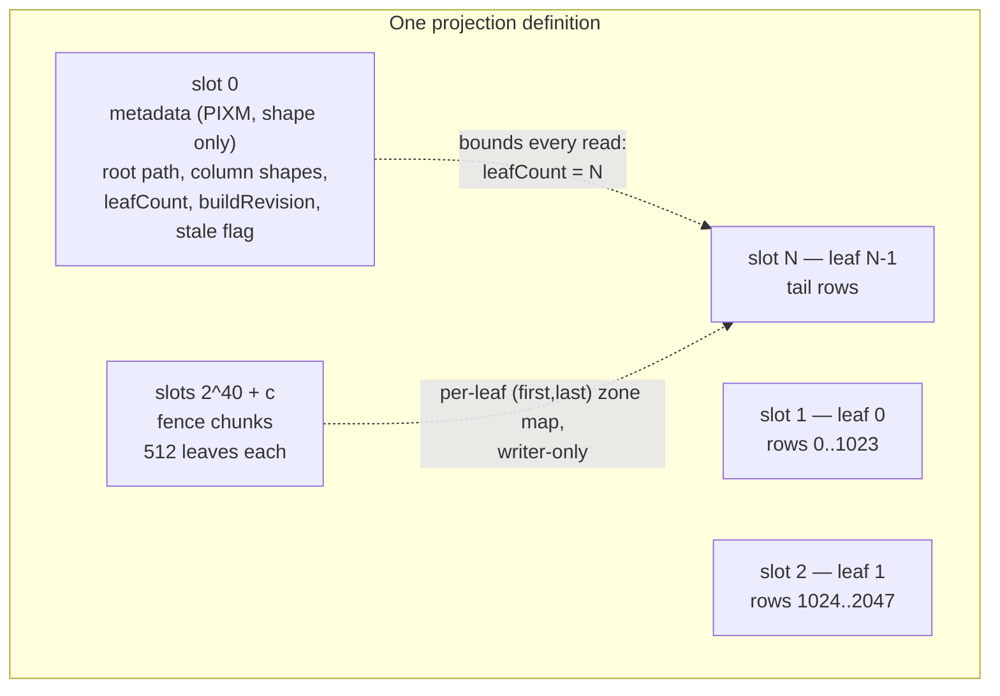

Each leaf carries, per column:

| Column kind | id | In-leaf representation |
|---|---:|---|
| `NUMERIC_LONG` | 0 | 64-bit values + zone map (min/max) |
| `BOOLEAN` | 1 | 1024-bit bitmap words |
| `STRING_DICT` | 2 | leaf-local dictionary + per-row dict ids |
| `NUMERIC_DOUBLE` | 3 | order-preserving 64-bit transform of the double bits (§9) |

plus a **presence bitmap** (a field can be missing on any row) and sticky
**provenance flags**:

| Flag | Meaning |
|---|---|
| `UNREPRESENTABLE` (0x01) | some present value could not be represented in the column type (e.g. a string in a long column, NaN in a double column) — value-serving is refused, fall back |
| `NON_INTEGRAL` (0x02) | long column: some source number was not an exact integer |
| `NOT_VALUE_EXACT` / non-integral reading for doubles | double column: some source value (BigDecimal/BigInteger) rounded during conversion — value-exact serving declined |

The 1024-row leaf is a deliberate, load-bearing choice (§2.1 of the
redesign): it is the re-extraction granularity of incremental maintenance
and exactly matches the kernels' 1024-bit match masks. It is *not* the I/O
granularity — that is the segment (§4).

### 2.1 Two forms of the same leaf

Every leaf exists in two byte-identically convertible forms:

- **Raw scan form** (`ProjectionIndexLeafPage.serialize()`, `PIX1` presence
  tail): flat little-endian primitive arrays — what the SIMD kernels
  consume, cached on the heap.
- **Persisted form**: per-column *segments* using compact encodings
  (delta/frame-of-reference record keys, FOR bit-packed numerics, packed
  dict ids, marker-byte presence, optional FSST dictionaries).

The round-trip guarantee is absolute: `assembleRaw(encode(leaf))`
reproduces the raw form **byte for byte**, presence and provenance
included. This is regression-tested down to multi-kilobyte dictionaries and
adversarial FSST inputs.

---

## 3. Architecture: where the projection lives in the page tree

Projection indexes plug into the same secondary-index machinery as
CAS/PATH/NAME indexes, under one `RevisionRootPage` per revision:

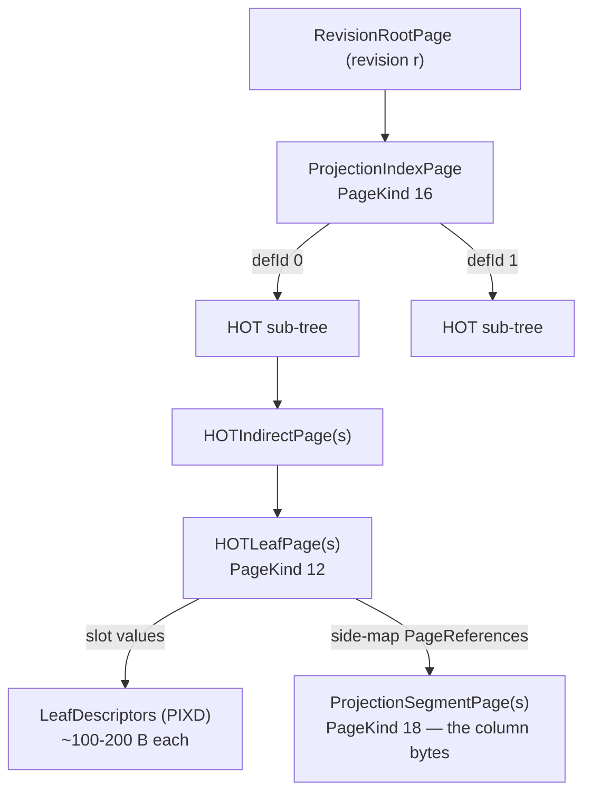

- One **HOT trie** (Height Optimized Trie) per index definition maps
  `slotIndex → slot value`. Slot keys are
  `PathKeySerializer.serialize(slotIndex)` — sign-flipped 8-byte big-endian,
  so unsigned byte comparison preserves numeric order and a range scan
  yields leaves in ascending order.
- The slot **value** is tiny: a `LeafDescriptor` (§5). The actual column
  bytes live in dedicated **`ProjectionSegmentPage`s** (PageKind 18),
  referenced from the HOT leaf's *side map* — a
  `(ownerSlot, segmentId) → PageReference` map that serializes alongside
  the page but outside slot bytes.
- Segment pages have **offset identity** like `OverflowPage`: their durable
  key *is* their file offset, assigned at write time. No logical page key,
  no fragment chain — a segment page is immutable once written; a change
  writes a new page (last-writer-wins at the reference).

This descriptor-vs-payload split is the heart of the design. HOT slots
shrink from ~4 KB chunk values (the interim layout) to ~100–200 B
descriptors, so one 64 KB `HOTLeafPage` holds hundreds of leaves instead of
~15, the trie gets shallower by orders of magnitude, and the deep-split
failure families of the chunked era disappear (§1.6/§2.5 of the redesign).

---

## 4. Semantic segments — the columnar unit of I/O and sharing

A leaf's persisted bytes are split on **column boundaries** — never byte
offsets — into up to `3·columnCount + 1` segments:

| Segment | id | Contents |
|---|---:|---|
| `KEYS` | `0` | record-key column (fences + delta/FOR-packed keys) |
| `BODY(c)` | `3c + 1` | column *c*: flags, zone map, presence bitmap, encoded values |
| `DICT(c)` | `3c + 2` | column *c*'s leaf-local dictionary (string columns only) |

The 8-bit segment-id space caps a projection at
`MAX_COLUMNS = (255 − 2) / 3 = 84` columns — validated at creation.

For the running example (3 columns: `age`, `active`, `dept`), one leaf
persists as **five** segments:

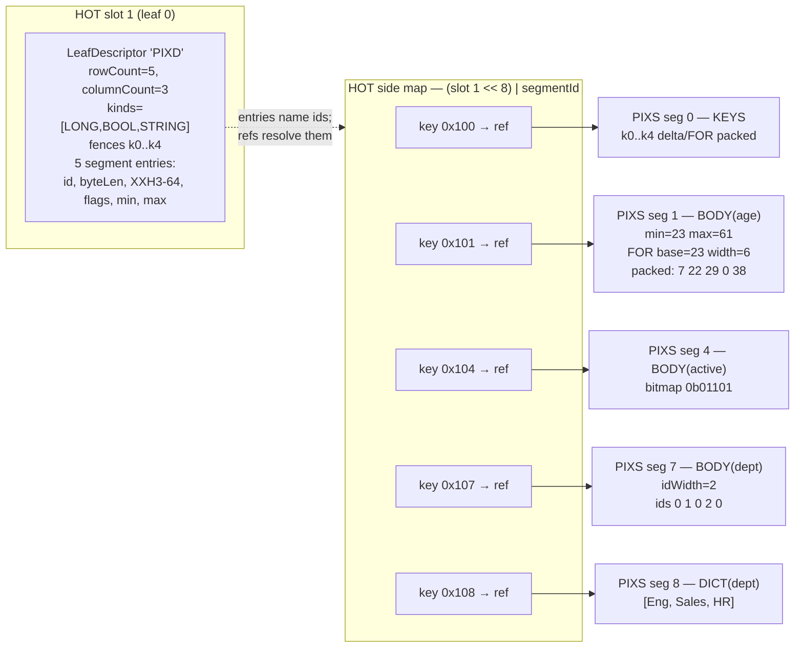

Why this decomposition (the Parquet/DuckDB/ClickHouse lesson, §2.1 of the
redesign):

1. **Reads become columnar.** A predicate on `age` fetches `BODY(age)` and
   nothing else. `countRows` reads *no* segments — descriptors alone answer
   it. A string-equality predicate fetches `BODY(dept)` + `DICT(dept)`.
2. **Writes become contained.** A one-row in-place `age` update re-encodes
   one BODY segment + one descriptor slot. The byte-shift cascade of a
   monolithic encoding (change one value → FOR width grows → every
   downstream byte moves) is confined inside a single column's segment by
   construction.
3. **Stats live above the data.** The descriptor mirrors per-column
   min/max/flags, so zone-map pruning and emptiness checks never touch
   segment bytes.
4. **Dictionaries are separable** — the prerequisite for store-level
   canonical dictionaries (the planned fix for per-leaf dictionary
   amortization at 100 M-row scale, §8.6 R1).

A deliberate divergence from those systems: no fat row groups. DuckDB uses
~122 880-row groups, Parquet ~128 MB; SirixDB keeps 1024-row leaves because
maintenance re-extracts touched leaves wholesale and CoW sharing works at
page granularity — a small leaf is what makes per-commit maintenance cheap.

---

## 5. Wire formats, byte by byte

Four magics, all little-endian; every payload is self-describing:

| Magic | ASCII | Where | Role |
|---|---|---|---|
| `0x44584950` | `PIXD` | HOT slot value | leaf descriptor |
| `0x53584950` | `PIXS` | segment page payload | one encoded segment |
| `0x42584950` | `PIXB` | HOT blob slot value | blob marker (metadata + fence chunks; payload inline or referenced) |
| `0x4D585049` | `PIXM` | blob payload of slot 0 | projection metadata (shape only, VERSION 2) |

### 5.1 `PIXD` — the leaf descriptor

```text
offset  size  field
------  ----  -----------------------------------------------
 0       4    MAGIC "PIXD"
 4       1    VERSION = 1
 5       4    rowCount                  (0 = live empty leaf)
 9       2    columnCount
11       8    firstRecordKey            ┐ fences (Long.MAX/Long.MIN
19       8    lastRecordKey             ┘  sentinels when empty)
27       C    kinds[columnCount]        one kind byte per column
27+C     2    segCount
        30    per segment entry (sorted by ascending segmentId):
                byte  segmentId
                int   byteLen           exact segment length
                long  contentHash       XXH3-64 of segment bytes
                byte  colFlags          provenance mirror
                long  min               ┐ zone-map mirror
                long  max               ┘  (transform domain for doubles)
```

For the example leaf: `5 + 4 + 2 + 8 + 8 + 3 + 2 + 5·30 = 182` bytes —
that is the *entire* HOT slot value for a 1024-row-capable leaf.

The `contentHash` does double duty and this is a design invariant (§5.2-h):

- **Write path**: maintenance re-encodes a column and compares
  `(byteLen, hash)` against the prior descriptor entry. On match, the prior
  `PageReference` is carried forward untouched — a no-op detected *without
  reading the prior segment bytes*.
- **Read path**: segment refs are bare 8-byte offsets with no checksum of
  their own; the descriptor hash is the **only** integrity check a segment
  ever gets. `assembleRaw` verifies length + hash before parsing. A
  mismatch throws; callers fail soft to the generic pipeline and
  negative-cache the definition for that build revision.

The mirror discipline (§5.2-k): descriptor flags/min/max are a *cache* of
the segment truth. Pruning may consult the mirror; provenance gates that
decide whether serving is *allowed* must read segment bytes. The mirror may
only ever short-circuit toward declining, never toward serving.

### 5.2 `PIXS` — segments

Common 6-byte header, then a kind-specific payload:

```text
 0   4   MAGIC "PIXS"
 4   1   SEGMENT_VERSION = 1
 5   1   segKind: 0=KEYS  1=BODY  2=DICT
```

**KEYS** (segment id 0):

```text
long firstRecordKey
long lastRecordKey
[rowCount > 0]:
  byte mode; long base; byte width; bit-packed key deltas
```

**BODY(c)** (segment id 3c+1):

```text
byte colFlags                     -- provenance TRUTH (5.1-7)
[rowCount > 0]: long min; long max -- zone-map truth
presence marker byte [+ 1024-bit words if mixed]
then by kind:
  NUMERIC long:   long base; byte width; FOR bit-packed values
  NUMERIC double: same — OR width byte 65 = ALP escape (§9.4):
                  byte e; byte f; int excCount;
                  FOR-packed decimal digits; verbatim exceptions
  BOOLEAN:        bitmap words verbatim
  STRING:         byte idWidth; bit-packed dict ids
```

Worked example, `BODY(age)` over `[30, 45, 52, 23, 61]`:
min = 23, max = 61 → frame-of-reference base = 23, deltas
`[7, 22, 29, 0, 38]`, max delta 38 → width = 6 bits → 30 bits ≈ 4 packed
bytes. The whole segment is ~35 bytes.

`BODY(active)` over `[true, false, true, true, false]`: bitmap
`0b01101` (row *i* → bit *i*) — one word.

`BODY(dept)`: dictionary ids `[0, 1, 0, 2, 0]` (first-occurrence interning
order: Eng=0, Sales=1, HR=2), dictSize 3 → idWidth = 2 bits → 10 bits
packed.

Escape space: FOR width byte **65 selects ALP** for double columns (§9.4);
bytes 66–255 remain reserved and are **rejected loudly** at decode, so an
old reader meeting a future encoding fails cleanly instead of misparsing
(§11 of the redesign).

**DICT(c)** (segment id 3c+2):

```text
byte dictMode: 0 = RAW, 1 = FSST
RAW:  int dictSize; int lens[dictSize]; concatenated UTF-8
FSST: symbol table + per-entry compressed streams (§10)
```

Empty-leaf rule (§5.1-4): a `rowCount == 0` descriptor still emits KEYS
(fence sentinels) and one BODY per column — per-column **flag truth must
survive emptiness** — but no DICT segments, and its descriptor mirrors
write the `min > max` sentinel pair so descriptor-only pruning skips it.

### 5.3 `PIXB` + `PIXM` — the metadata slot

Slot 0 does not hold a descriptor; it holds a `PIXB` **blob**. A blob is an
opaque payload stored either **inline** (bytes ride the slot value, right
after the marker) or **referenced** (bytes in a side-map `OverflowPage`) —
the same hybrid split the leaf descriptor uses for its segments (§5.1), and
the write path picks inline for payloads ≤ 512 B:

```text
 0  4  MAGIC "PIXB"
 4  1  version
 5  4  byteLen        ┐ high bit = INLINE flag; low 31 bits = exact length
 9  8  XXH3-64 hash   ┘ integrity for the payload (segment pages self-checksum nothing)
[inline only] 17..17+byteLen  the payload bytes
```

The 17-byte header is the whole slot value when the payload is referenced;
an inline blob appends the payload after it. Reads key off the INLINE flag
alone, so the 512 B threshold can change without breaking stored blobs.

The `PIXM` metadata payload is the projection's **shape and bounds
authority**: root path, per-column field paths/names/kinds (hydration reads
the shape from *here*, never trusting a caller's argument list — a
same-arity re-create with different fields must not silently mislabel
columns), `leafCount` (bounds every read; higher slots are stale remnants),
`buildRevision`, and the **stale flag** — the update-time invalidation
valve. It is a few hundred bytes, so it inlines: opening a projection reads
its shape from the one slot value, with **no extra random read** for a
metadata page.

`PIXM` is **VERSION 2**. Version 1 additionally carried the per-leaf record-key
fences inline; those moved to their own chunks (§5.4) so a maintenance commit
stops re-persisting the whole fence array. The version byte is the only thing
that tells a v1 fenced blob from a v2 shape-only one (same magic, same header
prefix), so a v1 blob parses to *nothing* and the reader rebuilds — the
graceful-degradation contract every unknown version already had.

Slot-0 states are deliberately distinct:

| State | Representation | Meaning |
|---|---|---|
| Valid metadata | `PIXB` → `PIXM` v2, stale bit clear | projection serves |
| Stale tombstone | `PIXB` → tiny `PIXM` with `FLAG_STALE` | invalidated; rebuild on next use |
| Truthful empty store | valid metadata, `leafCount = 0` | zero-record root; still valid |
| Legacy layout | slot-0 bytes are not `PIXB`, or `PIXM` version ≠ 2 | pre-redesign / v1 store → rebuild (§12) |

### 5.4 The fence chunks — a carry-forward zone map

Incremental maintenance needs, once per commit, the `(firstRecordKey,
lastRecordKey)` range of every leaf: the ascending **zone map** it two-pointer
-merges dirty record keys against to find which leaves a write touched (§6.3).
That is 16 bytes per leaf — ~1.5 MB at 100k leaves.

Keeping it inside the slot-0 blob meant every commit re-persisted the whole
array (one leaf moved → the blob's hash changed → the entire 1.5 MB was
rewritten), and copy-on-write history keeps each rewrite forever: ~1.5 MB of
permanent growth *per commit*. So the fences live in their own fixed-size
**chunks** instead:

- One chunk per **512 leaves** (8 KiB of raw `(first, last)` longs), stored as
  a `PIXB` blob at reserved slot key `(1 << 40) + chunkIndex`. That base sits
  far above the leaf slots (`1..leafCount`, bounded well under 2^24), so leaf
  probing — which stops at the first empty slot after the leaves — never
  reaches the chunks and the two key ranges cannot alias.
- Writing a chunk goes through the same `putBlob` carry-forward: an unchanged
  chunk (same length + hash) is a **no-op**, its `OverflowPage` shared by
  reference. A commit that touches a handful of leaves rewrites only the one or
  two chunks those leaves fall in (plus the tail chunk for appends) — a
  pure-append commit rewrites just the tail chunk (8 KiB). Per-commit growth
  drops from ~1.5 MB to ~8–24 KB (≈ 65–195×).
- Chunks stay **referenced** (not inline): at 8 KiB, inlining them would bloat
  the HOT leaf pages that hold the fence slots, defeating the point.

The fences are a **writer-only** zone map — the builder writes them, the change
listener reads and rewrites them, and nothing on the query/hydrate path ever
touches them. A missing or wrong-sized chunk therefore never returns a wrong
answer: the reader reports it as unreadable and maintenance falls back to a
full rebuild. Implementation: `ProjectionIndexFences` (`write`/`read`, plus
orphan-chunk tombstoning when a rebuild shrinks the leaf count).

---

## 6. The write path

### 6.1 Streaming build

`ProjectionIndexBuilder.buildAndPersist` walks the record set once and
emits leaves through a consumer — **one leaf in memory at a time** (the
interim design buffered every encoded leaf: ~240 MB of heap at 100 M rows;
now ~2 MB — two fence longs per leaf):

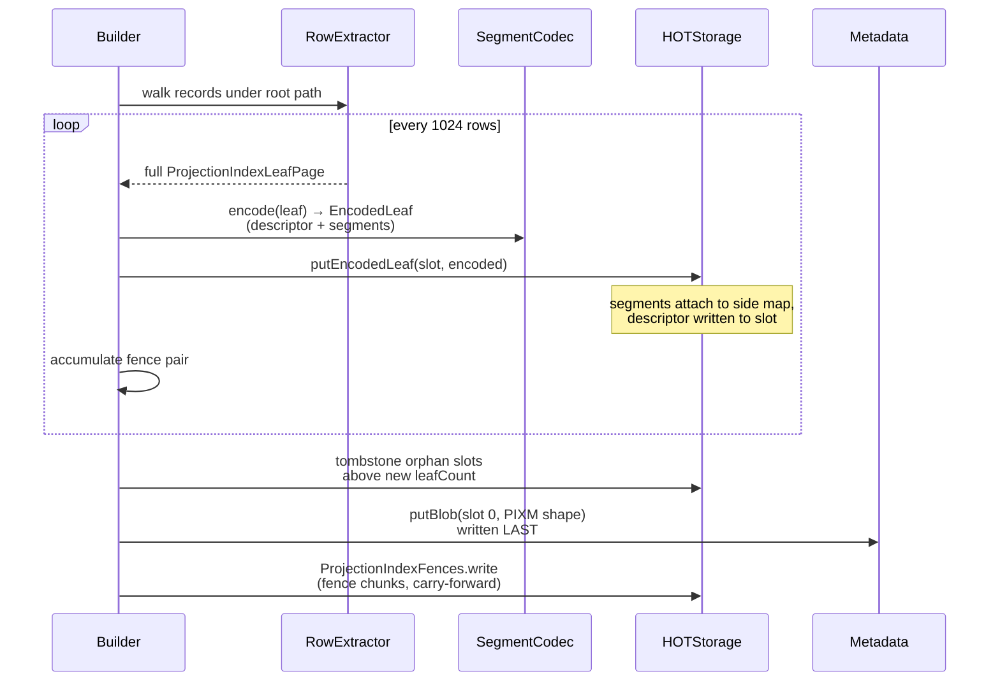

Writing metadata **last** means a crash mid-build leaves the old metadata
in place (all writes ride one CoW commit anyway, but the ordering keeps the
two writers — builder and maintenance — consistent). The fence chunks (§5.4)
are written alongside; unchanged chunks carry forward as no-ops.

### 6.2 The commit chain — how segment pages get their identity

Segment pages follow the `OverflowPage` discipline: **never written before
commit** (rollback safety needs no undo — an uncommitted segment page was
simply never written), and their durable key is assigned during the
recursive commit descent, strictly before the owning HOT leaf's bytes are
produced:

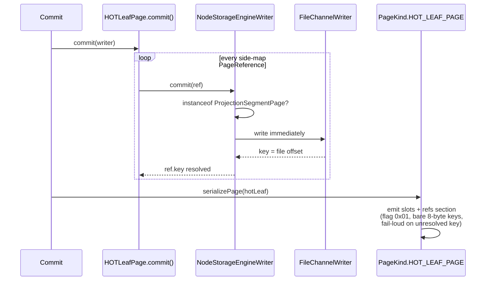

Details that make this correct under versioning:

- The refs section is guarded by an envelope flag
  (`HOTLeafPage.FLAG_SEGMENT_REFS = 0x01`), so HOT pages without projection
  refs serialize exactly as before.
- Under non-FULL versioning, HOT fragments are sparse (dirty entries only) —
  but **every fragment carries the complete refs map**, and fragment merge
  is newest-fragment-authoritative. A ref-only change therefore never
  requires a slot to be dirtied, and a merge can never resurrect a dropped
  ref.
- `HOTLeafPage.copy()` deep-copies each `PageReference` (CoW discipline: a
  commit through one revision's page mutates only that copy's reference; a
  reference already resolved to a disk key carries the key through — which
  is exactly how unchanged segments stay shared across revisions).
- All four leaf-split variants route side-map entries **by owner-slot
  residency** (`moveSegmentRefsAfterSplit`) — correct even for the
  discriminative-bit splits, whose partition is not contiguous in key
  order.
- HOT structural rebuild paths that don't carry refs (subtree merge,
  two-leaf migration, hoist-and-reroute) carry loud
  `segmentRefCount > 0` backstops — they throw rather than silently drop a
  reference.

### 6.3 Hash-based no-op sharing

`putLeaf` / maintenance re-encode a leaf and then, per segment:

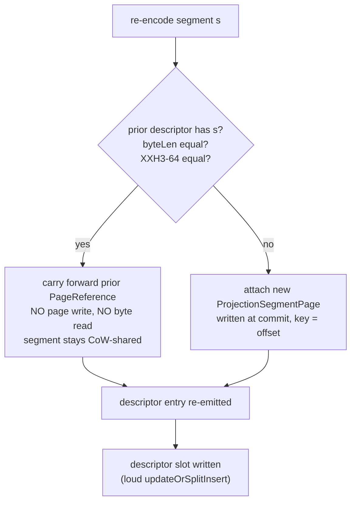

Determinism makes this sound: dictionary interning is append-only
first-occurrence order, extraction replay is order-stable, and FSST
symbol-table training is deterministic given identical input — so an
untouched column re-encodes to byte-identical output and hashes equal.
Consequence: even a **full rebuild** shares every unchanged leaf's segments
by reference; only genuinely-changed bytes hit the disk.

### 6.4 Update containment, honestly scoped

| Change to one 1024-row leaf | Segments rewritten |
|---|---|
| in-place value update, column *c* | `BODY(c)` (+ `DICT(c)` iff the dictionary grew) + descriptor |
| row append (tail) | `KEYS` + every `BODY` (+ interning `DICT`s) + descriptor |
| row delete | every segment of the leaf (rowCount changed) + descriptor |
| untouched leaf | nothing — descriptor and all segments shared |

Deletes/appends change `rowCount`, which participates in every column's
encoding — the re-encode-then-hash-compare loop makes the containment
automatic rather than hand-tracked.

---

## 7. The read path

### 7.1 Cold open → catalog → cache

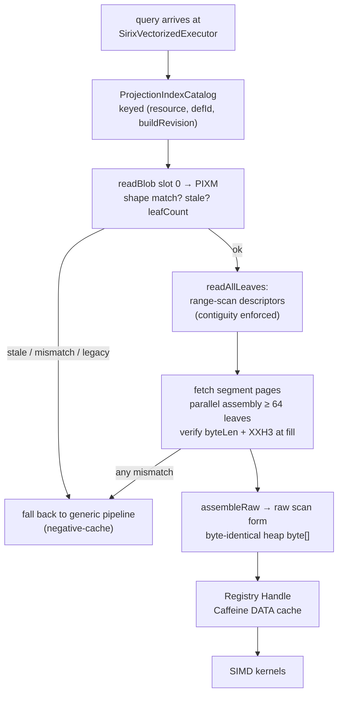

Kernels deliberately consume **heap `byte[]`** — a MemorySegment/FFM kernel
port measured +4.5 % wall time and was reverted; zero-copy applies to
storage-internal paths, not kernels. The catalog hydrates once per
`(resource, defId, buildRevision)` and serves every subsequent query from
cache, so descriptor-level pruning saves cold-open I/O; steady-state
columnar wins (per-column cache residency) arrive with the deferred P5b
Handle restructure.

### 7.2 Kernel execution over a leaf

`ProjectionIndexByteScan` walks the raw form with positional reads
(allocation-free). Example: `count where age > 40 and active`:

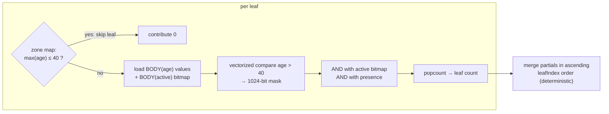

The same conjunctive-mask machinery drives filtered aggregates
(`sum/avg/min/max` with the mask), group-by (dict-id keyed accumulation),
and count-distinct (dictionary union + presence). Every kernel's result is
differential-tested byte-identical against the interpreted pipeline.

### 7.3 The serving gates

Before any kernel runs, the executor proves it may:

- **Shape**: metadata columns match the query's paths (scoping is exact —
  `/[]/age` never matches `/[]/pet/age`; the nested-same-name suites pin
  this).
- **Revision**: the handle's `buildRevision` must not be newer than the
  query's revision (time-travel executors bound to older revisions refuse
  newer projections).
- **Provenance**: `UNREPRESENTABLE` → decline the column entirely;
  `NON_INTEGRAL` → decline integer-exact serving; double columns with
  rounding provenance → decline value-exact serving (§9.3).
- **Presence**: aggregate semantics over missing fields must match the
  interpreted pipeline's (`sum` of an all-missing column is `()`, not 0).

Failing any gate is silent and cheap: the generic pipeline answers, and a
negative cache prevents re-probing per query.

---

## 8. Incremental maintenance and the degradation ladder

`ProjectionIndexChangeListener` hooks every commit of a resource with
projections:

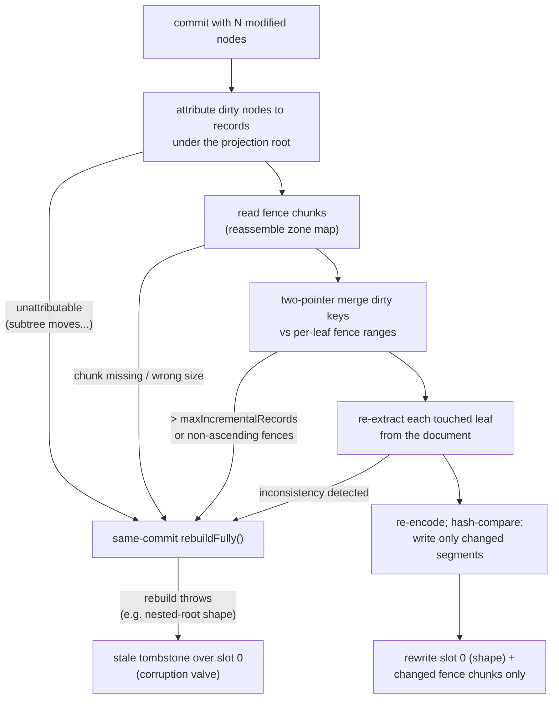

Properties worth naming:

- **Appends always classify cleanly**: record keys are monotone (node-key
  allocation is monotone — an explicit invariant), so new records always
  land at the tail.
- The ladder never blocks a commit: the worst case is a tombstone, which
  degrades queries to the fallback until the next
  `jn:create-projection-index` (or first-use rebuild).
- The rebuild rung, routed through hash-compare no-op writes, shares every
  unchanged leaf's segments — softening the `maxIncrementalRecords` cliff.

### 8.1 Time travel: what sharing looks like across revisions

After `replace json value of $doc[0].age with 99` (an in-place update to
leaf 0, column `age`):

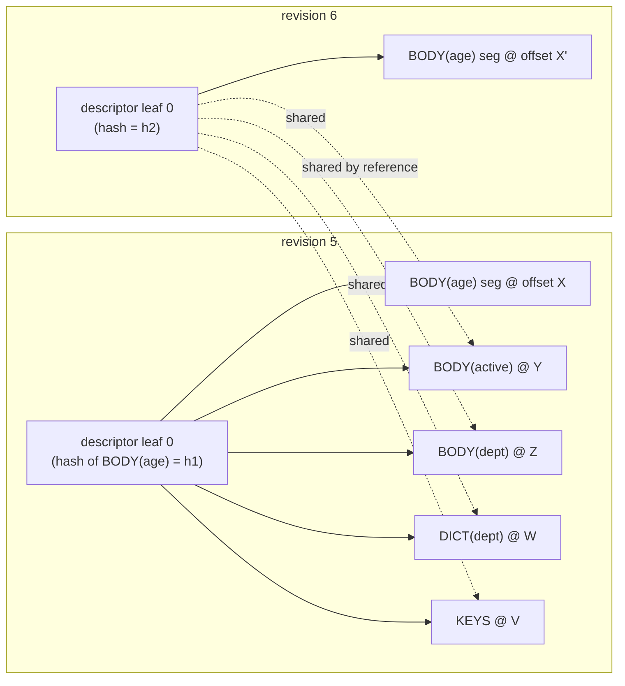

A query at revision 5 and a query at revision 6 run the same kernels over
their respective snapshots; four of five segments are literally the same
disk pages. This containment is proven at the storage level by a test that
asserts segment **disk-offset equality** across revisions
(`ProjectionIndexDescriptorStorageTest`).

The store is append-only — nothing reclaims old segment pages; revision
history is the product, not garbage (§5.2-d).

---

## 9. Double columns (`NUMERIC_DOUBLE`)

### 9.1 The sortable-bits transform

Doubles reuse **every** signed-long compare surface — zone maps, zone
skipping, the numeric predicate kernels, FOR bit-packing — through one
order-preserving involution on the raw bit pattern
(`ProjectionDoubleEncoding`):

```java
encoded = bits ^ ((bits >> 63) & 0x7FFF_FFFF_FFFF_FFFFL);
```

Positive doubles (sign bit 0) keep their bits — IEEE-754 ordering of
non-negative doubles *is* signed-long ordering. Negative doubles keep the
sign bit (still negative as a long) and flip the magnitude bits, so
more-negative doubles map to smaller longs. Applying the same expression
twice returns the original bits (an involution — encode and decode are the
same two ops, branch-free).

| double | raw bits | encoded (signed long order) |
|---|---|---|
| `-∞` | `0xFFF0000000000000` | `0x800FFFFFFFFFFFFF` (near Long.MIN) |
| `-1.5` | `0xBFF8000000000000` | `0xC007FFFFFFFFFFFF` |
| `-0.0` | `0x8000000000000000` | `0xFFFFFFFFFFFFFFFF` (= −1) |
| `0.0` | `0x0000000000000000` | `0` |
| `1.5` | `0x3FF8000000000000` | `0x3FF8000000000000` |
| `+∞` | `0x7FF0000000000000` | `0x7FF0000000000000` |

No finite double (nor ±∞) encodes onto `Long.MIN_VALUE`/`Long.MAX_VALUE`,
so the `min > max` empty-column sentinel stays unambiguous. NaN never
reaches the transform: it is marked `UNREPRESENTABLE` at extraction (JSON
cannot produce it anyway).

Property tests (`ProjectionDoubleEncodingTest`) pin strict order
preservation over 20 000 samples plus edge cases, bit-exact involution, and
sentinel safety.

### 9.2 Plan-time literal transform — the critical invariant

Column cells are stored in the transform domain, so **predicate literals
must be transformed exactly once, at plan time** (§5.2-m). The executor's
predicate extraction is kind-aware per comparison opcode:

| Opcode | Long column | Double column |
|---|---|---|
| `OP_NUM_CMP` (integer literal) | literal as-is | `encode((double) lit)` — declined above 2⁵³ (not exactly representable) |
| `OP_FP_CMP` (double literal) | threshold-rewrite gates | `encode(lit)` natively; NaN declined |
| `OP_DEC_CMP` (decimal literal) | decimal-exact compare | XQuery promotes decimal→double: `encode(decLit.doubleValue())` with the original operator |

Getting any of these wrong produces *silently wrong results*, not errors —
this is exactly the class of bug the adversarial review pass between phases
caught (the `OP_DEC_CMP` arm initially compared untransformed decimal
literals against transformed cells). The regression suite pins mixed
int/double predicates, decimal literals on double columns, and
double-literal predicates on integer columns.

### 9.3 Extraction exactness and aggregate honesty

Extraction (`ProjectionIndexRowExtractor`) stores `doubleValue()` and
tracks exactness per source type: `Double`/`Float`/`Integer` are always
exact; `Long` is exact iff round-trippable (`(long)(double) l == l`, with
`Long.MAX_VALUE` explicitly lossy — saturation makes the naive round-trip
lie); `BigDecimal`/`BigInteger` are compared via `BigDecimal` for exactness
and flagged when rounding occurred.

Aggregate serving over double columns is **purity-gated**. Counts are
always served (exact in the transform domain). Sum/avg/min/max are served
only under the **pure-double-source provenance bit**
(`COLUMN_FLAG_PURE_DOUBLE_SOURCE`, flags bit 2): every cell of the column,
on every leaf, was extracted from a `Double` source. Under that bit the
interpreted fallback provably aggregates in double space and types the
result `xs:double` — and the serving arithmetic reproduces the
interpreter's bit for bit: sums fold seed-first in document order
(identical to the interpreter's pairwise fold, which the review proved is
*not* the same as a zero-seeded fold — a lone `-0.0` and ill-conditioned
sums like `[1e16, 1, 1]` expose the difference), and min/max use
`Double.compare` total order, which distinguishes `-0.0 < 0.0` where IEEE
`<` does not. Regression tests pin each of these edges against the
interpreter's serialized output.

The subtlety is what counts as a double source. SirixDB's JSON shredder
tags plain decimal literals (`1.25`) as `BigDecimal` — XQuery then
aggregates them *decimal-exactly* and surfaces `Dec`, which a double
accumulator cannot reproduce digit-for-digit. Only exponent-form literals
that round-trip (`1.25E0`) shred as `Double`. So: scientific-notation and
sensor/ML-style data gets full fast-path aggregates; bookkeeping-style
plain decimals deliberately stay on the exact fallback (count still
served). Exact-but-wrongly-typed sources also clear the bit — an integer
`3` (the fallback would type the result `Dec`) or a `Float` (typed
`xs:float`, accumulated in float arithmetic): the bar is result *type*
parity, not representability. `ProjectionDoubleAggregateServingTest` pins
every one of these shapes.

---

### 9.4 ALP — compressing decimal doubles

Most real-world doubles are decimals in disguise: `12.25`, `3.4`, `-0.7`.
Their transform-domain bit patterns look random to FOR packing (~50–64 bits
per value), but as *decimal digits* they are tiny integers. ALP (adaptive
lossless floating-point) exploits exactly that, per leaf-column vector:

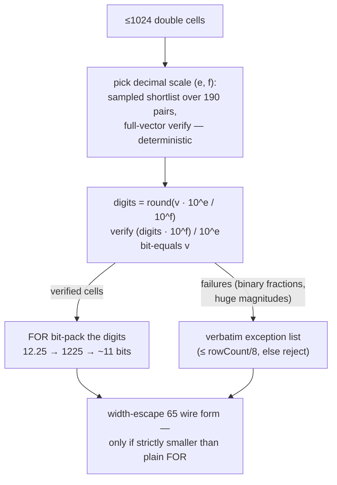

Two details are load-bearing. First, the decode expression ends in a
**division** — IEEE division is correctly rounded, so `k / 10ⁿ` decimals
verify bit-exact, where the tempting reciprocal multiply (`digits × 0.1`)
misses about half of them (a bug the ALP test suite caught immediately).
Second, every cell is verified against that exact expression at encode
time, so losslessness is a per-value proof, not a property argument —
`-0.0` (whose digits decode to `+0.0`) simply lands in the exception list.

Non-decimal data (π multiples, huge magnitudes) fails the profitability
bar and falls back to the plain FOR form byte-identically to before — the
escape byte is the only signal, and pre-ALP stores never carried it.
Selection is deterministic end to end, so the descriptor-hash no-op
carry-forward (§6.3) keeps sharing ALP segments across revisions.

## 10. FSST-compressed dictionaries

String dictionaries ride the persisted `DICT(c)` segment only; the raw scan
form always holds plain UTF-8, so **kernels never see compressed bytes**
(they compare dictionary entries as raw bytes pervasively — decompressing at
segment decode means zero kernel changes).

There is exactly **one FSST implementation** in the codebase —
`io.sirix.utils.FSSTCompressor`, already production-wired for PAX string
storage in `KeyValueLeafPage` — and the projection reuses it wholesale:

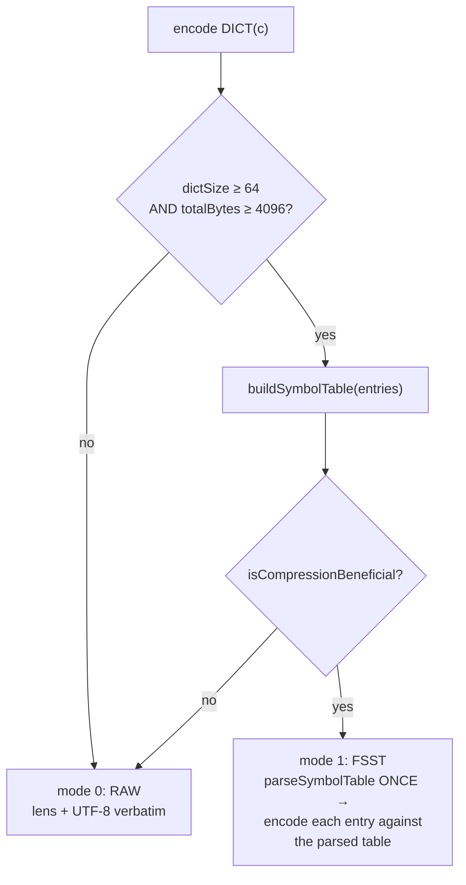

Typical leaf-local dictionaries (8–50 entries) take the RAW path — the
gates exist so FSST only pays where it wins (high-cardinality string
columns). Training is deterministic for identical input order, and
dictionary order is append-only interning order — so the no-op
`contentHash` stays stable across identical re-encodes (§5.2-n), keeping
hash-based sharing intact for FSST segments.

Decode parses the symbol table once per segment and batch-decodes into the
raw dictionary layout — the byte-identity guarantee of `assembleRaw` covers
FSST segments like any other.

---

## 11. Corner cases worth knowing

The full catalog is §5 of the redesign doc; these are the ones that shape
day-to-day behavior:

- **Tombstone vs live empty leaf** (§5.1-4): a zero-length slot value means
  *absent leaf* (deleted); a `PIXD` with `rowCount = 0` is a *live* empty
  leaf (every row of a mid-store leaf legitimately deleted; slots stay
  contiguous). `getLeaf` returns null only for the former; the
  truncated-store check counts descriptors, so mid-store empty leaves never
  trip fail-soft.
- **Contiguity is enforced, not assumed**: `readAllLeaves` walks slots
  1..leafCount and fails loudly on a gap — a gap means storage corruption,
  not a sparse store.
- **The 84-column cap** fails fast at creation (`3c + 2 ≤ 255`), and the
  segment-id math (`checkColumn`) refuses out-of-range columns before a
  byte cast could silently wrap one column's segment onto another's.
- **Segment size bound**: `ProjectionSegmentPage.MAX_SEGMENT_BYTES = 16 MB`
  — far above any 1024-row leaf's worst case; a violation is a loud bug
  signal, not a spill path.
- **Same-commit create+delete** of a record dedupes in the dirty set and
  extraction simply finds nothing — no phantom rows.
- **Dropped definitions** write a blob tombstone over slot 0 (not just a
  cache invalidation), so a drop → recreate with fewer leaves can never
  resolve old segment pages through stale descriptors.

## 12. Migration from the interim chunked layout

No version bump — detection is **structural** (§6 of the redesign; project
convention: no deployed databases, and the version gate is reserved for
future wire changes):

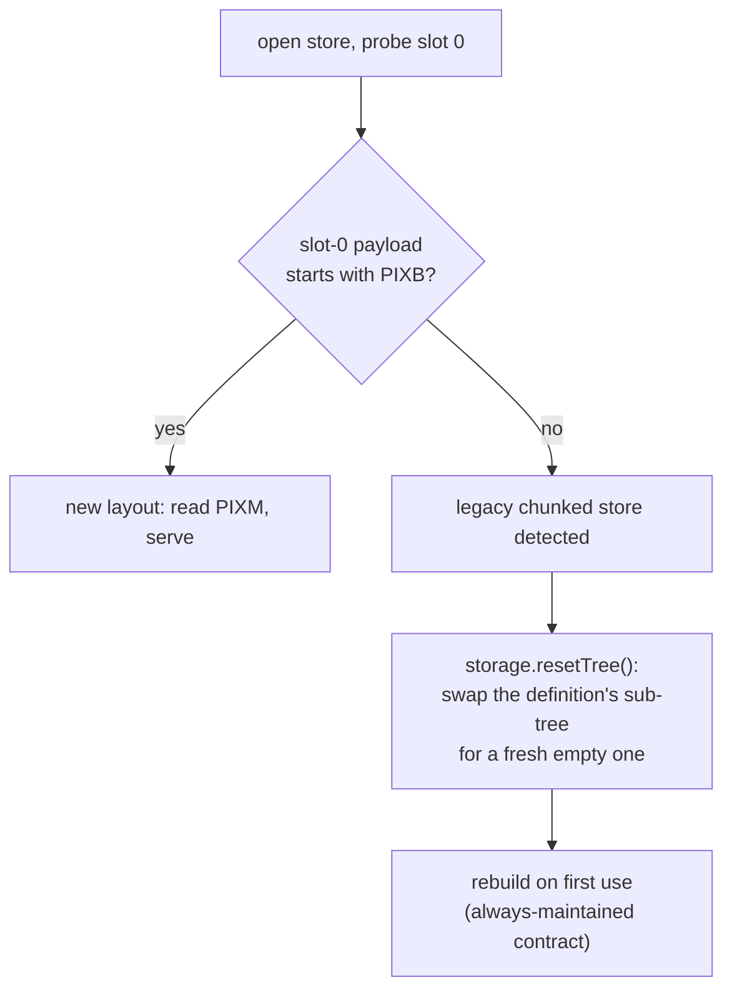

Selective in-place conversion is impossible by design: legacy composite
chunk keys (`leafIndex << 8 | chunkIdx`) and new slot keys are
indistinguishable at the HOT layer, and value sniffing is forbidden — so
the whole sub-tree is swapped. Old pages stay on disk (append-only store);
only a resource copy/re-import sheds them.

An orphan-recovery path covers the pathological case of tombstoned
metadata over live leaves: `probeLiveLeafCount` walks descriptors directly
(bounded at 2²⁴ slots) so a rebuild can tombstone stale remnants it can no
longer enumerate via metadata.

## 13. Performance positioning

Measured standing at 100 M records (protocol in `COMPARISON_DUCKDB.md`;
full context in §8 of the redesign doc):

| shape | SirixDB (PGO native) | DuckDB | standing |
|---|---:|---:|---|
| filtered count | **33 ms** | 40 ms | ahead |
| filtered range count | **42 ms** | 44 ms | ahead |
| filtered group-by | **43 ms** | 59 ms | ahead |
| sum/avg/min+max | 16–19 ms | 10–18 ms | 1.1–1.6× |
| group-by (1 key / 2 keys) | 71 / 240 ms | 28 / 115 ms | 2.1–2.5× |
| count-distinct | 81 ms | 18 ms | 4.2× |

Per-kernel physics is competitive; the remaining gaps are per-leaf
dictionary amortization at scale (the DICT-segment separation built here is
the prerequisite for the store-level canonical dictionary that closes it)
and kernel shape coverage. The structural advantage no immutable-storage
engine can follow: every revision is queryable with the same kernels, and a
commit's maintenance cost is a handful of segment pages — not a part
rewrite, not an ETL export.

## 14. Source map

| Concern | Where |
|---|---|
| Descriptor wire format | `index/projection/LeafDescriptor.java` |
| Segment codec (encode/assemble/FSST modes) | `index/projection/ProjectionIndexSegmentCodec.java` |
| Shared encoding primitives (FOR, presence, dicts) | `index/projection/ProjectionIndexLeafCodec.java` |
| Raw scan form | `index/projection/ProjectionIndexLeafPage.java` |
| Storage API (slots, blobs, readAllLeaves, resetTree) | `index/projection/ProjectionIndexHOTStorage.java` |
| Double transform | `index/projection/ProjectionDoubleEncoding.java` |
| Extraction + exactness | `index/projection/ProjectionIndexRowExtractor.java` |
| Streaming build | `index/projection/ProjectionIndexBuilder.java` |
| Incremental maintenance | `index/projection/ProjectionIndexChangeListener.java` |
| Catalog / hydrate | `index/projection/ProjectionIndexCatalog.java` |
| Kernels | `index/projection/ProjectionIndexByteScan.java` |
| Segment page | `page/ProjectionSegmentPage.java` |
| Side map, refs serialization, split routing | `page/HOTLeafPage.java`, `page/PageKind.java` |
| Commit chain | `access/trx/page/NodeStorageEngineWriter.java` |
| Executor integration | `sirix-query .../scan/SirixVectorizedExecutor.java` |
| Create/drop functions | `sirix-query .../function/jn/index/create/CreateProjectionIndex.java`, `.../drop/DropProjectionIndex.java` |

*(paths relative to `bundles/sirix-core/src/main/java/io/sirix/` unless
noted)*

## 15. Glossary

| Term | Meaning |
|---|---|
| **Record / record key** | One JSON object under the projection's root path; its record key is the document node key — a stable 64-bit id that never changes, assigned in ascending order. |
| **Leaf (logical leaf)** | Up to 1024 consecutive records' worth of columns — the unit of extraction, encoding, and maintenance. Not to be confused with a HOT leaf *page*. |
| **Descriptor (`PIXD`)** | The ~100–200 byte summary of one leaf stored as a HOT slot value: row count, column kinds, fences, and one entry (id, length, hash, stats) per segment. |
| **Segment** | One column-shaped slice of a leaf's persisted bytes: `KEYS` (record keys), `BODY(c)` (one column's flags + presence + values), or `DICT(c)` (a string column's dictionary). Stored in its own page. |
| **Segment page** | A `ProjectionSegmentPage` (PageKind 18) holding exactly one segment; identified by its file offset, immutable once written, shared across revisions by reference. |
| **Side map** | A small map on the HOT leaf page — `(slot, segmentId) → PageReference` — connecting a descriptor's segment entries to the pages holding the bytes. Serialized with the page but outside slot values. |
| **HOT trie** | Height Optimized Trie — the ordered key→value index structure that maps slot keys to descriptors. One per projection definition. |
| **Fences** | The first and last record key of a leaf. Maintenance uses them to find which leaves a commit touched with one metadata read. |
| **Zone map** | Per-column min/max kept in the descriptor and BODY segment; lets queries skip whole leaves without reading values. |
| **Presence bitmap** | One bit per row per column: is the field present on this record? Missing fields are first-class (JSON is sparse). |
| **Provenance flags** | Per-column sticky truth bits (`UNREPRESENTABLE`, `NON_INTEGRAL`, …) recording anything that would make fast-path answers inexact. Serving gates read them and decline rather than risk a wrong answer. |
| **Raw scan form** | The flat in-memory layout (`PIX1` tail) the SIMD kernels read — reconstructed byte-identically from segments at hydrate time. |
| **Hydrate** | Loading and assembling a projection's leaves from disk into the query-side cache, once per (resource, definition, build revision). |
| **Blob slot (`PIXB`/`PIXM`)** | Slot 0's indirection: a small marker pointing at the metadata payload (shape, leaf count, fences, stale flag) stored as one segment. |
| **Tombstone** | A zero-length slot value marking a deleted leaf — distinct from a live leaf with zero rows, and from the *stale* metadata tombstone that invalidates a whole projection. |
| **Carry-forward / no-op share** | Skipping a segment write because the re-encoded bytes hash identically to the prior revision's — the prior page is referenced instead of rewritten. |
| **Fail closed / fall back** | The serving discipline: any unproven precondition silently routes the query to the generic document-scan pipeline, which is always correct (just slower). |
| **Differential suite** | Tests that run every query on both the vectorized path and the interpreted pipeline and require byte-identical results. |
| **buildRevision** | The revision a projection's columns were extracted at; caches and time-travel gates key on it. |
| **FSST** | Fast Static Symbol Table — a string compression scheme; applied to large persisted dictionaries only, invisible to kernels. |
| **FOR** | Frame of reference — store a block minimum plus small offsets instead of full-width values. |
