# Projection Indexes — A Technical Deep Dive

How SirixDB serves OLAP-style analytics (filtered counts, aggregates,
group-bys) over versioned JSON documents at columnar-engine speed, while
keeping every revision queryable.

This document walks one small dataset through **every layer** of the
projection index: from JSON rows to columnar leaves, to semantic segments, to
the exact bytes on disk, to the SIMD kernels that answer queries — and back
up through incremental maintenance and time travel.

Authoritative companion documents:

- `docs/PROJECTION_INDEX_STORAGE_REDESIGN.md` — the design/spec of record
  for the segment-directory storage layout (cited as §n below).
- `docs/PROJECTION_INDEX_INCREMENTAL_MAINTENANCE.md` — exact record lookup,
  document-order routing, and local update/delete/insert/move maintenance.
- `docs/DISK_FORMAT.md` — on-disk format reference.
- Class javadoc under
  `bundles/sirix-core/src/main/java/io/sirix/index/projection/` — the
  per-class documentation of record.

## How to read this document

Different readers need different slices — the sections stand alone well
enough to skip around:

| You are… | Read | Skip on first pass |
|---|---|---|
| **New to columnar storage** | the primer below, then §1–§2 and §13 | the wire formats (§5) and corner cases (§11) |
| **New to versioning / revisions** | the CoW primer bullet below, then §8.2 (versioning from first principles), §8.3 (the four algorithms), §8.4 (what it means for a projection) | everything about bytes (§5) |
| **A SirixDB user** wanting fast analytics | §1 (what it is, how to create one), §7.3 (when queries are served vs fall back), §13 | everything about bytes and commits |
| **A contributor** touching the projection code | everything, in order; keep §14 (source map) open | — |
| **A storage/database enthusiast** comparing engines | §2–§4 (the design), §6.3 (hash sharing), §8.1–§8.4 (time travel and the versioning algorithms), §13 | the XQuery examples |

**A five-minute primer** on the ideas everything else builds on — skip if
you know columnar engines:

- **Row vs column storage.** A JSON document store keeps each record's
  fields together (great for "give me record 4017"). Analytics wants the
  opposite: `sum(age)` over a million records should read a million ages and
  *nothing else*. A **columnar** layout stores all values of one field
  contiguously, so scans touch only the bytes they need — and identical-type
  values sitting together compress far better.
- **Dictionary encoding.** Instead of storing `"Eng", "Sales", "Eng",
  "HR", "Eng"`, store each distinct string once in a *dictionary*
  (`[Eng, Sales, HR]`) and replace the values with small integer ids
  (`0 1 0 2 0`). Comparisons become integer compares; group-by becomes
  counting ids.
- **Zone maps.** Keep the min and max of each column per storage block.
  A query for `age > 40` can skip an entire 1024-row block whose stored
  maximum is 38 — without reading a single value. "Pruning" below always
  means this: deciding from small metadata that big data cannot match.
- **Bit-packing / frame of reference (FOR).** If a block's ages span
  23..61, store the minimum (23) once and each value as its offset
  (0..38), which fits in 6 bits instead of 64. Lossless, and cheap to
  decode.
- **Copy-on-write (CoW) versioning.** SirixDB never overwrites pages on
  disk. A commit writes *new* pages for what changed and re-points
  references; unchanged pages are shared with previous revisions. That is
  why every past revision stays queryable for free — and why "rewrite one
  column of one block" is the unit of write cost that matters here.

A **glossary** of the recurring SirixDB-specific terms sits at the end
(§15) — refer back when a term like *descriptor*, *side map*, or
*provenance flag* appears.

---

## 1. What a projection index is

A **projection index** is a persistent, incrementally-maintained columnar
projection of selected fields from a JSON record set. You name a *root path*
(the records) and a list of *field paths* with declared types (the columns);
SirixDB extracts those fields into column-major storage and serves matching
analytical queries from it — without touching the document tree.


```mermaid
flowchart LR
    subgraph doc["JSON resource (tree of nodes, versioned)"]
        R0["{ age: 30, active: true, dept: 'Eng' }"]
        R1["{ age: 45, active: false, dept: 'Sales' }"]
        R2["{ age: 52, active: true, dept: 'Eng' }"]
        R3["{ age: 23, active: true, dept: 'HR' }"]
        R4["{ age: 61, active: false, dept: 'Eng' }"]
    end
    subgraph proj["Projection index (column-major, versioned)"]
        K["record keys<br/>k0..k4"]
        C0["age : NUMERIC_LONG<br/>30 45 52 23 61"]
        C1["active : BOOLEAN<br/>1 0 1 1 0"]
        C2["dept : STRING_DICT<br/>ids 0 1 0 2 0<br/>dict [Eng, Sales, HR]"]
    end
    doc -- "extract once, maintain per commit" --> proj
    proj -- "serves" --> Q["count / sum / avg / min / max<br/>filtered counts, group-by,<br/>count-distinct"]
```

Three properties distinguish it from a Parquet file or a DuckDB table:

1. **It is versioned.** The projection lives inside SirixDB's copy-on-write
   page tree. Every commit produces a new queryable snapshot; unchanged
   parts are shared structurally between revisions. Time-travel analytics
   ("group-by over the state as of revision 42") run on the same kernels.
2. **It is always maintained.** A change listener patches the persisted
   columns at every commit — updates re-encode the touched ≤1024-row row
   group, inserts and moves splice at their document predecessor/successor
   anchors (only a proven document-tail insert extends the tail), deletes
   drop rows. No manual refresh, and no whole-index rebuild (§8).
3. **It is fail-closed.** Every serving path is gated: if the projection
   cannot *prove* it can answer a query exactly (type provenance, presence,
   staleness), the query silently falls back to the generic document-scan
   pipeline. Speed never outruns correctness.

### 1.1 The running example

Every layer below uses this dataset (from
`ProjectionIndexCatalogServingTest`):

```xquery
jn:store('json-path1','sales.jn','[
  {"age": 30, "active": true,  "dept": "Eng"},
  {"age": 45, "active": false, "dept": "Sales"},
  {"age": 52, "active": true,  "dept": "Eng"},
  {"age": 23, "active": true,  "dept": "HR"},
  {"age": 61, "active": false, "dept": "Eng"}
]')
```

Create the projection and commit:

```xquery
let $doc := jn:doc('json-path1','sales.jn')
let $stats := jn:create-projection-index($doc, '/[]',
    ('/[]/age', '/[]/active', '/[]/dept'),
    ('long', 'boolean', 'string'))
return {"revision": sdb:commit($doc)}
```

From then on, queries like these are served from the projection (verified in
tests by the `ProjectionIndexCatalog.servedCount()` delta):

```xquery
sum(for $r in $doc[] return $r.age)                          (: → 211 :)
count(for $r in $doc[] where $r.age > 40 and $r.active return $r)
for $d in distinct-values(for $r in $doc[] return $r.dept) ...
```

Declared column types: `long`, `boolean`, `string`, and — since the
segment-directory redesign — `double` / `float` / `decimal` (all mapped to
the `NUMERIC_DOUBLE` column kind, §9). A field path may also end in an
**array step** — `'/[]/genres/[]'` declares a `genres` column over the
*elements* of an array-valued field (the `STRING_SET` column kind, §2), so
membership predicates (`some $g in $r.genres[] satisfies $g eq "..."`) are
answered from the column.

---

## 2. The logical model: leaves of 1024 rows

The unit of everything — extraction, encoding, maintenance, SIMD masks — is
the **logical leaf**: up to `MAX_ROWS = 1024` consecutive records in document
order. Stable record keys are identities, not positions. The `KEYS` segment
therefore stores every key in document order, while a one-bit classification
keeps the increasing subsequence on the normal fence backbone and marks key
inversions as sparse order exceptions. An exception is located by its exact
persisted `recordKey -> physical row-group` entry; it never needs a global
renumbering or a rebuild of the suffix that follows it.

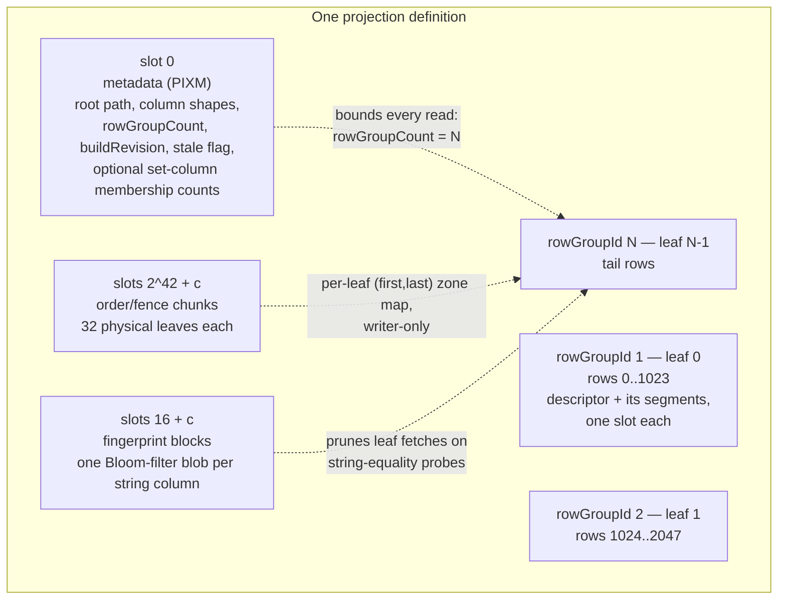
```mermaid
flowchart TB
    subgraph store["One projection definition"]
        M["slot 0<br/>metadata (PIXM)<br/>root path, column shapes,<br/>rowGroupCount, buildRevision, stale flag,<br/>optional set-column membership counts"]
        L1["rowGroupId 1 — leaf 0<br/>rows 0..1023<br/>descriptor + its segments,<br/>one slot each"]
        L2["rowGroupId 2 — leaf 1<br/>rows 1024..2047"]
        LN["rowGroupId N — leaf N-1<br/>tail rows"]
        F["slots 2^42 + c<br/>order/fence chunks<br/>32 physical leaves each"]
        B["slots 16 + c<br/>fingerprint blocks<br/>one Bloom-filter blob per string column"]
    end
    M -.->|"bounds every read:<br/>rowGroupCount = N"| LN
    F -.->|"per-leaf (first,last) zone map,<br/>writer-only"| LN
    B -.->|"prunes leaf fetches on<br/>string-equality probes"| LN
```

Each of those row groups occupies *several* HOT slots, not one: its descriptor
at `(rowGroupId << 16) | 0` and each of its segments at
`(rowGroupId << 16) | segmentId + 1` (§3). The `rowGroupId == 0` key space
belongs to the store itself: the metadata blob at key 0 and, at keys
`16 + column`, one **fingerprint block** per string(-set) column — the
per-leaf string-dictionary fingerprints gathered into a single blob, so a
string-equality probe rules out leaves with one sequential read instead of a
scattered per-leaf fetch. Incremental maintenance tombstones the blocks
before patching leaves (a stale filter would prove a fresh value "absent");
the next full build rewrites them, and readers without one fall back to the
per-leaf filters.

Each leaf carries, per column:

| Column kind | id | In-leaf representation |
|---|---:|---|
| `NUMERIC_LONG` | 0 | 64-bit values + zone map (min/max) |
| `BOOLEAN` | 1 | 1024-bit bitmap words |
| `STRING_DICT` | 2 | leaf-local dictionary + per-row dict ids |
| `NUMERIC_DOUBLE` | 3 | order-preserving 64-bit transform of the double bits (§9) |
| `STRING_SET` | 4 | array-valued fields: `STRING_DICT` storage plus a per-row element count, elements laid out consecutively |

plus a **presence bitmap** (a field can be missing on any row) and sticky
**provenance flags**:

| Flag | Meaning |
|---|---|
| `UNREPRESENTABLE` (0x01) | some present value could not be represented in the column type (e.g. a string in a long column, NaN in a double column) — value-serving is refused, fall back |
| `NON_INTEGRAL` (0x02) | long column: some source number was not an exact integer |
| `NOT_VALUE_EXACT` / non-integral reading for doubles | double column: some source value (BigDecimal/BigInteger) rounded during conversion — value-exact serving declined |

The 1024-row leaf is a deliberate, load-bearing choice (§2.1 of the
redesign): it is the re-extraction granularity of incremental maintenance
and exactly matches the kernels' 1024-bit match masks. It is *not* the I/O
granularity — that is the segment (§4).

### 2.1 Two forms of the same leaf

Every leaf exists in two byte-identically convertible forms:

- **Raw scan form** (`ProjectionIndexLeafPage.serialize()`, `PIX1` presence
  tail): flat little-endian primitive arrays — what the SIMD kernels
  consume, cached on the heap.
- **Persisted form**: per-column *segments* using compact encodings
  (delta/frame-of-reference record keys, FOR bit-packed numerics, packed
  dict ids, marker-byte presence, optional FSST dictionaries).

The round-trip guarantee is absolute: `assembleRaw(encode(leaf))`
reproduces the raw form **byte for byte**, presence and provenance
included. This is regression-tested down to multi-kilobyte dictionaries and
adversarial FSST inputs.

---

## 3. Architecture: where the projection lives in the page tree

Projection indexes plug into the same secondary-index machinery as
CAS/PATH/NAME indexes, under one `RevisionRootPage` per revision:

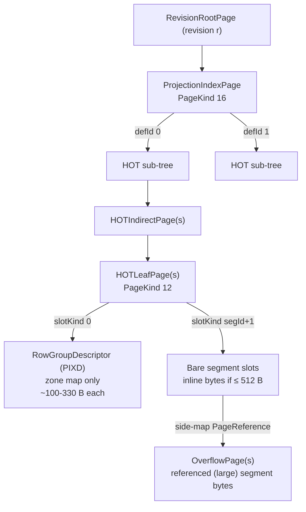
```mermaid
flowchart TD
    RRP["RevisionRootPage (revision r)"]
    PIP["ProjectionIndexPage<br/>PageKind 16"]
    RRP --> PIP
    PIP -->|"defId 0"| T0["HOT sub-tree"]
    PIP -->|"defId 1"| T1["HOT sub-tree"]
    T0 --> HI["HOTIndirectPage(s)"]
    HI --> HL["HOTLeafPage(s)<br/>PageKind 12"]
    HL -->|"slotKind 0"| D["RowGroupDescriptor (PIXD)<br/>zone map only<br/>~100-330 B each"]
    HL -->|"slotKind segId+1"| SS["Bare segment slots<br/>inline bytes if ≤ 512 B"]
    SS -->|"side-map PageReference"| SP["OverflowPage(s)<br/>referenced (large) segment bytes"]
```

- One **HOT trie** (Height Optimized Trie) per index definition. **Every
  segment is its own slot** — the mapping is 1:1, not "one slot per leaf" —
  under a composite key `(rowGroupId << 16) | slotKind`, where `slotKind 0`
  is the row group's descriptor and `slotKind segmentId + 1` is that
  segment's bytes. Keys are `PathKeySerializer.serialize(slotKey)` —
  sign-flipped 8-byte big-endian, so unsigned byte comparison preserves
  numeric order, one row group's slots are key-adjacent, and a range scan
  yields them in ascending order.
- The descriptor slot's **value** is a `RowGroupDescriptor` (§5) — a
  **zone-map-only** directory: it names each segment with a `byteLen` and an
  XXH3-64 `contentHash` and mirrors its min/max/flags, but carries no segment
  bytes. Descriptor-contained segment bytes are not a second supported form:
  descriptor validation rejects them. Storing every payload in its one
  segment slot leaves exactly one authoritative copy.
- A **segment slot** is BARE — no magic, no version, no on-disk hash, because
  the descriptor entry's `byteLen` + `contentHash` already back it and are
  re-checked at assembly. Its value is a 1-byte discriminator plus either the
  raw bytes (**inline**, ≤ 512 B) or nothing (**referenced**), the latter
  hanging one **`OverflowPage`** off the HOT leaf's *side map* — a
  `(ownerSlot, subId) → PageReference` map that serializes alongside the page
  but outside slot bytes. (The `ProjectionSegmentPage` of earlier drafts was
  retired for this reuse.)
- Referenced segment pages have **offset identity** like any `OverflowPage`:
  their durable key *is* their file offset, assigned at write time. No
  logical page key, no fragment chain — immutable once written; a change
  writes a new page (last-writer-wins at the reference). Inline segments, by
  contrast, ride their slot and are versioned with the HOT leaf holding it
  (§8.4).

This descriptor-vs-payload split is the heart of the design. HOT slots
shrink from ~4 KB chunk values (the interim layout) to ~100–330 B descriptors
and mostly-small segment slots, so one 64 KB `HOTLeafPage` holds hundreds of
slots instead of ~15 chunks, the trie gets shallower by orders of magnitude,
and the deep-split failure families of the chunked era disappear (§1.6/§2.5 of
the redesign).

The 1:1 mapping is also what makes the read path cheap in *page touches*, not
just bytes: because a row group's slots are key-adjacent, a full read is ONE
range scan followed by one coalesced batch per tier, rather than
`O(rowGroups × segments)` root-to-leaf descents. Descriptor-only work
(`countRows`, zone-map pruning) reads `slotKind 0` and touches no segment at
all; an aggregate over column *c* reads that column's slots and nothing else.

---

## 4. Semantic segments — the columnar unit of I/O and sharing

A leaf's persisted bytes are split on **column boundaries** — never byte
offsets — into up to `3·columnCount + 1` segments:

| Segment | id | Contents |
|---|---:|---|
| `KEYS` | `0` | record-key column (fences + delta/FOR-packed keys) |
| `BODY(c)` | `3c + 1` | column *c*: flags, zone map, presence bitmap, encoded values |
| `DICT(c)` | `3c + 2` | column *c*'s leaf-local dictionary (string columns only) |

The 16-bit `slotKind` space caps a projection at
`MAX_COLUMNS = (65535 − 2) / 3 = 21 844` columns — validated at creation, and
*derived* in `RowGroupDescriptor` from the id-scheme constants rather than
restated, so adding a fourth per-column segment kind tightens it automatically.
(It was 84 when `segmentId` had to share an 8-bit side-map sub-id field with the
leaf index; giving each segment its own slot freed that space.)

For the running example (3 columns: `age`, `active`, `dept`), one leaf
persists as **five** segments:

Each of those five is its own HOT slot, key-adjacent to the descriptor. Slot
keys below are `(rowGroupId=1 << 16) | slotKind`, i.e. `0x1_0000 + slotKind`:

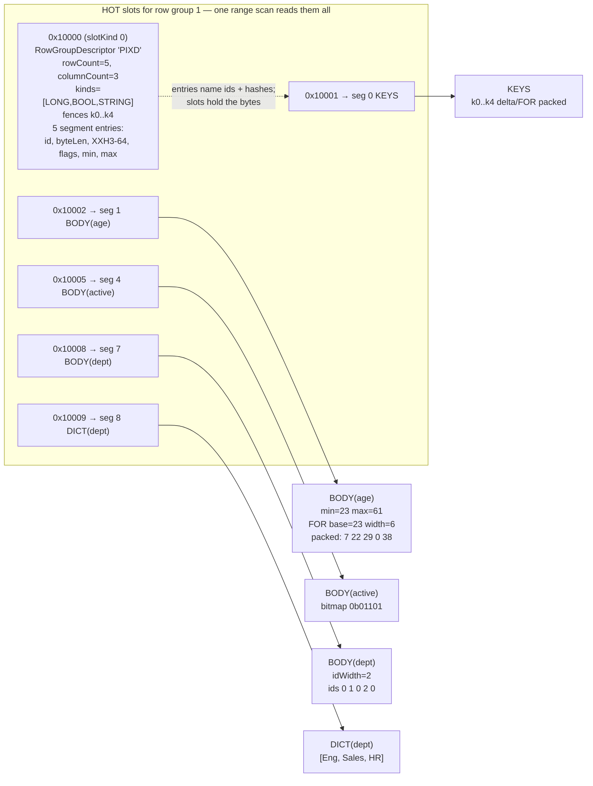
```mermaid
flowchart LR
    subgraph slots["HOT slots for row group 1 — one range scan reads them all"]
        PIXD["0x10000 (slotKind 0)<br/>RowGroupDescriptor 'PIXD'<br/>rowCount=5, columnCount=3<br/>kinds=[LONG,BOOL,STRING]<br/>fences k0..k4<br/>5 segment entries:<br/>id, byteLen, XXH3-64, flags, min, max"]
        E0["0x10001 → seg 0 KEYS"]
        E1["0x10002 → seg 1 BODY(age)"]
        E4["0x10005 → seg 4 BODY(active)"]
        E7["0x10008 → seg 7 BODY(dept)"]
        E8["0x10009 → seg 8 DICT(dept)"]
    end
    PIXD -.->|"entries name ids + hashes;<br/>slots hold the bytes"| E0
    E0 --> S0["KEYS<br/>k0..k4 delta/FOR packed"]
    E1 --> S1["BODY(age)<br/>min=23 max=61<br/>FOR base=23 width=6<br/>packed: 7 22 29 0 38"]
    E4 --> S4["BODY(active)<br/>bitmap 0b01101"]
    E7 --> S7["BODY(dept)<br/>idWidth=2<br/>ids 0 1 0 2 0"]
    E8 --> S8["DICT(dept)<br/>[Eng, Sales, HR]"]
```

At this size every one of those segments is well under 512 B, so all five ride
their slot values inline and the row group costs **zero** `OverflowPage`s. At
1024 rows the KEYS and BODY segments cross the threshold and become referenced;
a 4-value dictionary never does.

Why this decomposition (the Parquet/DuckDB/ClickHouse lesson, §2.1 of the
redesign):

1. **Reads become columnar.** A predicate on `age` fetches `BODY(age)` and
   nothing else. `countRows` reads *no* segments — descriptors alone answer
   it. A string-equality predicate fetches `BODY(dept)` + `DICT(dept)`.
2. **Writes become contained.** A one-row in-place `age` update re-encodes
   one BODY segment + one descriptor slot. The byte-shift cascade of a
   monolithic encoding (change one value → FOR width grows → every
   downstream byte moves) is confined inside a single column's segment by
   construction.
3. **Stats live above the data.** The descriptor mirrors per-column
   min/max/flags, so zone-map pruning and emptiness checks never touch
   segment bytes.
4. **Dictionaries are separable** — the prerequisite for store-level
   canonical dictionaries (the planned fix for per-leaf dictionary
   amortization at 100 M-row scale, §8.6 R1).

A deliberate divergence from those systems: no fat row groups. DuckDB uses
~122 880-row groups, Parquet ~128 MB; SirixDB keeps 1024-row leaves because
maintenance re-extracts touched leaves wholesale and CoW sharing works at
page granularity — a small leaf is what makes per-commit maintenance cheap.

---

## 5. Wire formats, byte by byte

Four magics, all little-endian; every payload is self-describing:

| Magic | ASCII | Where | Role |
|---|---|---|---|
| `0x44584950` | `PIXD` | HOT slot value | leaf descriptor |
| `0x53584950` | `PIXS` | segment page payload | one encoded segment |
| `0x42584950` | `PIXB` | HOT blob slot value | blob marker (metadata + fence chunks; payload inline or referenced) |
| `0x4D585049` | `PIXM` | blob payload of slot 0 | projection metadata (shape + set-summary capabilities, VERSION 0) |

### 5.1 `PIXD` — the row-group descriptor

```text
offset  size  field
------  ----  -----------------------------------------------
 0       4    MAGIC "PIXD"
 4       1    VERSION = 0                the ONLY supported value; any other is refused
 5       4    rowCount                  (0 = live empty row group)
 9       2    columnCount
11       8    firstRecordKey            ┐ fences (Long.MAX/Long.MIN
19       8    lastRecordKey             ┘  sentinels when empty)
27       C    kinds[columnCount]        one kind byte per column
27+C     2    segCount
        31    per segment entry (sorted by ascending columnSegmentId):
                short columnSegmentId   2 bytes since the cap became 21 844
                int   byteLen           exact non-negative segment length
                long  contentHash       XXH3-64 of segment bytes
                byte  colFlags          provenance mirror
                long  min               ┐ zone-map mirror
                long  max               ┘  (transform domain for doubles)
```

In the segment ⇔ slot layout the descriptor is **zone-map only**: it names
each segment and vouches for it, but never holds its bytes. The encoder emits
only this form, and every storage/read boundary validates it. A descriptor
with an inline flag or trailing payload region is unsupported and fails
closed; it is never normalized, migrated, or accepted as a second format.
Assembly therefore resolves every segment through exactly one segment slot.

Inline-vs-referenced did not disappear; it moved down one level, to the
**slot** (§8.4). A segment slot's value is a 1-byte discriminator plus either
the raw bytes (**inline**, ≤ 512 B) or nothing (**referenced**, bytes in one
side-map `OverflowPage`). The threshold is per segment, not a per-row-group
budget, because each segment now competes for space with nothing but itself.

For the example row group the descriptor is
`5 + 4 + 2 + 8 + 8 + 3 + 2 + 5·31 = 187` bytes; its five segments are all tiny,
so each rides its own slot inline (~149 B in total) and the row group costs no
segment pages at all — the *entire* on-disk footprint of a 1024-row-capable row
group is those two figures.

The `contentHash` does double duty and this is a design invariant (§5.2-h):

- **Write path**: maintenance re-encodes a column and compares
  `(byteLen, hash)` against the prior descriptor entry. On match, the prior
  `PageReference` is carried forward untouched — a no-op detected *without
  reading the prior segment bytes*.
- **Read path**: segment refs are bare 8-byte offsets with no checksum of
  their own; the descriptor hash is the **only** integrity check a segment
  ever gets. `assembleRaw` verifies length + hash before parsing. A
  mismatch throws; callers fail soft to the generic pipeline and
  negative-cache the definition for that build revision.

The mirror discipline (§5.2-k): descriptor flags/min/max are a *cache* of
the segment truth. Pruning may consult the mirror; provenance gates that
decide whether serving is *allowed* must read segment bytes. The mirror may
only ever short-circuit toward declining, never toward serving.

### 5.2 `PIXS` — segments

Common 6-byte header, then a kind-specific payload:

```text
 0   4   MAGIC "PIXS"
 4   1   SEGMENT_VERSION = 0
 5   1   segKind: 0=KEYS  1=BODY  2=DICT
```

**KEYS** (segment id 0):

```text
long firstRecordKey
long lastRecordKey
[rowCount > 0]:
  byte mode; long base; byte width; bit-packed key deltas
```

**BODY(c)** (segment id 3c+1):

```text
byte colFlags                     -- provenance TRUTH (5.1-7)
[rowCount > 0]: long min; long max -- zone-map truth
presence marker byte [+ 1024-bit words if mixed]
then by kind:
  NUMERIC long:   long base; byte width; FOR bit-packed values
  NUMERIC double: same — OR width byte 65 = ALP escape (§9.4):
                  byte e; byte f; int excCount;
                  FOR-packed decimal digits; verbatim exceptions
  BOOLEAN:        bitmap words verbatim
  STRING:         byte idWidth; bit-packed dict ids
```

Worked example, `BODY(age)` over `[30, 45, 52, 23, 61]`:
min = 23, max = 61 → frame-of-reference base = 23, deltas
`[7, 22, 29, 0, 38]`, max delta 38 → width = 6 bits → 30 bits ≈ 4 packed
bytes. The whole segment is ~35 bytes.

`BODY(active)` over `[true, false, true, true, false]`: bitmap
`0b01101` (row *i* → bit *i*) — one word.

`BODY(dept)`: dictionary ids `[0, 1, 0, 2, 0]` (first-occurrence interning
order: Eng=0, Sales=1, HR=2), dictSize 3 → idWidth = 2 bits → 10 bits
packed.

Escape space: FOR width byte **65 selects ALP** for double columns (§9.4);
bytes 66–255 remain reserved and are **rejected loudly** at decode, so an
old reader meeting a future encoding fails cleanly instead of misparsing
(§11 of the redesign).

**DICT(c)** (segment id 3c+2):

```text
byte dictMode: 0 = RAW, 1 = FSST
RAW:  int dictSize; int lens[dictSize]; concatenated UTF-8
FSST: symbol table + per-entry compressed streams (§10)
```

Empty-leaf rule (§5.1-4): a `rowCount == 0` descriptor still emits KEYS
(fence sentinels) and one BODY per column — per-column **flag truth must
survive emptiness** — but no DICT segments, and its descriptor mirrors
write the `min > max` sentinel pair so descriptor-only pruning skips it.

### 5.3 `PIXB` + `PIXM` — the metadata slot

Slot 0 does not hold a descriptor; it holds a `PIXB` **blob**. A blob is an
opaque payload stored either **inline** (bytes ride the slot value, right
after the marker) or **referenced** (bytes in a side-map `OverflowPage`) —
the same single tagged slot carrier used by the segment slots (§5.1). This is
one wire format with two size-selected states, not two readable formats or
compatibility paths. The write path picks inline for payloads ≤ 512 B:

```text
 0  4  MAGIC "PIXB"
 4  1  version = 0
 5  4  byteLen        ┐ high bit = INLINE flag; low 31 bits = exact length
 9  8  XXH3-64 hash   ┘ integrity for the payload (segment pages self-checksum nothing)
[inline only] 17..17+byteLen  the payload bytes
```

The 17-byte header is the whole slot value when the payload is referenced;
an inline blob appends the payload after it. Reads key off the INLINE flag
alone, so the 512 B threshold can change without breaking stored blobs.

The `PIXM` metadata payload is the projection's **shape and bounds
authority**: root path, per-column field paths/names/kinds (hydration reads
the shape from *here*, never trusting a caller's argument list — a
same-arity re-create with different fields must not silently mislabel
columns), the live `rowGroupCount`, `buildRevision`, and the **stale flag** — the
corruption/drop valve. Ordinary maintenance never sets it (an unattributable or
corrupt touched unit fails the owning transaction instead, §8); a dropped
definition and an unfinished load-time build do. VERSION 0 carries explicit
**set-summary capability columns**. Each
capable column's counts live in an independent chunk at `1 << 44 | column`,
including an explicit empty chunk, so empty-to-nonempty maintenance remains
servable and one touched column never copies every other summary.

The shape is normally a few hundred bytes, so it inlines: opening a projection
reads its shape from the one slot value, with **no extra random read** for a
metadata page. Exact set counts never inflate this blob: slot 0 carries only
the capability-column ids, while every capable column's bounded counts occupy
its independent `1 << 44 | column` chunk. Only an unusually large shape itself
can push slot 0 past the 512 B inline threshold and into an `OverflowPage`.

`PIXM` is **VERSION 0**, and exactly one version is supported. Any other
version fails closed: serving declines and ordinary maintenance rejects the
owning transaction instead of interpreting shifted fields.

Slot-0 states are deliberately distinct:

| State | Representation | Meaning |
|---|---|---|
| Valid metadata | `PIXB` → current-version `PIXM`, stale bit clear | projection serves |
| Stale marker | `PIXB` → tiny `PIXM` with `FLAG_STALE`, plus the writer's `StaleReason` in the reason bits (see `DISK_FORMAT.md`) | an explicitly abandoned virgin build; the physical tree is not repaired or reused. Remove the catalog definition, commit, and create again to allocate a fresh physical index id |
| Truthful empty store | valid metadata, `leafCount = 0` | zero-record root; still valid |
| Unsupported/corrupt layout | slot-0 bytes are not `PIXB`, or `PIXM` version ≠ 0 | decline; maintenance fails closed |

### 5.4 The order/fence chunks — local routing units

Incremental maintenance needs two independent facts: the physical leaves in
document order, and the numeric ranges of only the normal routing-backbone
rows. V0 stores both explicitly. Initial-build leaves are immutable base
heads; locally allocated split leaves are linked after them in document order
and into a bounded numeric skip tower when they contain at least one normal
row. Exception-only leaves remain in the document chain with the sentinel
fence `[MAX_VALUE, MIN_VALUE]` and are reached only through exact locators.

Keeping this state in one slot-0 array would make every local splice rewrite
the whole index-order map, and copy-on-write history would retain every copy.
It therefore lives in fixed-size persistent units:

- One chunk per **32 physical row groups**, stored as a `PIXB` blob at reserved
  slot key `(1 << 42) + chunkIndex`. That base clears every composite row-group
  slot and stays below the side map's owner-slot ceiling. Each 144-byte entry
  carries normal first/last keys, previous/next document links, the immutable
  base owner, numeric skip links, the base high-water boundary, and a free-list
  link. A 32-entry chunk is about 4.5 KiB.
- Writing a chunk goes through the same `putBlob` carry-forward: an unchanged
  chunk (same length + hash) is a **no-op**, its `OverflowPage` shared by
  reference. A commit rewrites only chunks containing links or fences that it
  actually changed; there is no whole-fence-array rewrite.
- Chunks stay **referenced** (not inline): at about 4.5 KiB, inlining them would
  bloat the HOT leaf pages that hold the slots, defeating the point.

The change listener reads these chunks lazily for exact placement; hydration
reads their explicit physical document order before assembling row groups. A
missing, malformed, cyclic, duplicate, or incomplete order fails closed—it is
never replaced by physical-slot or numeric-key order. Implementation:
`ProjectionIndexFences` (`Accessor` for lazy lookup/touched writes, plus
`write`/`readPhysicalOrder` for creation and hydration).

---

## 6. The write path

### 6.1 Streaming build

`ProjectionIndexBuilder.buildAndPersist` walks the record set once and
emits leaves through a consumer — **one leaf in memory at a time** (the
interim design buffered every encoded leaf: ~240 MB of heap at 100 M rows;
now ~2 MB — two fence longs per leaf):

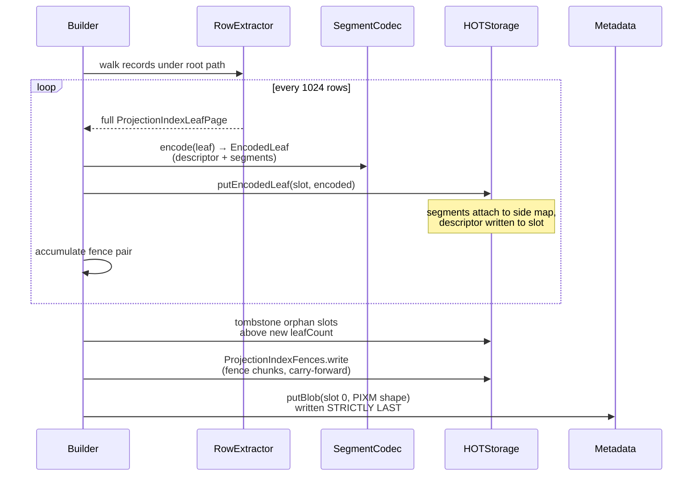
```mermaid
sequenceDiagram
    participant B as Builder
    participant X as RowExtractor
    participant C as SegmentCodec
    participant S as HOTStorage
    participant M as Metadata

    B->>X: walk records under root path
    loop every 1024 rows
        X-->>B: full ProjectionIndexLeafPage
        B->>C: encode(leaf) → EncodedLeaf<br/>(descriptor + segments)
        B->>S: putEncodedLeaf(slot, encoded)
        Note over S: segments attach to side map,<br/>descriptor written to slot
        B->>B: accumulate fence pair
    end
    B->>S: tombstone orphan slots<br/>above new leafCount
    B->>S: ProjectionIndexFences.write<br/>(fence chunks, carry-forward)
    B->>M: putBlob(slot 0, PIXM shape)<br/>written STRICTLY LAST
```

Writing metadata **last** means a failed virgin build never publishes a usable
projection. All writes ride one CoW transaction; failure aborts that transaction
and no catalog definition may point at the incomplete physical tree. The fence
chunks (§5.4) are written before metadata. Incremental maintenance uses the same
metadata-last publication rule and carries unchanged chunks forward as no-ops.

The slot writes above do **not** each descend the trie. A fresh build starts
from a virgin tree, so the builder engages `HOTBulkSlotLoader`
(`beginBulkSlotAccumulation`): every slot write accumulates, point reads are
served back out of the accumulator, side-page attaches are deferred, and the
whole tree is materialized in one canonical `HOTBulkBuilder` pass at
`finalizeBulkSlotAccumulation`. Accumulation is bounded — a capacity trip
splices the accumulated prefix and falls back to the per-entry path, which is
always safe because the drain replays in ascending key order. The class javadoc
on `HOTBulkSlotLoader` and `ProjectionIndexHOTStorage` documents the mechanism;
`docs/HOT_BULK_BUILD.md` §2 holds the memory arithmetic behind the cap.
Incremental maintenance (§8) never takes this path — it writes a non-virgin
tree per entry.

### 6.2 The commit chain — how referenced segment pages get their identity

This applies to *referenced* segments only; inline small segments (§5.1,
§8.4) travel inside their own segment slots and need no page of their own.
Referenced segments are `OverflowPage`s and follow its discipline: **never
written before commit** (rollback safety needs no undo — an uncommitted
segment page was simply never written), and their durable key is assigned
during the recursive commit descent, strictly before the owning HOT leaf's
bytes are produced:

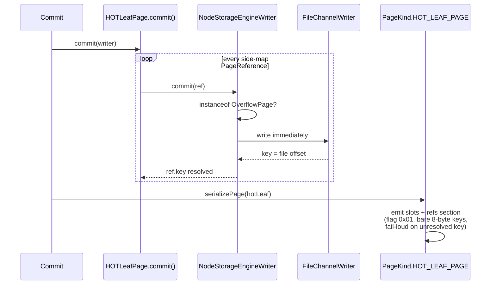
```mermaid
sequenceDiagram
    participant TX as Commit
    participant HL as HOTLeafPage.commit()
    participant W as NodeStorageEngineWriter
    participant F as FileChannelWriter
    participant PK as PageKind.HOT_LEAF_PAGE

    TX->>HL: commit(writer)
    loop every side-map PageReference
        HL->>W: commit(ref)
        W->>W: instanceof OverflowPage?
        W->>F: write immediately
        F-->>W: key = file offset
        W-->>HL: ref.key resolved
    end
    TX->>PK: serializePage(hotLeaf)
    PK->>PK: emit slots + refs section<br/>(flag 0x01, bare 8-byte keys,<br/>fail-loud on unresolved key)
```

Details that make this correct under versioning:

- The refs section is guarded by an envelope flag
  (`HOTLeafPage.FLAG_SEGMENT_REFS = 0x01`), so HOT pages without projection
  refs serialize exactly as before.
- Under non-FULL versioning, HOT fragments are sparse (dirty entries only) —
  but **every fragment carries the complete refs map**, and fragment merge
  is newest-fragment-authoritative. A ref-only change therefore never
  requires a slot to be dirtied, and a merge can never resurrect a dropped
  ref.
- `HOTLeafPage.copy()` deep-copies each `PageReference` (CoW discipline: a
  commit through one revision's page mutates only that copy's reference; a
  reference already resolved to a disk key carries the key through — which
  is exactly how unchanged segments stay shared across revisions).
- All four leaf-split variants route side-map entries **by owner-slot
  residency** (`moveSegmentRefsAfterSplit`) — correct even for the
  discriminative-bit splits, whose partition is not contiguous in key
  order.
- A projection writer never invokes the generic arbitrary-subtree rebuild
  path. Bounded local split/splice code routes every referenced segment by its
  owner slot and re-encodes only the affected leaves and ancestor spine; loud
  backstops reject any path that cannot prove reference preservation.

### 6.3 Hash-based no-op sharing

`putLeaf` / maintenance re-encode a leaf and then, per segment:

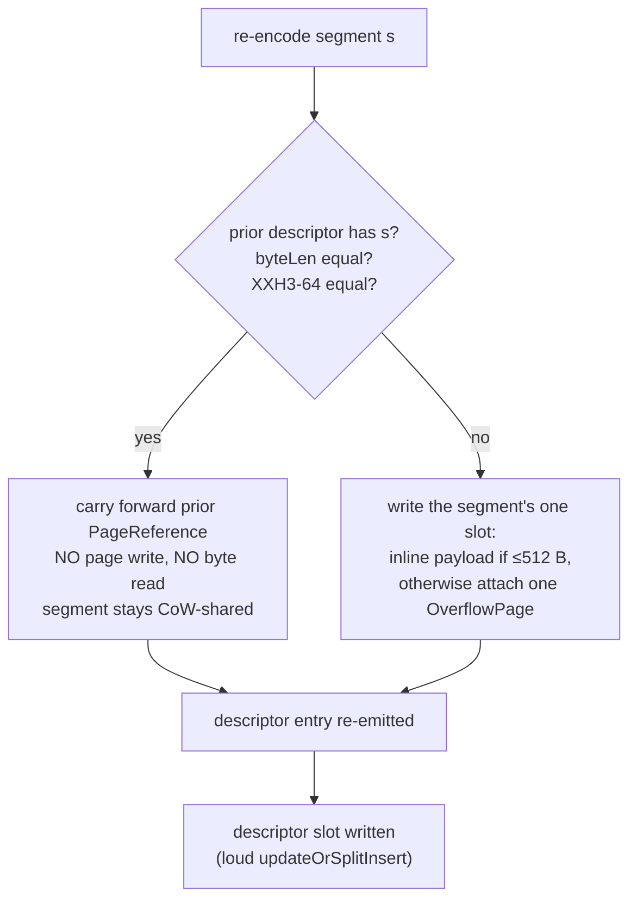
```mermaid
flowchart TD
    A["re-encode segment s"] --> B{"prior descriptor has s?<br/>byteLen equal?<br/>XXH3-64 equal?"}
    B -- yes --> C["carry forward prior PageReference<br/>NO page write, NO byte read<br/>segment stays CoW-shared"]
    B -- no --> D["write the segment's one slot:<br/>inline payload if ≤512 B,<br/>otherwise attach one OverflowPage"]
    C --> E["descriptor entry re-emitted"]
    D --> E
    E --> F["descriptor slot written<br/>(loud updateOrSplitInsert)"]
```

Determinism makes this sound: dictionary interning is append-only
first-occurrence order, extraction replay is order-stable, and FSST
symbol-table training is deterministic given identical input — so an
untouched column re-encodes to byte-identical output and hashes equal.
Consequence: explicit re-creation can share unchanged leaf segments by
reference; ordinary maintenance never performs that global walk.

### 6.4 Update containment, honestly scoped

| Change to one 1024-row leaf | Segments rewritten |
|---|---|
| in-place value update, column *c* | `BODY(c)` (+ `DICT(c)` iff the dictionary grew) + descriptor |
| row append (tail) | `KEYS` + every `BODY` (+ interning `DICT`s) + descriptor |
| row delete | every segment of the leaf (rowCount changed) + descriptor |
| untouched leaf | nothing — descriptor and all segments shared |

Deletes/appends change `rowCount`, which participates in every column's
encoding — the re-encode-then-hash-compare loop makes the containment
automatic rather than hand-tracked.

---

## 7. The read path

### 7.1 Cold open → catalog → cache

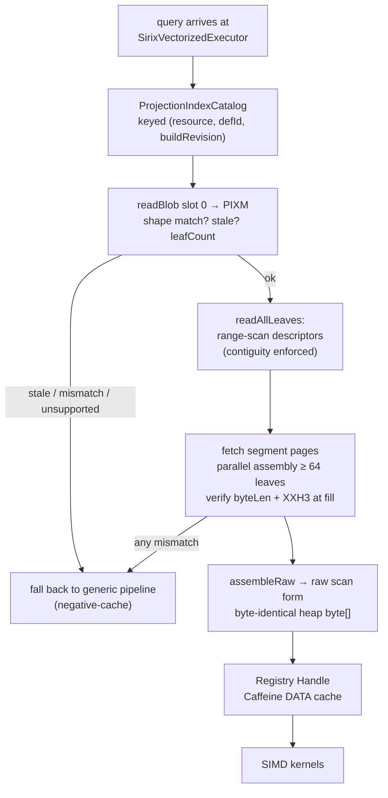
```mermaid
flowchart TD
    Q["query arrives at<br/>SirixVectorizedExecutor"] --> CAT["ProjectionIndexCatalog<br/>keyed (resource, defId, buildRevision)"]
    CAT --> META["readBlob slot 0 → PIXM<br/>shape match? stale? leafCount"]
    META -- "stale / mismatch / unsupported" --> FB["fall back to generic pipeline<br/>(negative-cache)"]
    META -- ok --> RAL["readAllLeaves:<br/>range-scan descriptors<br/>(contiguity enforced)"]
    RAL --> SEG["fetch segment pages<br/>parallel assembly ≥ 64 leaves<br/>verify byteLen + XXH3 at fill"]
    SEG -- "any mismatch" --> FB
    SEG --> ASM["assembleRaw → raw scan form<br/>byte-identical heap byte[]"]
    ASM --> H["Registry Handle<br/>Caffeine DATA cache"]
    H --> K["SIMD kernels"]
```

Kernels deliberately consume **heap `byte[]`** — a MemorySegment/FFM kernel
port measured +4.5 % wall time and was reverted; zero-copy applies to
storage-internal paths, not kernels. The catalog hydrates once per
`(resource, defId, buildRevision)` and serves every subsequent query from
cache, so descriptor-level pruning saves cold-open I/O; steady-state
columnar wins (per-column cache residency) arrive with the deferred P5b
Handle restructure.

### 7.2 Kernel execution over a leaf

`ProjectionIndexByteScan` walks the raw form with positional reads
(allocation-free). Example: `count where age > 40 and active`:

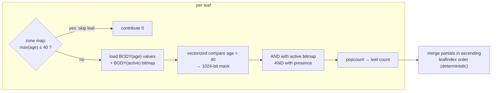
```mermaid
flowchart LR
    subgraph leaf["per leaf"]
        Z{"zone map:<br/>max(age) ≤ 40 ?"} -- "yes: skip leaf" --> N["contribute 0"]
        Z -- no --> P["load BODY(age) values<br/>+ BODY(active) bitmap"]
        P --> V["vectorized compare age > 40<br/>→ 1024-bit mask"]
        V --> W["AND with active bitmap<br/>AND with presence"]
        W --> CT["popcount → leaf count"]
    end
    CT --> MERGE["merge partials in ascending<br/>leafIndex order (deterministic)"]
```

The same conjunctive-mask machinery drives filtered aggregates
(`sum/avg/min/max` with the mask), group-by (dict-id keyed accumulation),
and count-distinct (dictionary union + presence). Every kernel's result is
differential-tested byte-identical against the interpreted pipeline.

### 7.3 The serving gates

Before any kernel runs, the executor proves it may:

- **Shape**: metadata columns match the query's paths (scoping is exact —
  `/[]/age` never matches `/[]/pet/age`; the nested-same-name suites pin
  this).
- **Revision**: the handle's `buildRevision` must not be newer than the
  query's revision (time-travel executors bound to older revisions refuse
  newer projections).
- **Provenance**: `UNREPRESENTABLE` → decline the column entirely;
  `NON_INTEGRAL` → decline integer-exact serving; double columns with
  rounding provenance → decline value-exact serving (§9.3).
- **Presence**: aggregate semantics over missing fields must match the
  interpreted pipeline's (`sum` of an all-missing column is `()`, not 0).

Failing any gate is silent and cheap: the generic pipeline answers, and a
negative cache prevents re-probing per query.

---

## 8. Incremental maintenance and bounded ownership

`ProjectionIndexChangeListener` hooks every commit of a resource with
projections:

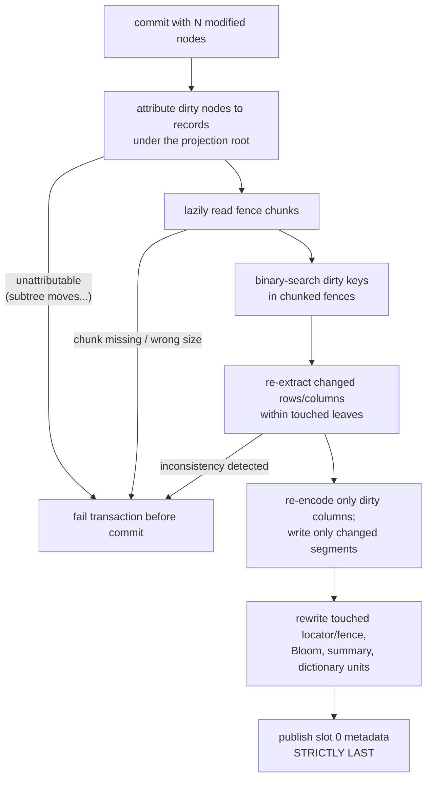
```mermaid
flowchart TD
    C["commit with N modified nodes"] --> A["attribute dirty nodes to records<br/>under the projection root"]
    A -- "unattributable<br/>(subtree moves...)" --> FC["fail transaction before commit"]
    A --> F["lazily read fence chunks"]
    F --> M["binary-search dirty keys<br/>in chunked fences"]
    M --> T["re-extract changed rows/columns<br/>within touched leaves"]
    T --> E["re-encode only dirty columns;<br/>write only changed segments"]
    E --> S["rewrite touched locator/fence,<br/>Bloom, summary, dictionary units"]
    S --> P["publish slot 0 metadata<br/>STRICTLY LAST"]
    F -- "chunk missing / wrong size" --> FC
    T -- "inconsistency detected" --> FC
```

Properties worth naming:

- **First, middle, and tail changes are positional**: allocation makes a new
  record key fresh, but says nothing about its document position. Maintenance
  derives predecessor/successor anchors from the document, resolves existing
  rows through exact locator-or-fence lookup, and splices only the affected
  bounded row groups. A new middle row and a moved normal row become sparse
  exceptions; only a proven high-key tail row extends the normal backbone.
- There is no dirty-count cliff or ordinary full-rebuild rung. Work and
  transient state remain proportional to touched persistent units.
- Subtree moves snapshot record roots and their outside anchors before and
  after pointer surgery. The same local remove/splice machinery handles
  reordering and moves into or out of the projected record set.

### 8.1 Time travel: what sharing looks like across revisions

After `replace json value of $doc[0].age with 99` (an in-place update to
leaf 0, column `age`):

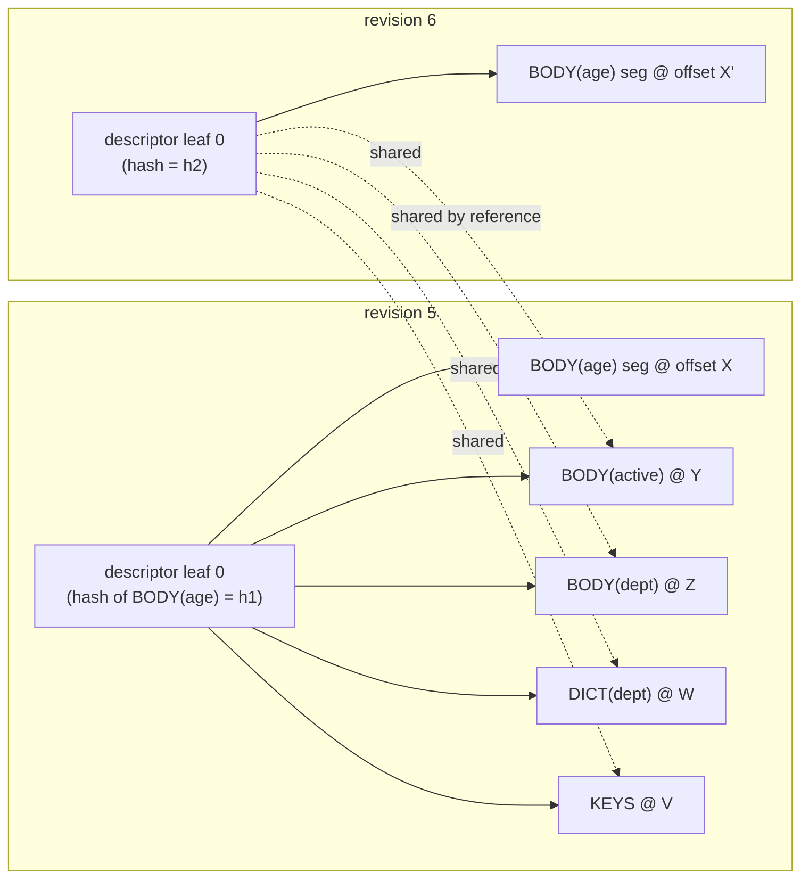
```mermaid
flowchart LR
    subgraph r5["revision 5"]
        D5["descriptor leaf 0<br/>(hash of BODY(age) = h1)"]
        B5["BODY(age) seg @ offset X"]
        A5["BODY(active) @ Y"]
        S5["BODY(dept) @ Z"]
        DI5["DICT(dept) @ W"]
        K5["KEYS @ V"]
    end
    subgraph r6["revision 6"]
        D6["descriptor leaf 0<br/>(hash = h2)"]
        B6["BODY(age) seg @ offset X'"]
    end
    D5 --> B5
    D5 --> A5
    D5 --> S5
    D5 --> DI5
    D5 --> K5
    D6 --> B6
    D6 -.->|shared by reference| A5
    D6 -.->|shared| S5
    D6 -.->|shared| DI5
    D6 -.->|shared| K5
```

A query at revision 5 and a query at revision 6 run the same kernels over
their respective snapshots; four of five segments are literally the same
disk pages. This containment is proven at the storage level by a test that
asserts segment **disk-offset equality** across revisions
(`ProjectionIndexDescriptorStorageTest`).

The store is append-only — nothing reclaims old segment pages; revision
history is the product, not garbage (§5.2-d).

### 8.2 Versioning from first principles

*Start here if "revisions" and "copy-on-write" are new — everything above
this point assumed them; this section earns them from scratch.*

**What a revision is.** Every time you `sdb:commit`, SirixDB freezes the
entire resource — document *and* its projection indexes — into a numbered
**revision**, and never touches those bytes again. Revision 41 stays
exactly as it was even after revision 42 is written; a query can ask for
"the state as of revision 41" forever. There is no separate backup, no undo
log, no "history table" bolted on: the history *is* the storage. This is
what "time travel" (§8.1) runs on.

**Why the obvious implementation is unaffordable.** The naïve way to keep
every revision queryable is to copy the whole database on each commit.
Change one `age` value in a 100-million-row resource and you would write
100 million rows again. Cost per commit would scale with the *size of the
data*, not the *size of the change* — hopeless.

**The first idea: share unchanged pages (copy-on-write).** SirixDB stores
data in a tree of fixed-capacity **pages**, and a commit rewrites only the
pages it actually touched, re-pointing the tree at the new pages while
every untouched page is *shared by reference* with the previous revision.

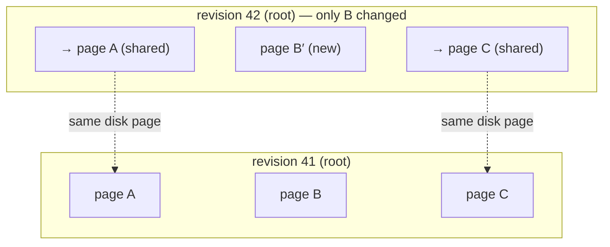
```mermaid
flowchart TB
    subgraph r41["revision 41 (root)"]
        A1["page A"]
        B1["page B"]
        C1["page C"]
    end
    subgraph r42["revision 42 (root) — only B changed"]
        A2["→ page A (shared)"]
        B2["page B′ (new)"]
        C2["→ page C (shared)"]
    end
    A2 -.->|same disk page| A1
    C2 -.->|same disk page| C1
```

Now a commit costs "the pages you touched," not "the size of the database."
A whole revision is just a new root that reuses almost everything. This is
the **copy-on-write (CoW)** primer bullet at the top of the document, drawn
out.

**The second idea, and the one this section is really about.** CoW answers
*which pages* to rewrite. It leaves a second question open: when a page
*is* touched, how much of it do you write? A SirixDB page is not one
record — it holds up to **1024** records (document nodes) or, for a
projection, up to 1024 leaf **descriptors**. If a commit changes one record
on a 1024-record page, must the new revision re-serialize all 1024?

- Write the **whole** page every time → reads are trivial (one page *is*
  the answer) but writes and disk grow with page size, not change size —
  the same waste as before, one level down.
- Write only the **changed records** as a small **page fragment** → writes
  are tiny, but a reader now has to *reconstruct* the current page by
  combining several fragments from several revisions.

That trade-off — *write-amplification now* versus *read-reconstruction
later* — is exactly what a **versioning algorithm** decides. SirixDB ships
four of them (§8.3), and they apply to document pages and projection-index
descriptor pages alike.

Three terms the algorithms are described in:

| Term | Meaning |
|---|---|
| **Page fragment** | One revision's partial write of a page — only the entries that changed that commit. The full page is the newest fragment merged with older ones. |
| **Fragment chain** | The ordered list (newest → older) of a page's fragments a reader must fetch to rebuild it. Each `PageReference` carries the disk offsets of its older fragments. |
| **`revsToRestore`** (window) | The cap on how many fragments a read ever combines — the resource's `maxNumberOfRevisionsToRestore`, **default 3**. It bounds worst-case read cost and forces a periodic *full* fragment so the chain can never grow without end. |

**Combining** a chain means walking it newest-first and letting the newest
version of each entry win. For the projection's descriptor pages (HOT leaf
pages) the merge is *by key with tombstone shadowing*: a deleted entry
writes a one-byte **tombstone** into the newer fragment so the merge knows
to hide — not resurrect — an older fragment's value for that key
(`mergeHOTFragmentsByKey`). Document-node pages do the same idea at slot
granularity with an in-window bitmap. Either way the rule is identical:
**newer fragments authoritative, missing entries filled from older ones,
tombstones shadow.**

### 8.3 The four versioning algorithms

All four are the enum constants of `VersioningType`; a resource picks one at
creation and its projection indexes inherit it. They differ only in *how
much each commit writes* and *how many fragments a read combines* — never in
the answer a query gets.

| Algorithm | Each commit writes | A read combines | Full page re-emitted | One-line character |
|---|---|---|---|---|
| **FULL** | the **complete** page | **1** fragment | every commit | zero read cost, maximum write cost; no chain at all |
| **DIFFERENTIAL** | entries changed **since the last full dump** | ≤ **2** (newest delta + last full dump) | every `revsToRestore` revisions | flat read cost; each delta re-includes everything touched since the dump |
| **INCREMENTAL** | entries changed **since the previous commit** | up to **`revsToRestore`** (delta chain back to a full dump) | every `revsToRestore` commits | smallest writes; read cost climbs to the window, then a full dump resets it |
| **SLIDING_SNAPSHOT** *(default)* | entries changed this commit **plus** any that would age out of the window | up to **`revsToRestore`** (a moving window) | never as a spike — carried continuously | incremental-sized writes with the periodic full-dump spike smoothed away |

How each reconstructs the *same* descriptor leaf after a few commits, with
`revsToRestore = 3` (the default). `Δ` is a sparse fragment, `FULL` a
complete one, an arrow `→` a fragment a read at that revision must fetch:


```mermaid
flowchart TB
    subgraph F["FULL"]
        f1["r1 FULL"] --- f2["r2 FULL"] --- f3["r3 FULL"] --- f4["r4 FULL — read: r4 only"]
    end
    subgraph D["DIFFERENTIAL (full dump every 3rd)"]
        d1["r1 FULL"] --- d2["r2 Δ(since r1)"] --- d3["r3 FULL"] --- d4["r4 Δ(since r3) — read: r4 → r3"]
    end
    subgraph I["INCREMENTAL (full dump every 3rd)"]
        i1["r1 FULL"] --- i2["r2 Δ"] --- i3["r3 Δ — read: r3 → r2 → r1"] --- i4["r4 FULL — read: r4 only"]
    end
    subgraph S["SLIDING_SNAPSHOT (window = 3)"]
        s1["r1 FULL"] --- s2["r2 Δ+carry"] --- s3["r3 Δ+carry"] --- s4["r4 Δ+carry — read: r4 → r3 → r2"]
    end
```

The distinctions that matter in practice:

- **FULL** keeps no fragment chain — the newest page is always complete, so
  a read never reconstructs and time-travel to any revision is a single
  page fetch. The cost is write-amplification: every commit re-serializes
  the whole page even for a one-entry change.
- **DIFFERENTIAL** pins read cost at two pages (newest delta + the last full
  dump) by making each delta cumulative — it re-writes *everything* changed
  since the dump, so late-in-cycle deltas grow. `getRevisionRoots` returns
  exactly `{previousRevision, lastFullDump}`.
- **INCREMENTAL** writes the least — each commit stores only that commit's
  changes — but a read walks the whole delta chain back to the last full
  dump, so read cost rises across the cycle and is reset by a periodic full
  re-emit (`fragments.size() >= revsToRestore - 1`).
- **SLIDING_SNAPSHOT** (the default) is incremental writes without the
  periodic full-dump spike: instead of re-dumping the whole page every
  `revsToRestore` commits, each commit additionally *carries forward* the
  entries about to fall out of the trailing window — `markSlotForPreservation`
  for document (record) pages, and `carryForwardAgingHOTEntries` for
  descriptor (HOT) pages: the writer marks only the still-live entries of the
  fragment about to age out (skipping tombstones and anything a newer fragment
  already re-emitted), so the rotation commit stays a *sparse* delta, not a
  full leaf. Read cost stays bounded by the window with no synchronized write
  storms — which is why it is SirixDB's default (`ResourceConfiguration`).

For the projection **descriptor** pages specifically, the three non-FULL
strategies share one merge implementation (`combineHOTLeafPages` dispatches
`DIFFERENTIAL, INCREMENTAL, SLIDING_SNAPSHOT` to the same
tombstone-shadowing `mergeHOTFragmentsByKey`); they differ only in how long
the fragment chain is allowed to grow and when a full leaf is forced
(`bumpHOTPageFragmentChain`). FULL short-circuits to "return the newest
fragment, it is already complete."

### 8.4 What versioning means for a projection index — the tagged slot carrier

Here is the payoff, and it is where the strategies of §8.3 finally earn their
keep on a projection. A row group is not stored as one blob; each of its pieces
is a slot of its own, **routed to the sharing mechanism that fits its size** — the inline-vs-
reference states of the one tagged segment-slot carrier (spec:
`PROJECTION_INDEX_HYBRID_INLINE_SEGMENTS.md`; plain-English tour:
`PROJECTION_INDEX_HYBRID_EXPLAINED.md`). It is the move a small-string-
optimized `string` makes — short strings live *inside* the object, long ones
on the heap behind a pointer — and the one `KeyValueLeafPage` already makes
for document records (an encoded inline slot allocation ≤ `MAX_RECORD_SIZE = 512` B,
including any Dewey payload/trailer; a larger allocation puts the record body in an
`OverflowPage` while the Dewey ID remains in page metadata). A projection applies it per segment.

The single persisted projection format has three storage classes with two
versioning behaviours:

| Storage class | What it is | How it versions |
|---|---|---|
| **Descriptor slots and inline segment slots** | HOT slot values: the zone-map-only `PIXD` directory at `slotKind 0` (§5.1), and every segment ≤ 512 B riding its own slot behind a discriminator byte | **Rides the algorithm (§8.3).** A slot value is a fragment-versioned unit — a non-FULL commit writes a sparse HOT fragment for touched slots; a read combines up to `revsToRestore` fragments newest-first. Small columns version as slots of their own, next to the descriptor rather than inside it. |
| **Referenced large segments** | any segment over 512 B: its bytes go to an `OverflowPage` (the retired `ProjectionSegmentPage`'s replacement) hung off the side map, its slot keeps only the discriminator | **No fragment versioning.** Offset identity — immutable once written, keyed by file offset, never merged; shared across revisions purely by reference, reuse decided by content hash (§6.3), independent of the algorithm. |
| **Order/fence chunks** | explicit document links plus normal-backbone routing metadata, 32 physical row groups/chunk in an `OverflowPage` (§5.4) | **Carry-forward.** An unchanged chunk is a hash no-op; a touched commit rewrites only chunks containing changed links/fences. Hydration reads the validated document order, while maintenance lazily reads numeric routing. |

For the running 3-column example every segment is tiny (~149 B total) so **all
five inline** into their slots: the row group is a ~187 B descriptor plus five
small slot values, zero segment pages, wholly governed by the versioning
strategy. At scale a full 1024-row `BODY(age)` (≈1 KB packed) crosses 512 B and
**spills to an `OverflowPage`**, while the 1024-row boolean (~152 B) and a small
dictionary stay inline. The cut is per segment and purely by size, so an
untouched row group re-encodes byte-identically and its carry-forward sharing
(§6.3) is unaffected.

This is the answer to "do the strategies even matter for a projection?" — now
they do, for everything that inlines:

- The **descriptor and the inline segment slots** are small and mutable, and a
  commit's change to them *is* a fragment delta. That is exactly the shape
  FULL/DIFFERENTIAL/INCREMENTAL/SLIDING_SNAPSHOT trade write-amplification
  against reconstruction depth for. A boolean or low-cardinality column
  versions as a slot with no page of its own; for narrow row groups the chosen
  strategy governs the whole projection.
- The **referenced large segments** are write-once: between revisions a
  segment is either byte-identical (shared) or fully re-encoded (a new page) —
  there is no partial delta to slide, so a temporal fragment chain has nothing
  to optimize. Content-addressed sharing (§6.3) is the strictly better fit; it
  dedups a segment across revisions by hash and is the prerequisite for dedup
  *across leaves* (the canonical-dictionary direction, §13) — dedup a temporal
  fragment chain could never reach.

The load-bearing knob is the slot inline threshold, `BLOB_INLINE_MAX = 512` B
in `ProjectionIndexHOTStorage`. It is deliberately small: inlining *everything*
would re-fatten the HOT slots and walk straight back into the deep-split
failure families the descriptor/segment split was built to kill (§3, §12) —
which is why the design inlines only what is cheap and references the rest.

> **Rejected design record.** An earlier proposal put small segment payloads in
> a trailing descriptor region. That proposal is not a readable or writable
> format. No size properties, codec classification, conversion path, or test
> seam selects it. The sole implementation gives every segment one slot and
> applies the 512-byte inline decision to that slot.
>
> Note also that 1:1 **segment ⇔ slot** — which shipped — is a different
> question from splitting ONE segment across MANY slots, which did not and is
> argued against in `PROJECTION_INDEX_WHY_NOT_SUBSLOT_SEGMENTS.md`. The first
> gives each existing unit its own address; the second would slice the unit
> itself.

Net: a time-travel query at revision *r* reconstructs the touched descriptor and
inline segment slots (bounded by `revsToRestore`) and fetches only the
*referenced* large segments the descriptors name (offset-addressed, shared, no
reconstruction). The algorithm reconstructs the map and the small stuff; the big
write-once bytes it never touches — which is the sharing §8.1 shows across
revisions, holding now for a precise reason.

---

## 9. Double columns (`NUMERIC_DOUBLE`)

### 9.1 The sortable-bits transform

Doubles reuse **every** signed-long compare surface — zone maps, zone
skipping, the numeric predicate kernels, FOR bit-packing — through one
order-preserving involution on the raw bit pattern
(`ProjectionDoubleEncoding`):

```java
encoded = bits ^ ((bits >> 63) & 0x7FFF_FFFF_FFFF_FFFFL);
```

Positive doubles (sign bit 0) keep their bits — IEEE-754 ordering of
non-negative doubles *is* signed-long ordering. Negative doubles keep the
sign bit (still negative as a long) and flip the magnitude bits, so
more-negative doubles map to smaller longs. Applying the same expression
twice returns the original bits (an involution — encode and decode are the
same two ops, branch-free).

| double | raw bits | encoded (signed long order) |
|---|---|---|
| `-∞` | `0xFFF0000000000000` | `0x800FFFFFFFFFFFFF` (near Long.MIN) |
| `-1.5` | `0xBFF8000000000000` | `0xC007FFFFFFFFFFFF` |
| `-0.0` | `0x8000000000000000` | `0xFFFFFFFFFFFFFFFF` (= −1) |
| `0.0` | `0x0000000000000000` | `0` |
| `1.5` | `0x3FF8000000000000` | `0x3FF8000000000000` |
| `+∞` | `0x7FF0000000000000` | `0x7FF0000000000000` |

No finite double (nor ±∞) encodes onto `Long.MIN_VALUE`/`Long.MAX_VALUE`,
so the `min > max` empty-column sentinel stays unambiguous. NaN never
reaches the transform: it is marked `UNREPRESENTABLE` at extraction (JSON
cannot produce it anyway).

Property tests (`ProjectionDoubleEncodingTest`) pin strict order
preservation over 20 000 samples plus edge cases, bit-exact involution, and
sentinel safety.

### 9.2 Plan-time literal transform — the critical invariant

Column cells are stored in the transform domain, so **predicate literals
must be transformed exactly once, at plan time** (§5.2-m). The executor's
predicate extraction is kind-aware per comparison opcode:

| Opcode | Long column | Double column |
|---|---|---|
| `OP_NUM_CMP` (integer literal) | literal as-is | `encode((double) lit)` — declined above 2⁵³ (not exactly representable) |
| `OP_FP_CMP` (double literal) | threshold-rewrite gates | `encode(lit)` natively; NaN declined |
| `OP_DEC_CMP` (decimal literal) | decimal-exact compare | XQuery promotes decimal→double: `encode(decLit.doubleValue())` with the original operator |

Getting any of these wrong produces *silently wrong results*, not errors —
this is exactly the class of bug the adversarial review pass between phases
caught (the `OP_DEC_CMP` arm initially compared untransformed decimal
literals against transformed cells). The regression suite pins mixed
int/double predicates, decimal literals on double columns, and
double-literal predicates on integer columns.

### 9.3 Extraction exactness and aggregate honesty

Extraction (`ProjectionIndexRowExtractor`) stores `doubleValue()` and
tracks exactness per source type: `Double`/`Float`/`Integer` are always
exact; `Long` is exact iff round-trippable (`(long)(double) l == l`, with
`Long.MAX_VALUE` explicitly lossy — saturation makes the naive round-trip
lie); `BigDecimal`/`BigInteger` are compared via `BigDecimal` for exactness
and flagged when rounding occurred.

Aggregate serving over double columns is **purity-gated**. Counts are
always served (exact in the transform domain). Sum/avg/min/max are served
only under the **pure-double-source provenance bit**
(`COLUMN_FLAG_PURE_DOUBLE_SOURCE`, flags bit 2): every cell of the column,
on every leaf, was extracted from a `Double` source. Under that bit the
interpreted fallback provably aggregates in double space and types the
result `xs:double` — and the serving arithmetic reproduces the
interpreter's bit for bit: sums fold seed-first in document order
(identical to the interpreter's pairwise fold, which the review proved is
*not* the same as a zero-seeded fold — a lone `-0.0` and ill-conditioned
sums like `[1e16, 1, 1]` expose the difference), and min/max use
`Double.compare` total order, which distinguishes `-0.0 < 0.0` where IEEE
`<` does not. Regression tests pin each of these edges against the
interpreter's serialized output.

The subtlety is what counts as a double source. SirixDB's JSON shredder
tags plain decimal literals (`1.25`) as `BigDecimal` — XQuery then
aggregates them *decimal-exactly* and surfaces `Dec`, which a double
accumulator cannot reproduce digit-for-digit. Only exponent-form literals
that round-trip (`1.25E0`) shred as `Double`. So: scientific-notation and
sensor/ML-style data gets full fast-path aggregates; bookkeeping-style
plain decimals deliberately stay on the exact fallback (count still
served). Exact-but-wrongly-typed sources also clear the bit — an integer
`3` (the fallback would type the result `Dec`) or a `Float` (typed
`xs:float`, accumulated in float arithmetic): the bar is result *type*
parity, not representability. `ProjectionDoubleAggregateServingTest` pins
every one of these shapes.

---

### 9.4 ALP — compressing decimal doubles

Most real-world doubles are decimals in disguise: `12.25`, `3.4`, `-0.7`.
Their transform-domain bit patterns look random to FOR packing (~50–64 bits
per value), but as *decimal digits* they are tiny integers. ALP (adaptive
lossless floating-point) exploits exactly that, per leaf-column vector:

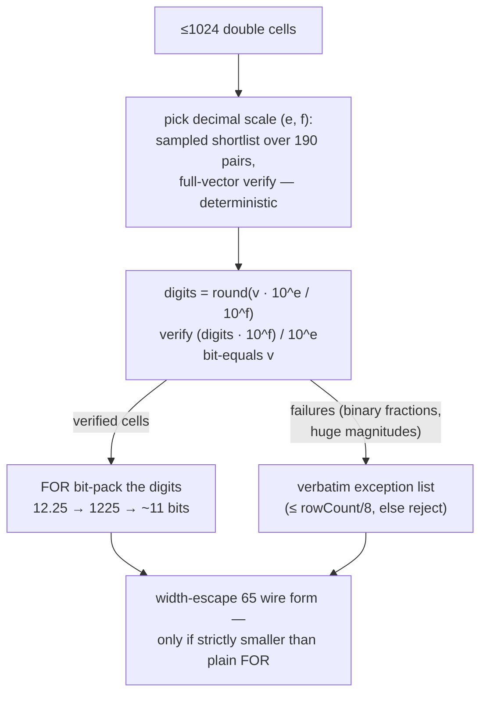
```mermaid
flowchart TD
    V["≤1024 double cells"] --> S["pick decimal scale (e, f):<br/>sampled shortlist over 190 pairs,<br/>full-vector verify — deterministic"]
    S --> E["digits = round(v · 10^e / 10^f)<br/>verify (digits · 10^f) / 10^e<br/>bit-equals v"]
    E -- "verified cells" --> P["FOR bit-pack the digits<br/>12.25 → 1225 → ~11 bits"]
    E -- "failures (binary fractions,<br/>huge magnitudes)" --> X["verbatim exception list<br/>(≤ rowCount/8, else reject)"]
    P --> W["width-escape 65 wire form —<br/>only if strictly smaller than plain FOR"]
    X --> W
```

Two details are load-bearing. First, the decode expression ends in a
**division** — IEEE division is correctly rounded, so `k / 10ⁿ` decimals
verify bit-exact, where the tempting reciprocal multiply (`digits × 0.1`)
misses about half of them (a bug the ALP test suite caught immediately).
Second, every cell is verified against that exact expression at encode
time, so losslessness is a per-value proof, not a property argument —
`-0.0` (whose digits decode to `+0.0`) simply lands in the exception list.

Non-decimal data (π multiples, huge magnitudes) fails the profitability
bar and falls back to the plain FOR form byte-identically to before — the
escape byte is the only signal, and pre-ALP stores never carried it.
Selection is deterministic end to end, so the descriptor-hash no-op
carry-forward (§6.3) keeps sharing ALP segments across revisions.

## 10. FSST-compressed dictionaries

String dictionaries ride the persisted `DICT(c)` segment only; the raw scan
form always holds plain UTF-8, so **kernels never see compressed bytes**
(they compare dictionary entries as raw bytes pervasively — decompressing at
segment decode means zero kernel changes).

There is exactly **one FSST implementation** in the codebase —
`io.sirix.utils.FSSTCompressor`, already production-wired for PAX string
storage in `KeyValueLeafPage` — and the projection reuses it wholesale:

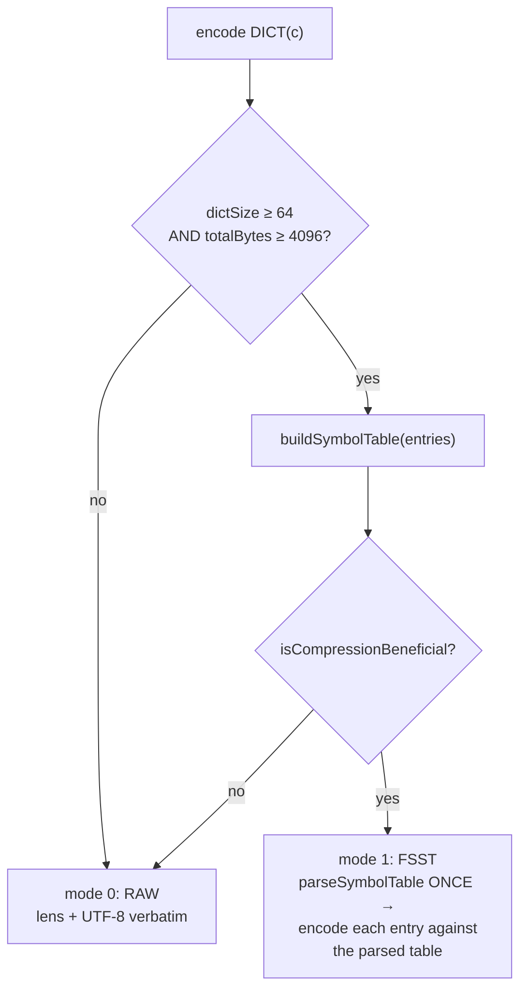
```mermaid
flowchart TD
    E["encode DICT(c)"] --> G{"dictSize ≥ 64<br/>AND totalBytes ≥ 4096?"}
    G -- no --> RAW["mode 0: RAW<br/>lens + UTF-8 verbatim"]
    G -- yes --> T["buildSymbolTable(entries)"]
    T --> B{"isCompressionBeneficial?"}
    B -- no --> RAW
    B -- yes --> F["mode 1: FSST<br/>parseSymbolTable ONCE →<br/>encode each entry against<br/>the parsed table"]
```

Typical leaf-local dictionaries (8–50 entries) take the RAW path — the
gates exist so FSST only pays where it wins (high-cardinality string
columns). Training is deterministic for identical input order, and
dictionary order is append-only interning order — so the no-op
`contentHash` stays stable across identical re-encodes (§5.2-n), keeping
hash-based sharing intact for FSST segments.

Decode parses the symbol table once per segment and batch-decodes into the
raw dictionary layout — the byte-identity guarantee of `assembleRaw` covers
FSST segments like any other.

---

## 11. Corner cases worth knowing

The full catalog is §5 of the redesign doc; these are the ones that shape
day-to-day behavior:

- **Tombstone vs live empty leaf** (§5.1-4): a zero-length slot value means
  *absent leaf* (deleted); a `PIXD` with `rowCount = 0` is a *live* empty
  leaf (every row of a mid-store leaf legitimately deleted; slots stay
  contiguous). `getLeaf` returns null only for the former; the
  truncated-store check counts descriptors, so mid-store empty leaves never
  trip fail-soft.
- **Physical order is explicit and validated**: base slots start contiguous,
  but local splits and recycling may leave a live physical slot above the live
  row-group count. The order header and chunk links must account for every
  physical slot exactly once as live or free, with no gap, duplicate, cycle,
  or broken previous link. Hydration follows that validated order.
- **The column cap** (`3c + 2 ≤ 65535` → 21 844) fails fast at creation, and
  the segment-id math (`checkColumn`) refuses out-of-range columns before a
  narrowing cast could silently wrap one column's segment onto another's. It
  was `≤ 255` → 84 while the segment id shared an 8-bit side-map sub-id field
  with the leaf index.
- **Segment size bound**: a referenced segment is capped at
  `OverflowPage.MAX_PAGE_BYTES = 16 MB` — far above any 1024-row leaf's worst
  case; a violation is a loud bug signal, not a spill path.
- **Same-commit create+delete** of a record dedupes in the dirty set and
  extraction simply finds nothing — no phantom rows.
- **Dropped definitions** remove only the catalog definition. The immutable
  historical physical tree remains addressable by its old id for time travel;
  a later create allocates a fresh physical id and therefore cannot resolve
  old segment pages through stale descriptors.

## 12. V0 format identity and failure policy

Exactly one projection format is implemented. Every projection envelope and
payload emits version zero; unknown version bytes decline at serving boundaries
and fail ordinary maintenance before publication. Same-shape create is
idempotent only for a usable catalogued definition. Replacement requires
drop + commit + create, and create allocates a fresh physical CoW sub-tree;
there is no on-open migration or in-place repair contract.

## 13. Performance positioning

Measured standing at 100 M records (protocol in `COMPARISON_DUCKDB.md`;
full context in §8 of the redesign doc):

| shape | SirixDB (PGO native) | DuckDB | standing |
|---|---:|---:|---|
| filtered count | **33 ms** | 40 ms | ahead |
| filtered range count | **42 ms** | 44 ms | ahead |
| filtered group-by | **43 ms** | 59 ms | ahead |
| sum/avg/min+max | 16–19 ms | 10–18 ms | 1.1–1.6× |
| group-by (1 key / 2 keys) | 71 / 240 ms | 28 / 115 ms | 2.1–2.5× |
| count-distinct | 81 ms | 18 ms | 4.2× |

Per-kernel physics is competitive; the remaining gaps are per-leaf
dictionary amortization at scale (the DICT-segment separation built here is
the prerequisite for the store-level canonical dictionary that closes it)
and kernel shape coverage. The structural advantage no immutable-storage
engine can follow: every revision is queryable with the same kernels, and a
commit's maintenance cost is a handful of segment pages — not a part
rewrite, not an ETL export.

## 14. Source map

| Concern | Where |
|---|---|
| Descriptor wire format | `index/projection/RowGroupDescriptor.java` |
| Segment codec (encode/assemble/FSST modes) | `index/projection/ProjectionIndexSegmentCodec.java` |
| Shared encoding primitives (FOR, presence, dicts) | `index/projection/ProjectionIndexLeafCodec.java` |
| Raw scan form | `index/projection/ProjectionIndexLeafPage.java` |
| Storage API (slots, blobs, readAllLeaves, virgin-tree initialization) | `index/projection/ProjectionIndexHOTStorage.java` |
| Double transform | `index/projection/ProjectionDoubleEncoding.java` |
| Extraction + exactness | `index/projection/ProjectionIndexRowExtractor.java` |
| Streaming build | `index/projection/ProjectionIndexBuilder.java` |
| Fresh-build slot accumulation (bulk splice) | `index/hot/HOTBulkSlotLoader.java` |
| Incremental maintenance | `index/projection/ProjectionIndexChangeListener.java` |
| Catalog / hydrate | `index/projection/ProjectionIndexCatalog.java` |
| Kernels | `index/projection/ProjectionIndexByteScan.java` |
| Segment-slot storage / 512-byte carrier choice | `page/OverflowPage.java`, `index/projection/ProjectionIndexHOTStorage.java` |
| Per-leaf fence chunks | `index/projection/ProjectionIndexFences.java` |
| Side map, refs serialization, split routing | `page/HOTLeafPage.java`, `page/PageKind.java` |
| Commit chain | `access/trx/page/NodeStorageEngineWriter.java` |
| Executor integration | `sirix-query .../scan/SirixVectorizedExecutor.java` |
| Create/drop functions | `sirix-query .../function/jn/index/create/CreateProjectionIndex.java`, `.../drop/DropProjectionIndex.java` |

*(paths relative to `bundles/sirix-core/src/main/java/io/sirix/` unless
noted)*

## 15. Glossary

| Term | Meaning |
|---|---|
| **Record / record key** | One JSON node (commonly an array item) or XML element matching the projection root; its record key is the document node key — a stable 64-bit identity allocated monotonically in time, **not** a document-order label. Rows stay in explicit document order; inversions use sparse order-exception bits and exact locators. |
| **Leaf (logical leaf) / row group** | Up to 1024 consecutive records' worth of columns — the unit of extraction, encoding, and maintenance. Not to be confused with a HOT leaf *page*. This document says *leaf*; the code says **row group** (`RowGroupDescriptor`, `ProjectionIndexRowGroupPage`, `rowGroupId`). Same thing. |
| **Descriptor (`PIXD`)** | The ~100–200 byte summary of one row group, stored as the HOT slot value at `slotKind 0`: row count, column kinds, fences, and one entry (id, length, hash, stats) per segment. Zone map only — it names and vouches for segments, it does not hold their bytes. |
| **Segment** | One column's `n` rows for a single row group (`n` = its row count, ≤ 1024) — *not* the whole column, which is sliced into ~one segment per row group. Forms: `KEYS` (the record-key "column"), `BODY(c)` (column `c`'s flags + presence + values), or `DICT(c)` (a string column's dictionary). Every segment gets **its own HOT slot** (1:1), inline in that slot's value when small, else in its own referenced page. |
| **Segment storage (inline vs referenced)** | A small segment (≤ 512 B) rides its own slot's value behind a discriminator byte; a larger one lives in an `OverflowPage`, identified by file offset, immutable once written, shared across revisions by reference. |
| **Slot key** | `(physicalRowGroupSlot << 16) \| slotKind` — `slotKind 0` is the row group's descriptor, `slotKind segmentId + 1` that segment's bytes. Slot 0 is the `PIXM` metadata; keys at or above `1 << 42` are order/fence chunks. One physical row group's segments are key-adjacent; logical document order comes from the validated order links. |
| **Side map** | A small map on the HOT leaf page — `(ownerSlot, subId) → PageReference` — connecting a *referenced* segment slot to the page holding its bytes. Serialized with the page but outside slot values. |
| **HOT trie** | Height Optimized Trie — the ordered key→value index structure that maps slot keys to descriptors. One per projection definition. |
| **Fences** | The first and last non-exception record key of a physical leaf. Normal lookup uses the base high-water table and local numeric skip links; exception lookup uses an exact sparse locator. |
| **Zone map** | Per-column min/max kept in the descriptor and BODY segment; lets queries skip whole leaves without reading values. |
| **Presence bitmap** | One bit per row per column: is the field present on this record? Missing fields are first-class (JSON is sparse). |
| **Provenance flags** | Per-column sticky truth bits (`UNREPRESENTABLE`, `NON_INTEGRAL`, …) recording anything that would make fast-path answers inexact. Serving gates read them and decline rather than risk a wrong answer. |
| **Raw scan form** | The flat in-memory layout (`PIX1` tail) the SIMD kernels read — reconstructed byte-identically from segments at hydrate time. |
| **Hydrate** | Loading and assembling a projection's leaves from disk into the query-side cache, once per (resource, definition, build revision). |
| **Blob slot (`PIXB`/`PIXM`)** | The hashed-blob container used for metadata and auxiliary blob slots: a marker with byteLen + XXH3-64, payload inline (≤ 512 B) or in one page. `PIXM` is the metadata payload it carries at slot 0 (shape, row-group count, stale flag). |
| **Tombstone** | A zero-length slot value marking a deleted slot — distinct from a live row group with zero rows. A stale metadata marker is reserved for an explicitly abandoned virgin build; catalog drop does not mutate the physical tree. |
| **Carry-forward / no-op share** | Skipping a segment write because the re-encoded bytes hash identically to the prior revision's — the prior page is referenced instead of rewritten. |
| **Fail closed / fall back** | The serving discipline: any unproven precondition silently routes the query to the generic document-scan pipeline, which is always correct (just slower). |
| **Differential suite** | Tests that run every query on both the vectorized path and the interpreted pipeline and require byte-identical results. |
| **buildRevision** | The revision a projection's columns were extracted at; caches and time-travel gates key on it. |
| **FSST** | Fast Static Symbol Table — a string compression scheme; applied to large persisted dictionaries only, invisible to kernels. |
| **FOR** | Frame of reference — store a block minimum plus small offsets instead of full-width values. |
