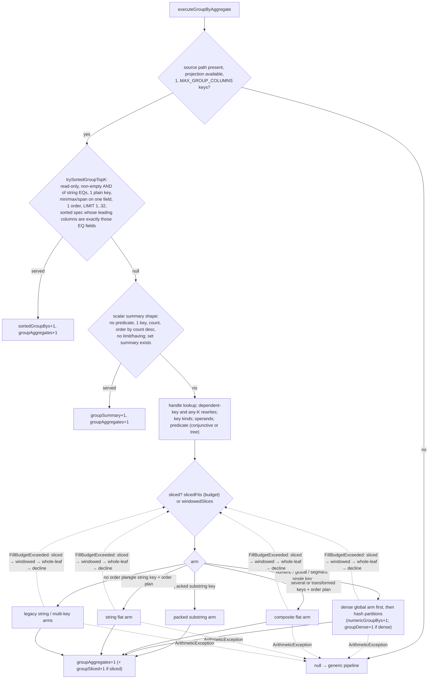

# Projection Indexes, the Segment Lane and the Read Path: Specification and Campaign Record

Status: **specification of the code on `main` after PR
[#1214](https://github.com/sirixdb/sirix/pull/1214)** (merged 2026-09-19), plus the record of the 2026
benchmark campaign that built it. First written 2026-09-17 against commit `739e46288` and revised
2026-09-20 against the merged tree; nothing in this document was verified by running code. Measured
figures are copied from the reports named next to them and never recomputed.

The document has two voices. Sections 2-8 are **normative where the code is**: formats, invariants,
algorithms, defaults, each with a `path:line` citation into the merged tree. Sections 1 and 9-11 are
**descriptive**: what was built, why, what was measured and what is still open.

The projection store keeps its pages in a HOT tree; [HOT_INDEX_SPECIFICATION.md](HOT_INDEX_SPECIFICATION.md)
specifies that tree, its page formats and its concurrency rules.

## Contents

0. [Conventions](#0-conventions)
1. [Motivation and history](#1-motivation-and-history)
2. [Projection index model](#2-projection-index-model)
3. [Storage format](#3-storage-format)
4. [Dictionaries and string encodings](#4-dictionaries-and-string-encodings)
5. [Build path and incremental maintenance](#5-build-path-and-incremental-maintenance)
6. [Read-side structures](#6-read-side-structures)
7. [Query serving](#7-query-serving)
8. [I/O layer and caches](#8-io-layer-and-caches)
9. [Measurement methodology and results](#9-measurement-methodology-and-results)
10. [The generality rule, audited](#10-the-generality-rule-audited)
11. [Open questions](#11-open-questions)
12. [Existing documents: coverage and staleness](#12-existing-documents-coverage-and-staleness)
- [Appendix A: configuration properties](#appendix-a-configuration-properties)

---

## 0. Conventions

| Alias | Path |
|---|---|
| `proj/` | `bundles/sirix-core/src/main/java/io/sirix/index/projection/` |
| `core/` | `bundles/sirix-core/src/main/java/io/sirix/` |
| `io/` | `bundles/sirix-core/src/main/java/io/sirix/io/` |
| `trx/` | `bundles/sirix-core/src/main/java/io/sirix/access/trx/page/` |
| `cache/` | `bundles/sirix-core/src/main/java/io/sirix/cache/` |
| `query/` | `bundles/sirix-query/src/main/java/io/sirix/query/` |
| `SVE` | `bundles/sirix-query/src/main/java/io/sirix/query/scan/SirixVectorizedExecutor.java` |
| `kit/` | `bundles/sirix-query/bench/jsonbench/` |
| `reports/` | the campaign's measurement reports, kept outside this repository. They are cited so every figure can be traced to the run that produced it; they are not part of the published source tree. |

- All persisted projection integers are **little-endian** unless a table says "BE". Sort keys and HOT
  slot keys are big-endian by design (unsigned byte order = value order).
- "Row group" and "leaf" are used interchangeably for the unit of ≤ 1024 rows; the code uses both.
- A "slot" is one HOT key/value entry of the projection's HOT tree.
- "true-unless-false" describes a property read as `!"false".equals(System.getProperty(x))`.

---

## 1. Motivation and history

SirixDB is a versioned document store: every revision is a copy-on-write page tree, and the primary
storage of a JSON resource is a node tree in record pages. Analytical queries over large homogeneous
record sets (`for $r in $doc[] where ... group by ... return ...`) are slow on that representation.
A **projection index** is a columnar, revisioned, incrementally maintained copy of selected fields of
such a record set, stored in the resource's own page tree so that time travel and snapshot isolation
come for free.

The campaign that built the current form ran in four stages.

1. **ClickBench on the segment-dictionary lane (to 2026-09-09).** The 43-query ClickBench port at up to
   100M rows drove the storage format (segments per column, global and segment-scoped dictionaries,
   Bloom chunks, fences), the executor's group and top-K routes, and the measurement rig. It landed on
   `main` as PR [#1190](https://github.com/sirixdb/sirix/pull/1190), "ClickBench segment-dictionary
   campaign: storage, serving, indexes, and measured findings", merged 2026-09-09T22:27:37Z (merge
   commit `37c9d54c8`). Records: [BENCHMARK_CAMPAIGNS.md](BENCHMARK_CAMPAIGNS.md),
   [CAMPAIGN_PROGRESS.md](CAMPAIGN_PROGRESS.md), [HANDOFF_SEGMENT_LANE_2026-09-06.md](HANDOFF_SEGMENT_LANE_2026-09-06.md)
   (goal: "Top 10 on the ClickBench leaderboard for queries at 100M rows", `:11`), [CLICKBENCH.md](CLICKBENCH.md)
   and the `CLICKBENCH_RIG_*_2026-09-08.md` studies of measurement variance; the rig itself is
   `bundles/sirix-query/bench/clickbench/rig/` (its `README.md` is the operating manual).
2. **JSONBench at 100M on `fm/sirix-cb-top10` (2026-09-10 to 2026-09-16).** Thirteen commits on top of
   `main` (`git log 37c9d54c8..739e46288`): HOT read progress under eviction (`5d76b53ac`), bulk slot
   offsets per HOT leaf (`b5374bda3`), the native LZ77 decoder and its native-image registration
   (`165681b07`, `2d1700d18`), serial directory traversal by default (`81cdec2d5`), column-major
   directories, **sorted group summaries and revisioned leaf bounds** (`aa726548b`), the projection read
   path, numeric proofs, span scans, file-channel batching and borrowed decoding (`aa12e6558`), and the
   **batched page reads** (`739e46288`). The kit's README records the progression under earlier
   protocols, e.g. "1.61–1.67× behind ClickHouse", then "0.85 / 0.81× ClickHouse's geometric score",
   then "Final native warm ratios were **0.770 / 0.767× ClickHouse's geometric score**"
   (`kit/README.md:119-138`), with per-step evidence under `kit/evidence/2026091*/`.
3. **Head-to-head measurement (2026-09-16 and 2026-09-17)** under a stricter isolated-process protocol
   (§9): first on the uncommitted tree, then ten official rounds on `739e46288`, which "beat ClickHouse
   26.7.3.19 on JSONBench 100M query time in all 10 official rounds, hot and cold, with both Sirix
   binaries" (`reports/sirix-jb-h2h-10rounds/report.md:1`).
4. **Review and ship (2026-09-17 to 2026-09-19).** The branch went through review, test and
   documentation rounds and landed on `main` as PR
   [#1214](https://github.com/sirixdb/sirix/pull/1214), "feat(sirix-core): add sorted projection views
   and batched projection page reads", merged 2026-09-19T16:58:28Z (merge commit `9900f5b1b`). It
   carries `aa12e6558`, `739e46288` and the Q3 cold-read work `b7d26bbb4`, plus the review commits.
   Five of those changes are visible in this document:
   - the sorted view is **declared with sort columns only**, and a query's equality filter on a leading
     run of them is served as a **prefix range** over the view (§6.1, §7.2);
   - the initial build uses a **spilling external sort**, and maintenance applies a commit's removals
     and insertions as **one sorted batch** (§5.2, §5.3);
   - a row whose sort key cannot be encoded is **stored under a reserved key and counted**, instead of
     failing the load; the view declines while any exist (§6.1.1);
   - the scalar-count **backfill tool and its Gradle task were removed**; value-count summaries are
     maintained at load time and per commit (§6.5);
   - `Writer#supportsUncommittedWrites()` splits the **pre-commit page-write capability** from
     reclaimability, so memory-mapped storage spills its pinned pages too (§8.6).

The HOT index work that the projection store depends on is recorded in
[HOT_CAMPAIGN_RESULTS.md](HOT_CAMPAIGN_RESULTS.md) and specified in
[HOT_INDEX_SPECIFICATION.md](HOT_INDEX_SPECIFICATION.md).

---

## 2. Projection index model

### 2.1 Definition

A projection index is an `IndexDef` of type `IndexType.PROJECTION` (id 10, `core/index/IndexType.java:70`)
with (`core/index/IndexDef.java:225-246`):

- a **record-set root path**: "every descendant that matches this path contributes one row";
- ordered **field paths** relative to that root, and index-aligned **field types**; the field order is
  the column order;
- an optional **`ProjectionSortedSpec`**: an ordered, distinct, nonnegative list of **key columns** and
  nothing else — "in the manner of a table's `ORDER BY` key". **Every** projected record is kept in the
  view, ordered by the key columns and then by its stable record key; a query's equality filter on a
  leading prefix of the key columns "is answered as a key range at query time". The declaration
  "applies identically to initial construction and fine-grained maintenance"
  (`core/index/ProjectionSortedSpec.java:17-40`). `validate` rejects a key column outside the field
  list or of a type a sort key cannot order exactly — string, long, boolean and temporal columns are
  sortable; floating, decimal and array-element (set) columns are not (`:42-64`).

  Before PR #1214 the spec also carried **equality literals**, and the view held only the rows that
  satisfied them. Those literals are gone from the declaration and from the persisted catalogue; the
  same queries are now served as a prefix range over a view of every row (§6.1, §7.2).

Definitions are persisted in the per-revision catalogue `<resource>/indexes/<revision>.xml`
(`trx/NodeStorageEngineWriter.java:4075-4080`; XML elements `IndexDef.java:56-62`, `:292-301`,
`:442-461`: one `keyColumn column="N"` child of `projectionSort` per key column, in order).

JSONiq: `jn:create-projection-index($doc, $rootPath, $fields [, $types [, $sortColumns]])`
(`query/function/jn/index/create/CreateProjectionIndex.java:41-77`). Each `$sortColumns` entry names
one of `$fields`, spelled as a path that parses to the same canonical path; a name that is not a
declared field, or a name declared twice, is a `QueryException`, and the check runs before any write
transaction is begun (`:221-254`). Sort columns refine a projection's identity only when given: a call
with sort columns reuses only a same-shape projection with exactly those sort columns, a call without
them reuses any same-shape projection, sorted or not (`:69-76`, `:195-197`). Type names map as `long|integer|int`
→ LON, `double|float` → DBL, `decimal|dec` → DEC, `boolean|bool` → BOOL, `string|str` → STR,
`timestamp|datetime` → DATI, `date` → DATE (`:496-506`); without types they are inferred from path-summary
statistics (`:166-177`, `:466-494`). A path ending in an array step (`/[]/genres/[]`) declares a set
column (`:138-140`). The resource needs a path summary (`:127-129`). An existing but unusable store is
never rebuilt in place: the caller must drop, commit and recreate it (`:194-213`). All three signatures
are registered in `query/function/jn/JNFun.java:201-213`; the five-argument one is first.

### 2.2 Rows and row identity

- One row per node whose path class matches the root (`proj/ProjectionIndexBuilder.java:50-59`).
- **Row identity is the record root's node key** (`proj/ProjectionIndexRowExtractor.java:290-305`).
- Rows are kept in **document order**, carried by order labels; node keys need not be monotone. A key
  `≤` the last normal key becomes an *order exception* that resolves through an exact locator
  (`proj/ProjectionIndexBuilder.java:1949-1983`).
- Cell semantics (`proj/ProjectionIndexRowExtractor.java:982-1071`): a second match of the same scalar
  column, a JSON `null`, a kind mismatch or a non-finite double makes the cell **unrepresentable**
  (poison, not last-wins); a lossy integer conversion sets **non-integral**; a double from a non-double
  source sets **non-double-source**; a non-canonical timestamp fails the build (`:951-979`). A set column
  accepts only string elements and at most `1 << 14` per row (`:46`, `:332-372`).

### 2.3 Physical anchoring

```
RevisionRootPage
 └─ ref[9] ProjectionIndexPage ── slot[defId] ── HOT tree of this projection (one per definition)
                                                   slot 0            PIXM metadata blob
                                                   slot 16+c         Bloom manifest of column c
                                                   (rg<<16)|kind     row-group descriptor and segments
                                                   2^42...           fence chunks, order header
                                                   2^43...           Bloom chunks
                                                   2^44+c            set summaries
                                                   2^45...           flag summaries
                                                   2^46...           sorted view (leaves, directory,
                                                                     summaries, bounds, numeric proofs)
                                                   2^50+nodeKey      structural-order labels
                                                   MIN|recordKey     record locators (negative keys)
 NamePage
 └─ ref[2] value-dictionary sub-trie (global and segment-scoped dictionaries, shared by all projections)
```

- `PROJECTION_REFERENCE_OFFSET = 9` (`core/page/RevisionRootPage.java:102`); one HOT tree per definition,
  `ProjectionIndexHOTStorage extends AbstractHOTIndexWriter<Long>` (`proj/ProjectionIndexHOTStorage.java:100`, `:173`).
- The dictionary sub-trie is `NamePage.JSON_PROJECTION_VALUE_DICTIONARY_REFERENCE_OFFSET = 2`
  (`core/page/NamePage.java:174`; `proj/GlobalValueDictionary.java:55-60`).
- Versioning is the resource's: every slot follows the resource `VersioningType`; there is no private
  version chain (`proj/ProjectionIndexRowGroupPage.java:124-129`).
- The Javadoc of `ProjectionIndexPage` (`core/page/ProjectionIndexPage.java:22-31`) and of
  `ProjectionIndexRowGroupRecord` (`proj/ProjectionIndexRowGroupRecord.java:16-24`) still describe HOT
  leaves as row-group records; that is stale (§12).

### 2.4 Runtime objects

| Object | Role | Cite |
|---|---|---|
| `ProjectionIndexCatalog` | production discovery: pairs the resource's index catalogue (which projections exist) with the revision's `ProjectionIndexPage` (what they contain); serving contract "its record-set root EXACTLY equals the query's canonical source path", covering fields, narrowest match wins, `//` roots only if they resolve to one path class | `proj/ProjectionIndexCatalog.java:43-65` |
| catalog caches | process-wide Caffeine: `DEFS` by (resource, revision) max 8192; `PROBES` of slot 0 max 65 536; `DATA` decoded handles keyed by (resource, defId, **build** revision), weighed in KiB with `sirix.projection.cacheBytes` (8 GiB); expected non-usability cached, corruption logged and cached as unusable, transient failures not cached | `:67-84`, `:120-180` |
| write-transaction access | `lookupCoveringUncommitted`/`loadUncommitted`: uncached read-your-writes | `:91-101`, `:551` |
| `ProjectionIndexRegistry` | "BENCH/TEST wiring" pool for uncatalogued stores; its `Handle` is also the runtime object the catalog returns (field chains, payloads, column store, defId, projected weight, set counts, dictionary anchors) | `proj/ProjectionIndexRegistry.java:36-57`, `:104-281` |
| `ProjectionColumnStore` | column-lazy view built from one descriptor walk with zero segment reads; a column's BODY segments are fetched and decoded on first touch; "segment truth": every slice decodes from BODY bytes after length and XXH3-64 verification; double-checked per-column fill, first publish wins; corruption memoized as permanent, fetch failures not | `proj/ProjectionColumnStore.java:27-60`, `:124-140` |
| eager vs windowed | above `eagerMaterializeBytes` = `min(cacheBytes/2, maxMemory/4)` a handle serves through `ProjectionWindowedRowGroupPayloads`, windows of 128 row groups, CLOCK eviction | `proj/ProjectionIndexCatalog.java:1101-1107`, `:1162-1230`; `proj/ProjectionWindowedRowGroupPayloads.java:19-253` |

---

## 3. Storage format

### 3.1 Slot-key namespaces

Slot keys are signed longs serialized by `PathKeySerializer` (sign flip, 8 bytes big-endian), so
unsigned byte order equals signed order (`proj/ProjectionIndexHOTStorage.java:54-56`, `:119-121`).
A zero-length value is a tombstone (`:115-116`).

| Namespace | Key | Cite |
|---|---|---|
| PIXM metadata | `0` | `proj/ProjectionIndexHOTStorage.java:176`, `:258`, `:507-509` |
| Bloom manifest (PBMF) for column c | `16 + c` | `:539-549` |
| Row group, `ROW_GROUP_MAJOR` (metadata version 0, default) | `(rowGroupId << 16) \| slotKind`, row groups 1..2^24 | `proj/ProjectionSlotLayout.java:12`, `:49-57`; `proj/ProjectionIndexHOTStorage.java:110` |
| Row group, `COLUMN_MAJOR` (metadata version 1, opt-in) | `2^41 \| (slotKind << 25) \| rowGroupId` | `proj/ProjectionSlotLayout.java:14-20`, `:51`, `:58` |
| Fence chunks; order header | `2^42 + chunkId`; `2^42 + 2^20` | `proj/ProjectionIndexFences.java:29`, `:38` |
| Bloom fingerprint chunks | `2^43 + (c << 16) + chunkId` | `proj/ProjectionBloomChunks.java:46`, `:116-127` |
| Set summaries | `2^44 + c` | `proj/ProjectionSetSummaryChunks.java:21`, `:339` |
| Flag summaries; header | `2^45 + chunkId`; `+ 2^20` | `proj/ProjectionFlagSummaryChunks.java:26-27` |
| Sorted data leaves | `2^46 + leafId`, ids 1..2^32−1 | `proj/ProjectionSortedLeafStore.java:15-16`, `:116-121` |
| Sorted directory header; node n | `2^46 + 2^32`; `header + n` | `proj/ProjectionSortedDirectory.java:27`, `:941`, `:971` |
| Sorted group summaries | `2^46 + 2·2^32 + leafId` | `proj/ProjectionSortedGroupSummary.java:18`, `:91-95` |
| Sorted leaf bounds | `2^46 + 3·2^32 + ((leafId − 1) >>> 4)` (16 leaves per chunk) | `proj/ProjectionSortedLeafBounds.java:21-26`, `:325-330` |
| Numeric proofs | `boundsBase + 2^32 + column·2^18 + chunk`; header `boundsBase + 2^33 − 1` | `proj/ProjectionNumericProofs.java:21-38` |
| Structural-order labels | `2^50 + nodeKey` (`nodeKey < 2^48`) | `proj/ProjectionStructuralOrderDirectory.java:44-46` |
| Record locators | `Long.MIN_VALUE \| recordKey` | `proj/ProjectionRecordLocator.java:15-32` |

- `slotKind 0` is the descriptor; `slotKind = segmentId + 1` is a segment (`proj/ProjectionSlotLayout.java:33-42`).
- **Blob-capable namespaces must stay below 2^47**, because overflow side-map keys are
  `(ownerSlotKey << 16) | subId` with `|ownerSlotKey| < 2^47` (`core/page/HOTLeafPage.java:127`, `:148-157`;
  `proj/ProjectionSortedDirectory.java:26`). Structural-order and locator slots are raw values that never
  use side pages (`proj/ProjectionIndexHOTStorage.java:3855-3901`).
- `COLUMN_MAJOR` is chosen only for a fresh bulk-built tree with `-Dsirix.projection.columnMajorSlots=true`;
  otherwise the layout comes from PIXM, and `putBlob(0, …)` refuses to change a persisted layout
  (`proj/ProjectionIndexHOTStorage.java:176-193`, `:255-259`, `:511-521`, `:3727-3735`).

### 3.2 Slot values: inline, referenced, blobs

**Segment slot** (`proj/ProjectionIndexHOTStorage.java:423-443`, `:958-1076`):

| Form | Slot value | Payload |
|---|---|---|
| inline (payload ≤ 512 B) | `[0x00][segment bytes]` | in the HOT leaf |
| referenced (payload > 512 B) | `[0x01]` | one copy-on-write `OverflowPage` under side-map key `(slotKey << 16) \| 0` |

A referenced write puts the owner marker first; an inline write removes any old side page first; an unknown
discriminator throws; committed reads retry under leaf-stamp validation. A segment or descriptor may not
exceed `MAX_SEGMENT_BYTES = 16 MiB` (`proj/RowGroupDescriptor.java:108`).

**Blob (PIXB)**, used for metadata, descriptors, fences, Bloom and summary chunks and sorted leaves
(`proj/ProjectionIndexHOTStorage.java:394-418`, `:3746-3808`, `:4156-4189`):

| Off | Size | Field |
|---|---|---|
| 0 | 4 | magic `0x42584950` "PIXB" |
| 4 | 1 | version 0 |
| 5 | 4 | byteLen; bit 31 = INLINE |
| 9 | 8 | XXH3-64 of the payload |
| 17 | len | payload (inline only; otherwise an `OverflowPage`) |

- Inline iff `payload.length ≤ 512`; readers trust the stored flag, not the threshold, so the threshold can
  change without breaking old data.
- A write whose length, inline class and hash match the existing blob is skipped (carry-forward no-op).
- `verifyBlob` throws on a length or hash mismatch.

### 3.3 Metadata (PIXM, slot 0)

`proj/ProjectionIndexMetadata.java:55-120`, `:567-626`, `:645-756`, `:804-883`. Strings are `i32 length + UTF-8`.

| Field | Size | Notes |
|---|---|---|
| magic | 4 | `0x4D585049` "PIXM" |
| version | 1 | 0 = ROW_GROUP_MAJOR, 1 = COLUMN_MAJOR; anything else → `parse` returns null (unusable) |
| flags | 1 | bit 0 STALE; bits 1-3 `StaleReason` |
| rowGroupCount | 4 | live row groups, 0..2^24 |
| buildRevision | 4 | ≥ 0 |
| rootPath | 4+n | |
| columnCount | 4 | ≤ `RowGroupDescriptor.MAX_COLUMNS` (13 105) |
| per column | (4+n)+(4+n)+1 | path, name, kind |
| set-summary section | 2 + 4k | u16 k, then (u16 column, u16 0); counts live in the set-summary blobs; kind must be STRING_SET or STRING_DICT |
| value-dictionary section | 2 + 10d | u16 d, then (u16 column, i64 headerKey > 0); always present; column kind must be STRING_GLOBAL |
| segment-anchor section (optional) | 4 + 22a | i32 a > 0, then (i64 segment, u16 column, i64 headerKey, i32 sealedEntryCount) |

- Trailing bytes throw. Every STRING_GLOBAL column needs an anchor and no other column may have one.
- `StaleReason` ordinals (append-only): UNSPECIFIED, GLOBAL_DICTIONARY_NOT_MAINTAINABLE (reserved),
  MAINTENANCE_FAILED (reserved), KIND_INCONSISTENT_STORE, GLOBAL_DICTIONARY_BUDGET_EXCEEDED,
  REBUILD_PENDING (reserved: "Current maintenance never schedules or performs a whole-index rebuild").
- **The stale flag is set only when the virgin-tree initializer cannot finish**; "Ordinary update-time
  maintenance never installs it" (`:40-45`, `:476-479`).
- `matches()` compares root and paths exactly and kinds "up to the choice of string dictionary"
  (`:498-530`).
- **Slot 0 is always written last** by builds and maintenance: it is the visibility point
  (`proj/ProjectionIndexBuilder.java:1341-1344`).

### 3.4 Column kinds and flags

`proj/ProjectionIndexRowGroupPage.java:141`, `:166-397`:

| Kind | Id | Representation of a cell |
|---|---|---|
| NUMERIC_LONG | 0 | long |
| BOOLEAN | 1 | bit |
| STRING_DICT | 2 | id into the row group's own dictionary |
| NUMERIC_DOUBLE | 3 | long via the order-preserving `ProjectionDoubleEncoding` |
| STRING_SET | 4 | count + element ids into the row group's dictionary |
| STRING_GLOBAL | 5 | id into the resource-wide dictionary (long lane) |
| TIMESTAMP | 6 | epoch seconds UTC (long lane) |
| DATE | 7 | epoch days UTC (long lane) |
| STRING_SEGMENT | 8 | `(segment << 32) \| id` into a segment-scoped dictionary (long lane) |

Column flags: `0x01` UNREPRESENTABLE, `0x02` NON_INTEGRAL, `0x04` PURE_DOUBLE_SOURCE (NUMERIC_DOUBLE only).
`MAX_ROWS = 1024` per row group; it must be a power of two (`proj/ProjectionPersistedRecordLookup.java:27-36`).

Declared type → kind (`proj/ProjectionIndexBuilder.java:812-864`): BOOL → BOOLEAN; INR/LON/INT →
NUMERIC_LONG; DATI/DATE → TIMESTAMP/DATE (STRING_DICT with `-Dsirix.projection.temporalKinds=false`);
DEC/DBL/FLO → NUMERIC_DOUBLE; STR/ANY on an array-layer path → STRING_SET; anything else → STRING_DICT.
STRING_GLOBAL and STRING_SEGMENT arise by conversion (§4).

### 3.5 Row-group descriptor (PIXD)

`proj/RowGroupDescriptor.java:29-121`, `:192-485`:

| Off | Size | Field |
|---|---|---|
| 0 | 4 | magic `0x44584950` "PIXD" |
| 4 | 1 | version 0 (anything else refused) |
| 5 | 4 | rowCount (0..1024) |
| 9 | 2 | columnCount |
| 11 | 8 | firstRecordKey |
| 19 | 8 | lastRecordKey |
| 27 | C | kinds |
| 27+C | 2 | segment entry count n |
| 29+C | 31·n | entries |

Entry (31 bytes): u16 segmentId, i32 byteLen (6 .. 16 MiB), i64 XXH3-64 contentHash, u8 colFlags,
i64 min, i64 max.

- Entry ids ascend strictly and fit 16 bits; total length must match exactly.
- flags/min/max mirror the BODY segment's zone map. **The BODY segment is authoritative**: pruning may use
  the mirror, provenance gates must read the segment (`:20-23`).
- Canonical schema (`validateCanonicalSchema`, `:284-379`): KEYS first; one BODY per column; for
  STRING_DICT/STRING_SET with rows: DICT, optional SET_COUNTS (sets only, ≤ 512 B), BLOOM; after all
  columns, DICT_HASHES for every STRING_DICT column; non-BODY entries have flags = min = max = 0; an empty
  leaf carries the (MAX, MIN) sentinels.
- **All row groups of one projection declare identical kinds** (`kindsAgree`, `:458-485`); a violation is
  `ProjectionStoreInconsistentException` (`proj/ProjectionColumnStore.java:773-785`).
- The descriptor is written as a PIXB blob and gets a hash because nothing else protects it
  (`proj/ProjectionIndexHOTStorage.java:451`, `:804`).

### 3.6 Segments (PIXS)

**Segment ids** (`proj/ProjectionIndexColumnSegmentCodec.java:207-275`): KEYS = 0; BODY(c) = 4c+1;
DICT(c) = 4c+2; SET_COUNTS(c) = 4c+3; STRING_BLOOM(c) = 4c+4; DICT_HASHES(c) = `4·MAX_COLUMNS + 8 + c`
(a separate region so existing ids were not renumbered). `SEGMENT_ID_SLOTS_PER_COLUMN = 5`, hence
`MAX_COLUMNS = (0xFFFF − 10) / 5 = 13 105` (`proj/RowGroupDescriptor.java:80-94`). Emission order KEYS,
then per column BODY, [DICT], [SET_COUNTS], [BLOOM], then all DICT_HASHES.

**Header** (6 bytes, `:86-157`): u32 magic `0x53584950` "PIXS", u8 version 0, u8 segKind
(0 KEYS, 1 BODY, 2 DICT, 3 SET_COUNTS, 4 STRING_BLOOM, 5 DICT_HASHES).

**Verification on read** (`verifyColumnSegment`, `:2162-2250`), in order: descriptor entry exists, bytes
present, exact length, magic/version/kind, descriptor mirrors (KEYS first/last = descriptor fences; BODY
flags = entry flags; BODY min/max = entry min/max when rows exist), XXH3 hash. Any mismatch throws.
"the descriptor hash is their only checksum" and doubles as the maintenance no-op comparator
(`:68-79`).

**Bit packing** (FOR): `[i64 base][u8 width][packed (v − base)]`, LSB-first into little-endian 64-bit
words; width 0 = all equal to base; widths > 56 are clamped to 64 (raw); **65 = ALP escape**; 66-255
reserved and rejected (`proj/ProjectionIndexRowGroupCodec.java:110-129`, `:1147-1161`, `:1318-1328`,
`:1420-1445`).

#### KEYS (segKind 0)

| Field | Notes |
|---|---|
| i64 firstRecordKey, i64 lastRecordKey | always written |
| [rows > 0] u8 mode | 0 = delta-FOR (ascending: base = keys[0], rows−1 deltas); 1 = absolute-FOR (base = min) |
| i64 base, u8 width, packed | |
| u8 orderExceptionKind | 0 NONE, 1 DENSE |
| [DENSE] ⌈rows/64⌉ × u64 | exception bitmap |
| order-label lane | LEGACY `i32 len; i32 offsets[rows+1]; bytes` · SYNTHESIZED (`i32 −1`, delta + anchors) · FRONT_CODED (`i32 −2`, prefix/suffix lengths); smallest wins, ties prefer legacy then synthesized; decoding accepts all |

Cites: `proj/ProjectionIndexColumnSegmentCodec.java:797-812`; `proj/ProjectionIndexRowGroupCodec.java:65-108`, `:262-354`.

#### BODY (segKind 1)

| Off | Size | Field |
|---|---|---|
| 6 | 1 | colFlags |
| 7 | 8 | min (rows > 0) |
| 15 | 8 | max (rows > 0) |
| 23 | 1 | presence marker: 0 all present, 1 all missing, 2 explicit words follow |
| 24 | 8·⌈rows/64⌉ | presence words (marker 2) |
| … | var | payload by kind |

| Kind | Payload |
|---|---|
| NUMERIC_LONG, STRING_GLOBAL, TIMESTAMP, DATE, STRING_SEGMENT | FOR stream (min as base) |
| NUMERIC_DOUBLE | FOR over the sortable-bits transform, or ALP when strictly smaller |
| BOOLEAN | ⌈rows/64⌉ raw words |
| STRING_DICT | u8 idWidth (0 if dictSize ≤ 1), packed ids |
| STRING_SET | u8 countWidth, packed counts[rows], u8 idWidth, packed element ids |

Cites: `proj/ProjectionIndexColumnSegmentCodec.java:820-884`, `:1652-1688`; `proj/ProjectionIndexRowGroupCodec.java:197-231`, `:1256-1269`.
A rowless BODY is just the flags byte; its descriptor mirror is (MAX, MIN).

**Doubles.** `ProjectionDoubleEncoding.encode(v) = bits ^ ((bits >> 63) & 0x7FFF_FFFF_FFFF_FFFF)` is its own
inverse and preserves order; non-finite values are unrepresentable (`proj/ProjectionDoubleEncoding.java:9-43`).
**ALP** stream: `[i64 0][u8 65][u8 e][u8 f][i32 nExc][FOR digits][nExc × (i32 row, i64 bits)]`, decoded as
`digits · 10^f / 10^e`, each value verified bit-exact at encode time; (e, f) chosen from a 32-cell sample with
`0 ≤ f ≤ e ≤ 18`, dropped once exceptions exceed `max(1, rows/8)`; |digits| < 2^53
(`proj/ProjectionAlpEncoding.java:9-253`; `proj/ProjectionIndexRowGroupCodec.java:138-172`).

**Temporal.** Only `dddd-dd-ddTdd:dd:dd` and `dddd-dd-dd` (no zone, no fraction) are accepted; anything else in
a declared temporal column fails the build (`proj/ProjectionTemporalCodec.java:18-48`).

#### DICT (segKind 2)

| Mode | Layout after the mode byte |
|---|---|
| 0 RAW / 2 RAW_ROW_COUNTS | `i32 dictSize; i32 lens[dictSize]; UTF-8 bytes` |
| 1 FSST / 3 FSST_ROW_COUNTS | `i32 tableLen; table; i32 dictSize; per entry {i32 len; FSST bytes}` |
| modes 2 and 3 | then `u8 countWidth; packed rowCounts[dictSize]` (rows per value, STRING_SET only) |

- Written only for STRING_DICT/STRING_SET columns with rows (`proj/ProjectionIndexColumnSegmentCodec.java:887-892`, `:2253-2440`).
- **FSST gate**: `dictSize ≥ 64`, total bytes ≥ 4096, non-empty symbol table, and `isCompressionBeneficial`
  (≥ 15 % saving on a sample) (`:2324-2376`; `core/utils/FSSTCompressor.java:101-135`, `:648-679`). FSST exists
  only on disk; decode restores UTF-8 (zero-copy for RAW, thread-local 64 KiB scratch for FSST).
- An unknown mode throws "written by a newer version" (`:2677`).

#### Auxiliary segments

| segKind | Layout after the header | Written when |
|---|---|---|
| 3 SET_COUNTS | `u16 valueCount; {u16 len; bytes; u16 rowCount (≤ 0xFFFF)}*` | STRING_SET with rows, if the segment fits 512 B |
| 4 STRING_BLOOM | `i32 mBits; u64[mBits/64]` | every STRING_DICT/STRING_SET column with rows |
| 5 DICT_HASHES | `i32 dictSize; i64[dictSize]` FNV-1a-64 of each entry, in id order | STRING_DICT with rows (absence is corruption) |

Bloom: `mBits` = next power of two ≥ 10 · dictSize, clamped to [512, 16 384]; three probes `h`, `h >>> 21`,
`h >>> 42` of one FNV-1a-64 hash (seed `0xcbf29ce484222325`, prime `0x100000001b3`); a malformed segment
answers "may contain" (`proj/ProjectionIndexColumnSegmentCodec.java:947-1082`, `:1327-1338`). The comment
estimates about 1 % false positives (`:124-126`).

### 3.7 Fences and document order

`ProjectionIndexFences` links every live physical row group in document order and routes record keys
(`proj/ProjectionIndexFences.java:14-55`, `:276-333`, `:575-607`):

- **Order header** (slot `2^42 + 2^20`, 132 bytes): u32 magic `0x4F464950`, u8 version **1**, 3 bytes padding,
  then i32 baseRowGroupCount, physicalRowGroupCount, liveRowGroupCount, freeHead, documentHead, documentTail,
  and 25 × i32 documentSkipTails.
- **Chunk** (slot `2^42 + chunkId`): 32 entries × 244 bytes = 7 808 bytes (always referenced).
  Entry: i64 first, i64 last (normal-backbone record keys), i32 docNext, i32 docPrev, i32 ownerBase,
  25 × i32 numericSkip, i64 baseUpper, i32 freeNext, 4 bytes unused, 25 × i32 documentBackSkip.
- Skip height = trailing zeros of a hashed slot id, capped at 25. `findSlot` binary-searches bases by
  `baseUpper`, then descends the skip list.
- Only rows whose order-exception bit is clear route by numeric fence; exceptions resolve through
  `ProjectionRecordLocator` values `[u8 formatVersion 0][i32 physicalSlot LE]` (`proj/ProjectionRecordLocator.java:9-17`).
- The physical order is read in batches (`sirix.projection.batchPhysicalOrder`, default true; ≤ 2^20 leaves,
  64 chunks per batch, `:57-59`, `:117-154`).

`ProjectionStructuralOrderDirectory` mints the projection's own document-order labels (ORDPATH/`SirixDeweyID`
style), so the projection does not depend on the resource storing DeweyIDs: one slot per projected record and
per node on a record's root path, value `[u8 1][label bytes ≤ 1 << 14]`, lazy minting, bounded rebalance when a
label exceeds 8 divisions (`proj/ProjectionStructuralOrderDirectory.java:18-66`, `:767-851`).

### 3.8 The in-memory row-group form

`ProjectionIndexRowGroupPage.serialize` produces the *assembled* form that the byte-scan kernels read; it is
never persisted ("Persistence uses the one segmented format owned by ProjectionIndexColumnSegmentCodec", `proj/ProjectionIndexRowGroupPage.java:19-29`).
`ProjectionIndexColumnSegmentCodec.assembleRaw(descriptor, resolver)` rebuilds it "byte-identical to the raw
scan form" from the segments (`:1387`; `proj/ProjectionIndexHOTStorage.java:1135-1172`).

| Field | Size |
|---|---|
| rowCount, columnCount | i32, i32 |
| firstRecordKey, lastRecordKey | i64, i64 |
| kinds | C |
| recordKeys | 8·rows |
| orderExceptionKind (+ DENSE words) | 1 (+ 8·⌈rows/64⌉) |
| order labels | i32 length (≤ 2^18), i32 offsets[rows+1], bytes |
| per column | i64 min, i64 max, body (long lanes 8·rows; BOOLEAN words; STRING_DICT `i32 dictSize, i32 lens[], bytes, i32 ids[rows]`; STRING_SET dict + counts + element ids) |
| presence tail | flags[C], presence words 8·C·⌈rows/64⌉, i32 tailLen, u8 version 0, u32 magic `0x50495831` "PIX1" |

Cites: `proj/ProjectionIndexRowGroupPage.java:2242-2515`; `proj/ProjectionIndexByteScan.java:5434-5503`, `:5900-5931`.

---

## 4. Dictionaries and string encodings

### 4.1 Three representations

| Kind | Dictionary lives in | Chosen when |
|---|---|---|
| STRING_DICT (2) | the row group's DICT segment (RAW or FSST) | default |
| STRING_GLOBAL (5) | the resource-wide `GlobalValueDictionary` | elected by sampling (below) or the rank post-pass |
| STRING_SEGMENT (8) | one dictionary per (segment, column) in the value-dictionary sub-trie | the segment lane is armed (`sirix.projection.segmentDict`, default **off**) |

**Election** (`proj/ProjectionIndexBuilder.java:181-273`, `:2401-2587`, `:2674-2681`): the first 16 row groups
are buffered; a column goes global iff its sampled per-leaf dictionary entries ≥ `minEntries` (4096) and
`sampledRows < dedupFactor (4) · perLeafDictTotal`. `sirix.projection.globalDict` = `auto` (default) declines a
column whose sampled values exceed `GlobalValueDictionaryWriter.MAX_VALUE_BYTES` (256 KiB), whose exact seeding
would leave less than `MAX_ROWS` of headroom below 16 384 distinct entries per append generation, or whose
seeding breaks the budget; AUTO ranks candidates and admits a subset within
`sirix.projection.globalDict.budgetBytes` (default `min(maxHeap/8, 2 GiB)`); `always` fails closed instead.

### 4.2 Global value dictionary

- **Identity**: each value is stored once per resource and its id is its identity; `ID_ABSENT = 0`,
  `ID_UNKNOWN = −1` (`proj/GlobalValueDictionary.java:33-51`, `:109-115`).
- **Location**: one sub-trie shared by all columns under `NamePage` reference 2; keys are dense runs reserved
  from that reference's counter (worst case `1 + 13·entries + 4·⌈entries/256⌉`) (`:55-79`, `:2101-2107`).
- **Node kinds** (`core/node/NodeKind.java`): ENTRY 37, DIRECTORY 38, HEADER 39, SEGMENT 40, RADIX 41,
  HASH_BUCKET 42, VALUE_BUCKET 43, COLLISION 45, VALUE_BLOCK 59, BLOCK_INDEX 60, RANK_TABLE 61,
  SEGMENT_DICTIONARY_DIRECTORY 62.
- **Header node** (`core/node/NodeKind.java:1674-1747`): i32 version (must be 0), i32 entryCount (ids
  1..entryCount live), i64 forwardRootKey (0 = no forward index), i64 reverseRootKey, i32 generation, optional
  trailer `i32 orderedPrefixCount; i64 blockIndexKey; i64 rankTableKey`. Ids 1..P are in UTF-16 collation
  order; order-needing readers require `P == entryCount`; a non-zero rank table means ids are mint ids, not
  storage positions (`core/node/ValueDictionaryHeaderNode.java:40-103`).
- **Radix** (`proj/GlobalValueDictionaryRadix.java:25-31`, `:225-269`, `:740-750`): forward index on a 3-byte
  hash path, then an 8-byte secondary path; buckets ≤ 128 entries, chains ≤ 64, collision trees ≤ 64 deep;
  reverse index on a 3-byte id path with 256 ids per bucket; value blocks ≤ 64 KiB and ≤ 256 values
  (front-coded, optionally LZ77); oversized values spill to entry nodes.
- **Writer** (`proj/GlobalValueDictionaryWriter.java:24-197`, `:691-840`): in-memory interner;
  `MAX_DISTINCT_ENTRIES_PER_APPEND = 16 384` per generation; admission DECLINE or FAIL_CLOSED;
  `flush`/`flushAppend` write a new or generation+1 header; any failure makes the transaction rollback-only.
- **Budget breach** is a typed decline, `GlobalDictionaryBudgetExceededException`: during election the column
  stays per-leaf; during a bulk load the projection is abandoned (tombstone reason
  GLOBAL_DICTIONARY_BUDGET_EXCEEDED, stderr `[proj] PROJECTION ABANDONED`) but the load finishes
  (`proj/GlobalDictionaryBudgetExceededException.java:8-103`; `proj/ProjectionBulkLoad.java:484-507`, `:645-657`).
- **Rank post-pass** (`ProjectionRankPass`): off unless `sirix.projection.globalDict.rank=true`; no production
  caller, tests only (`proj/ProjectionRankPass.java:22-119`).

### 4.3 Segment-scoped dictionaries (the segment lane)

The segment lane replaces the load-time dictionary pre-pass (design:
[SEGMENT_DICTIONARY_DESIGN.md](SEGMENT_DICTIONARY_DESIGN.md), [SEGMENT_SCOPED_DICTIONARIES.md](SEGMENT_SCOPED_DICTIONARIES.md)).

- **Switch**: `sirix.projection.segmentDict` (default off); binding throws unless
  `-Dsirix.chunkedBody.enable=true`; bound only at load-time builds (`proj/SegmentDictionaryLane.java:62-124`;
  `proj/ProjectionBulkLoad.java:346-356`).
- **Segments** are page-aligned ranges of document page keys, `starts[]` strictly ascending from 0. The open
  segment closes on adoption when minted bytes reach 64 MiB or the page span reaches 2^17 leaves
  (`sirix.segmentDict.budgetBytes`, `sirix.segmentDict.maxLeaves`); nothing closes a segment at commit
  (`proj/SegmentBoundaries.java:11-205`).
- **Minting**: values are minted as pages encode (no pre-pass); ids are arrival-order mint ids, dense from 1 and
  permanent; projection pages and document pages share one dictionary per (segment, column); values longer than
  the maximum stay on the page (`proj/SegmentScopedDictionaries.java:21-332`, `:537-555`, `:833-862`).
- **Sealing**: a segment becomes sealable when no page is outstanding; `SegmentDictionarySeal.write` ranks mints
  by UTF-16 order, interns in rank order in generations, builds the block index, then attaches a rank table
  (unless the permutation is the identity); "The order of the four writes is load-bearing" (`proj/SegmentSealController.java:13-212`;
  `proj/SegmentDictionarySeal.java:25-213`).
- **Directory node** (kind 62): `i32 segments; i64 starts[]`, then per segment `i32 slots`, per slot
  `i32 tagCount; i32 tags[] (ascending); i64 headerKey; i32 entryCount` (`core/node/NodeKind.java:2099-2170`).
- **Anchors** `(segment, column) → (headerKey, sealedEntryCount)` are persisted in the PIXM trailing section
  (`proj/ProjectionBulkLoad.java:967-984`).
- **Readers** (`trx/NodeStorageEngineReader.java:1218-1264`): live lane view, else the segment directory, else
  `TrieLaneDictionaries` from projection anchors; each refuses ids ≤ 0 or above the recorded count.

### 4.4 Packed ids, identity and per-query helpers

- **Packed string slices** (`sirix.projection.packedStringSlices`, default true): a STRING_DICT BODY with id width
  0, 1, 2 or 4 is wrapped zero-copy as `PackedDictionaryIds`, which counts selected ids from the packed words
  (`proj/ProjectionIndexColumnSegmentCodec.java:82-83`, `:1895-1901`; `proj/ProjectionColumnStore.java:242-332`).
- **String identity registry** (query-time): proves that composite group-key string components (FNV-1a + XXH3
  fingerprint pair) are exact identities by keeping one canonical copy per fingerprint; a collision or an
  exhausted budget (`sirix.projection.compositeIdentityMaxBytes`, default `maxHeap/8` clamped to
  [32 MiB, 1 GiB]) makes the query decline (`proj/ProjectionStringIdentityRegistry.java:12-179`).
- **Dormant**: `SchemeSelector`, `ProjectionSchemePool`, `LightweightSchemes` and `RleScan` have no production
  callers; BODY always uses FOR, ALP or bitmap words (`proj/ProjectionSchemePool.java:43-57`).

---

## 5. Build path and incremental maintenance

### 5.1 Entry points

| Path | Entry | Cite |
|---|---|---|
| explicit creation | `JsonIndexController.createProjectionIndex` → `ProjectionIndexBuilder.buildAndPersist` | `core/access/trx/node/json/JsonIndexController.java:234-238` |
| load-time build | `ProjectionBulkLoad.begin` per definition (refused if the root already has records); found by the parallel importer via `ProjectionBulkLoad.active` | `:160-183`; `core/access/trx/node/json/ParallelBulkJsonImporter.java:571` |
| incremental maintenance | one `ProjectionIndexChangeListener` per write transaction | `JsonIndexController.java:241-249` |

Both builders require a **virgin tree** (`storage.requireVirginTreeForInitialBuild()`); a populated definition
"is maintained in routed units by ProjectionIndexChangeListener and must not be reset/rebuilt here"
(`proj/ProjectionIndexBuilder.java:930-934`; `proj/ProjectionBulkLoad.java:426-428`). The bulk builder "is an
initializer, never a second update strategy".

### 5.2 Initial build

1. Walk the document (pruned descent with a generic `DescendantAxis` fallback), one row per root match
   (`proj/ProjectionIndexBuilder.java:1351-1523`).
2. Cut a row group at 1024 rows or 2^18 label bytes, or at a segment boundary (`:1881-1918`).
3. Per row group, in order: set summaries → `ProjectionIndexColumnSegmentCodec.encode` →
   `putRowGroupAsColumnSegmentSlots` → numeric proofs → flag summary → fences → exception locators → Bloom chunks
   (`:985-1015`).
4. Slot writes accumulate in `HOTBulkSlotLoader` (≤ 8 000 000 entries or 512 MiB) and are spliced into the empty
   HOT tree by `HOTBulkBuilder` (`proj/ProjectionIndexHOTStorage.java:134-137`, `:219-309`).
5. Finish, in order: sorted view → Bloom `finishChunks` → dictionary anchors → fence finish → numeric-proof finish →
   flag-summary finish → metadata and Bloom manifests → **slot 0 last**
   (`proj/ProjectionIndexBuilder.java:1043-1054`, `:1342-1344`).
6. Any failure marks the transaction rollback-only (`proj/ProjectionIndexBuilder.java:1063-1076`).

**The sorted view** (when the definition declares one) is built by a heap-bounded external sort, not
by a second walk. Each extracted row's key is written once by `ProjectionSortedRowEncoder` and appended
to a `ProjectionSortedRunAccumulator` (`:1939-1944`); `persistSortedView` sorts, merges and publishes it
before any other finish step, then releases the run (`:2300-2308`).

- **Packing.** Keys are copied into grow-only byte blocks (64 KiB doubling to 8 MiB); one primitive
  `long` per row names its block and offset, and sorting (`LongArrays.quickSort`) moves only those
  longs. Blocks plus the reference array never exceed
  `sirix.projection.sortedRun.budgetBytes`, default `min(maxMemory/16, 512 MiB)`
  (`proj/ProjectionSortedRunAccumulator.java:42-47`, `:90-101`, `:122-156`).
- **Spilling.** Before an append would cross the budget, the resident run is sorted and written as one
  length-prefixed key file (`run-N.keys`) and its blocks are reused (`:312-352`). A
  duplicate row key fails the build, both within a run and across the merge (`:164-167`, `:409-412`).
- **Where runs go.** `ProjectionSortedRunSpill` puts them in `<resource>/projection-sort-spill`, never
  `java.io.tmpdir`; `sirix.projection.sortedRun.spillDirectory` replaces that root and each resource
  still gets its own subdirectory, named after the resource and a digest of its path. Each build owns
  one directory below it and is registered as live. Every run is written and read **through the
  resource's `ByteHandlerPipeline`**, exactly as its pages are, so a resource configured with the
  `Encryptor` never writes a plaintext sort key (`proj/ProjectionSortedRunSpill.java:37-75`, `:96-130`,
  `:144-200`).
- **Publishing.** With no spill, the resident run is sorted once and encoded straight into bounded data
  leaves. With spills, the resident remainder is spilled and the runs are k-way merged through a binary
  heap with one 128 KiB read buffer per run, encoding leaves as keys stream past, so the heap holds at
  most one leaf's keys beyond those buffers; the merge asserts it read exactly the spilled row count
  (`:172-192`, `:390-434`; the reader's buffer is `IO_BUFFER_BYTES`, `:47`, `:525`). Each leaf takes the
  largest prefix that fits `ProjectionSortedLeaf`'s bounds, halving the row count until it does
  (`:254-269`). The sparse directory's header is written
  last (§6.1.3).
- **Cleanup and failure.** Run files are deleted after the merge, and again when the build is released
  or abandoned (`:191`, `:194-205`, `:487-520`); a run file that cannot be deleted is logged and never
  fails the build. An `IOException` while spilling or merging fails the build with a `SirixIOException`
  naming the spill directory, the cause and the two remedies — free space or point
  `sirix.projection.sortedRun.spillDirectory` elsewhere, or raise the budget (`:363-371`). Runs left by
  a process that died are deleted the next time the resource is opened; live builds of this or another
  running process are kept (`proj/ProjectionSortedRunSpill.java:53-59`).

**Load-time variant** (`ProjectionBulkLoad`): the record-fed builder lives for the whole load in a process-global
map keyed `resource#defId`; slot 0 carries a **stale tombstone for the whole load**, so readers skip a crashed
load; records are held back until the next one starts (non-monotone keys throw); `finish` checks that every
array child produced a row, then replaces the tombstone (`proj/ProjectionBulkLoad.java:36-77`, `:404-439`,
`:668-816`, `:864-1020`).

### 5.3 Incremental maintenance

`ProjectionIndexChangeListener` (`proj/ProjectionIndexChangeListener.java:60-161`):

- **Listen**: classify each change notification by path class; attribute it to its enclosing record (raw ancestor
  walk, positive memo capped at 2^20); record the record key and dirty-column bits; an unattributable change throws
  (`:202-229`, `:794-864`, `:1243-1361`, `:1537-1558`).
- **Apply** (`beforeCommit`, `beforePageFlush`, structural hooks) classifies each dirty record
  (`applyIncremental`, `:2028-2120`):

  | Persisted row? | Still a root? | Evidence | Outcome |
  |---|---|---|---|
  | no | yes | first INSERT or structural entry | insertion |
  | yes | no | DELETE or structural exit | removal |
  | yes | yes | structural enter/exit or relabel | remove + insert (move) |
  | yes | yes | otherwise | column-only update |
  | any other combination | | | inconsistent → the transaction fails |

- **Membership edits** re-extract every row of each touched row group from the document and re-split it into
  ⌈rows/1024⌉ groups ("Inserts and deletes rebuild their touched leaves", `:75-77`, `:2296-2375`): up to 1024
  record extractions per touched row group, not per changed row.
- **Column-only updates** keep keys and untouched segments and re-extract only the dirty columns, but for **every
  row** of the row group, because V0 has no per-row provenance bits (`:2965-3090`).
- **Publish** (`:2377-2426`): global-dictionary append generations → set summaries → sorted view
  (`maintainSortedView`, `:2395`) → metadata (build revision = current revision) → fences → Bloom
  `rewriteTouchedChunks` → flag summary `rewriteTouched` → **slot 0 last**; every rewritten row group is
  validated for key uniqueness and locators first.
- **Sorted view** (`maintainSortedView`, `:2440-2569`), one batched edit per commit:

  | Step | What it does |
  |---|---|
  | prior key | For a record this listener already wrote in the open transaction, the key it last wrote — a memo that survives queries served inside the transaction, failed commits and the drop of another index (`:205`, `:373`). Otherwise the key derived from the record's state in the revision the writer represents (after `revertTo`, the reverted-to revision). |
  | trust or check | The derived key is used **with no read** when the view provably held it: the view existed at that revision, has this encoder's layout and holds no reserved row (`priorViewHoldsDerivedKeys`, `:2570-2581`). Otherwise `Editor.dropAbsent` checks the derived keys against the transaction's view in **one key-ordered pass that reads each leaf once** (`proj/ProjectionSortedDirectory.java:598-625`). |
  | find the rest | A record the view does not hold under its derived key — one whose row was built inside the open transaction, say — is found by one ordered scan (`findViewKeys`, `:2586-2604`). |
  | apply | Removals and insertions are sorted and handed to `Editor.apply` as **one** batch: it walks both runs in key order, locates each leaf once, and rewrites it with every removal and insertion that falls inside its fence (`:2556-2565`; `proj/ProjectionSortedDirectory.java:638-694`). `ProjectionSortedLeafStore.write` then re-encodes that leaf's group summary once, and `ProjectionSortedLeafBounds.Updater` copies each touched bounds chunk once and publishes it once (`proj/ProjectionSortedLeafStore.java:44-48`, `:56-72`; `proj/ProjectionSortedLeafBounds.java:49-108`). A leaf that overflows splits; only directory nodes whose entries change are rewritten. |
  | layout drift | Keys are encoded in the view's **persisted** layout. When the configured column kinds no longer produce it — after a `sirix.projection.temporalKinds` change for a timestamp key column, for instance — every touched row is written under the reserved unencodable key instead of mixing two encodings, and the view declines until those rows are rewritten under matching kinds (`proj/ProjectionSortedRowEncoder.java:13-24`, `:86-90`). |

  The layout-drift state has a **write cost**: while it holds, every commit that touches records still
  stored under their old key scans the view in key order until it has found them, which on a large view
  can mean reading most of it. Results stay exact
  ([PROJECTION_READ_PERFORMANCE.md](PROJECTION_READ_PERFORMANCE.md), "Sorted views").
- **Failure model**: any failure sets `maintenanceFailed` and marks the transaction rollback-only; **there is no
  fallback to rebuild or invalidate** for ordinary maintenance
  (`proj/ProjectionIndexChangeListener.java:157-161`, `:1799-1802`, `:3499-3505`).
  `invalidate` is used only when a bulk load was abandoned on budget.
- Numeric proofs are **not** rewritten by maintenance; a changed BODY hash makes a proof decode to null and the
  reader falls back to the BODY (§6.3).
- Whether updates to STRING_SEGMENT columns are supported is unclear: the listener never names kind 8 and only
  carries anchors forward (`:2414`).

### 5.4 Cost of maintenance, as documented

"No projection-relevant rows changed → zero bytes"; "A value-only update rewrites the row-group descriptor and only the
selected column segments whose length/hash changed"; "An insert/delete/move rebuilds only its bounded affected row group(s)" (`proj/ProjectionIndexRowGroupPage.java:113-122`). The
normative contract is [PROJECTION_INDEX_INCREMENTAL_MAINTENANCE.md](PROJECTION_INDEX_INCREMENTAL_MAINTENANCE.md),
which was found consistent with the code except that its descriptor key formula holds only for `ROW_GROUP_MAJOR`.

---

## 6. Read-side structures

Each structure below is **derived and maintained**, never a precomputed answer: it is written by the initial
build and patched by maintenance, keyed by leaf or column, and a missing or stale piece makes the reader fall
back to the segments. §10 audits that rule.

### 6.1 The sorted view

A projection may declare a `ProjectionSortedSpec`: an ordered list of **key columns** and nothing
else (§2.1). The view is then a **complete covering index** over the projection: every projected
record, ordered by the key columns and then by its record key. A query's string equality filter on a
leading prefix of the key columns is turned into an encoded **key prefix**, and every route below is
restricted to `[prefix, prefixUpperExclusive(prefix))` — the one contiguous range those literals
name (`core/index/ProjectionSortedSpec.java:17-40`; `proj/ProjectionSortKeyCodec.java:56-67`;
`proj/ProjectionIndexCatalog.java:408-500`).

Boundary leaves of the range also hold rows outside it. They contribute only their in-range groups;
their wider bounds and summaries only weaken pruning, never the answer.

#### 6.1.1 Sort keys (`ProjectionSortKeyCodec`)

Unsigned byte order equals tuple order; a prefix of complete fields is a valid seek bound; dictionary
ids are never used as sort keys, because they follow insertion order rather than value order
(`proj/ProjectionSortKeyCodec.java:9-32`).

| Field | Bytes |
|---|---|
| missing | `0x00` |
| long / temporal | `0x01` + 8 bytes BE of `v ^ Long.MIN_VALUE` |
| boolean | `0x01` + `0x00`/`0x01` |
| string | `0x01` + UTF-8 with `0x00` escaped as `00 FF`, terminated by `00 00` |
| row suffix | 8 bytes BE of `recordKey ^ Long.MIN_VALUE` (no presence byte) |
| **unencodable row** | the whole key is `0xFF` + the 8-byte row suffix |

Cites: `:36-38`, `:234-303`. `MAX_KEY_BYTES = 4096` bounds a whole key, record key included, so
"every leaf and directory node therefore has room for at least fifteen keys, so eight directory
levels address far more rows than a resource can hold, and every key stays within a run's two-byte
length prefix" (`:40-45`).

**Layout.** The field shapes of one view — `FIELD_STRING`, `FIELD_LONG` or `FIELD_BOOLEAN` per key
column, 1..255 of them — are a `Layout`, **persisted with the view** in its directory header "so
every reader and writer parses keys identically without consulting the index definition"
(`:77-114`). `Layout` also supplies the parsing every route needs: `fieldEnd`, `prefixEnd`,
`lastFieldOffset`, `isGroup` and `groupsByLastLong` (`:145-211`).

**Unencodable rows.** `ProjectionSortedRowEncoder` compiles the spec once and writes a key from the
extractor's reusable primitive buffers without allocating or probing a dictionary. A row whose key
column is unrepresentable or non-integral, whose string is absent or longer than `MAX_KEY_BYTES`, or
whose whole key would exceed `MAX_KEY_BYTES − 8`, receives the reserved `0xFF` key **instead of
failing its load or commit**; so does every row written by an encoder whose target layout the
extractor's column kinds no longer produce (`proj/ProjectionSortedRowEncoder.java:13-24`, `:92-135`).
Such keys sort after every ordinary key, the directory header counts them, and **every sorted route
declines while the count is nonzero** (`proj/ProjectionSortedDirectory.java:139-141`;
`proj/ProjectionSortedGroupScan.java:113-115`). This is the behavior change PR #1214 made: the
earlier encoder threw on such a row and failed the build.

#### 6.1.2 Sorted leaf (`ProjectionSortedLeaf`)

One format for data leaves, directory nodes and group summaries
(`proj/ProjectionSortedLeaf.java:12-36`):

| Off | Width | Field |
|---|---|---|
| 0 | i32 | magic `0x314C5350` "PSL1" |
| 4 | u8 | version 1 |
| 5 | u16 | rows (1..256) |
| 7 | u16 | prefixBytes |
| 9 | prefixBytes | common prefix of first and last key |
| 9+p | i32 × (rows+1) | absolute entry offsets; the last equals the blob length |
| … | per entry | `u16 suffixLen, u16 payloadLen, suffix, payload` |

`MAX_ROWS = 256`, `MAX_BYTES = 64 KiB`; all integers little-endian except the ordered key bytes
themselves; keys unique and strictly increasing; `open` validates every entry and offset
(`:30-33`, `:191-229`). `encode`/`encodeSortedRun` return null when the bounded leaf must split
(`:63-66`, `:143-150`). Mutation is copy-on-write: `withInserted`, `withRemoved`, `withReplaced`,
`rewrite` (`:381-500`).

#### 6.1.3 Directory (`ProjectionSortedDirectory`)

A sparse copy-on-write fence tree over sorted leaves, at most 8 levels; nodes are sorted leaves whose
key is a child's first key and whose payload is a 4-byte child id; a new tree becomes visible only
when its header is published (`proj/ProjectionSortedDirectory.java:14-37`, `:1134-1141`).

**Header, version 3**, `31 + fieldCount` bytes (`:49-95`):

| Off | Width | Field |
|---|---|---|
| 0 | i32 | magic `0x31445350` "PSD1" |
| 4 | u8 | version 3 |
| 5 | u8 | height (0..8) |
| 6 | i32 | rootId (0 = empty) |
| 10 | i32 | nodeCount |
| 14 | i32 | dataLeafCount |
| 18 | i32 | maxLeafId |
| 22 | i64 | **unencodableRows** |
| 30 | u8 | key-layout field count (1..255) |
| 31 | n | key-layout field shapes |

Invariants checked on parse: `rootId == 0 ⇔ dataLeafCount == 0 ⇔ height == 0`; `rootId ≤ nodeCount`;
`maxLeafId ≥ dataLeafCount`; `unencodableRows ≥ 0`; the trailing bytes must be a valid `Layout`
(`:54-75`). Ids are high-water marks and never reused; a leaf cursor checks that it visited exactly
`dataLeafCount` leaves (`:317-322`).

Read API (`Accessor`): `findLeafId`, `seek`/`first`, `unencodableRows`, `layout`, the range walkers
`leaves()`, `leaves(from, upperExclusive)`, `leafIds(from, upper, maximum)` (null beyond `maximum`)
and `leafCount(from, upper, cap)` (the whole view needs no walk), plus the cursor's `skipPrefix`,
`skipPrefixCapturingLast` and `moveToLastPrefixLeaf`; all reads are scalar (`:139-250`, `:405-500`).
The range walkers are what confines every route to the prefix range.

Build: `Builder` appends strictly increasing leaves (ids 1..N), counts the trailing run of
unencodable keys, writes levels bottom-up and the header last (`:1037-1142`). Maintenance: `Editor`
performs `dropAbsent`, `insert`, `remove` and the batched `apply` (§5.3), rewriting or splitting each
touched leaf on a path-local basis and republishing the header only when it changed (`:563-700`).

`ProjectionSortedLeafStore.write` keeps the dependents consistent: encode the summary, write the leaf,
write or tombstone the summary, then set the bound. It has three forms — one that flushes its own
bound updater, the maintenance form that lets the caller publish coalesced chunks once per pass, and
the initial-build form that appends bounds in leaf-id order (`proj/ProjectionSortedLeafStore.java:36-72`).

#### 6.1.4 Group summaries (`ProjectionSortedGroupSummary`)

For each data leaf whose layout ends in an ordered long, one row per distinct group — **every key
field but the last** — with the (min, max) of that long inside the leaf. Key = the encoded group
prefix; payload 16 bytes = i64 min, i64 max, both little-endian
(`proj/ProjectionSortedGroupSummary.java:12-19`, `:24-61`). **Shape constraint**: each data key must
be well formed and end in a present long, i.e. `lastFieldOffset ≥ 0` and
`length == lastFieldOffset + 1 + 8 + 8`; otherwise no summary is written, so a single missing
aggregate value in a leaf disables that leaf's summary (`:44-47`). Reads: scalar `read`, or
`readBatch` of up to 1024 leaves through `ProjectionIndexHOTStorage.readBlobBatch` (`:63-88`).

Before PR #1214 this was restricted to a two-column view (string group, ordered long); it now
generalizes to any layout whose last field is an ordered long, which is what makes the prefix range
work for a five-column view.

#### 6.1.5 Leaf bounds (`ProjectionSortedLeafBounds`)

Per data leaf, the min and max of the ordered long, so best-first pruning does not have to read
summaries. **16 leaf ids per 272-byte chunk** — "small enough to live inline in its trie entry: a
chunk written by a build therefore never becomes a staged side page, and maintenance later in the
same transaction can still replace it" (`proj/ProjectionSortedLeafBounds.java:15-28`).

Chunk (272 bytes): i32 magic `0x31425350` "PSB1", u8 version 1, u8 log2 leaves per chunk = 4, 2 zero
bytes, u64 valid bitmap (bit `(leafId − 1) & 15`), then 16 × (i64 min, i64 max), little-endian
(`:22-26`, `:111-117`, `:325-336`).

- Invalidate an entry before changing its source; a chunk read by `getBlob` aliases an immutable page
  and is cloned before modification (`:35-46`, `:49-108`).
- `read`/`readUnordered`: null above `MAX_CANDIDATE_LEAVES = 2^20` data leaves ("bound the four
  primitive candidate arrays to 24 MiB; larger views retain the streaming scan"); collects the leaf
  ids of the queried range with the directory cursor, then reads the **distinct chunks in batches of
  1024 via `readBlobBatch`** (a failed or tiny batch falls back to scalar reads); a missing chunk or
  clear valid bit returns null (the query declines); a duplicate id or `min > max` throws
  (`:27-28`, `:200-323`).

#### 6.1.6 Grouped top-K (`ProjectionSortedGroupScan`)

`topK` answers grouped-extrema top-K with K ≤ 32 over a key range in three orders: MIN_ASC, MAX_DESC,
SPAN_DESC (`max/div − min/div`, exact arithmetic)
(`proj/ProjectionSortedGroupScan.java:19-21`, `:70-105`, `:659-673`).

Entry conditions (`:106-127`): no directory → null; **`unencodableRows > 0` → null**; a layout with
fewer than two fields, or whose last two are not (string, ordered long) → null; a `prefix` that does
not encode exactly the leading `fields − 2` key fields → `IllegalArgumentException` (the catalogue
builds it, so this is a contract violation, not a decline). The upper bound is
`prefixUpperExclusive(prefix)`, or null for the whole view. It also returns null on **any score tie
among the winners or at the K+1 cut line**, because the interpreter breaks ties by document order,
which a key-ordered page does not carry (`:82-86`, `:642-657`).

Dispatch (`:130-203`):

1. SPAN_DESC, no intent log, `sortedSpanBounds` → `ProjectionSortedSpanScan.topK` over the range (§6.1.7);
2. min-only, `sortedMinBounds` → `topKFromBounds` over the range;
3. otherwise `topKFromSummaries` (parallel lanes when the **range** holds at least
   `LEAVES_PER_SUMMARY_WORKER` = 1024 leaves per worker, at most `sortedSummaryMaxWorkers` = 4 and
   never more than the CPU count, each lane with its own reader at the caller's revision — the leaf
   count is taken with `directory.leafCount(prefix, upper, …)`, which never walks the whole view);
4. fallback: a directory cursor seeked to `prefix`, over full keys, with `skipPrefix` jumps, stopping
   at the first key that does not start with `prefix`.

`topKFromBounds` (MIN_ASC) visits leaves of the range in ascending leaf-min order and stops once K+1
groups are retained and the next leaf's minimum exceeds `scores[K]`; each summary is validated
against its bounds.

#### 6.1.7 Span scan (`ProjectionSortedSpanScan`)

Best-first SPAN_DESC top-K for groups that may span many leaves
(`proj/ProjectionSortedSpanScan.java:15-21`, `:120-172`):

1. validate `limit ∈ 1..32`, `divisor ≥ 1`, `lookahead ∈ 1..64`; null with an intent log, when the
   range exceeds `MAX_LEAVES = 2^18` leaves (`leafIds` returns null), or without bounds;
2. `capture`: walk the range; every leaf's first key must be a well-formed group plus a present long,
   in the view's layout; copy group prefixes into an exact-sized arena of ≤ `MAX_KEY_BYTES` = 16 MiB.
   Two directory walks are used "to avoid growing/copying a large arena or allocating a key per leaf";
3. `buildUpperBounds`: each maximal run of leaves starting with the same group, plus its predecessor,
   gets a span upper bound from combined leaf extrema (saturating);
4. priority: a max-heap over ordinals when the range has ≥ `CACHE_SIZE * 8` = 1024 leaves
   (`heapSpanPriority`), else an indirect sort;
5. `visit`: stop once K+1 groups are retained and `upper[ordinal] < scores[K]` (strict, so ties reach
   the fallback); a run member completes its run (reading the run's last leaf and the leaf before it);
   otherwise read the leaf's summary and offer its groups;
6. `read(ordinal)`: 128-entry direct-mapped cache, then the **read budget** (unlimited for ≤ 128
   leaves, else `min(4096, max(32, count >>> 3))`, where `count` is the range's leaf count; exhausted
   → null → decline), then a staged or scalar read, then validation against bounds, directory first
   key, row order and the next leaf's first group (`:83-85`, `:480-500`).

#### 6.1.8 The sorted lookahead (tier C of the batched-reads change)

`SORTED_LOOKAHEAD = clamp(1..64, sirix.projection.sortedLookahead, default 8)`: "The candidate ORDER is fixed
before the first read; only the stop point depends on the data, so the next window candidates are known and their
leaves can be in flight at once … `1` restores the one-read-per-step loop exactly; at most `window - 1` leaves (twice
that for run edges in the span scan) are fetched past the stop point for nothing"
(`proj/ProjectionSortedGroupScan.java:33-42`).

- **Bound walk**: when the position passes the staged range, the next `window` candidate summaries are read with
  one `readBatch`; a `RuntimeException` clears the stage and that window reads serially; the break test, the
  missing-summary return and validation run at consumption time, so decisions equal the serial loop's
  (`:253-256`, `:290-400`).
- **Span scan**: `takePending` pops the next `lookahead` ordinals (the same sequence the serial loop pops);
  `stageLeaves` predicts the leaves they will read, skipping cached, completed and duplicate leaves and **never
  staging more than the remaining read budget**; staging capacity is `2 × lookahead`; a staged summary is charged
  and validated only when consumed (`proj/ProjectionSortedSpanScan.java:50-81`, `:309-390`).
- **Accounting**: `LookaheadStats(fetched, consumed, charged, wasted)`, printed as `[sortedLookahead] …` under
  `-Dsirix.projDiag=true` (`proj/ProjectionSortedGroupScan.java:44-67`;
  `proj/ProjectionSortedSpanScan.java:166-170`).
- **`readBlobBatch`** (`proj/ProjectionIndexHOTStorage.java:3973-4064`), the batched path underneath:
  1. at most 1024 slots per batch;
  2. writers (intent log) read each slot with `readBlob`; with `coalesceBlobBatches=false`, slots are read one by
     one over a shared trie reader;
  3. if `count > 1` and the backend advertises a prefetch batch, `HOTTrieReader.prefetchLeafPaths` warms the trie
     paths level-synchronously;
  4. each slot's marker is captured under stamp validation; inline blobs are verified at once;
  5. bare durable offsets are read with **one** `readSideOverflowPageBatch` → `Reader.read(PageReference[])`,
     coalesced in file order (§8.2); richer references use scalar reads;
  6. every payload is checked with `verifyBlob`.

  So `Reader.prefetch` warms only HOT trie pages here; the summary payloads come from the coalesced batch read.

#### 6.1.9 The double walk when the aggregate field is optional

A leaf that holds one row without the aggregated field gets no group summary at all (§6.1.4). The
summary routes decline **late**: `topKFromSummaries` returns null at the first leaf of the range whose
summary is missing, having already read every leaf before it
(`proj/ProjectionSortedGroupScan.java:446-450`), and `topKFromBounds` does the same (`:347-349`). The
full-key fallback of §6.1.6 then seeks back to `prefix` and walks the range again, key by key, before
the query gives up and the generic route answers. **A query over a prefix range holding rows without
the aggregated field can therefore walk that range up to twice.** Results stay exact, and only such
queries pay the extra walk. This is recorded as a known limitation in
[PROJECTION_READ_PERFORMANCE.md](PROJECTION_READ_PERFORMANCE.md) ("Sorted views"); it was open when
PR #1214 merged.

### 6.2 Directory loading

- **Row-group directories** (`RowGroupDirectory(rowGroupId, descriptor, segmentIds, segmentOffsets,
  inlineSegmentBytes, logicalSlots)`) are built by one descriptor walk (`proj/ProjectionIndexHOTStorage.java:2214-2313`).
  The parallel walk is opt-in (`sirix.projection.parallelWalk`); column-major directories use
  `min(sirix.projection.columnDirectoryWorkers, CPUs, rowGroups/1024)` workers unless
  `sirix.projection.parallelColumnDirectory=false` (`:2319-2326`, `:2697-2703`). That ceiling **defaults to 32**,
  clamped to 1..64; `b7d26bbb4` raised it from a fixed 8, because "the walk is bounded by the slower of leaf
  decoding (hot) and leaf I/O latency (cold), and both keep scaling past the previous fixed ceiling of 8 on machines
  with more cores" (`:2331-2342`). Commit `81cdec2d5` made the serial cursor the default for directory traversal.
- `ProjectionDirectoryLoad` overlaps the physical-order read with the descriptor read on committed column-major stores
  with 1 024..2^20 leaves and ≥ 2 CPUs (`proj/ProjectionDirectoryLoad.java:17-65`).
- `ProjectionDirectoryWindows` (64 directories per window, 16 direct-mapped slots) is used only with
  `-Dsirix.projection.directoryWindows=true` (`proj/ProjectionDirectoryWindows.java:14-80`;
  `proj/ProjectionIndexCatalog.java:105`, `:781-790`).

### 6.3 Numeric proofs

For one row group and one NUMERIC_LONG column, a proof records that the BODY has full presence, `colFlags == 0`,
and the canonical (min, max, rows), **bound to the BODY's descriptor content hash and byte length**
(`proj/ProjectionNumericProofs.java:14-121`). There is no separate "all-integer" bit.

- **What it lets a reader skip**: for a group key `(v + offset) / divisor [mod modulus]`, when the whole row group
  falls into one bucket (`oneQuotient(min, max, offset, divisor)`), `decodeFullPresenceProof` builds a constant
  representative slice and a full presence mask **without fetching the BODY**
  (`proj/ProjectionIndexColumnSegmentCodec.java:1705-1775`).
- **Format**: header (slot `boundsBase + 2^33 − 1`, 12 bytes: i32 magic `0x31504E50` "PNP1", i32 shift 6, i32
  columnCount); chunk (slot `boundsBase + 2^32 + column · 2^18 + chunk`, 2 072 bytes): 24-byte header (magic, shift,
  column, chunk, u64 bitmap of proven positions) then 64 × 32-byte entries (i64 BODY hash, i64 min, i64 max, i32
  rows, i32 BODY byte length); 64 row groups per chunk.
- **Invariants**: maintenance never rewrites proofs; a changed hash or row count makes `decode` return null and the
  reader reads the BODY; a hash match that disagrees with the descriptor mirrors throws (`:232-241`).
- **Read path** (`proj/ProjectionColumnStore.java:3158-3291`): `numericBucketKeyColumn` → `numericProofColumn`,
  which declines above 2^20 leaves, for an already filled column, with `sirix.projection.numericProofs=false`, above
  8 192 chunks, above 20 MiB scratch, when eligible BODY bytes are below 4× the proof bytes, or when the fill budget
  refuses; proof chunks are fetched with `readBlobBatch` in groups of 1024; unproven leaves fetch their BODY.
- **Query shape**: count group-by over a NUMERIC_LONG key with a div/mod transform and no predicate on the key,
  gated by `sirix.projection.constantBucketSlices` (`SVE:16082-16093`).

### 6.4 Bloom chunks

Per-row-group STRING_BLOOM segments (§3.6) are packed into 256-row-group **chunk blobs** so equality pruning reads
sequentially (`proj/ProjectionBloomChunks.java:18-127`, `:140-176`; `proj/ProjectionIndexColumnSegmentCodec.java:1090-1170`):

| Blob | Slot | Layout |
|---|---|---|
| manifest "PBMF" | `16 + column` | u32 magic `0x464D4250`, u8 version 0, i32 liveRowGroupCount, i32 physicalRowGroupCount, i32 256, i32 chunkCount |
| chunk "PBLM" | `2^43 + (column << 16) + chunkId` | u32 magic `0x50424C4D`, u8 version 0, i32 leafCount, i32 offsets[leafCount+1] (empty slice = no fingerprint, leaf kept), concatenated STRING_BLOOM segments |

- The manifest is published last and is the visibility point; a missing manifest disables pruning for the column; a
  bad chunk keeps its whole 256-leaf span.
- Maintenance rebuilds only chunks with changed leaves (`rewriteTouchedChunks`, `:581-694`). The codec comment
  "deleted on incremental maintenance, rebuilt by the next full build" (`ProjectionIndexColumnSegmentCodec.java:1095-1096`)
  is stale.
- Readers fetch `sirix.projection.bloomFetchWindowChunks` chunks per ranged fetch — **default 16**, clamped to 1..64,
  raised from a fixed 4 in `b7d26bbb4` because "every window is one ranged fetch on a fresh read transaction, so a
  wider window trades a few hundred KiB of owner-thread scratch for proportionally fewer transaction opens per
  column" (`proj/ProjectionBloomChunks.java:56-63`, `:300-320`).
- Pruning splits its chunk range over the common pool from 32 chunks up, one range per 16 chunks, bounded by the CPU
  count, and only when the fetcher permits concurrent ranged fetches and chunk boundaries coincide with mask-word
  boundaries (`proj/ProjectionColumnStore.java:576-604`, `:647-653`; `proj/ProjectionBloomChunks.java:289-292`).
  Since `b7d26bbb4` the **single-literal** prune takes the same path: "One literal is the degenerate case of the
  many-literal walk … the per-leaf probe is the same allocation-free single-literal test either way"
  (`proj/ProjectionColumnStore.java:521-525`).
- Query shapes: string EQ on STRING_DICT (never CONTAINS or ordering), same-column EQ disjunctions, any-K group
  evidence (`proj/ProjectionColumnScan.java:2071-2120`, `:2313-2322`).

### 6.5 Flag summaries and set summaries

**Flag summaries** (`proj/ProjectionFlagSummaryChunks.java:16-38`, `:40-304`): a revision-tagged per-leaf copy of each column's
BODY flags, for projections with ≤ 8 columns and ≥ 1024 row groups. Header (slot `2^45 + 2^20`, 20 bytes): magic
`0x53464950`, u8 version 1, u8 columns, u8 32, u8 0, i32 physicalCount, i32 liveCount, i32 revision. Chunk (slot
`2^45 + chunkId`): per physical leaf `columns + 1` bytes: liveness, then per column bits UNREP_ANY 1, NONINT_ANY 2,
PURE_ALL 4. Any mismatch with the metadata makes `readAll` return null and evidence comes from descriptors.

**Set summaries** (`proj/ProjectionSetSummaryChunks.java:19-27`, `:34-120`): exact index-wide **row counts per
value** for a STRING_SET or STRING_DICT column, one blob per column at slot `2^44 + column`: u32 magic `0x43534950`,
u8 flag (1 if a missing key is present), u16 count, then per entry `u16 len (0xFFFF = missing), UTF-8, i64 rows`.
Capped at `sirix.projection.metadataSetCountsValues` (256, itself capped at 0xFFFF) values and
`sirix.projection.metadataSetCountsBytes` (1024, at least 7) bytes; exceeding a cap permanently disables the column
and tombstones its blob (`:24-27`, `:63-80`). A summary carrying a missing-value entry is written with version byte
1, one without it as version 0 ([DISK_FORMAT.md](DISK_FORMAT.md), Compatibility). Maintained by `Accessor.adjust`;
counts are rows, not occurrences; underflow throws. They answer `count(set contains literal)` and single-key
value-count group-bys from metadata alone (§7.4, Q1).

These counts are **maintained at load time and on every commit**; there is no backfill step. PR #1214 removed
`ProjectionScalarCountBackfill`, the harness main `JsonBenchScalarCountBackfillMain` and the Gradle task
`jsonBenchBackfillScalarCounts` that drove it, together with `ProjectionIndexMetadata.withValueSummaryColumn` and
`ProjectionSetSummaryChunks.publishColumn`, the two entry points that existed only for that tool. Earlier revisions
of this document — and the campaign reports — describe a projection whose scalar counts had to be backfilled after
the load; that path is gone.

### 6.6 Dictionary counts

"Dictionary count" names several mechanisms:

1. **SET_COUNTS segments** and **DICT modes 2/3** give per-row-group value row counts for STRING_SET columns;
   `ProjectionColumnScan.countSetMembership` answers one set-membership count from them, or −1 when a leaf has none
   (`proj/ProjectionColumnScan.java:2671-2717`), gated by `sirix.projection.dictCount` (`SVE:8043`, `:7225-7245`).
2. **Local dictionary COUNT batches** (`sirix.projection.dictionaryCountBatches`, default true): a count-only string
   group-by keeps an `int[dictSize + 1]` histogram and first-row array per leaf, hashes each used entry once and
   acquires its group once (`proj/ProjectionColumnGroupScan.java:446-452`, `:719-792`).
3. **Packed dictionary counts** (`sirix.projection.packedDictionaryCounts`, default true): count packed 0/1/2/4-bit ids
   without a dense `int[]` (`:728`, `:1325`; `proj/ProjectionColumnStore.java:242-332`).
4. The unrelated `SegmentScopedDictionaries.dictionaryCount(segment)` counts dictionaries minted per segment.

### 6.7 Scan kernels

| Class | Reads | Role | Cite |
|---|---|---|---|
| `ProjectionIndexByteScan` | the assembled row-group form (§3.8), zero-copy | filter, count, aggregate and group kernels over whole leaves; numeric compares via branch-free 0/1 flags that C2 auto-vectorizes (no Vector API); exact sums with `Math.addExact` (overflow → decline); `zoneSkip` shared with the column kernels; `sirix.projection.manualLE` selects manual little-endian assembly | `proj/ProjectionIndexByteScan.java:29-197`, `:5749-6232` |
| `ProjectionColumnScan` | column slices of only the touched columns | filter/aggregate/top-K/distinct; must match the byte scan bit for bit; prunes by zone mirror and Bloom before any fetch; numeric compares with `ProjectionVectorKernels` (Vector API, `SPECIES_PREFERRED`) | `proj/ProjectionColumnScan.java:27-45`, `:1970-2340`, `:2487-2637` |
| `ProjectionColumnGroupScan` | column slices | group kernels mirroring the byte scan's flat group kernels; FNV-1a group hash; first-seen ordinal `leaf << 20 \| row` | `proj/ProjectionColumnGroupScan.java:14-47` |
| `ProjectionColumnSegmentFoldScan` | cached BODY bytes | count and sum/min/max/count directly from packed BODY blocks of 1024 values without building slices; plain widths only (not ALP) | `proj/ProjectionColumnSegmentFoldScan.java:13-219`, `:359-477` |
| `ProjectionIndexScan` | whole deserialized leaves | defines `ColumnPredicate`, `Op`, `PredicateTree` (postfix, ≤ 64 leaves, NOT exact because missing = false); its count entry points have no production caller | `proj/ProjectionIndexScan.java:52-455` |

Group tables: `NumericGroupAggTable` (hash-partitioned accumulators), `DenseGlobalGroupAggTable` (id-indexed,
for STRING_GLOBAL keys), `GroupTableSpill` (partitioned spill and hash-range passes under a heap-derived group
budget), `GroupDistinctAccumulator`/`GroupDistinctBitmaps` (exact COUNT(DISTINCT)), `TopKHeap` (bounded max-heap
with document-rank tie-break). All projection-side budgets derive from `HeapHeadroom`:
`min(maxHeap/8, headroom/4)` with headroom = max heap − live after last GC (`proj/HeapHeadroom.java:200-247`).

---

## 7. Query serving

### 7.1 From JSONiq to the executor

1. **Executor installation** at compile time: a session-bound compile chain installs a `RevisionTrackingExecutor`
   over `SirixVectorizedExecutor` (`query/SirixCompileChain.java:443-506`); kill switch
   `-Dsirix.query.autoVectorize=false` (`:122`). The JSONBench runner installs a **fresh executor per try** so memo
   hits cannot flatter a try (`query/bench/jsonbench/JsonBenchRunMain.java:291-294`).
2. **Detection** (`query/compiler/optimizer/SirixOptimizer.java:87-138`):
   `GroupAggregateDetectionStage` recognizes `for $v in src [where …] [let pre-group …] group by … let aggregates …
   [having] [order by] return {…}` with ≤ 5 bare-variable keys and aggregate lets over the grouped loop variable
   (including `count(distinct-values(…))` and spans `max(f) idiv k − min(f) idiv k`) (`GroupAggregateDetectionStage.java:188-866`,
   `:1402-1484`); `SortedScanDetectionStage` marks `fn:subsequence(pipe, start, len)` limits and group-less sorted or
   predicate scans (`SortedScanDetectionStage.java:94-279`). `VectorizedDetectionStage`/`VectorizedRoutingStage` are
   commented out and serve nothing (`SirixOptimizer.java:108-116`).
3. **Translation** (`query/compiler/translator/SirixPipelineStrategy.java:41-228`): the generic pipeline is **always**
   compiled as the fallback; priority SORTED_SCAN → PREDICATE_SCAN → ROW_MAT → GROUP_AGG_CONST → GROUP_AGG.
4. **Runtime**: `SirixGroupAggregateExpr.evaluate` acquires the executor and calls `executeGroupByAggregate`;
   **`null` means the generic pipeline runs**; unordered results are sorted with Brackit's `Ordering`
   (`SirixGroupAggregateExpr.java:161-238`).
5. **Projection selection**: `ProjectionIndexCatalog.lookupCovering(session, resource, revision, sourcePath,
   requiredFields)`: root equal to the canonical source path, covering condition + group + aggregate + predicate
   fields, narrowest first, first loadable wins (`proj/ProjectionIndexCatalog.java:332-354`, `:583-621`;
   `SVE:14899-14932`). Columns are matched by path relative to the record root (`commit/collection`). The sorted
   group route (`ProjectionIndexCatalog.sortedGroupTopK`, `proj/ProjectionIndexCatalog.java:408-473`) instead
   requires a definition whose `ProjectionSortedSpec` has exactly `equalities.size() + 2` key columns, the query's
   **equality fields in key order** as the leading prefix, the **group field** as the next key column and the
   **aggregate field** as the last; the group column must be a string kind and the aggregate column
   NUMERIC_LONG (`:436-449`). Every equality column must itself be a string column, "so a literal compares exactly
   as the interpreter compares it"; `equalityPrefix` appends each literal's UTF-8 in key order with the sort-key
   writer and returns null — declining the route — when a leading key column has no literal or is not a string
   (`:479-500`). The encoded prefix, and `prefixUpperExclusive` of it, bound every route (§6.1).

### 7.2 Route selection in `executeGroupByAggregate`

`SVE:14835-17620`:



Details:

- **Sliced vs whole-leaf** (`SVE:15625-15699`): `slicedKinds` needs `sirix.projection.groupSliced` ≠ false, a column
  store and sliceable kinds; `slicedFits` additionally needs no bounded stream, no budget refusal and
  `columnsFitWithinBudget`; `windowedSlices = slicedKinds && !slicedFits && !cdStringDict`. A budget-refused fill
  re-enters the route: windowed slices, then whole-leaf kernels, then decline (`SVE:17596-17612`).
- **Hot promotion**: after `sirix.projection.slicedPromoteAfter` (2) sliced serves per handle, whole-leaf payloads are
  materialized in the background unless the projected weight exceeds `sirix.projection.promoteMaxBytes` (default
  `min(4 GiB, maxHeap/4)`) (`SVE:3034`; `proj/ProjectionIndexRegistry.java:1238-1271`). The 100M runs set it to 0,
  "a workaround, not a tuning" for an open OOM defect (`kit/README.md:257-261`).
- **Failures**: an `ArithmeticException` (sum overflow) declines; other runtime exceptions go to `failSoft`, counted,
  and rethrown only with `-Dsirix.query.strictServing=true` (`SVE:8013-8037`, `:17586-17619`).
- **Parallelism**: a fixed pool of `sirix.vec.threads` (default CPUs) daemon threads; row groups are split into
  `min(threads, ⌈rowGroups/64⌉)` chunks (`SVE:1081-1161`, `:15851-15852`).
- **`trySortedGroupTopK`'s own gate** (`SVE:17622-17691`): no write transaction, a predicate present, exactly one
  group field, every aggregate over the **same** field and each of them `min`, `max` or a span, one order index,
  `limit ∈ 1..32`, no `having`, plain keys only. The ordered aggregate picks the order — `min` ascending →
  MIN_ASC, `max` descending → MAX_DESC, span descending → SPAN_DESC with its divisor — and anything else declines.
  `collectSortedEqualities` walks the predicate tree and accepts only a conjunction of string equalities, each field
  once with a consistent literal; an empty set declines (`:17693-17709`). `minOnly` is set when every aggregate is
  `min`, which lets the scan skip every row after each group's first value.

### 7.3 The `# served:` counters

Printed by the JSONBench runner, not by the executor (`query/bench/jsonbench/JsonBenchRunMain.java:347-357`):
`predicateCounts groupAggregates numericGroupBys groupSliced groupSummary groupDense sortedScans sortedGroupBys
predicateScans valueEmissions`. All are process-wide `LongAdder`s. With fast paths on, on the default variant and
without `--allow-missing-projection`, the runner **throws** if the `groupAggregates` delta is not one per query try
that actually ran, or the `sortedGroupBys` delta is not one per Q4 and Q5 try. Since PR #1214 both expectations are
incremented **after** a try completes, so a suite that fails part way is not judged against tries it never ran
(`:283`, `:304-307`, `:335-339`).

| Counter | Incremented by | Shape | Reads | Fallback |
|---|---|---|---|---|
| predicateCounts | `tryProjectionIndexFastPath` (`SVE:7155-7161`) | `count(for $r in doc[] where p return $r)` | descriptor row counts (no predicate); set summaries, then per-leaf dictionary row counts (single set EQ); otherwise count kernels | record/page scan |
| groupAggregates | every served group-aggregate arm (`SVE:14701`, `16458`, `16576`, `17077`, `17327`, `17449`, `17556`, `18276`, `19003`, `19273`) | the whole group-aggregate family | per arm | `null` → generic pipeline |
| numericGroupBys | numeric group arms (`SVE:2022`, `3715`, `19004`, `19274`) | one key of kind NUMERIC_LONG/temporal, STRING_GLOBAL or STRING_SEGMENT | id and long lanes | slot walk or generic |
| groupSliced | sliced serves of the group arms (`SVE:16714`, `17079`, `17329`, `17451`, `18332`, `19006`, `19276`) | a group serve that read column slices instead of whole leaves | `ProjectionColumnStore` slices of the needed columns | whole-leaf kernels |
| groupSummary | `serveScalarValueCounts` (`SVE:14702`) | no-predicate single-key value-count ordered by count desc | slot-0 metadata + set-summary blob only; no row groups (`proj/ProjectionIndexCatalog.java:356-400`) | normal group route |
| groupDense | `denseGlobalGroupAggregate` (`SVE:19334`) | ordered group-by over one STRING_GLOBAL key | one id-indexed table ≤ `sirix.projection.groupDense.maxBytes` (`min(1 GiB, maxHeap/8)`) | hash-partitioned table |
| sortedScans | `markSortedScanServed` (`SVE:20706`) | `for … [where] order by $r.f … return $r \| $r.f` (optionally top-K) | projection sort columns, then record pages of the winners | generic |
| sortedGroupBys | `trySortedGroupTopK` (`SVE:17688`) | grouped min/max/span top-K ≤ 32 with equality predicates | sorted directory, leaf bounds, group summaries (§6.1); no row groups | rest of the group route |
| predicateScans | `markPredicateScanServed` (`SVE:20724`) | `for … where p return $r \| $r.f`, conjunctive, ≤ `sirix.predScan.maxMatches` (100 000) | column slices → record keys → record pages | generic |
| valueEmissions | `markPredicateValueEmissionServed` (`SVE:20739`) | predicate scan returning a projected field, ≤ 1 000 000 matches (10 000 for global columns) | column slices only | record-key scan |

The separate `# chunked:` line (`lazyLoads chunkMaterializations eagerFallbacks`, `JsonBenchRunMain.java:333-334`)
counts chunk-framed page loads (diagnostic-gated) plus, unconditionally, windowed projection-column engagements,
window materializations and eager whole-leaf materializations (`core/page/ChunkedBodyConfig.java:72-199`). Every
JSONBench log in the evidence directories reads all zeros; the 10-round report also checked `eagerFallbacks=0` per
process (`reports/sirix-jb-h2h-10rounds/report.md:199`, `:203`).

### 7.4 Read path of each JSONBench query

The five queries (`query/bench/jsonbench/JsonBenchQueries.java:130-230`) run over the projection
`/[]/kind, /[]/did, /[]/time_us (long), /[]/commit/collection, /[]/commit/operation`, declared with the sorted view
**key columns `kind, operation, collection, did, time_us`** — column numbers 0, 4, 3, 1, 2 of that list, and "the
same column list as ClickHouse's `ORDER BY` for this table". No literal is part of the declaration
(`query/bench/jsonbench/JsonBenchProjection.java:41-46`, `:54-56`, `:87-92`). Q4's and Q5's filter
`kind = "commit" and operation = "create" and collection = "app.bsky.feed.post"` is the leading three-column
prefix; `did` is the next key column, which they group by, and `time_us` the last, which they aggregate — so the
catalogue's shape test (§7.1) matches and the filter becomes one prefix range. The same declaration is made by the
load-time `ProjectionSpec` and by the second-pass `jn:create-projection-index` call, whose fifth argument the kit
builds from `SORT_COLUMN_PATHS` (`:97-121`).

Before PR #1214 the kit declared the literals `kind = "commit"`, `commit/operation = "create"` and
`commit/collection = "app.bsky.feed.post"` in the spec itself, and the view held only the rows that satisfied them.

The routes below are **derived from the code**. The counters are confirmed by the `# served:` lines of the evidence
runs ("Route counters showed one aggregate route per query, and Q4/Q5 were served by `sortedGroupBys=1`",
`reports/sirix-jb-h2h-querytime/report.md` §Exactness; e.g. `reports/sirix-jb-h2h-10rounds/evidence/gate-pgo/q1-sirix.stdout:4`).
The storage reads listed are predictions from code and were not traced.

| Query | JSONiq shape | Counters (observed) | Route | Storage read (predicted) |
|---|---|---|---|---|
| Q1 | `let $k := string($e.commit.collection) group by $k let $c := count($e) order by $c descending` | groupAggregates, groupSummary | scalar summary shape, no predicate → `lookupScalarValueRowCounts` → `serveScalarValueCounts` merges missing rows into `""` (`SVE:14674-14703`, `:14918-14927`) | slot-0 PIXM and one set-summary blob for `collection`; no row groups |
| Q2 | `where kind = "commit" and commit.operation = "create" … group by collection … count($e), count(distinct-values($e.did)) order by count desc` | groupAggregates, groupSliced | string flat arm on column slices; COUNT(DISTINCT) through the distinct accumulator; `cdStringDict` forbids windowed slices, so a budget miss would go whole-leaf (`SVE:15676`, `:16796-17466`) | descriptors; BODY/DICT/DICT_HASHES segment chains of `kind`, `operation`, `collection`, `did`; whether Bloom chunks prune the string equalities on this route was not traced |
| Q3 | same filter plus `collection = post or repost or like`; keys `collection` and `(time_us idiv 3600000000) mod 24`; order by hour, collection | groupAggregates, groupSliced | composite flat arm on slices with a deferred order (re-sorted by Brackit); the hour key comes from `numericBucketKeyColumn` (`SVE:15786-15791`, `:16082-16093`, `:16709-16715`) | predicate and key column slices; numeric proofs for `time_us` where a row group lies within one hour, BODY otherwise |
| Q4 | `subsequence(… where … collection = post group by did let $first := min(time_us) order by $first, 1, 3)` | groupAggregates, sortedGroupBys | sorted group top-K, MIN_ASC → `topKFromBounds` with the lookahead (`SVE:17622-17691`; `proj/ProjectionSortedGroupScan.java:139-145`) | sorted directory header and nodes; leaf-bounds chunks in one batch; group summaries of a few best leaves in windows of 8 |
| Q5 | same filter; `span := (max idiv 1000) − (min idiv 1000)` order by span desc, top 3 | groupAggregates, sortedGroupBys | sorted group top-K, SPAN_DESC → `ProjectionSortedSpanScan.topK` | directory, all bounds chunks, summaries in staged windows under the read budget |

Consistent with these predictions, the ten-round report's I/O table shows cold reads of 0.5 MiB for Q1, 798.1 MiB for
Q2, 473.2 MiB for Q3, 20.5 MiB for Q4 and 25.5 MiB for Q5 (`sirix-retained`, medians over 10 rounds,
`reports/sirix-jb-h2h-10rounds/report.md:140-154`). The tier C sweep recorded "`bounds window=8 fetched=8 consumed=4
wasted=4 charged=4`; `span window=8 reads=360 budget=4090`" (`reports/sirix-batched-reads-patch/report.md:155-156`).

The kit README's "At 100 M the dense group table adds `groupDense=2`" (`kit/README.md:418`) and its note that
promotion routes Q4/Q5 to the byte kernel at smaller tiers (`:257-261`) describe an older format; the current 100M
evidence shows `groupDense=0` and `sortedGroupBys=1`.

---

## 8. I/O layer and caches

### 8.1 The reader contract

`io/Reader.java`:

- Batched `read(PageReference[], ResourceConfiguration)`: `result[i]` belongs to `references[i]`, a reference
  without a disk key gives null, offsets need not be sorted; backends on a seekable file "should override this with
  COALESCED reads"; the default is a per-page loop (`:112-147`). **If the batch fails part way, the pages it already
  decoded for that call are released before the failure propagates** — unless the reader
  `returnsSharedPages()`, which is false for every file-backed reader and true for `RAMStorage`, whose reads return
  the only instance the storage holds (`:134-166`; `io/AbstractReader.java:75-104`;
  `io/ram/RAMStorage.java:159-169`). `MMFileReader.read(PageReference[])` does the same
  (`io/memorymapped/MMFileReader.java:204-219`). Without this, a member that decoded before the failure stranded its
  allocator frame.
- `prefetch(PageReference[] references, int count)`, default no-op (`io/Reader.java:167-196`): "**Purely an I/O hint: it must not
  change what any subsequent read returns**, and fragments beyond the referenced offsets still read normally." An
  ordinary I/O failure must be a `SirixIOException` (callers treat it as declined); anything else may be thrown only
  when later reads could return wrong bytes. The array is caller-owned scratch and must not be retained. The Javadoc
  permits a staging area; the in-tree file-channel implementation stages nothing.
- `preferredPrefetchBatch()`, default 0: callers check it once per scan and skip all prefetch work, including
  reference resolution, when it is 0 (`:198-206`).
- At the storage-engine level, `prefetchPageSpans` forwards to `Reader.prefetch` only when the batch is non-zero and
  the reader has no intent log; `recordPagePrefetchBatch()` is 0 for write transactions
  (`trx/NodeStorageEngineReader.java:2076-2091`).

"Tier A/B/C" are names from the batched-reads report, not from the code
(`reports/sirix-batched-reads-patch/report.md:29-44`): **A** = backend prefetch hints, **B** = fragment-chain batching,
**C** = sorted-scan lookahead and batched bounds chunks.

### 8.2 `FileChannelReader` (the default backend)

`io/filechannel/FileChannelReader.java`:

- **Single read** (`:363-420`): one pread of `sirix.filechannel.pagePrefixBytes` (1024) → u32 length → if the body fits,
  no second pread → checksum → deserialize from the pooled direct buffer (2 × CPUs buffers of 128 KiB, lock-free CAS
  slots, `:153-263`).
- **Batched read** (`:576-689`, `:823-899`):
  1. sort the batch into file order (the comment cites 5× re-coverage with zig-zag order);
  2. snapshot the file size once (`sirix.filechannel.batchFileSize`);
  3. build runs: extend while the next offset is ascending, the gap is ≤ `coalesceGapBytes` (64 KiB) and the span is
     ≤ `coalesceSpanBytes` (8 MiB);
  4. **hint** every run starting within `batchReadAhead` (1024) pages of the cursor with one
     `posix_fadvise(WILLNEED)` over `[start, lastOffset + 4 + batchReadAheadBytes)`, clipped to the next run and the
     file size — with the defaults the whole batch is hinted up front;
  5. a single-member run is a normal read; a multi-member run is one pread of `[start, lastOffset + 4)`, members decoded
     from inside the span (a member whose body crosses the next offset falls back to an exact read), plus one pread for
     the last member's body; with `sirix.filechannel.borrowBatchInput` members decode from span slices without copying.
- **`prefetch`** (`:722-786`): pure `posix_fadvise(WILLNEED)`; one hint of `batchReadAheadBytes` for a single reference;
  otherwise sorted durable offsets with exact extents where the successor is within the tail, else the tail, merging
  touching extents into one call. Stages nothing, never throws. Advertised batch `sirix.filechannel.prefetchBatch` = 32,
  only when the descriptor can be extracted (Linux) (`:111-121`, `:712-720`).
- `PosixFadvise` binds `posix_fadvise` through an FFM downcall resolved on Linux only and extracts the file descriptor
  via `Unsafe` field offsets; whole-file SEQUENTIAL/RANDOM advice only with `-Dsirix.fadvise=…` (default none)
  (`io/filechannel/PosixFadvise.java:53-240`; `io/filechannel/FileChannelStorage.java:381-404`).

Before `739e46288`, `FileChannelReader` implemented neither `prefetch` nor `preferredPrefetchBatch`, so every span hint
in sirix-core was a no-op; the defaults were 16 pages and 4 KiB (`reports/sirix-enterprise-iouring-ab/report.md` §2 and §7;
`reports/sirix-batched-reads-patch/report.md:397-408`).

**Write transactions lose coalescing.** `AbstractForwardingReader` forwards `prefetch`,
`preferredPrefetchBatch` and (since PR #1214) `returnsSharedPages`, but still not the batched `read` or
`readRegionsOnly`, and `FileChannelWriter` (its only subclass, used as the page reader of write transactions) does
not override them, so fragment batches on the write path remain per-page loops
(`io/AbstractForwardingReader.java:26-85`; `io/filechannel/FileChannelWriter.java:76`;
`trx/StorageEngineWriterFactory.java:125-126`). Whether this is intended was not established; it was still true when
PR #1214 merged.

### 8.3 Fragment-chain batching (tier B)

Every versioned page is rebuilt from a chain of fragments (§3.5 of the HOT specification for HOT leaves). The chain
loaders now read all cache misses together (`trx/NodeStorageEngineReader.java`):

- **Record pages**: `hintUncachedFragments` hints the chain before the first fragment is read (gated on the prefetch
  batch, not on the intent log, "fragment keys are committed offsets, valid for a writer's reader too"); older fragments:
  guarded probe of the fragment cache for every key, then **one** `readDurableBatch` for all misses, adoption per page,
  sort newest-first (`:3099-3354`).
- **Regions-only chains**: all fragment offsets hinted before the per-fragment partial reads (`:2361-2369`);
  `MAX_FRAGMENT_CHAIN = 64` (`:2436`).
- **Owned chains** (writer read-back): one batch read, except on the trie lane, which keeps lazy per-fragment reads
  (`:2880-2898`).
- **HOT leaf chains**: `loadChainFragmentsGuarded` (`:4093-4174`).
- `readDurableBatch` (`:3291-3312`): a backend that answers a batch with null gets scalar reads (added after a Mockito
  `Reader` double failed); a length mismatch retires the pages and throws.

### 8.4 Decoding

- **Byte-handler pipeline**: new resources default to the **empty** pipeline (`sirix.compression=none`; `lz4` selects
  `FFILz4Compressor` and degrades to empty with a warning if liblz4 is missing) (`core/access/ResourceConfiguration.java:1088-1100`).
  With the empty pipeline, `decompressScoped` copies into an allocator buffer (the input may be a pooled read buffer)
  (`io/bytepipe/ByteHandlerPipeline.java:133-160`).
- **Borrowed overflow decoding**: with an empty pipeline and `sirix.io.borrowOverflowInput`, an overflow page is decoded
  straight from the borrowed read segment, skipping `decompressScoped` (`io/AbstractReader.java:64-65`, `:325-333`).
  Since PR #1214 both borrow switches default **on for every runtime**, native images included; only the literal
  value `false` (case-insensitive, trimmed) disables a path, and each is resolved once per reader (`:49-58`,
  `:60-73`). `sirix.filechannel.borrowBatchInput` defaults to the value of `sirix.io.borrowOverflowInput`, and an
  explicit value wins. The earlier native default was owned input, on the strength of a small-database native
  hot-query suite; on a 100M-row column scan the owned path's per-page frame-slot allocation, copy and release were
  the largest single cost of the column fills
  ([PROJECTION_READ_PERFORMANCE.md](PROJECTION_READ_PERFORMANCE.md), "Runtime defaults for input borrowing").
- **Native LZ77 decoder**: C source `bundles/sirix-core/src/main/native/sirix_lz77.c`, entry
  `int sirix_lz77_decode(const uint8_t *input, int input_len, uint8_t *output, int output_len)`, LZ4-block-compatible
  with a `0xFD` marker and varint size; built by the Gradle task `buildNativeLz77` with portable
  `gcc -O3 … -fPIC -shared` (opt out `-Psirix.nativeLz77.skip`; skipped without gcc) (`bundles/sirix-core/build.gradle:289-372`).
  **The resulting `libsirix_lz77.so` is a build output, ignored by git** (`bundles/sirix-core/.gitignore:7`).
  Java binds it with an unbound constant downcall and `Linker.Option.critical(true)` (heap arrays pinned), extracts the
  library to a content-addressed name under `${java.io.tmpdir}/sirix-native-${user.name}`, and falls back to the Java
  decoder with `-Dsirix.lz77Codec.native.disable=true` or when slack requirements fail (16 input bytes, output
  capacity + 64) (`core/page/SirixLZ77NativeDecoder.java:66-287`; `core/page/SirixLZ77Codec.java:482-574`). Compressed
  overflow payloads decode into a thread-local native landing buffer (the former 1 KiB minimum was removed in
  `2d1700d18`) (`core/page/PageKind.java:8329-8458`).
- **Native-image registration** (all changed by PR #1214; see
  [NATIVE_IMAGE.md](NATIVE_IMAGE.md)). `.../sirix-core/reachability-metadata.json:4-17` registers the LZ77 downcall
  `jint(void*, jint, void*, jint)` with `critical: {allowHeapAccess: true}`, `:18-26` **the `posix_fadvise`
  signature `jint(jint, jlong, jlong, jint)`** — added by this PR, so the open question of whether the hints
  silently turn off in a native image no longer arises from a missing registration — and `:95-102` the resource glob
  `native/**/libsirix_lz77.so`.
- **FFM downcall initialization.** `.../sirix-core/native-image.properties:5` build-time-initializes **only**
  `io.sirix.node.LE` and `io.sirix.node.SegmentAccess`. The two downcall-handle holders
  `SirixLZ77NativeDecoder$DecodeCall` and `PosixFadvise$AdviceCall` are **run-time initialized by default**: the
  GraalVM 25.0.x LTS line that CI resolves aborts image analysis with `linkToNative` when a downcall handle is
  created at build time, so listing them there made every native image fail to build. An optimized image can opt in
  with `-Pnative.preinitializeDowncalls=true`, which adds
  `--initialize-at-build-time=io.sirix.page.SirixLZ77NativeDecoder$DecodeCall,io.sirix.io.filechannel.PosixFadvise$AdviceCall`
  to the **main binary only** — not the smoke-test or test binaries, not the shared properties file, and nothing
  selects it by version string, toolchain autodetection or workload
  (`bundles/sirix-query/build.gradle:750-755`). It needs a GraalVM 25 **innovation** release 25.1.3 or later
  (upstream [oracle/graal#13309](https://github.com/oracle/graal/pull/13309)); on 25.0.x it fails with
  `linkToNative`. Measured on identical bytecode, an unchanged database and unchanged PGO profiles with only that
  setting changed, run-time adapters cost roughly **160 ms per Q3 query and 90-120 ms per Q2 query** — ongoing
  call-path cost, not the 0.6-0.9 ms of one-time adapter construction (PR #1214, "Follow-up 2").
- The §9.4 native-binary measurements show higher cold read concurrency with tier A (in-flight maxima 50-61 against
  21-47), which already suggested the `posix_fadvise` hints reach the kernel; that was never confirmed by a native
  smoke test, and still is not.
- **FSST** (`core/utils/FSSTCompressor.java`, ≤ 255 symbols of 1-8 bytes, escape `0xFF`) is used by projection
  dictionaries (§3.6) and by document string compression (`StringCompressionType.FSST`, default NONE); FSST resources
  are excluded from the bounded regions-only chunk read (`io/filechannel/FileChannelReader.java:429-430`, `:477-480`).

### 8.5 Caches and memory

The off-heap allocator (default `FrameSlotAllocator`, `sirix.allocator=frame`) has seven size classes from 4 KiB to
256 KiB, each a `MAP_NORESERVE` virtual reservation with a per-slot version counter that the optimistic readers
validate (`cache/Allocators.java:44-65`; `cache/FrameSlotAllocator.java:7-135`, `:296`, `:403-430`). Its budget is
`sirix.allocator.maxSize` (default `16G`, persisted per database) clamped to `physical − Xmx − max(2 GiB, physical/10)`
(`core/access/DatabaseConfiguration.java:172-179`; `cache/MemorySegmentAllocator.java:24-55`). **`sirix.offheap.bytes`
is not a sirix-core property**: the benchmark mains read it and call `Allocators.getInstance().init(bytes)` before
opening the database (default 24 GiB; `query/bench/jsonbench/JsonBenchRunMain.java:96-97`), which is why the kit warns
that other entry points silently ignore it (`kit/README.md:245-256`).

| Cache | Key → value | Default capacity | Eviction | Property |
|---|---|---|---|---|
| record page | `PageReference` → `KeyValueLeafPage` | budget / 2 (bytes) | global `ClockSweeper` second chance above 80 % (100 ms cycle, 10 % scan), guarded pages skipped; inline eviction above 110 % | `sirix.cache.recordPage` |
| record page fragment | fragment offset → `KeyValueLeafPage` | budget × 3/16 | same | `sirix.cache.recordPageFragment` |
| HOT leaf | `PageReference` → combined `HOTLeafPage` | record budget / 4 − HOT fragment share | same | derived |
| HOT leaf fragment | `PageReference` → `HOTLeafPage` image | `min(q/2, max(q/4, 32 × 64 KiB))`, q = record budget / 4 | same | derived |
| page (metadata pages) | `PageReference` → `Page` | **50 000 entries** (the byte budget passed in is ignored) | Caffeine size | `sirix.cache.page.max.entries` |
| revision root | (db, resource, revision) → `RevisionRootPage` | 20 000 entries | Caffeine | `sirix.cache.revisionRoot.max.entries` |
| HOT lookup | `HOTLookupKey` → node keys | 1 024..65 536 entries, budget-derived | set-associative | `sirix.hotLookupCache.maxEntries` |
| global verdicts / segment verdicts / dictionary records | … → bitsets, byte tables, records | 64 / 128 / 256 MiB | Caffeine weight | `sirix.projection.globalDict.verdictCacheBytes`, `sirix.projection.segmentDict.verdictCacheBytes`, `sirix.projection.globalDict.recordCacheBytes` |
| revision file data | (resource, revision) → offset, timestamp, hash | 1 000 000 entries | Caffeine | `sirix.revision.file.data.cache.size` |
| projection handles | (resource, defId, build revision) → decoded handle | 8 GiB weight | Caffeine | `sirix.projection.cacheBytes` |

Cites: `core/access/Databases.java:504-620`; `cache/BufferManagerImpl.java:83-139`, `:211-344`, `:463-520`;
`cache/ShardedPageCache.java:27-51`, `:709-742`, `:1187-1259`; `cache/ClockSweeper.java:43-62`, `:134-250`;
`cache/PageCache.java:29-107`; `io/StorageType.java:155-212`. The clock sweepers do not consult the MVCC revision
watermark; guard counts are the only protection (`cache/ClockSweeper.java:43-55`). `Databases.java` Javadoc and log
labels still say 25 % and 12.5 % (`:541-545`, `:589`, `:593`) while the code uses 50 % and 18.75 %.

### 8.6 The writer contract: writing pages before the commit

A projection bulk load pins HOT trie pages in the transaction intent log, and the pre-commit spill that releases
them can only run on a backend that accepts a page written **before** the owning revision is published. PR #1214
split that capability in two, because one gate had been standing for both (`io/Writer.java:117-149`):

| Method | Question it answers | Default | `FileChannelWriter` |
|---|---|---|---|
| `supportsUncommittedWrites()` | May a page be written before the revision is published? Such a page is read back by the writing transaction, becomes part of the revision its commit publishes, and is unreachable after a rollback. | `supportsReclaimableUncommittedWrites()` | **`true` for both commit profiles** (`io/filechannel/FileChannelWriter.java:1412-1422`) |
| `supportsReclaimableUncommittedWrites()` | Can the bytes of an **aborted** transaction be reused? A backend that says yes derives each writer's append frontier from the last durable revision, so the next writer overwrites the aborted tail. | `false` | only the **preallocated** profile (`:1424-1431`) |

The pinned-trie spill, the uncommitted overflow-page staging and the record-page carrier staging now gate on the
first (`trx/NodeStorageEngineWriter.java:1829`, `:2414-2418`, `:5726-5734`); abort handling stays on the second,
"because only a reclaiming backend re-addresses an aborted tail" (`:2482`).

**What this means for MEMORY_MAPPED.** `MMStorage.createWriter` returns a `FileChannelWriter` with
`preallocatedCommit = false` — "MM readers remap only when the physical file size grew, so this backend pins the
legacy grow path" (`io/memorymapped/MMStorage.java:353-390`). Under the old gate that writer reported `false`, every
spill call was refused and a large load exhausted its off-heap frames; it now reports `true` for the first
capability and `false` for the second, so it spills while leaving an aborted tail unreachable in the file, exactly
like the record pages the asynchronous flush already wrote there. The PR measured a 1M-event projection bulk load on
MEMORY_MAPPED holding **at most 98 pinned pages at once**, against all 4,665 held to the end before the fix.
`PinnedTrieProjectionSpillColdReopenTest` covers the MEMORY_MAPPED case.

`JsonBenchLoadMain` now also defaults to `-DstorageType=FILE_CHANNEL`, like `ClickBenchLoadMain` — the store's own
default on 64-bit Linux and macOS is MEMORY_MAPPED — because that is the backend of the 100M database the campaign
measured (`query/bench/jsonbench/JsonBenchLoadMain.java:58-63`, `:323-331`; `kit/README.md:250-256`).

### 8.7 io_uring

**There is no io_uring backend in this repository.** `StorageType.IO_URING` is provided by `FFMIOUringStorageProvider`
in the external `sirix-enterprise-core` module; "The former built-in jasyncfio-based implementation was REMOVED"
(`io/StorageType.java:113-132`). The campaign measured that module (§9.5).

---

## 9. Measurement methodology and results

All figures in this section are copied from the reports cited next to them. None were recomputed. The reports and
their evidence directories live outside the repository under `reports/`; the kit's own evidence lives under `kit/evidence/`.

### 9.1 The kit

`bundles/sirix-query/bench/jsonbench/` (`kit/README.md:17-43`, `:83-103`): `download-data.sh` (corpus),
`clean-corpus.py` (one canonical NDJSON for both engines, dropping the records truncated at 64 KiB boundaries:
"**0** at 1 M, **6** (3 incidents) at 10 M, **32** (16 incidents) at 100 M — leaving 1,000,000 / 9,999,994 /
99,999,968 rows", `:310-313`), `clickhouse-setup.sh` (ClickHouse 26.7.3.19 reference answers under
`session_timezone='UTC'`), `run-benchmark.sh` (SirixDB load, isolated rounds, differential), `pgo-native.sh`
(three-step PGO native image), `compare-results.py` (differential), `queries.sql` (the five upstream queries).
The Sirix side is `query/bench/jsonbench/` (`JsonBenchSchema`, `JsonBenchLoadMain`, `JsonBenchProjection`,
`JsonBenchQueries`, `JsonBenchRunMain`).

Kit rules that shaped every campaign measurement (`kit/README.md:165-227`, `:295-329`):

- interleave arms, never measure them in blocks ("This laptop drops to **one seventh of its clock at 99 °C**");
- cool-gate every timed run (package below 55 °C);
- min-of-N, including internal phase timers;
- visible-file eviction (`posix_fadvise(DONTNEED)` after `sync`, verified with `mincore`) is not proof of disk-cold
  reads on a stacked filesystem such as eCryptfs;
- prove the route with the `# served:` counters, not with timing, and remember that "A served route is not a fast
  route";
- a stale PGO profile makes the native binary under-read its own engine: re-run all three `pgo-native.sh` steps
  after any hot-path change, and collect the profile at the tier you measure;
- at 100M, `ps` RSS counts mapped database pages;
- per-tier flags at 100M: runner `-Xmx14g -Xms12g -Dsirix.offheap.bytes=8589934592 -Dsirix.projection.promoteMaxBytes=0`
  (`:215-234`).

The kit script defaults to `ROUNDS=2` and `TRIES=4` (`kit/run-benchmark.sh:17-18`, `:74-75`); the head-to-head runs
below used their own runner with three tries (§9.2).

### 9.2 The campaign protocol

Common to the 2026-09-16 and 2026-09-17 head-to-heads (`reports/sirix-jb-h2h-querytime/report.md` §Scores, §What "query
time" includes, §Gates; `reports/sirix-jb-h2h-10rounds/report.md:9-26`, `:249-272`):

- **Workload**: "the informal canonical 100M-row JSONBench (Bluesky) workload on this laptop: 99,999,968 rows and the
  five exact queries. It is not ClickBench and not a leaderboard submission."
- **Engines**: ClickHouse 26.7.3.19 (`clickhouse local`, table ORDER BY (kind, operation, collection, did, time),
  ZSTD(1)); SirixDB native image on the database `/var/tmp/sirix-jsonbench-v72-ext4/db-100m-separate`.
- **Tries**: per (query, engine) three tries, each a **fresh process**. Try 1 follows verified file-specific eviction
  (`posix_fadvise(DONTNEED)`, then `mincore` must show 0 resident bytes) and is **cold**. **Hot = min(try 2, try 3)**:
  fresh processes with the OS cache warm, never a warmed JVM.
- **Query time**: Sirix = the timer in `JsonBenchRunMain.runSuite`, covering the projection-header check on try 1 plus
  compile, execute and full serialization, with catalog construction inside the timer and database open outside it
  (`query/bench/jsonbench/JsonBenchRunMain.java:297-303`); ClickHouse = the last stderr line of
  `clickhouse local --time`, which excludes process start and table metadata load.
- **Score** = geometric mean over the five queries of (Sirix + 0.010) / (ClickHouse + 0.010); below 1 means Sirix is
  faster.
- **Order**: rounds alternate the engine order; every try is kept, nothing is rerun.
- **Exactness**: every Sirix dump compared with the ClickHouse reference by `compare-results.py`; route counters and
  storage markers checked per process.
- **Machine discipline**: every heavy stage strictly sequential under `guard-100m-storage.py` (disk floor: 66 GiB in
  the first head-to-head, 72 GiB in the batching and io_uring runs, a one-time 40 GiB exception in the ten rounds),
  inside `systemd-run --scope` with 24 GiB and no swap, under `prior_thermal_guard.py` (90 °C cap) and the runner's
  < 55 °C cool gate; no global cache drop, no profiler, no power or governor change. The laptop's NVMe is a
  "WD PC SN810 1 TB NVMe, scheduler none, read_ahead_kb 128" (`reports/sirix-jb-h2h-querytime/report.md:219`).
- **Binaries**: GraalVM 25.0.4.1.1 native image, `-O3 -march=native --gc=G1`, either with the **retained** v34b
  per-query PGO profiles or **freshly** built through `kit/pgo-native.sh` (instrument, collect a single two-try run over
  all five queries, optimize) (`reports/sirix-jb-h2h-10rounds/report.md:11-15`, `:221-237`).

### 9.3 First head-to-head, 2026-09-16

Binary: clean rebuild of `aa726548b` plus the then-uncommitted work, retained PGO; two rounds
(`reports/sirix-jb-h2h-querytime/report.md`).

| | Round 1 (AB) | Round 2 (BA) | Overall (geomean of 2 rounds = geomean of all 10 ratios) |
|---|---:|---:|---:|
| **Hot score** | **0.3201** | **0.3454** | **0.3325** |
| **Cold score** | **0.5466** | **0.5147** | **0.5304** |
| Sirix hot sum | 1.873 s | 2.043 s | |
| ClickHouse hot sum | 2.902 s | 2.854 s | |
| Sirix cold sum | 2.524 s | 2.682 s | |
| ClickHouse cold sum | 3.142 s | 3.307 s | |

| Round | Query | Sirix cold | CH cold | cold ratio | Sirix hot | CH hot | hot ratio |
|---|---|---:|---:|---:|---:|---:|---:|
| 1 (AB) | Q1 | 0.019 | 0.118 | 0.227 | 0.012 | 0.113 | 0.179 |
| 1 (AB) | Q2 | 1.449 | 1.768 | 0.821 | 1.235 | 1.640 | 0.755 |
| 1 (AB) | Q3 | 0.768 | 0.631 | **1.214** | 0.545 | 0.561 | 0.972 |
| 1 (AB) | Q4 | 0.109 | 0.309 | 0.373 | 0.027 | 0.294 | 0.122 |
| 1 (AB) | Q5 | 0.179 | 0.316 | 0.580 | 0.054 | 0.294 | 0.211 |
| 2 (BA) | Q1 | 0.016 | 0.131 | 0.184 | 0.012 | 0.112 | 0.180 |
| 2 (BA) | Q2 | 1.564 | 1.875 | 0.835 | 1.321 | 1.644 | 0.805 |
| 2 (BA) | Q3 | 0.828 | 0.663 | **1.245** | 0.624 | 0.514 | **1.210** |
| 2 (BA) | Q4 | 0.102 | 0.319 | 0.340 | 0.027 | 0.295 | 0.121 |
| 2 (BA) | Q5 | 0.172 | 0.319 | 0.553 | 0.059 | 0.289 | 0.231 |

An addendum to the same report found that Sirix's cold reads were **serial**: "About 0.13-0.15 ms of wall
time per extra wait on Sirix Q4/Q5 means those reads complete essentially one after another … ClickHouse overlaps
35-55 times more per wait on the same queries", and proposed the mechanism, unverified: "a pointer-chasing traversal
cannot request a child page before its parent arrives, so it stays serial unless whole levels or known page lists are
fetched together." That finding motivated the batched reads.

### 9.4 Batched reads: tiers A, B and C, 2026-09-16

`reports/sirix-batched-reads-patch/report.md`. Five arms per query in round 1 (baseline, baseline with
`-Dsirix.filechannel.batchReadAheadBytes=262144`, A, A+B, A+B+C), reversed in round 2, three tries each; run 2 measured
the final patches.

Run 2, each arm against the baseline, both rounds (`:62-80`):

| query | arm | cold s r1 / r2 | vs baseline cold (ms) | hot s r1 / r2 | vs baseline hot (ms) | cold MiB r1 / r2 | +waits r1 / r2 | ms per 1k waits r1 / r2 | in flight cold max r1 / r2 |
|---|---|---|---:|---|---:|---|---|---|---|
| Q3 | baseline | 0.865 / 0.860 | +0 | 0.660 / 0.604 | +0 | 377.5 / 375.4 | +9086 / +9056 | 23 / 28 | 47 / 22 |
| Q3 | baseline-ra256k | 0.874 / 0.923 | +36 | 0.655 / 0.607 | -1 | 796.9 / 796.3 | +8549 / +8305 | 26 / 38 | 52 / 53 |
| Q3 | A | 0.811 / 0.808 | -53 | 0.647 / 0.651 | +17 | 484.1 / 484.0 | +6459 / +6455 | 25 / 24 | 55 / 61 |
| Q3 | AB | 0.794 / 0.829 | -51 | 0.599 / 0.616 | -25 | 472.8 / 472.8 | +6171 / +5869 | 32 / 36 | 68 / 54 |
| Q3 | ABC | 0.848 / 0.768 | -54 | 0.645 / 0.619 | +0 | 473.2 / 473.3 | +6343 / +6210 | 32 / 24 | 68 / 73 |
| Q4 | baseline | 0.114 / 0.098 | +0 | 0.030 / 0.028 | +0 | 4.7 / 4.7 | +561 / +557 | 150 / 126 | 1 / 1 |
| Q4 | baseline-ra256k | 0.105 / 0.111 | +2 | 0.028 / 0.029 | -0 | 4.7 / 4.7 | +556 / +560 | 138 / 146 | 1 / 1 |
| Q4 | A | 0.099 / 0.093 | -10 | 0.027 / 0.027 | -2 | 4.7 / 4.7 | +552 / +562 | 130 / 117 | 1 / 1 |
| Q4 | AB | 0.101 / 0.094 | -9 | 0.027 / 0.027 | -2 | 4.8 / 4.8 | +556 / +553 | 133 / 121 | 1 / 3 |
| Q4 | ABC | 0.040 / 0.038 | -67 | 0.027 / 0.027 | -2 | 20.5 / 20.5 | +32 / +30 | 406 / 367 | 26 / 35 |
| Q5 | baseline | 0.178 / 0.182 | +0 | 0.055 / 0.054 | +0 | 10.6 / 10.6 | +933 / +930 | 132 / 138 | 2 / 2 |
| Q5 | baseline-ra256k | 0.178 / 0.164 | -9 | 0.055 / 0.055 | +1 | 10.6 / 10.6 | +928 / +930 | 133 / 117 | 2 / 2 |
| Q5 | A | 0.170 / 0.186 | -2 | 0.056 / 0.059 | +3 | 10.6 / 10.6 | +925 / +926 | 123 / 137 | 3 / 1 |
| Q5 | AB | 0.169 / 0.179 | -6 | 0.058 / 0.064 | +6 | 10.7 / 10.7 | +924 / +922 | 120 / 125 | 2 / 2 |
| Q5 | ABC | 0.081 / 0.088 | -96 | 0.054 / 0.054 | -1 | 25.5 / 25.5 | +202 / +199 | 134 / 171 | 30 / 20 |

The report's reading (`:104-123`):

- "Q4 and Q5 are the dependent-read case": baseline, the 256 KiB variant, A and A+B sit at 1-3 reads in flight;
  A+B+C changes the shape: "558→26–32 and 932→199–203 blocking waits, 18–35 reads in flight, cold time −57 to −63 %
  (Q4) and −51 to −53 % (Q5). Hot times are unchanged to the millisecond."
- "Q3 is the coalesced-batch case": A raises the in-flight maximum to 50-61 and lowers blocking waits by 2.4-2.9k;
  cold improves by 29 ms (run 1) and 53 ms (run 2); "the A gain on cold Q3 is at its edge [of the noise] in both runs
  with the same sign".
- "The 256 KiB read-ahead variant … is a clear negative on Q3: cold +72 ms (run 1) and +36 ms (run 2) with 2.1× the
  bytes".

Where tier C's gain comes from (supplementary single-try sweep, `:131-157`):

| query | window | cold s | cold MiB | cold waits | in flight cold max | warm s | lookahead accounting (`-Dsirix.projDiag=true`) |
|---|---:|---:|---:|---:|---:|---:|---|
| Q4 | 1 | 0.042 | 20.2 | 109 | 32 | 0.029 | fetched=0 consumed=0 wasted=0 charged=4 |
| Q4 | 2 | 0.047 | 20.2 | 100 | 24 | 0.026 | fetched=4 consumed=4 wasted=0 charged=4 |
| Q4 | 4 | 0.054 | 20.2 | 98 | 16 | 0.027 | fetched=4 consumed=4 wasted=0 charged=4 |
| Q4 | 8 | 0.041 | 20.5 | 100 | 32 | 0.027 | fetched=8 consumed=4 wasted=4 charged=4 |
| Q4 | 16 | 0.041 | 20.9 | 100 | 30 | 0.036 | fetched=16 consumed=4 wasted=12 charged=4 |
| Q4 | 32 | 0.042 | 21.8 | 104 | 27 | 0.033 | fetched=32 consumed=4 wasted=28 charged=4 |
| Q5 | 1 | 0.108 | 25.8 | 459 | 28 | 0.056 | reads=360 budget=4090 |
| Q5 | 2 | 0.105 | 25.4 | 363 | 24 | 0.055 | reads=360 budget=4090 |
| Q5 | 4 | 0.089 | 25.4 | 303 | 29 | 0.055 | reads=360 budget=4090 |
| Q5 | 8 | 0.083 | 25.5 | 270 | 33 | 0.059 | reads=360 budget=4090 |
| Q5 | 16 | 0.085 | 25.5 | 246 | 31 | 0.054 | reads=360 budget=4090 |
| Q5 | 32 | 0.098 | 25.4 | 209 | 20 | 0.054 | reads=360 budget=4090 |

"Most of Q4/Q5's gain is the batched bounds chunks, not the lookahead"; "The lookahead adds about 20 ms on Q5 … and
nothing on Q4, whose bound walk needs only 4 candidates"; "Window 32 is slower again on Q5."

Tier B cannot show on the single-revision 100M database, so it was measured on two scratch resources (300 000 string
values, 12 revisions, every third value rewritten per revision, `maxNumberOfRevisionsToRestore = 8`) (`:159-203`).
Run 2 (final B code) against the run-1 baseline:

| resource | arm | cold read ms | hot read ms | +waits | in flight cold max / mean busy |
|---|---|---:|---:|---:|---|
| sliding | baseline (run 1) | 1191.8 | 953.3 | +2530 | 1 / 1.00 |
| incremental | baseline (run 1) | 1516.3 | 1138.5 | +3109 | 1 / 1.00 |
| sliding | B-only | 1073.5 | 935.4 | +746 | 7 / 2.60 |
| incremental | B-only | 1370.9 | 1139.8 | +1381 | 7 / 2.40 |
| sliding | AB | 1022.2 | 952.4 | +343 | 8 / 3.71 |
| incremental | AB | 1232.4 | 1152.1 | +377 | 8 / 4.07 |

"The SHA-256 of all 300,000 values is identical across all 36 runs and both resources". Tests on the final tree:
"sirix-core 11,771 tests, 0 failures, 76 skipped (pre-existing skips); sirix-query 1,731 tests, 0 failures, 5 skipped"
(`:248-250`).

### 9.5 Ten official rounds on the committed code, 2026-09-17

`reports/sirix-jb-h2h-10rounds/report.md`. Two Sirix arms from the same clean source `739e46288`: **`sirix-retained`** (the
retained v34b PGO profiles) and **`sirix-pgo`** (the kit's `pgo-native.sh` on this code and database); 10 rounds, 450
timed processes. Interval method: "nonparametric percentile bootstrap over rounds … 100,000 resamples of the 10 rounds
with replacement, seed 20260917. Statistic: the median of the resampled per-round scores" (`:26`).

Scores (`:42-44`):

| | retained hot | retained cold | pgo hot | pgo cold |
|---|---:|---:|---:|---:|
| **median [95% bootstrap CI]** | **0.3354** [0.3309, 0.3426] | **0.4032** [0.3912, 0.4129] | **0.3327** [0.3275, 0.3383] | **0.3972** [0.3886, 0.4046] |
| geomean [95% bootstrap CI] | 0.3374 [0.3330, 0.3428] | 0.4011 [0.3914, 0.4101] | 0.3342 [0.3301, 0.3392] | 0.3973 [0.3914, 0.4039] |
| min–max | 0.3291–0.3569 | 0.3704–0.4261 | 0.3257–0.3527 | 0.3833–0.4200 |

"All 40 per-round scores are below 1." Five-query sums per round, seconds, median [min–max] (`:50-54`):

| Engine | cold sum | hot sum |
|---|---|---|
| ClickHouse | 3.166 [3.049–3.307] | 2.901 [2.854–2.994] |
| sirix-retained | 2.394 [2.337–2.458] | 1.942 [1.887–2.120] |
| sirix-pgo | 2.157 [2.084–2.239] | 1.735 [1.655–1.818] |

Per query, median engine seconds over 10 rounds (`:60-96`):

| Query | CH hot | retained hot | pgo hot | CH cold | retained cold | pgo cold |
|---|---:|---:|---:|---:|---:|---:|
| Q1 | 0.107 | 0.013 | 0.016 | 0.117 | 0.018 | 0.020 |
| Q2 | 1.657 | 1.244 | 1.067 | 1.765 | 1.446 | 1.260 |
| Q3 | 0.558 | 0.613 | 0.562 | 0.627 | 0.798 | 0.726 |
| Q4 | 0.290 | 0.028 | 0.030 | 0.327 | 0.041 | 0.045 |
| Q5 | 0.300 | 0.055 | 0.052 | 0.326 | 0.085 | 0.083 |

Adjusted ratio (Sirix + 0.010) / (ClickHouse + 0.010) over rounds (`:100-111`):

| Query | Arm | cold median [95% CI] | cold rounds lost | hot median [95% CI] | hot rounds lost |
|---|---|---|---:|---|---:|
| Q1 | sirix-retained | 0.214 [0.208, 0.222] | 0/10 | 0.190 [0.188, 0.195] | 0/10 |
| Q1 | sirix-pgo | 0.242 [0.225, 0.258] | 0/10 | 0.224 [0.220, 0.229] | 0/10 |
| Q2 | sirix-retained | 0.822 [0.784, 0.848] | 0/10 | 0.754 [0.745, 0.775] | 0/10 |
| Q2 | sirix-pgo | 0.711 [0.695, 0.733] | 0/10 | 0.649 [0.637, 0.671] | 0/10 |
| **Q3** | sirix-retained | **1.296** [1.229, 1.322] | **10/10** | **1.102** [1.061, 1.165] | **9/10** |
| **Q3** | sirix-pgo | **1.169** [1.130, 1.250] | **10/10** | **1.049** [0.958, 1.060] | **6/10** |
| Q4 | sirix-retained | 0.154 [0.145, 0.183] | 0/10 | 0.128 [0.122, 0.132] | 0/10 |
| Q4 | sirix-pgo | 0.163 [0.158, 0.190] | 0/10 | 0.135 [0.131, 0.140] | 0/10 |
| Q5 | sirix-retained | 0.287 [0.272, 0.307] | 0/10 | 0.211 [0.205, 0.223] | 0/10 |
| Q5 | sirix-pgo | 0.277 [0.272, 0.289] | 0/10 | 0.203 [0.197, 0.211] | 0/10 |

"Raw median-time ratios: cold 1.27× (retained) and 1.16× (pgo); hot 1.10× and 1.01×." "Q3 is also
Sirix's noisiest query: the hot IQR is 32–54 ms against ClickHouse's 13 ms" (`:114-116`).

Fresh profile vs retained profiles, raw engine-time ratio per round, below 1 = PGO arm faster (`:120-134`):

| Query | cold median [95% CI] | rounds pgo faster (cold) | hot median [95% CI] | rounds pgo faster (hot) |
|---|---|---:|---|---:|
| Q1 | 1.249 [1.059, 1.336] | 0/10 | 1.321 [1.269, 1.333] | 0/10 |
| Q2 | 0.872 [0.857, 0.894] | 10/10 | 0.861 [0.849, 0.881] | 10/10 |
| Q3 | 0.919 [0.887, 0.949] | 10/10 | 0.904 [0.847, 0.981] | 8/10 |
| Q4 | 1.114 [0.963, 1.214] | 2/10 | 1.109 [1.071, 1.167] | 1/10 |
| Q5 | 0.964 [0.878, 1.045] | 6/10 | 0.945 [0.921, 0.964] | 9/10 |
| score (adjusted geomean, pgo vs retained) | 0.986 [0.966, 1.020] | | 0.989 [0.974, 1.011] | |

"Under the 0.010 s-floored geometric score, the Q1/Q4 losses cancel the Q2/Q3 gains … The PGO arm narrows the Q3 loss
but does not remove it cold."

I/O per process, medians over 10 rounds (`:138-161`; the `sirix-pgo` rows and the hot context-switch column are omitted here):

| Query | Engine | cold − hot ms | cold MiB read | hot MiB read | cold vol. ctx switches | in-flight max (cold) | in-flight mean when busy (cold) | max RSS MiB (cold) |
|---|---|---:|---:|---:|---:|---:|---:|---:|
| Q1 | ClickHouse | 11 | 74.0 | 16.6 | 5534 | 6 | 1.3 | 545 |
| Q1 | sirix-retained | 5 | 0.5 | 0.0 | 90 | 1 | 1.0 | 122 |
| Q2 | ClickHouse | 108 | 349.1 | 25.0 | 12854 | 12 | 1.4 | 2565 |
| Q2 | sirix-retained | 194 | 798.1 | 0.0 | 10306 | 66 | 10.5 | 3840 |
| Q3 | ClickHouse | 66 | 368.9 | 16.7 | 11852 | 14 | 1.6 | 908 |
| Q3 | sirix-retained | 183 | 473.2 | 0.0 | 7740 | 66 | 10.1 | 1219 |
| Q4 | ClickHouse | 33 | 167.7 | 16.5 | 8254 | 13 | 1.6 | 1094 |
| Q4 | sirix-retained | 12 | 20.5 | 0.0 | 100 | 40 | 11.9 | 126 |
| Q5 | ClickHouse | 28 | 167.7 | 16.5 | 8237 | 12 | 1.6 | 1108 |
| Q5 | sirix-retained | 28 | 25.5 | 0.0 | 272 | 44 | 6.8 | 138 |

- "Sirix's cold minus hot penalty on Q4/Q5 is now 12–30 ms (H: 75–125 ms), with 40–46 reads in flight instead of 1."
- "Q3's cold penalty is 177–183 ms against ClickHouse's 66 ms for similar bytes (473 vs 369 MiB). That penalty is the
  whole Q3 cold loss beyond the hot gap."
- Against the first head-to-head: cold score "improved from about 0.53 to 0.40. Almost all of that comes from Q4
  (cold ~0.105 → 0.041 s) and Q5 (~0.175 → 0.085 s)"; hot score "unchanged, 0.33 then and now" (`:178-179`).
- Exactness: every one of the 300 timed Sirix processes wrote a dump that matched the ClickHouse output; every process
  passed the route check (sorted projection required for Q4/Q5) and the storage-marker check (`Data size: 34888682163`,
  `eagerFallbacks=0`) (`:193-205`).
- On process wall time, which includes process start and close, "Sirix beats ClickHouse on all five queries, including
  Q3 (1.00 vs 1.12 s cold); ClickHouse's CLI startup and metadata load dominate its short queries. This is secondary
  to query time and is not a server-throughput claim" (`:308`).

### 9.6 io_uring findings

Two reports measured the external `sirix-enterprise` io_uring backend against the standard file-channel reads, on the
pre-batching tree (`aa726548b` + diff) and the same 100M database.

**As found** (`reports/sirix-enterprise-iouring-ab/report.md`): "**No.** The sirix-enterprise io_uring backend does not make
Sirix's cold Q3/Q4/Q5 reads overlap, and it is slower: … cold Q3 took 2.08 / 2.01 s with io_uring against 0.89 / 0.88 s
with the standard file-channel reads (2.3×), cold Q4 0.19 vs 0.10 s (1.9×) and cold Q5 0.34 vs 0.17 s (2.0×), in both run
orders." The reasons it gives:

- **Dependent reads cannot overlap on any backend.** "NVMe reads in flight stayed at 1 for Q4 and Q5 in both modes,
  because those routes issue one dependent read at a time and the io_uring reader executes such reads as
  submit-and-wait" (§5).
- **O_DIRECT has no hot state and reads more.** The reader "transfers 1.6-2.3 times the bytes of a cold standard run
  for the same pages (every 4-byte length header becomes a 4 KiB block read and bodies are re-read block-aligned, on a
  layout that is byte-granular by design…)" (§3), and "being O_DIRECT, had no hot state (hot = cold, 2.0 s, versus
  0.62 s standard)" (summary).
- **Its prefetch hooks violated the core contract.** Its `prefetch()` materialized and swizzled pages, which the core
  never consumes; Q2 and Q3 "crash[ed] with heap OOM after reading 9-13 GiB" (summary, §2).
- Recommendation adopted by the campaign: "The concurrency has to come from the query-side loops …, or from letting the
  kernel prefetch hinted pages into the page cache …, not from replacing pread with io_uring + O_DIRECT" (§7). Tiers C
  and A implement exactly those two.

**After fixing the reader** (`reports/sirix-ent-iouring-fix/report.md`): "**Bar not met.** The fixed io_uring reader is exact on
all five queries and 3.8-4.6× faster than main on cold Q3 … but it does not beat the standard file-channel reads: cold
Q3 1.150 / 1.100 s vs 0.769 / 0.847 s (1.50× / 1.30×), cold Q4 0.185 / 0.165 vs 0.112 / 0.105 (1.65× / 1.57×), cold Q5
0.253 / 0.272 vs 0.189 / 0.196 (1.34× / 1.39×), and hot it loses too (Q3 1.21×, Q4 2.15×, Q5 2.1-2.3×). O_DIRECT mode is
slower than buffered on every query cold and, having no page cache, hot as well."

| round | query | arm | cold s | vs std cold | hot s | vs std hot |
|---|---|---|---:|---:|---:|---:|
| 1 | Q3 | std | 0.769 | 1 | 0.681 | 1 |
| 1 | Q3 | uring-fixed-buffered | 1.150 | **1.50×** | 0.827 | 1.21× |
| 1 | Q3 | uring-fixed-direct | 1.196 | 1.56× | 1.196 | 1.76× |
| 1 | Q3 | uring-main | 5.084 | 6.61× | 4.109 | 6.03× |
| 1 | Q4 | std | 0.112 | 1 | 0.027 | 1 |
| 1 | Q4 | uring-fixed-buffered | 0.185 | **1.65×** | 0.058 | 2.15× |
| 1 | Q4 | uring-fixed-direct | 0.177 | 1.58× | 0.167 | 6.19× |
| 1 | Q4 | uring-main | 0.287 | 2.56× | 0.255 | 9.44× |
| 1 | Q5 | std | 0.189 | 1 | 0.054 | 1 |
| 1 | Q5 | uring-fixed-buffered | 0.253 | **1.34×** | 0.123 | 2.28× |
| 1 | Q5 | uring-fixed-direct | 0.345 | 1.83× | 0.399 | 7.39× |
| 1 | Q5 | uring-main | 0.473 | 2.50× | 0.494 | 9.15× |
| 2 | Q3 | std | 0.847 | 1 | 0.649 | 1 |
| 2 | Q3 | uring-fixed-buffered | 1.100 | **1.30×** | 0.787 | 1.21× |
| 2 | Q4 | std | 0.105 | 1 | 0.026 | 1 |
| 2 | Q4 | uring-fixed-buffered | 0.165 | **1.57×** | 0.056 | 2.15× |
| 2 | Q5 | std | 0.196 | 1 | 0.054 | 1 |
| 2 | Q5 | uring-fixed-buffered | 0.272 | **1.39×** | 0.115 | 2.13× |

(Selected rows of the report's table `§2`; the full table, including the round-2 direct and main arms, is in the report.)

Diagnostics after that protocol run (untimed): "The syscalls themselves cost the same" (`io_uring_enter` median 10 µs vs
`pread` median 11 µs on warm Q4); "On the JVM the single-read path is at parity" (Q4 0.023 s standard vs 0.020 s fixed
buffered), so "the native +28-65 ms on Q4 / Q5 comes from the native image: the retained PGO profiles were trained on
standard reads and contain no enterprise methods"; a stripe-contention fix brought warm JVM Q3 "from 0.431 s to 0.345 s
against 0.331 s standard". The native re-measurement was blocked when free disk fell below the guard's floor (§3, §7 of
that report). **Why O_DIRECT loses** is therefore established (double reads for byte-granular pages, no page cache);
**whether a buffered, profile-guided io_uring reader beats pread** on this layout is not.

### 9.7 The shipped column-only view, 2026-09-19

Everything in §9.3-§9.6 was measured on the **literal-filtered** sorted view, which stored only the rows satisfying
Q4's and Q5's filter. PR #1214 ships the **column-only** view, which stores every row (§6.1); its figures are
therefore not interchangeable with those above, and they are the ones this specification's performance claims rest
on. All of them come from the PR's own record.

**The rebuilt 100M database.** The column-only view loads in **35m13s** to a **37,170,382,376-byte** database
(≈ 37.2 GB), **6.54 % larger** than the filtered view's 34,888,682,163 bytes. All five answers are exact and Q4/Q5
are served by the sorted prefix range. On it, Q4/Q5 cold/hot medians are **0.047 / 0.032 s** and
**0.108 / 0.074 s**, against the filtered view's 0.046 / 0.027 s and 0.084 / 0.055 s — still well ahead of
ClickHouse, but slower than the structure it replaces. That is the price of a complete covering index: the earlier
view was a partial one over the rows a particular filter selected.

**Head-to-head.** The optimized native image, built with `-Pnative.preinitializeDowncalls=true` on a GraalVM 25
innovation build with PGO (§8.4), against ClickHouse 26.7.3.19 on the same laptop; canonical 100M-row JSONBench, 5
paired rounds, a fresh process per try, cold after verified file-specific eviction, hot as the best of tries 2-3;
score = geometric mean of per-query `(Sirix + 0.01 s) / (ClickHouse + 0.01 s)`, below 1 = Sirix faster.
**All five results were exact in every run, and every round scored below 1.**

| | Score | 95 % interval |
|---|---:|---|
| Cold | **0.369** | [0.362, 0.385] |
| Hot | **0.318** | [0.304, 0.330] |

| Query | Cold: Sirix / ClickHouse | Hot: Sirix / ClickHouse |
|---|---|---|
| Q1 | 0.016 s / 0.125 s | 0.012 s / 0.115 s |
| Q2 | 1.226 s / 1.751 s | 1.032 s / 1.639 s |
| Q3 | 0.631 s / 0.614 s | 0.459 s / 0.559 s |
| Q4 | 0.043 s / 0.307 s | 0.030 s / 0.284 s |
| Q5 | 0.099 s / 0.343 s | 0.064 s / 0.299 s |

**Q3 cold is a tie** — the ratio is 1.00 [0.97, 1.06]. Every other query, cold and hot, is a win, and Q3 hot is a
win.

**The opt-in FFM adapters matter here.** The default build, with run-time downcall adapters, scores **0.411 cold and
0.362 hot**, and its Q3 cold is 0.800 s against ClickHouse's 0.615 s — slower than ClickHouse rather than tied.

These are laptop figures under the protocol of §9.2, not a leaderboard submission, and they describe this one
workload on this one machine.

---

## 10. The generality rule, audited

The rule as written: "Every mechanism is triggered by **data, statistics or resource configuration — never a column
name, field list, query id or benchmark**. Benchmark-specific = harness only (`io.sirix.query.bench.*`: which columns a
resource projects and their declared types, loaders, oracles, dump compares). Main code never mentions ClickBench"
(`docs/STORAGE_AND_SPEED_PLAN.md:8-12`); "They do not recognize benchmark names, query numbers, particular field names,
or dataset values" (`docs/PROJECTION_READ_PERFORMANCE.md:3-5`). Two further constraints were added during the campaign:
no global prepass and no precomputed answers.

What reading the merged code shows:

- **No logic keyed on benchmark names was found.** A grep for benchmark column names in `proj/` string literals finds
  only unrelated error messages. The literal wording "Main code never mentions ClickBench" is contradicted at the
  comment level: ClickBench, JSONBench or Bluesky appear in measurement comments in more than 20 main files (e.g.
  `proj/ProjectionColumnStore.java:892` "ClickBench q25", `proj/ProjectionIndexByteScan.java:2676` "This is the JSONBench
  Q2", `query/function/jn/index/create/CreateProjectionIndex.java:329-331` Bluesky `did`). A full audit of all 76 000
  lines of `proj/` was not done.
- **Workload-specific declarations live in the harness, and they are now column lists.** `JsonBenchProjection`
  declares the five columns and a sorted view over `kind, operation, collection, did, time_us`
  (`query/bench/jsonbench/JsonBenchProjection.java:41-46`, `:54-56`, `:87-92`) — **no literal is part of the
  declaration**. That is the same list as ClickHouse's `ORDER BY (kind, operation, collection, did, time)` for this
  table, and the equality filter of Q4/Q5 becomes a key range at query time, exactly as it would on a table with that
  `ORDER BY`.

  This is the honest-accounting item PR #1214 closed. Earlier in the campaign the harness declared a sorted spec
  whose **equality literals were Q4's and Q5's filter**, and the view held only the rows that satisfied them: a
  mechanism that accepted any spec, but a declaration that encoded the workload's predicate as well as its sort order.
  Under the current declaration only the sort order is workload-shaped, which is the freedom a schema's `ORDER BY`
  leaves. It is not free: the complete view is 6.54 % more database and measurably slower on Q4/Q5 than the filtered
  one (§9.7). The head-to-head report states the terms for such structures: "The contract allows generic maintained
  indexes with their setup and storage cost disclosed. This report does not re-measure ingestion or setup cost"
  (`reports/sirix-jb-h2h-querytime/report.md`, Context).
- **Maintained summaries answer some queries almost entirely.** Q1 is served from a set summary: exact per-value row
  counts of `collection`, maintained incrementally and capped at 256 values (§6.5). Q4 and Q5 read per-leaf group
  (min, max) summaries and leaf bounds (§6.1). These are generic derived statistics that every update maintains, not
  stored query results; they are also, by construction, close to what those queries ask. Readers judging the "no
  precomputed answers" rule should know both facts. These summaries are maintained at load time and on every commit;
  PR #1214 removed `ProjectionScalarCountBackfill` and its harness main, the one path that added a summary to an
  already-built projection after the fact (§6.5).
- **No global prepass.** The ClickBench load-time pre-pass hooks named in `SEGMENT_DICTIONARY_DESIGN.md` §9
  (`ClickBenchLoadPrepassHook`, `PrebuiltGlobalDictionary`, `PrePassDictionaryBuilder`) no longer exist in main code;
  global-dictionary election samples 16 row groups of the build itself; the segment lane mints during encoding.
  The whole-projection background read sweep (`sirix.projection.prefetchAll`) was switched **off** by default in
  `739e46288` because on a hint-honouring backend "it is a store-wide prepass that competes with the query's own reads"
  (`SVE:9195-9203`). The ClickBench runner's open-time catalog warm still runs the sweep, untimed by that runner's design,
  unless `-Dclickbench.catalogWarm.disabled=true` (`reports/sirix-batched-reads-patch/report.md:416-421`).
- **Structures are trusted only when verified.** Numeric proofs bind to BODY hashes, Bloom manifests and flag summaries
  are revision- and count-checked, summaries are validated against bounds at read time; a mismatch falls back or throws
  (§6).

---

## 11. Open questions

1. **Q3 cold.** Q3 was the only query Sirix lost in §9.5: cold in every round (1.27× and 1.16× the ClickHouse median),
   hot 1.10× and 1.01×, with a cold penalty of 177-183 ms against ClickHouse's 66 ms for similar bytes and 57-66 reads
   in flight. The report's next step was "A wall-clock phase stamp (`-Dsirix.projDiag=true`, untimed) plus a cold read
   trace would show whether the remaining time is reads, decompression or directory/catalog setup"
   (`reports/sirix-jb-h2h-10rounds/report.md:318`). The Q3 cold-read work landed as `b7d26bbb4` (parallel catalog work,
   a wider column-major directory walk, borrowed input on native, a parallel Bloom prune). On the shipped column-only
   view with the opt-in FFM adapters, **Q3 cold is a tie** — 0.631 s against 0.614 s, ratio 1.00 [0.97, 1.06] — and
   Q3 hot is a win (§9.7). It remains the weakest of the five, and no per-phase attribution of the remaining cold
   time is recorded here.
2. **Server steady state.** All runs used a fresh process per try. "A long-running ClickHouse server would keep them
   [its caches] warm; that was not measured" (`reports/sirix-jb-h2h-querytime/report.md`, addendum); likewise Sirix's
   in-process caches, lookup cache and hot promotion were never measured warm across queries.
3. **Ingestion and setup cost.** Not re-measured by the head-to-heads. Recorded elsewhere: "the parallel path loaded
   99,999,968 rows in 3423.214 s versus 10274.520 s for the sequential path" (`kit/README.md:105-107`); a later 100M pair
   "from 44m 14s to 32m 39s" (`:134-135`); the separate-layout database at "33.3 GiB allocated vs ClickHouse's 26.5 GiB"
   (`reports/sirix-jb-h2h-querytime/report.md`, Context). The projection build, set summaries and sorted view are part of that
   cost and are not broken out.
4. **ClickBench no-regression.** "The separate 43-query ClickBench no-regression question versus September 12 … is still
   open" (`reports/sirix-jb-h2h-querytime/report.md`, Recommendation; repeated in the ten-round report, `:320`). Every commit
   after PR #1190 touches shared read paths.
5. **Fresh profile vs short queries.** The kit's single-process PGO training made Q1 and Q4 3 ms and 2 ms slower while
   speeding Q2 and Q3; "Per-query training on the new code (v34b's q1..q5 `.iprof.gz` style), or a merged profile, is the obvious
   candidate for "best of both". It needs its own A/B" (`reports/sirix-jb-h2h-10rounds/report.md:319`).
6. **`posix_fadvise` in native images.** The downcall signature is now registered in reachability metadata (§8.4),
   and the measured concurrency suggests the hints reach the kernel, but no native smoke test asserts that they are
   actually issued. That test would still settle it.
7. **Write-transaction reads are not coalesced** (§8.2).
8. **`promoteMaxBytes=0` at 100M** is a workaround for an OOM in background promotion ("open defect, task #36",
   `kit/README.md:257-261`).
9. **Buffered io_uring with trained profiles** (§9.6) was not measured natively.
10. **STRING_SEGMENT maintenance** under updates is not evidently supported by the change listener (§5.3), and the lane is
    off by default.
11. **Dormant code**: `SchemeSelector`, `ProjectionSchemePool`, `LightweightSchemes`, `RleScan`, `ProjectionRankPass`
    (tests only), `ProjectionIndexScan` count entry points, the `VectorizedDetectionStage`/`VectorizedRoutingStage`
    pair. Keep, finish or delete. Still true on the merged tree; `ProjectionRankPass.run` has two test callers and one
    mention in a `ProjectionBulkLoad` comment (`proj/ProjectionBulkLoad.java:960`), no production caller.
12. **The optional-aggregate double walk** (§6.1.9): a prefix range holding rows without the aggregated field can be
    walked twice before the generic route answers. Recorded as a known limitation when PR #1214 merged; not fixed
    there.
13. **The layout-drift write cost** (§5.3): while a view holds rows written under the reserved unencodable key
    because the configured column kinds no longer produce its persisted layout, every commit touching such records
    scans the view in key order until it finds them, which on a large view can mean reading most of it. Results stay
    exact. Whether this state can be reached other than by changing `sirix.projection.temporalKinds` under an existing
    view was not established.

---

## 12. Existing documents: coverage and staleness

| Document | Covers | Verdict on the merged tree |
|---|---|---|
| [PROJECTION_INDEXES.md](PROJECTION_INDEXES.md) | user-facing feature | mostly current; PR #1214 extended its maintenance paragraph to the sorted view and its ordered-scan exception (`:145-155`). Type limits (`:199-201`) omit timestamp/date; describes only per-leaf dictionaries (`:6`, `:10-11`); "decoded once per revision" (`:130`) — the cache is keyed by build revision; the page never mentions the `$sortColumns` argument of `jn:create-projection-index` |
| [PROJECTION_INDEX_DEEP_DIVE.md](PROJECTION_INDEX_DEEP_DIVE.md) | layer-by-layer walk-through | **stale**: segment id stride `3c+1`/`3c+2` (`:309-310`, `:461`, `:493`) vs `4c+1..4c+4`; column cap 21 844 (`:313`, `:398`) vs 13 105; segKinds 0-2 only (`:449`); DICT modes 0/1 (`:496`); kinds 0-4 (`:197-203`); nonexistent `NOT_VALUE_EXACT` flag (`:212`); only PIXM version 0 (`:382`, `:547-549`); slot keys only `(rg<<16)\|kind`; Bloom described as one blob per column tombstoned by maintenance (`:176`, `:186-193`); fence entry 144 bytes (`:574-585`, now 244); renamed classes `ProjectionIndexLeafPage`, `ProjectionIndexSegmentCodec`, `ProjectionIndexLeafCodec`, `putEncodedLeaf`, `readAllLeaves`, `getLeaf`, `FLAG_SEGMENT_REFS` |
| [DISK_FORMAT.md](DISK_FORMAT.md) projection section | slot ⇔ segment layout | partly stale: "32-byte PIFO order header … ver=0" (`:450`) vs 132 bytes, version 1; fence entry 144 B (`:446-449`) vs 244 B; the slot-key diagram (`:401-406`) still shows only `(rg<<16)\|slotKind` and fence chunks; no segment-anchor section; BODY flags bits 0-1 only (`:488`); "65..255 reserved escapes" (`:490`) — 65 is ALP; `-Dsirix.projection.trieLane=true` (`:236`) is read nowhere. **Fixed by PR #1214**: PIXM versions 0 and 1 are both documented (`:421-423`), and a new *Compatibility* section (`:526-564`) records the flag-summary, numeric-proof, value-summary, version-1 set-summary, `projectionSort` and sorted-view additions, the column-major layout, and that indexes built by this code cannot be opened by the previous release |
| [PROJECTION_INDEX_INCREMENTAL_MAINTENANCE.md](PROJECTION_INDEX_INCREMENTAL_MAINTENANCE.md) | normative maintenance contract | current except `descriptor HOT key = physicalSlot << 16` (`:161-170`), which holds only for ROW_GROUP_MAJOR |
| [PROJECTION_INDEX_HYBRID_INLINE_SEGMENTS.md](PROJECTION_INDEX_HYBRID_INLINE_SEGMENTS.md), `…_HYBRID_EXPLAINED.md`, `…_WHY_NOT_SUBSLOT_SEGMENTS.md` | inline vs overflow segments | current (512 B threshold confirmed); keys described only as (rowGroupId, kind) |
| [PROJECTION_INDEX_STORAGE_REDESIGN.md](PROJECTION_INDEX_STORAGE_REDESIGN.md) | historical design record | self-declared historical |
| [PROJECTION_READ_PERFORMANCE.md](PROJECTION_READ_PERFORMANCE.md) | read-path mechanisms and controls | **Largely fixed by PR #1214**, which corrected the read-ahead defaults to 1,024 offsets with 32 KiB tails (`:24-30`, `:110-111`), added `sortedLookahead`, `prefetchAll`, `columnDirectoryWorkers`, `bloomFetchWindowChunks` and the two sorted-run build controls to the tables, rewrote the borrowed-input defaults, and added a **Sorted views** section (`:209-265`) that is the normative companion to §5.3 and §6.1 here. Still inaccurate: "payloads still use the ordinary scalar read" for sorted summary windows (`:66-67`) — `ProjectionSortedGroupSummary.readBatch` goes through the coalesced `readBlobBatch` (§6.1.4); `promoteMaxBytes` and `projDiag` are still not in the controls table |
| [SEGMENT_DICTIONARY_DESIGN.md](SEGMENT_DICTIONARY_DESIGN.md) | approved segment-lane design | partly stale: "Two constants, no properties" (`:34`) vs `sirix.segmentDict.*`; "A commit closes the open segment" (`:39-41`) vs adoption-only closing; plan step "(f) on by default" (`:260`) not done; "projection-metadata anchors are neither written nor consulted" (`:196-197`, `:256-257`) vs written and consumed; `RevisionEncodeCompleteHook` (`:147-151`) does not exist |
| [SEGMENT_SCOPED_DICTIONARIES.md](SEGMENT_SCOPED_DICTIONARIES.md) | earlier design | superseded by the above, though `proj/SegmentDictionaryLane.java:30` still cites it |
| [BENCHMARK_CAMPAIGNS.md](BENCHMARK_CAMPAIGNS.md) | August 2026 campaigns at 1M | historical: "Everything described here is in the working tree … everything else is uncommitted pending review" (`:37-38`) predates PR #1190; does not cover the September JSONBench work. PR #1214 corrected two default claims in it (the `prefetchAll` sweep and the parallel directory walk are both off by default now, `:170-175`, `:189-194`) |
| `bundles/sirix-query/bench/jsonbench/README.md` | the kit | PR #1214 added the column-only sorted-view declaration and its 100M figures (`:143-162`), the FILE_CHANNEL loader default (`:250-256`) and the per-try route expectation (`:415-418`), and recorded that databases built before `7a619dd20` must be rebuilt. Still stale: `groupDense=2` at 100M (`:418`) and byte-kernel routing of Q4/Q5 (`:257-261`) vs `sortedGroupBys=1`, `groupDense=0`; §6 figures are "historical campaign figures from the earlier whole-suite process protocol" (`:265-267`) and describe the filtered view |
| [operations.md](operations.md) | operator tuning | stale for caches: revision-root cache "5,000 entries (fixed count)" (`:136`) vs 20 000 and overridable; `sirix.cache.page` byte budget (`:135`) is ignored (50 000 entries via `sirix.cache.page.max.entries`); "(default: 25% of budget)" log lines (`:153-154`); "The default `FFILz4Compressor`" (`:188`) vs the empty pipeline; "there is no runtime fallback for LZ4" (`:193-195`) vs `JavaLz4BlockDecoder`; "the second beacon at offset 512" (`:351`) vs 8192; documents 5 of ~230 sirix-core properties |
| [ZERO_COPY_PLAN.md](ZERO_COPY_PLAN.md) | zero-copy deserialization plan | stale: all todos unchecked (`:513-526`) though `DecompressionResult` ownership transfer exists (`io/bytepipe/ByteHandler.java:55-80`); allocator and page layout sketches outdated |
| [NATIVE_IMAGE.md](NATIVE_IMAGE.md) | native builds | PR #1214 added an *Optional constant FFM adapters for optimized builds* section (`:187-222`) covering `-Pnative.preinitializeDowncalls=true`, the `linkToNative` failure on the 25.0.x LTS line, the 25.1.3 requirement and the builder-JDK pin. The document still omits the LZ77 downcall and resource registration; "borrowed input off in native images" is no longer a native-specific default (§8.4), and `manualLE` off and the chunk-pool retain probe are still undocumented |
| [RECORD_PATH_DEPINNING.md](RECORD_PATH_DEPINNING.md) | stamp-validated record reads | current (spot-checked) |

Code comments that contradict code, relevant to this document: `core/page/ProjectionIndexPage.java:22-31` and
`proj/ProjectionIndexRowGroupRecord.java:16-24` (HOT leaves as row-group records); `proj/ProjectionIndexRegistry.java:45`
(maintenance "future work"); `proj/ProjectionIndexBuilder.java:913-917` ("fallback rebuild"); `core/index/IndexDef.java:521-524`
(pre-kind-5 layout); `proj/ProjectionIndexHOTStorage.java:419-421` (tail fence chunk inline) and `:446-448` ("The only storage layout there is."); `proj/ProjectionIndexRowGroupPage.java:31-67` (kinds 0-2, no label lane); `proj/ProjectionIndexByteScan.java:110-119`
(`manualLE` default, differs under native image), `:37-38` ("zero allocs on the hot path"); `proj/SegmentDictionaryLane.java:37-46`,
`:60-62` (seal regime, "no properties"); `proj/ProjectionRankPass.java:225` (names an unread property);
`proj/ProjectionIndexColumnSegmentCodec.java:1095-1096` (Bloom deleted on maintenance); `core/page/SirixLZ77NativeDecoder.java:29`
(`-march=native -mavx2 -flto` vs the portable build); `io/bytepipe/FFILz4Compressor.java:21` ("Falls back to lz4-java");
`core/access/Databases.java:541-545`, `:589`, `:593` (25 % / 12.5 %).

---

## Appendix A: configuration properties

Defaults are the code defaults on the merged tree. "T" = true-unless-false, "F" = `Boolean.getBoolean` (default false).
Only properties that change projection, I/O, cache or serving behaviour are listed; diagnostic switches are grouped at
the end. HOT-specific properties are in [HOT_INDEX_SPECIFICATION.md §6](HOT_INDEX_SPECIFICATION.md).

### A.1 I/O

| Property | Default | Effect | Cite |
|---|---|---|---|
| `sirix.filechannel.prefetchBatch` | 32 (0..1024) | advertised prefetch batch; 0 turns off every advisory hint (HOT sibling windows, directory walk, column sweep, trie path warm-up) | `io/filechannel/FileChannelReader.java:111-118` |
| `sirix.filechannel.batchReadAhead` | 1024 pages (0..4096) | runs hinted ahead of the batched-read cursor; 0 = no batch fadvise | `:106-107` |
| `sirix.filechannel.batchReadAheadBytes` | 32 KiB (4 KiB..1 MiB) | WILLNEED tail past a page of unknown length | `:108-109` |
| `sirix.filechannel.coalesceGapBytes` | 64 KiB | largest gap merged into one ranged read | `:557` |
| `sirix.filechannel.coalesceSpanBytes` | 8 MiB | largest coalesced span | `:560` |
| `sirix.filechannel.pagePrefixBytes` | 1024 (4..64 KiB) | first speculative pread size | `:233-234` |
| `sirix.filechannel.bufferBytes` | 128 KiB (64 KiB..16 MiB) | pooled direct read buffer size | `:229-230` |
| `sirix.filechannel.lockFreeBuffers` | T | CAS-slot buffer pool | `:155` |
| `sirix.filechannel.batchFileSize` | T | snapshot file size once per batch | `:563` |
| `sirix.filechannel.borrowBatchInput` | value of `sirix.io.borrowOverflowInput` (so on, every runtime) | decode run members from span slices; an explicit value wins | `:80`; `io/AbstractReader.java:49-58`, `:60-73` |
| `sirix.io.borrowOverflowInput` | on, every runtime | decode overflow pages from the borrowed read segment; also the default for the batch switch above | `io/AbstractReader.java:49-58`, `:64-65` |
| `sirix.fadvise` | `none` | whole-file `sequential`/`random` advice at open | `io/filechannel/FileChannelStorage.java:381-404` |
| `sirix.io.readerChannelLingerMillis` | 2000 | keep reader channel stripes open after the last reader | `:95-104` |
| `sirix.mm.prefetchBatch` / `sirix.mm.prefetchSpan` | 128 / 64 KiB | memory-mapped backend hints | `io/memorymapped/MMFileReader.java:248`, `:261` |
| `sirix.compression` | `none` | default byte-handler pipeline (`lz4`) for new resources | `core/access/ResourceConfiguration.java:1088-1100` |
| `sirix.lz77Codec.native.disable` | F | force the Java LZ77 decoder | `core/page/SirixLZ77NativeDecoder.java:77` |
| `sirix.page.overflow.compress` | true | compress overflow payloads (format) | `core/page/PageKind.java:8292` |
| `sirix.revision.file.data.cache.size` | 1 000 000 | revision file data cache entries | `io/StorageType.java:155` |

### A.2 Memory and caches

| Property | Default | Effect | Cite |
|---|---|---|---|
| `sirix.allocator` | `frame` | allocator (`pool`, `windowspool`) | `cache/Allocators.java:44-65` |
| `sirix.allocator.maxSize` | `16G` | off-heap budget per database configuration (clamped to physical headroom) | `core/access/DatabaseConfiguration.java:172-179` |
| `sirix.offheap.bytes` (benchmark mains only) | 24 GiB (JSONBench/ClickBench runners and loaders) | arena size initialized before opening the database | `query/bench/jsonbench/JsonBenchRunMain.java:96-97` |
| `sirix.cache.recordPage` | budget / 2 | record page cache bytes | `core/access/Databases.java:504`, `:565` |
| `sirix.cache.recordPageFragment` | budget × 3/16 | fragment cache bytes | `:510`, `:567` |
| `sirix.cache.page` | max(100 MiB, budget/16) | passed to the page cache, which ignores it | `:516`, `:569` |
| `sirix.cache.page.max.entries` | 50 000 | actual page cache cap | `cache/PageCache.java:36` |
| `sirix.cache.revisionRoot.max.entries` | 20 000 | revision root cache | `core/access/Databases.java:524`, `:533` |
| `sirix.clockSweeper.highWaterPercent` | 80 | fill level at which sweeping starts | `cache/ClockSweeper.java:62` |
| `sirix.projection.cacheBytes` | 8 GiB | projection handle cache weight | `proj/ProjectionIndexCatalog.java:139-140` |
| `sirix.projection.eagerMaterializeBytes` | min(cacheBytes/2, maxHeap/4) | eager vs windowed payloads; column fill budget | `:1095-1096`; `proj/ProjectionColumnStore.java:1983-1985` |
| `sirix.projection.promoteMaxBytes` | min(4 GiB, maxHeap/4) | largest background whole-leaf promotion | `proj/ProjectionIndexRegistry.java:1238-1253` |
| `sirix.projection.slicedPromoteAfter` | 2 | sliced serves before promotion | `SVE:3034` |
| `sirix.projection.residency.evict` / `.headroom` | true / false | fill eviction; headroom-driven shedding | `proj/ProjectionColumnStore.java:2004-2030`, `:2347-2362` |
| `sirix.projection.stringLength.memoBytes` | 512 MiB | string-length memo bound | `proj/ProjectionIndexRegistry.java:61-68` |
| `sirix.projection.globalDict.verdictCacheBytes` / `segmentDict.verdictCacheBytes` / `globalDict.recordCacheBytes` | 64 / 128 / 256 MiB | dictionary verdict and record caches | `cache/BufferManagerImpl.java:232-249` |
| `sirix.heapHeadroom.boundByUsage` / `.lastGcInfo` | T / T | headroom accounting | `proj/HeapHeadroom.java:29-39` |

### A.3 Projection storage and build

| Property | Default | Effect | Cite |
|---|---|---|---|
| `sirix.projection.columnMajorSlots` | F | COLUMN_MAJOR layout for fresh bulk builds | `proj/ProjectionIndexHOTStorage.java:177-179` |
| `sirix.projection.globalDict` | `auto` | per-leaf vs resource-wide dictionaries (`always`, `never`) | `proj/ProjectionIndexBuilder.java:204-273` |
| `sirix.projection.globalDict.minEntries` / `.dedupFactor` / `.budgetBytes` | 4096 / 4 / min(maxHeap/8, 2 GiB) | global dictionary election | `:186-259` |
| `sirix.projection.globalDict.rank` | F | rank post-pass and block encoder | `proj/ProjectionRankPass.java:74-78` |
| `sirix.projection.segmentDict` | F | segment lane (requires `sirix.chunkedBody.enable=true`) | `proj/SegmentDictionaryLane.java:62-124` |
| `sirix.segmentDict.budgetBytes` / `.maxLeaves` | 64 MiB / 2^17 | segment close thresholds | `proj/SegmentBoundaries.java:66-100` |
| `sirix.projection.temporalKinds` | T | TIMESTAMP/DATE kinds | `proj/ProjectionTemporalCodec.java:95-107` |
| `sirix.projection.orderLabels.synthesized` | T | synthesized/front-coded label lane | `proj/ProjectionIndexRowGroupCodec.java:276-287` |
| `sirix.projection.packedStringSlices` | true | packed dictionary ids in slices | `proj/ProjectionIndexColumnSegmentCodec.java:82-83` |
| `sirix.projection.metadataSetCountsValues` / `…Bytes` | 256 (max 0xFFFF) / 1024 (min 7) | set summary caps | `proj/ProjectionSetSummaryChunks.java:25-27` |
| `sirix.projection.sortedRun.budgetBytes` | min(maxHeap/16, 512 MiB) | heap held by resident sort keys while a sorted view is built; beyond it, runs spill | `proj/ProjectionSortedRunAccumulator.java:41`, `:90-101` |
| `sirix.projection.sortedRun.spillDirectory` | `<resource>/projection-sort-spill` | root for a sorted-view build's spilled runs; each resource keeps its own subdirectory below it | `proj/ProjectionSortedRunSpill.java:63-66`, `:96-130` |
| `sirix.projection.buildIntermediateFlush` | T | builds ride the async-flush epochs | `proj/ProjectionIndexBuilder.java:918-928` |
| `sirix.projection.builder` | unset | `generic` forces the `DescendantAxis` walk | `:1359-1364` |
| `sirix.projection.rle` | F | RLE scheme (unused by BODY) | `proj/ProjectionSchemePool.java:45-57` |

### A.4 Projection reads

| Property | Default | Effect | Cite |
|---|---|---|---|
| `sirix.projection.sortedLookahead` | 8 (1..64) | candidate summary leaves fetched together | `proj/ProjectionSortedGroupScan.java:32-43` |
| `sirix.projection.sortedGroupSummaries` / `sortedSpanBounds` / `sortedMinBounds` / `parallelSortedSummaries` | T | sorted top-K routes | `:130-147` |
| `sirix.projection.batchSortedSummaries` / `sortedSummaryMaxWorkers` | true / 4 (1..8) | summary windows | `:25-30` |
| `sirix.projection.heapSpanPriority` / `denseSpanBounds` | T / T | span scan priority and bound indexing | `proj/ProjectionSortedSpanScan.java:154-182` |
| `sirix.projection.coalesceBlobBatches` | T | coalesced blob batch reads | `proj/ProjectionIndexHOTStorage.java:3973-3976` |
| `sirix.projection.batchPhysicalOrder` | T | batched fence physical order | `proj/ProjectionIndexFences.java:117-121` |
| `sirix.projection.parallelColumnDirectory` / `parallelWalk` / `overlapDirectoryLoad` / `directoryWindows` | T / F / T / F | directory loading | `proj/ProjectionIndexHOTStorage.java:2319-2326`, `:2697-2703`; `proj/ProjectionIndexCatalog.java:105`, `:781-790` |
| `sirix.projection.columnDirectoryWorkers` | 32 (1..64) | worker ceiling of the column-major descriptor walk, further limited by CPUs and one worker per 1,024 leaves | `proj/ProjectionIndexHOTStorage.java:2330`, `:2341-2342` |
| `sirix.projection.flagSummary` / `descriptorEvidence` | T / T | column flag evidence | `proj/ProjectionIndexCatalog.java:857-858`; `proj/ProjectionIndexRegistry.java:592-601` |
| `sirix.projection.numericProofs` | T | numeric proof reads | `proj/ProjectionColumnStore.java:3206-3212` |
| `sirix.projection.parallelChainFetch` / `chainFetchMinLeaves` / `chainFetchRangeLeaves` | T / 8192 / 1024 | parallel segment-chain fetch | `:3679-3729` |
| `sirix.projection.dictionaryCountBatches` / `packedDictionaryCounts` / `longLaneCompositeCounts` | T / T / T | count kernels | `proj/ProjectionColumnGroupScan.java:446-449`, `:723`; `proj/ProjectionIndexByteScan.java:3051-3052` |
| `sirix.projection.manualLE` | codec: JVM manual, native VarHandle; byte scan: manual unless `false` | little-endian access style | `proj/ProjectionIndexRowGroupCodec.java:48-54`; `proj/ProjectionIndexByteScan.java:110-140` |
| `sirix.projection.compositeIdentityMaxBytes` / `.compositeIdentity.lockFreeProbe` | maxHeap/8 in [32 MiB, 1 GiB] / true | string identity registry | `proj/ProjectionStringIdentityRegistry.java:85-179` |
| `sirix.topK.workers` / `sirix.topK.docOrder` | CPUs / F | top-K parallelism and order | `proj/ProjectionColumnScan.java:50-56`, `:1008-1013` |
| `sirix.projection.groupTable.*` | see `GroupTableSpill` | group tables, spill, budgets | `proj/GroupTableSpill.java:72-776` |
| `sirix.projection.groupDistinct.maxValues` | heap-derived | exact (group, value) pair ceiling | `proj/GroupDistinctAccumulator.java:51-85` |

### A.5 Query serving

| Property | Default | Effect | Cite |
|---|---|---|---|
| `sirix.query.autoVectorize` | true | install the vectorized executor | `query/SirixCompileChain.java:122` |
| `sirix.projection.serving.disabled` | F | disable all projection serving | `SVE:9206` |
| `sirix.projection.prefetchAll` | false | whole-projection background hint sweep on first resolve | `SVE:9195-9203` |
| `sirix.projection.groupSliced` | true | sliced group routes | `SVE:3026-3027` |
| `sirix.projection.groupDense` / `.maxBytes` | true / min(1 GiB, maxHeap/8) | dense STRING_GLOBAL group arm | `SVE:19365-19377` |
| `sirix.projection.dictCount` | true | set-membership counts from metadata and dictionaries | `SVE:8043` |
| `sirix.projection.constantBucketSlices` | T | div/mod count keys from bucketed columns and proofs | `SVE:16082-16089` |
| `sirix.projection.reuseWorkerProofCache` / `reuseGroupPredicateSlices` | true / true | reuse per worker / per query | `SVE:16216-16217`, `:3190` |
| `sirix.query.anyKGroups` | true | any-K groups rewrite | `SVE:14159-14160` |
| `sirix.query.strictServing` | false | rethrow serving failures instead of falling back | `SVE:8013` |
| `sirix.vec.threads` | CPUs | executor worker pool | `SVE:1081-1097` |
| `sirix.predScan.maxMatches` / `valueEmitMaxMatches` / `globalValueEmitMaxMatches` | 100 000 / 1 000 000 / 10 000 | predicate scan caps | `SVE:20185`, `:20235-20259` |
| `sirix.projection.rowMaterializeMaxRows` | 1 000 000 | covered-row serving cap | `SVE:21046` |
| `sirix.projection.groupTable.partitions` | 1024 | group merge partitions | `SVE:21399-21417` |
| `sirix.projection.groupDistinct.maxBitmapBytes` | min(1 GiB, maxHeap/8) | grouped distinct bitmaps | `SVE:21574-21575` |

### A.6 Diagnostics (no intended effect on results)

`sirix.projDiag` (route declines, catalog candidates, `[sortedLookahead]`, `[prune]`, `[topk]`, `[phase]` timings, file-channel
run counters; e.g. `query/compiler/optimizer/GroupAggregateDetectionStage.java:211`, `SVE:14616-14618`,
`proj/ProjectionIndexCatalog.java:581`, `io/filechannel/FileChannelReader.java:812-821`), `sirix.projection.fillDiag`,
`sirix.projection.bulkDiag`, `sirix.segBuildDiag`, `sirix.projection.verifyDirectAssembly` (parity check),
`sirix.hft.telemetry`, `sirix.fadvise.diag`, `sirix.lz77Codec.diag`, `sirix.lz77Codec.diag.counters`,
`sirix.chunkedBody.diag`, `sirix.projection.groupPasses.planDiag`, `sirix.debug.ast`.
